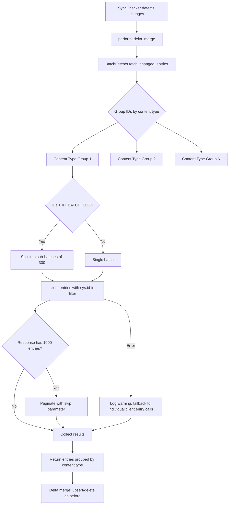

# Design Document: Batched Delta Sync

## Overview

This feature optimizes the delta sync path in `ContentfulFetcher#perform_delta_merge` by replacing individual `client.entry()` calls with batched `client.entries()` calls. Currently, when the Sync API reports N changed entries, the system makes N individual HTTP requests. This design introduces a `BatchFetcher` module that groups entry IDs by content type and fetches them using `sys.id[in]` filtering, reducing HTTP requests from O(N) to O(C) where C is the number of distinct content types changed.

The batch fetcher handles three key constraints of the Contentful CDA:
1. **URL length limit** (~7600 chars) — IDs are sub-batched into groups of ~300
2. **Page size limit** (1000 entries) — responses are paginated via `skip`
3. **Transient failures** — failed batches fall back to individual entry fetches

All existing delta merge behavior (upsert, deletion, logging, index updates, hash computation) is preserved unchanged.

## Architecture



The `BatchFetcher` is a Ruby module mixed into `ContentfulFetcher`, keeping the architecture consistent with the existing `SyncChecker` mixin pattern. It sits between the sync result (which provides changed entry IDs grouped by content type) and the existing delta merge logic (which upserts/deletes entries).

## Components and Interfaces

### BatchFetcher Module

A new module at `_plugins/batch_fetcher.rb` that provides a single public method:

```ruby
module BatchFetcher
  ID_BATCH_SIZE = 300

  # Fetches all changed entries in batches, grouped by content type.
  # Returns a Hash: { content_type_id => [Contentful::Entry, ...] }
  #
  # @param client [Contentful::Client] the CDA client
  # @param changed_entries [Hash] { content_type_id => [sync_item, ...] } from SyncResult
  # @return [Hash] { content_type_id => [Contentful::Entry, ...] }
  def fetch_changed_entries_batched(client, changed_entries)
end
```

Internal private methods:

```ruby
# Fetches entries for a single content type group, handling sub-batching and pagination.
# @param client [Contentful::Client]
# @param content_type_id [String]
# @param entry_ids [Array<String>]
# @return [Array<Contentful::Entry>]
def fetch_content_type_batch(client, content_type_id, entry_ids)

# Fetches a single sub-batch with pagination.
# @param client [Contentful::Client]
# @param content_type_id [String]
# @param id_batch [Array<String>] up to ID_BATCH_SIZE IDs
# @return [Array<Contentful::Entry>]
def fetch_sub_batch(client, content_type_id, id_batch)

# Falls back to individual client.entry() calls for a list of IDs.
# @param client [Contentful::Client]
# @param entry_ids [Array<String>]
# @return [Array<Contentful::Entry>]
def fetch_entries_individually(client, entry_ids)
end
```

### Modified: ContentfulFetcher#perform_delta_merge

The existing Phase 2 loop changes from:

```ruby
# Current: one HTTP call per entry
entries.each do |delta_entry|
  entry_id = delta_entry.sys[:id]
  re_fetched = client.entry(entry_id, locale: '*', include: 2)
  # ... upsert logic
end
```

To:

```ruby
# New: batch fetch all changed entries, then iterate results
batched_results = fetch_changed_entries_batched(client, result.changed_entries)
batched_results.each do |content_type_id, fetched_entries|
  config = CONTENT_TYPES[content_type_id]
  fetched_entries.each do |re_fetched|
    # ... same upsert logic as before
  end
end
```

The deletion phase (Phase 3), YAML writing (Phase 4), site data reload (Phase 5), and hash computation (Phase 6) remain completely unchanged.

## Data Models

### Constants

| Constant | Value | Rationale |
|----------|-------|-----------|
| `ID_BATCH_SIZE` | 300 | CDA URI limit is 7600 chars. With ~22-char entry IDs + comma separators + ~150 chars base URL overhead: `(7600 - 150) / 25 ≈ 298`, rounded to 300. |
| `PAGE_SIZE` | 1000 | Already defined in `ContentfulFetcher`. CDA maximum entries per response. |

### Data Flow

1. **Input**: `changed_entries` hash from `SyncResult` — `{ content_type_id => [sync_item, ...] }`
2. **ID extraction**: Each sync item's `sys[:id]` is extracted to form `{ content_type_id => [entry_id_string, ...] }`
3. **Sub-batching**: Each content type's ID array is split into chunks of `ID_BATCH_SIZE`
4. **API call**: Each chunk becomes a `client.entries(content_type: ct, 'sys.id[in]' => ids.join(','), locale: '*', include: 2, limit: 1000)`
5. **Pagination**: If response size equals `PAGE_SIZE`, subsequent calls add `skip: offset`
6. **Fallback**: On error, the failed chunk's IDs are fetched individually via `client.entry(id, locale: '*', include: 2)`
7. **Output**: `{ content_type_id => [Contentful::Entry, ...] }` — same entry objects the existing upsert logic expects


## Correctness Properties

*A property is a characteristic or behavior that should hold true across all valid executions of a system — essentially, a formal statement about what the system should do. Properties serve as the bridge between human-readable specifications and machine-verifiable correctness guarantees.*

### Property 1: Grouping preserves all entry IDs by content type

*For any* set of sync items with arbitrary content type IDs, grouping them by content type should produce a hash where (a) every input entry ID appears in exactly one group, (b) the group key matches the entry's content type, and (c) no entry IDs are lost or duplicated.

**Validates: Requirements 1.1**

### Property 2: Batch call count matches expected sub-batch formula

*For any* set of entry IDs grouped by content type, the total number of `client.entries()` calls issued should equal the sum over each content type of `ceil(group_size / ID_BATCH_SIZE)`. When every group has `ID_BATCH_SIZE` or fewer IDs, this simplifies to exactly one call per content type (C calls total instead of N).

**Validates: Requirements 1.2, 1.3, 2.3, 5.1, 5.2**

### Property 3: Pagination collects all entries across pages

*For any* batched request where the CDA returns multiple pages (each page containing up to 1000 entries), the batch fetcher should return the concatenation of all pages' entries with no entries lost or duplicated. Specifically, if the total entry count is T, the result array should have exactly T elements.

**Validates: Requirements 2.1, 2.2**

### Property 4: Every batched request includes required parameters

*For any* batch fetch call, the `client.entries()` invocation must include `locale: '*'` and `include: 2` parameters, matching the parameters used by the current individual `client.entry()` calls.

**Validates: Requirements 1.4**

### Property 5: Batch failure triggers individual fallback for all IDs in the failed group

*For any* content type group where the batched `client.entries()` call raises an error, the batch fetcher should fall back to calling `client.entry()` individually for every entry ID in that group, and the successfully fetched entries should still be returned.

**Validates: Requirements 4.1, 4.2**

## Observability Logging

The `BatchFetcher` uses `Jekyll.logger` (consistent with the rest of the plugin codebase) to provide visibility into the batch fetch process. All messages use the `'Contentful:'` prefix to match existing log output.

### Happy Path Logs

| When | Level | Message Format |
|------|-------|----------------|
| Before fetching a content type group | `info` | `"Batch fetching #{count} #{ct_id} entries in #{sub_batch_count} API call(s)"` |
| After fetching a content type group | `info` | `"Batch fetched #{fetched_count} #{ct_id} entries"` |
| Pagination (additional page) | `info` | `"Fetching page at offset #{skip} for #{ct_id} batch"` |
| After all groups fetched | `info` | `"Batch fetch complete: #{total_entries} entries in #{total_calls} API call(s) (would have been #{individual_count} without batching)"` |

### Fallback Logs

| When | Level | Message Format |
|------|-------|----------------|
| Batch fetch fails for a group | `warn` | `"Batch fetch failed for content type '#{ct_id}': #{error} -- falling back to individual fetches (#{count} entries)"` |
| Individual fallback fetch fails | `warn` | `"Individual fetch failed for entry '#{entry_id}': #{error} -- skipping"` |

## Error Handling

### Batch Fetch Errors

When a `client.entries()` call raises any `StandardError`:
1. Log a warning: `"Batch fetch failed for content type '#{ct_id}': #{e.message} -- falling back to individual fetches"`
2. Iterate over all entry IDs in the failed sub-batch and call `client.entry(id, locale: '*', include: 2)` for each
3. Collect successfully fetched entries; skip failed individual fetches with a warning log

### Individual Fallback Errors

When an individual `client.entry()` call fails during fallback:
1. Log a warning: `"Individual fetch failed for entry '#{entry_id}': #{e.message} -- skipping"`
2. Continue processing remaining entries — do not abort the delta merge

### Full Merge Failure

The existing `rescue StandardError` block in `perform_delta_merge` remains unchanged. If the entire merge (including all fallback attempts) raises an unhandled error, the system falls back to `perform_full_sync_and_cache`, matching current behavior.

### Error Hierarchy

```
Batch client.entries() fails
  └─> Fallback: individual client.entry() per ID
       └─> Individual fails: log + skip entry
            └─> Entire merge fails: existing rescue → full sync
```

## Testing Strategy

### Property-Based Tests (Rantly)

Each correctness property maps to a single property-based test in `spec/batch_fetcher_properties_spec.rb`, using the existing RSpec + Rantly setup. Each test runs a minimum of 100 iterations.

| Property | Test Description | Tag |
|----------|-----------------|-----|
| 1 | Generate random `{ct_id => [entry_ids]}` maps, verify grouping invariants | `Feature: batched-delta-sync, Property 1: Grouping preserves all entry IDs by content type` |
| 2 | Generate random group sizes (1–1000), mock client, count `client.entries()` calls | `Feature: batched-delta-sync, Property 2: Batch call count matches expected sub-batch formula` |
| 3 | Generate random total entry counts (1–3000), mock paginated responses, verify all entries collected | `Feature: batched-delta-sync, Property 3: Pagination collects all entries across pages` |
| 4 | Generate random batches, mock client, inspect call arguments for `locale` and `include` | `Feature: batched-delta-sync, Property 4: Every batched request includes required parameters` |
| 5 | Generate random groups, make batch call raise, verify individual fallback calls are made | `Feature: batched-delta-sync, Property 5: Batch failure triggers individual fallback for all IDs in the failed group` |

### Unit Tests

Unit tests in `spec/batch_fetcher_spec.rb` cover specific examples and edge cases:

- Single content type with 1 entry (simplest case)
- Single content type with exactly 300 entries (boundary)
- Single content type with 301 entries (triggers sub-batching)
- Multiple content types with mixed sizes
- Empty changed entries hash (no-op)
- Pagination: mock response returning exactly 1000, then fewer
- Fallback: batch error → individual success
- Fallback: batch error → individual error → entry skipped
- Integration: verify `perform_delta_merge` uses batched path and produces same YAML output

### Test Configuration

- Framework: RSpec 3.13 + Rantly 3.0 (already in Gemfile)
- Location: `spec/batch_fetcher_spec.rb` and `spec/batch_fetcher_properties_spec.rb`
- Minimum iterations per property test: 100
- Each property test tagged with a comment referencing the design property
