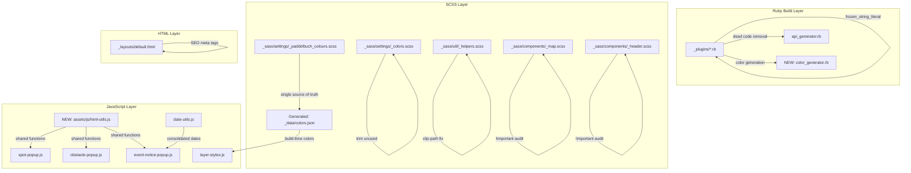

# Design Document: Best Practices Cleanup

## Overview

This design addresses eight categories of technical debt in the Paddel Buch Jekyll project. Every change is strictly internal — no user-facing HTML, CSS rendering, or JavaScript behavior may change (Requirement 0). The work spans Ruby plugins, JavaScript modules, SCSS partials, and the default HTML layout.

The project is a Jekyll site using:
- IIFE-pattern JavaScript (no ES modules) with global-scope exports
- `jekyll-multiple-languages-plugin` for i18n (`de`, `en`)
- Bootstrap (via `node_modules`) and Leaflet for UI
- SCSS compiled via Jekyll's built-in Sass pipeline
- Ruby plugins in `_plugins/` extending the Jekyll build

## Architecture

The cleanup touches four layers of the existing architecture. No new architectural patterns are introduced — the goal is to align existing code with best practices.



## Components and Interfaces

### 1. Frozen String Literal (Requirement 1)

**Scope:** 16 files in `_plugins/`. Five already have the comment; eleven need it added.

**Files needing the comment:**
- `api_generator.rb`, `build_timer.rb`, `collection_generator.rb`, `contentful_mappers.rb`, `env_loader.rb`, `i18n_patch.rb`, `locale_filter.rb`, `sitemap_generator.rb`, `ssl_patch.rb`, `tile_generator.rb`, `waterway_filters.rb`

**Approach:** Prepend `# frozen_string_literal: true` followed by a blank line as the first line of each file. Files that already have it are left untouched. No string mutations exist in these files (verified during research), so no runtime changes are expected.

### 2. Dead Code Removal (Requirement 2)

**Scope:** Remove the `normalize_timestamp` method (~line 258) from `api_generator.rb`.

**Rationale:** The method is never called. All timestamp normalization uses `normalize_to_contentful_timestamp`, which has memoization and handles the same input formats. The dead method is a copy-paste artifact with slightly different formatting (no memoization, no millisecond stripping).

**Approach:** Delete the `normalize_timestamp` method definition (approximately 7 lines). No callers exist — grep confirms zero references outside the method definition itself.

### 3. Shared JavaScript Utilities (Requirement 3)

**Problem:** `escapeHtml` is duplicated in 3 files, `stripHtml` in 2, `truncate` in 2, and `isDateInFuture`/`formatDate` each appear in both `event-notice-popup.js` and `date-utils.js` with slightly different implementations.

**Design:**

#### 3a. New `html-utils.js` module

Create `assets/js/html-utils.js` as an IIFE exporting `PaddelbuchHtmlUtils`:

```javascript
(function(global) {
  'use strict';

  function escapeHtml(text) { /* single canonical implementation */ }
  function stripHtml(html) { /* single canonical implementation */ }
  function truncate(text, maxLength) { /* single canonical implementation */ }

  global.PaddelbuchHtmlUtils = {
    escapeHtml: escapeHtml,
    stripHtml: stripHtml,
    truncate: truncate
  };
})(typeof window !== 'undefined' ? window : this);
```

#### 3b. Consolidate date functions into `date-utils.js`

- `isDateInFuture`: The `date-utils.js` implementation is already the canonical one (date-only comparison via ISO string splitting). Remove the duplicate from `event-notice-popup.js` and have it call `PaddelbuchDateUtils.isDateInFuture`.

- `formatDate`: Add a `format` parameter to `PaddelbuchDateUtils.formatDate`:
  - `'numeric'` (default): existing `DD.MM.YYYY` / `DD/MM/YYYY` behavior
  - `'short'`: the `DD MMM YYYY` abbreviated-month format currently in `event-notice-popup.js`
  
  The abbreviated month names (`monthsAbbr`) move into `date-utils.js`.

#### 3c. Script loading order

`html-utils.js` and `date-utils.js` must load before the popup modules. In `_includes/map-init.html`, add `html-utils.js` before the existing popup script includes. `date-utils.js` is already loaded early. For non-map pages that include popup scripts directly, ensure the same ordering in the relevant layout/include.

#### 3d. Consumer updates

- `spot-popup.js`: Remove local `escapeHtml`, `stripHtml`, `truncate`. Reference `PaddelbuchHtmlUtils.*`. Remove these from the module's own exports.
- `obstacle-popup.js`: Remove local `escapeHtml`. Reference `PaddelbuchHtmlUtils.escapeHtml`.
- `event-notice-popup.js`: Remove local `escapeHtml`, `stripHtml`, `truncate`, `isDateInFuture`, `formatDate`, `monthsAbbr`. Reference `PaddelbuchHtmlUtils.*` and `PaddelbuchDateUtils.*`. Update `formatDate` calls to pass `'short'` as the format parameter.

### 4. Material UI Color Audit (Requirement 4)

**Problem:** `_sass/settings/_colors.scss` defines ~270 Material UI color variables. Only a handful are actually used.

**Audit results** (grep across all SCSS files excluding `_colors.scss` itself):

| Variable | Used in |
|---|---|
| `$blue-grey-50` | `_map.scss` |
| `$blue-grey-200` | `_map.scss` |
| `$blue-grey-500` | `_helpers.scss` |
| `$black` | (not used outside `_colors.scss`) |
| `$white` | `_header.scss`, `_map.scss`, `_filter-panel.scss` |

**Note:** `$green-1`, `$purple-1`, `$white-40pc` etc. are defined in `_paddelbuch_colours.scss`, not `_colors.scss`, so they are not part of this audit.

**Approach:** Reduce `_colors.scss` to only the variables actually referenced:
- `$blue-grey-50`, `$blue-grey-200`, `$blue-grey-500`
- `$white` (used extensively)
- `$black` (keep for completeness — it's a base color paired with `$white`)

All other Material UI color families (red, pink, purple, deep-purple, indigo, blue, light-blue, cyan, teal, green, light-green, lime, yellow, amber, orange, deep-orange, brown, grey, and the remaining blue-grey/special variants) are removed.

### 5. Single Source of Truth for Colors (Requirement 5)

**Problem:** `layer-styles.js` hardcodes the same hex values defined in `_paddelbuch_colours.scss`.

**Design:** A new Jekyll plugin `_plugins/color_generator.rb` reads `_paddelbuch_colours.scss` at build time, extracts `$variable: #hex` pairs via regex, and writes a JSON data file to `_data/colors.json`. The `layer-styles.js` module then reads from a `<script>` tag that injects the colors, or more simply, a Jekyll include generates a small inline `<script>` that sets `window.PaddelbuchColors` before `layer-styles.js` loads.

**Chosen approach — build-time JSON + inline script injection:**

1. **New plugin `_plugins/color_generator.rb`:** Parses `_sass/settings/_paddelbuch_colours.scss` using regex (`/^\$([a-z0-9_-]+):\s*(#[0-9a-fA-F]{3,8}|rgba?\([^)]+\))/`), produces a hash mapping camelCase variable names to hex values, and writes it to `site.data['paddelbuch_colors']`.

2. **New include `_includes/color-vars.html`:** Outputs an inline `<script>` tag:
   ```html
   <script>
   window.PaddelbuchColors = {{ site.data.paddelbuch_colors | jsonify }};
   </script>
   ```
   This include is placed in `_layouts/default.html` before any JS that needs colors.

3. **Update `layer-styles.js`:** Replace the hardcoded `colors` object with:
   ```javascript
   var colors = window.PaddelbuchColors || {};
   ```
   The property names in the generated JSON use camelCase to match the existing `colors` object keys in `layer-styles.js`.

**Variable name mapping** (SCSS → camelCase):
- `$swisscanoe-blue` → `swisscanoeBlue`
- `$secondary-blue` → `secondaryBlue`
- `$water-blue` → `waterBlue`
- `$warning-yellow` → `warningYellow`
- `$danger-red` → `dangerRed`
- `$startingspots-purple` → `startingspotsPurple`
- `$othersport-pink` → `othersportPink`
- `$routes-purple` → `routesPurple`
- `$purple-1` → `purple1`
- `$green-1` → `green1`
- `$green-2` → `green2`
- `$green-3` → `green3`

### 6. Deprecated CSS Fix (Requirement 6)

**Scope:** Replace `clip: rect(0 0 0 0)` with `clip-path: inset(50%)` in `_sass/util/_helpers.scss`.

The `.visually-hidden` class becomes:
```scss
.visually-hidden {
  overflow: hidden;
  position: absolute;
  clip-path: inset(50%);
  width: 1px;
  height: 1px;
  padding: 0;
  border: 0;
  margin: -1px;
}
```

Both `clip: rect(0 0 0 0)` and `clip-path: inset(50%)` produce the same visual result (element is invisible but remains in the accessibility tree). `clip-path` is the modern standard; `clip` is deprecated.

### 7. !important Audit (Requirement 7)

#### `_header.scss` — 5 declarations

| Selector | Property | Justified? | Action |
|---|---|---|---|
| `hr.dropdown-divider` | `border-top: 1px solid $white !important` | Yes — overrides Bootstrap's `.dropdown-divider` border color | Keep + add comment |
| `hr.dropdown-divider` | `opacity: 1 !important` | Yes — overrides Bootstrap's `.dropdown-divider` opacity | Keep + add comment |
| `.dropdown-item:hover .nav-link` | `color: $swisscanoe-blue !important` | Yes — overrides Bootstrap's `.nav-link` color on hover state | Keep + add comment |
| `.nav-link` | `color: $white !important` | Yes — overrides Bootstrap's `.nav-link` default color | Keep + add comment |
| `.paddelbuch-logo` | `margin-right: 12px !important` | No — no third-party style to override; this is internal styling | Remove `!important`, increase specificity if needed via `header .paddelbuch-logo` |

#### `_map.scss` — 15 declarations

| Selector | Property | Justified? | Action |
|---|---|---|---|
| `.popup-icon img` | `width: 20px !important` | Borderline — overrides potential inline `width` on `` tags in popup HTML. Since the popup HTML is generated by our own JS, we control the markup. | Remove `!important`; ensure the JS does not set inline width, or use higher specificity `.popup-icon > img` |
| `.popup-btn-right, .popup-btn-right a` | `text-decoration: none !important` | No — internal styling, no third-party override needed | Remove `!important`; use `a.popup-btn-right` for specificity |
| `.leaflet-control-layers` | `background-color`, `border`, `color`, `border-radius` (4× `!important`) | Yes — overrides Leaflet's `.leaflet-control-layers` default styles | Keep all + add comment |
| `.leaflet-control-zoom a, .leaflet-control-locate a` | `border-radius: 0 !important` | Yes — overrides Leaflet's default rounded corners | Keep + add comment |
| `.leaflet-control-zoom, .leaflet-control-locate` | `border`, `border-radius` (2× `!important`) | Yes — overrides Leaflet's default control styling | Keep + add comment |
| `.leaflet-popup-content-wrapper` | `border-radius`, `color`, `background-color` (3× `!important`) | Yes — overrides Leaflet's popup styling | Keep + add comment |
| `.leaflet-popup-content-wrapper a, .leaflet-popup a.leaflet-popup-close-button` | `color: $white !important` | Yes — overrides Leaflet's popup link color | Keep + add comment |
| `.leaflet-popup-tip` | `background-color: $swisscanoe-blue !important` | Yes — overrides Leaflet's popup tip color | Keep + add comment |
| `.leaflet-popup-content table:not(.popup-details-table)` | `width: min-content !important` | Borderline — overrides Bootstrap's table width. Since we use Bootstrap globally, this is a justified third-party override. | Keep + add comment |

**Summary:** Remove `!important` from 3 declarations (`.paddelbuch-logo`, `.popup-icon img`, `.popup-btn-right`). Add explanatory comments to all remaining `!important` declarations.

### 8. SEO Meta Tags (Requirement 8)

**Scope:** Add canonical URL, Open Graph, and Twitter Card meta tags to `_layouts/default.html`.

**Implementation:** Add the following tags inside `<head>`, after the existing `<meta>` tags:

```html
<!-- Canonical URL -->
<link rel="canonical" href="{{ site.url }}{{ page.url | replace: 'index.html', '' }}">

<!-- Open Graph -->
<meta property="og:title" content="{{ page.title | escape }}{{ site.title | escape }}">
<meta property="og:description" content="{{ page.description | strip_html | truncate: 160 | escape }}{{ site.description | strip_html | truncate: 160 | escape }}">
<meta property="og:url" content="{{ site.url }}{{ page.url | replace: 'index.html', '' }}">
<meta property="og:type" content="website">
<meta property="og:locale" content="en_GBde_CH">

<!-- Twitter Card -->
<meta name="twitter:card" content="summary">
<meta name="twitter:title" content="{{ page.title | escape }}{{ site.title | escape }}">
<meta name="twitter:description" content="{{ page.description | strip_html | truncate: 160 | escape }}{{ site.description | strip_html | truncate: 160 | escape }}">
```

**Locale mapping:** The `jekyll-multiple-languages-plugin` sets `site.lang` to the current locale. We map `de` → `de_CH` and `en` → `en_GB` to match the Swiss German and British English locale conventions already used in the project.

## Data Models

No new persistent data models are introduced. The only new data artifact is the build-time `site.data['paddelbuch_colors']` hash generated by the color plugin:

```json
{
  "swisscanoeBlue": "#1b1e43",
  "secondaryBlue": "#606589",
  "waterBlue": "#3cc4f6",
  "warningYellow": "#ffb200",
  "dangerRed": "#c40200",
  "startingspotsPurple": "#cb3cf6",
  "othersportPink": "#e693be",
  "routesPurple": "#4c0561",
  "purple1": "#69599b",
  "green1": "#07753f",
  "green2": "#38676d",
  "green3": "#839420"
}
```

This is ephemeral — generated fresh on each Jekyll build and not committed to the repository. The `rgba()` values (`$white-40pc`, `$secondary-blue-20`) are excluded from the JSON since they are not used in `layer-styles.js`.


## Correctness Properties

*A property is a characteristic or behavior that should hold true across all valid executions of a system — essentially, a formal statement about what the system should do. Properties serve as the bridge between human-readable specifications and machine-verifiable correctness guarantees.*

### Property 1: Frozen string literal presence and uniqueness

*For any* Ruby file in the `_plugins/` directory, the first non-empty line shall be exactly `# frozen_string_literal: true`, and this comment shall appear exactly once in the file.

**Validates: Requirements 1.1, 1.2**

### Property 2: Timestamp normalization round trip

*For any* valid ISO 8601 timestamp string (with or without timezone offset, with or without milliseconds), `normalize_to_contentful_timestamp` shall return a string matching the pattern `YYYY-MM-DDTHH:MM:SSZ`, and calling it twice on the same input shall produce the same result (idempotence).

**Validates: Requirements 2.2**

### Property 3: HTML escaping correctness

*For any* string containing HTML special characters (`<`, `>`, `&`, `"`, `'`), `escapeHtml` shall return a string where all such characters are replaced with their HTML entity equivalents, and the result shall contain no unescaped `<` or `>` characters.

**Validates: Requirements 3.1**

### Property 4: HTML stripping completeness

*For any* string containing HTML tags, `stripHtml` shall return a string containing no substrings matching the pattern `<[^>]*>`.

**Validates: Requirements 3.2**

### Property 5: Truncation length invariant

*For any* string and positive integer `maxLength`, `truncate(text, maxLength)` shall return a string whose length is at most `maxLength + 3` (accounting for the `...` suffix), and if the input length is ≤ `maxLength`, the output shall equal the input exactly.

**Validates: Requirements 3.3**

### Property 6: Date-in-future uses date-only comparison

*For any* two dates where the date-only components (YYYY-MM-DD) are equal, `isDateInFuture(date, referenceDate)` shall return `true` regardless of the time components. *For any* date whose date-only component is strictly before the reference date's date-only component, `isDateInFuture` shall return `false`.

**Validates: Requirements 3.7**

### Property 7: Format date dual format support

*For any* valid date and locale (`de` or `en`), `formatDate(date, locale, 'numeric')` shall produce a string matching `DD.MM.YYYY` (for `de`) or `DD/MM/YYYY` (for `en`), and `formatDate(date, locale, 'short')` shall produce a string matching `DD MMM YYYY` where `MMM` is a three-letter abbreviated month name in the correct locale.

**Validates: Requirements 3.8**

### Property 8: SCSS color parsing to JSON

*For any* SCSS file containing lines of the form `$variable-name: #hexvalue;`, the color generator shall produce a JSON object where each SCSS variable is mapped to a camelCase key with the correct hex value, and parsing the generated JSON back shall yield the same key-value pairs.

**Validates: Requirements 5.3**

### Property 9: Canonical URL correctness

*For any* page with a URL path, the canonical `<link>` tag's `href` attribute shall equal `site.url` concatenated with the page's URL path (with trailing `index.html` removed).

**Validates: Requirements 8.1**

### Property 10: Open Graph tags presence

*For any* rendered page, the HTML `<head>` shall contain `<meta>` tags for `og:title`, `og:description`, `og:url`, `og:type`, and `og:locale`.

**Validates: Requirements 8.2**

### Property 11: Twitter Card tags presence

*For any* rendered page, the HTML `<head>` shall contain `<meta>` tags for `twitter:card`, `twitter:title`, and `twitter:description`.

**Validates: Requirements 8.3**

### Property 12: SEO tags use page-specific front matter

*For any* page that defines a custom `title` and/or `description` in its front matter, the `og:title`, `twitter:title`, `og:description`, and `twitter:description` meta tags shall use the page-specific values rather than the site-level defaults.

**Validates: Requirements 8.4, 8.5**

### Property 13: Open Graph locale reflects current language

*For any* page rendered under the `de` locale, `og:locale` shall be `de_CH`. *For any* page rendered under the `en` locale, `og:locale` shall be `en_GB`.

**Validates: Requirements 8.7**

## Error Handling

Since this feature is a cleanup of existing code with no new user-facing functionality, error handling is minimal:

- **Color generator plugin:** If `_paddelbuch_colours.scss` cannot be read or contains no parseable color variables, the plugin logs a warning via `Jekyll.logger.warn` and sets `site.data['paddelbuch_colors']` to an empty hash. `layer-styles.js` falls back to its existing hardcoded defaults via `window.PaddelbuchColors || { /* fallback */ }` during development, but in production the plugin is expected to succeed.

- **Shared JS utilities:** `escapeHtml`, `stripHtml`, and `truncate` already handle `null`/`undefined` input by returning empty strings. No new error paths are introduced.

- **SEO meta tags:** Missing `page.title` or `page.description` gracefully falls back to `site.title` / `site.description` via Liquid conditionals. Missing `site.url` would produce a relative canonical URL — this is acceptable since `site.url` is always configured in `_config.yml`.

- **Frozen string literal:** If a plugin file contains string mutations that conflict with frozen strings, Ruby raises a `FrozenError` at build time. Research confirms no such mutations exist in the current plugin files.

## Testing Strategy

### Dual Testing Approach

This feature uses both unit tests and property-based tests:

- **Unit tests** verify specific examples, edge cases, and integration points (e.g., "the `.visually-hidden` class uses `clip-path`", "the `normalize_timestamp` method no longer exists").
- **Property-based tests** verify universal properties across randomly generated inputs (e.g., "for any string, `escapeHtml` produces no unescaped `<` or `>`").

### Property-Based Testing Library

- **JavaScript:** [fast-check](https://github.com/dubzzz/fast-check) — the standard PBT library for JavaScript
- **Ruby:** [rspec-property](https://github.com/ohbarye/rspec-property) or manual loop-based property tests using RSpec with randomized inputs (100+ iterations)

### Property Test Configuration

- Minimum **100 iterations** per property test
- Each property test must include a comment referencing the design property:
  ```
  // Feature: best-practices-cleanup, Property 3: HTML escaping correctness
  ```
- Each correctness property is implemented by a **single** property-based test

### Test Organization

| Property | Test Type | Tool | File |
|---|---|---|---|
| P1: Frozen string literal | Property (Ruby) | RSpec | `spec/plugins/frozen_string_literal_spec.rb` |
| P2: Timestamp normalization | Property (Ruby) | RSpec | `spec/plugins/api_generator_spec.rb` |
| P3: escapeHtml | Property (JS) | fast-check + Jest | `_tests/html-utils.test.js` |
| P4: stripHtml | Property (JS) | fast-check + Jest | `_tests/html-utils.test.js` |
| P5: truncate | Property (JS) | fast-check + Jest | `_tests/html-utils.test.js` |
| P6: isDateInFuture | Property (JS) | fast-check + Jest | `_tests/date-utils.test.js` |
| P7: formatDate dual format | Property (JS) | fast-check + Jest | `_tests/date-utils.test.js` |
| P8: SCSS color parsing | Property (Ruby) | RSpec | `spec/plugins/color_generator_spec.rb` |
| P9–P13: SEO meta tags | Property (Ruby) | RSpec + Liquid rendering | `spec/layouts/default_layout_spec.rb` |

### Unit Test Coverage

Unit tests complement the property tests for:
- **Requirement 2:** Verify `normalize_timestamp` method no longer exists in `api_generator.rb`
- **Requirement 4:** Verify `_colors.scss` contains only the expected variables (static analysis)
- **Requirement 6:** Verify `.visually-hidden` uses `clip-path: inset(50%)` and not `clip: rect(...)`
- **Requirement 7:** Verify `!important` count in `_map.scss` and `_header.scss` matches expected values; verify comments exist on justified `!important` declarations
- **Edge cases:** `escapeHtml(null)` → `''`, `truncate('', 10)` → `''`, `isDateInFuture(null)` → `false`, `formatDate(invalidDate, 'de')` → `''`
