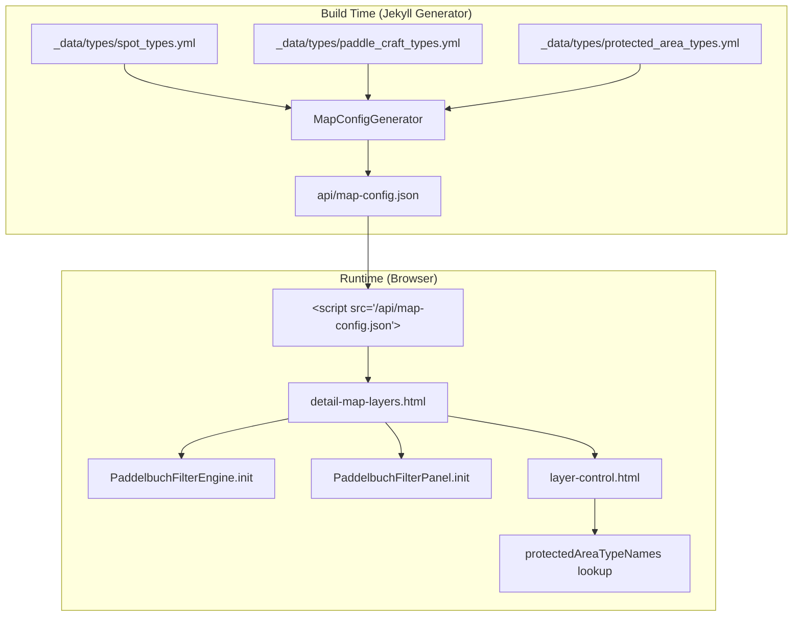

# Design Document: Build Time Optimization

## Overview

The Paddelbuch Jekyll site renders 2817 detail pages, each including `detail-map-layers.html` which nests `layer-control.html` and `filter-panel.html`. These includes contain Liquid `for` loops and `if/else` blocks that iterate over type data (`spot_types`, `paddle_craft_types`, `protected_area_types`) to build inline JavaScript configuration objects. Since the output is identical on every page, this work is redundant — the same JavaScript objects are re-evaluated ~2817 times.

The optimization extracts this repeated data into a single JSON file generated once at build time by a new Jekyll generator plugin. Detail pages then load the JSON via a `<script>` tag and select the locale-appropriate config at runtime. This eliminates the Liquid loops from the hot rendering path.

A secondary fix addresses a Bundler version mismatch in the Amplify build spec — the lock file specifies Bundler 2.6.2 but Amplify's default Ruby image ships an older version, causing a reinstall on every build.

## Architecture



The architecture follows the existing pattern established by `ApiGenerator` — a Jekyll `Generator` plugin that produces JSON files using `PageWithoutAFile`. The new `MapConfigGenerator` runs at `:low` priority alongside the existing API generator and produces a single `api/map-config.json` file.

At runtime, the JSON is loaded via a `<script>` tag that assigns the parsed object to `window.paddelbuchMapConfig`. The existing `detail-map-layers.html` and `layer-control.html` includes are simplified to read from this global instead of building the data inline via Liquid.

### Design Decisions

1. **`<script>` tag over `fetch()`**: Using `<script src="...">` with a global variable assignment is synchronous and avoids async complexity. The JSON file is small (< 5KB) and cacheable. This matches the existing pattern where JS modules are loaded via script tags.

2. **Output to `/api/` path**: The `api/` directory is already excluded from localization (`exclude_from_localizations: ["assets", "api"]`), so the file is generated once and accessible from both locale prefixes.

3. **Single file for both locales**: The JSON contains a top-level object keyed by locale (`de`, `en`). Runtime code selects the correct key. This avoids generating two files and keeps the approach simple.

4. **Generator over Liquid include**: A Ruby generator runs once per build regardless of page count. A Liquid-based approach (e.g., a JSON page template) would still be evaluated per-language-pass.


## Components and Interfaces

### 1. MapConfigGenerator (`_plugins/map_config_generator.rb`)

A new Jekyll `Generator` plugin that reads type data from `site.data` and produces a single JSON file.

```ruby
module Jekyll
  class MapConfigGenerator < Generator
    safe true
    priority :low

    LOCALES = ['de', 'en'].freeze

    def generate(site)
      # Skip duplicate runs for non-default language passes
      # (same pattern as ApiGenerator)
      default_lang = site.config['default_lang'] || 'de'
      current_lang = site.config['lang'] || default_lang
      return if current_lang != default_lang

      config = {}
      LOCALES.each do |locale|
        config[locale] = build_locale_config(site, locale)
      end

      # Write as a JS file that assigns to window.paddelbuchMapConfig
      js_content = "window.paddelbuchMapConfig = #{JSON.generate(config)};"

      page = PageWithoutAFile.new(site, site.source, 'api', 'map-config.js')
      page.content = js_content
      page.data['layout'] = nil
      site.pages << page
    end
  end
end
```

**Interface — Output JSON structure:**

```json
{
  "de": {
    "dimensions": [
      {
        "key": "spotType",
        "label": "Ortstyp",
        "options": [
          { "slug": "einstieg-ausstieg", "label": "Ein- und Ausstieg" },
          ...
        ]
      },
      {
        "key": "paddleCraftType",
        "label": "Paddelboottyp",
        "options": [
          { "slug": "stand-up-paddle-board", "label": "Stand Up Paddle Board (SUP)" },
          ...
        ]
      }
    ],
    "layerLabels": {
      "noEntry": "Keine Zutritt Orte",
      "eventNotices": "Gewässerereignisse",
      "obstacles": "Hindernisse",
      "protectedAreas": "Schutzgebiete"
    },
    "protectedAreaTypeNames": {
      "naturschutzgebiet": "Naturschutzgebiet",
      "schilfgebiet": "Schilfgebiet",
      ...
    }
  },
  "en": {
    "dimensions": [...],
    "layerLabels": {...},
    "protectedAreaTypeNames": {...}
  }
}
```

### 2. Modified `detail-map-layers.html`

The include is simplified to:
- Load `api/map-config.js` via a `<script>` tag (before the bootstrap script)
- Read `window.paddelbuchMapConfig[locale]` to get `dimensions`, `layerLabels`
- Attach `matchFn` functions to each dimension config at runtime (functions can't be serialized to JSON)
- Pass the assembled config to `PaddelbuchFilterEngine.init()` and `PaddelbuchFilterPanel.init()`

The Liquid `for` loops over `site.data.types.spot_types` and `site.data.types.paddle_craft_types`, and the `if/else` blocks for locale-specific labels, are removed entirely.

### 3. Modified `layer-control.html`

The Liquid `for` loop over `site.data.types.protected_area_types` that builds the `protectedAreaTypeNames` JS object is removed. Instead, the script reads `window.paddelbuchMapConfig[locale].protectedAreaTypeNames`.

### 4. Amplify BuildSpec Update

The preBuild phase is updated to install the correct Bundler version:

```yaml
preBuild:
  commands:
    - nvm use 18
    - npm ci
    - npm run download-fonts
    - npm run copy-assets
    - gem install bundler:2.6.2
    - bundle install
```

This is applied via `aws amplify update-app` CLI command using the `paddelbuch-dev` profile and `eu-central-1` region.

## Data Models

### Map Config JSON Schema

```
MapConfig (top-level object)
├── "de" : LocaleConfig
└── "en" : LocaleConfig

LocaleConfig
├── dimensions : DimensionConfig[]
├── layerLabels : LayerLabels
└── protectedAreaTypeNames : Record<string, string>

DimensionConfig
├── key : string          ("spotType" | "paddleCraftType")
├── label : string        (localized dimension label)
└── options : Option[]

Option
├── slug : string         (type slug, e.g. "einstieg-ausstieg")
└── label : string        (localized display label)

LayerLabels
├── noEntry : string
├── eventNotices : string
├── obstacles : string
└── protectedAreas : string
```

### Data Sources

| Field | Source | Path |
|-------|--------|------|
| Spot type options | `site.data.types.spot_types` | `_data/types/spot_types.yml` |
| Paddle craft type options | `site.data.types.paddle_craft_types` | `_data/types/paddle_craft_types.yml` |
| Protected area type names | `site.data.types.protected_area_types` | `_data/types/protected_area_types.yml` |
| Layer labels | Hardcoded per locale | Same values as current Liquid `if/else` blocks |
| Spot type dimension labels | Hardcoded per locale | "Ortstyp" / "Spot Type" |
| Paddle craft dimension labels | Hardcoded per locale | "Paddelboottyp" / "Paddle Craft Type" |

### Spot Type Options Mapping

The current `detail-map-layers.html` hardcodes spot type options rather than reading from data. The new generator reads from `site.data.types.spot_types` filtered by locale, using `name_de`/`name_en` for labels. However, the current hardcoded labels differ slightly from the data file (e.g., "Entry & Exit Spots" vs "Entry and Exit"). The generator will use the labels from the data file to maintain a single source of truth, but the hardcoded label values from the current Liquid template will be preserved as the canonical labels in the generator to ensure functional equivalence. This means the generator will use a static mapping for spot type labels matching the current output exactly.


## Correctness Properties

*A property is a characteristic or behavior that should hold true across all valid executions of a system — essentially, a formal statement about what the system should do. Properties serve as the bridge between human-readable specifications and machine-verifiable correctness guarantees.*

### Property 1: Generator output completeness

*For any* set of valid spot type, paddle craft type, and protected area type data entries, the `MapConfigGenerator` output SHALL contain keys for both `"de"` and `"en"` locales, and each locale object SHALL contain: a `dimensions` array with entries for `"spotType"` and `"paddleCraftType"` (each having a non-empty `options` array of `{slug, label}` objects), a `layerLabels` object with keys `noEntry`, `eventNotices`, `obstacles`, and `protectedAreas`, and a `protectedAreaTypeNames` object mapping slugs to translated names.

**Validates: Requirements 1.1, 1.2**

### Property 2: Generator data fidelity

*For any* set of type data entries (spot types, paddle craft types, protected area types) with `locale`, `slug`, `name_de`, and `name_en` fields, the generated config for a given locale SHALL produce options whose slugs are exactly the unique slugs from the source data, and whose labels match the `name_{locale}` field of the corresponding source entry.

**Validates: Requirements 1.4, 4.2**

### Property 3: Runtime config structure equivalence

*For any* valid map config JSON object and any supported locale (`"de"` or `"en"`), the runtime code that reads `window.paddelbuchMapConfig[locale]` and attaches `matchFn` functions SHALL produce a `dimensionConfigs` array and `layerToggles` array with the same keys, labels, option slugs, and option labels as the current Liquid-generated implementation would produce for that locale.

**Validates: Requirements 2.2, 2.5**

### Property 4: Protected area type name round-trip

*For any* protected area type entry with a `slug` and `name_{locale}` in the source data, generating the config and then looking up that slug in `protectedAreaTypeNames[locale]` SHALL return the same `name_{locale}` value from the source entry.

**Validates: Requirements 3.2, 4.6**

## Error Handling

### Generator Errors

| Scenario | Handling |
|----------|----------|
| Missing type data files (`_data/types/*.yml` empty or absent) | Generator produces empty `options` arrays and empty `protectedAreaTypeNames`. The site still builds; filter panel shows no checkboxes. Log a warning via `Jekyll.logger.warn`. |
| Malformed type data (missing `slug` or `name_*` fields) | Skip entries with missing `slug`. Use `name_de` as fallback if `name_{locale}` is missing. Log a warning per skipped entry. |
| Generator runs during non-default language pass | Skip silently (same pattern as `ApiGenerator`). |

### Runtime Errors

| Scenario | Handling |
|----------|----------|
| `map-config.js` fails to load (network error, 404) | `window.paddelbuchMapConfig` is undefined. The bootstrap script checks for this and falls back to empty dimension configs and layer labels. The map still loads but without filter panel options. Log a `console.warn`. |
| Locale key missing from config | Fall back to `"de"` locale. If that's also missing, use empty config. |
| `matchFn` attachment fails | The `matchFn` functions are defined inline in the bootstrap script, not in the JSON. If the config structure is unexpected, the filter engine receives no dimensions and filtering is disabled. |

### Amplify BuildSpec Errors

| Scenario | Handling |
|----------|----------|
| `gem install bundler:2.6.2` fails | Build fails at preBuild phase. This is expected behavior — if the gem can't be installed, `bundle install` would also fail. |
| AWS CLI update-app command fails | Manual intervention required. The command is idempotent and can be retried. |

## Testing Strategy

### Unit Tests (RSpec)

Unit tests verify specific examples and edge cases for the `MapConfigGenerator`:

- Generator produces valid JS output with the expected `window.paddelbuchMapConfig = {...};` wrapper
- Output file is placed at `api/map-config.js`
- Generator skips non-default language passes
- Empty type data produces valid but empty config
- Missing `name_en` falls back to `name_de`
- Spot type labels match the current hardcoded values exactly (functional equivalence check for Requirement 4.1)
- Layer labels match the current hardcoded values exactly (functional equivalence check for Requirement 4.3)
- Bundler version in build spec matches `Gemfile.lock` (Requirement 5.1)

### Property-Based Tests (RSpec + Rantly)

Property-based tests use the `rantly` gem (already in Gemfile) to verify universal properties across generated inputs. Each test runs a minimum of 100 iterations.

| Test | Property | Iterations |
|------|----------|------------|
| Generator output completeness | Property 1 | 100 |
| Generator data fidelity | Property 2 | 100 |
| Runtime config structure equivalence | Property 3 | 100 |
| Protected area type name round-trip | Property 4 | 100 |

Each property test is tagged with a comment:
- `# Feature: build-time-optimization, Property 1: Generator output completeness`
- `# Feature: build-time-optimization, Property 2: Generator data fidelity`
- `# Feature: build-time-optimization, Property 3: Runtime config structure equivalence`
- `# Feature: build-time-optimization, Property 4: Protected area type name round-trip`

Each correctness property is implemented by a single property-based test.

### Manual Verification

After deployment:
- Compare a detail page's rendered HTML before and after the change to verify the filter panel and layer toggles are identical
- Run a full build with `build_timer.rb` and compare render times against the baseline (308s DE, 373s EN)
- Verify the Amplify build log shows no Bundler reinstallation step

