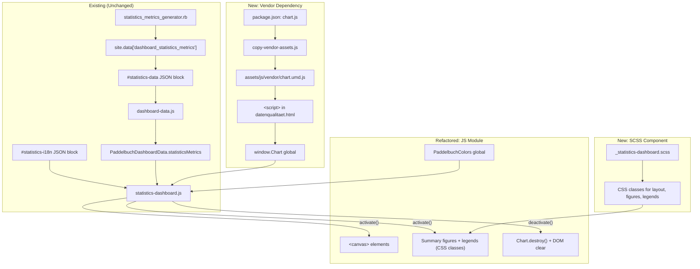

# Design Document: Chart.js Statistics Dashboard

## Overview

This is a refactoring of the existing Statistics Dashboard module (`assets/js/statistics-dashboard.js`) to replace hand-rolled HTML bar charts and inline-styled legends with Chart.js canvas-based rendering. The current implementation uses inline `style` attributes (`style="width:...%;background-color:..."` on bar segments and `style="background-color:..."` on legend swatches), which are blocked by the site's Content Security Policy (`style-src 'self'` — no `'unsafe-inline'`). Chart.js renders to `<canvas>` elements, which sidestep CSP `style-src` restrictions entirely because canvas drawing does not use CSS inline styles.

### Scope

- Add Chart.js as a vendor dependency (npm + copy-vendor-assets pipeline)
- Refactor `statistics-dashboard.js` to use Chart.js horizontal stacked bar charts instead of hand-crafted HTML `<div>` bar segments
- Replace inline-styled legends with either Chart.js built-in canvas legends or CSS-class-based HTML legends
- Replace inline-styled summary figures with SCSS-class-based HTML
- Create a new `_statistics-dashboard.scss` component for all layout and styling
- Remove all `.style.` assignments and `style=` string literals from the JS module
- Maintain the existing module interface, data contract, i18n pattern, and script load order
- No changes to the Ruby generator plugin, `dashboard-data.js`, or the i18n JSON blocks

### Key Design Decisions

1. **Chart.js UMD build**: Use `chart.umd.js` (the pre-bundled UMD distribution) since the project has no JS bundler. This exposes a global `Chart` constructor. The file is copied from `node_modules/chart.js/dist/chart.umd.js` to `assets/js/vendor/chart.umd.js` via the existing vendor asset pipeline.

2. **Horizontal stacked bar charts**: Chart.js `type: 'bar'` with `indexAxis: 'y'` and `stacked: true` on both axes produces horizontal stacked bars matching the current visual design. Each chart renders into a single `<canvas>` element.

3. **CSS-class-based HTML legends**: Rather than using Chart.js's built-in legend plugin (which renders inside the canvas and is harder to style consistently with the rest of the page), we render HTML legends with BEM-modifier CSS classes for swatch colours. This keeps legends accessible, consistent with the freshness/coverage dashboard legend pattern, and fully CSP-compliant.

4. **Chart.js instance lifecycle**: Store all `Chart` instances in an array during `activate()`. On `deactivate()`, call `.destroy()` on each instance before clearing the DOM. On re-activation, create fresh instances on new `<canvas>` elements. This prevents memory leaks and canvas reuse errors.

5. **No changes to data pipeline**: The Ruby generator, `dashboard-data.js`, i18n JSON blocks, and HTML template data blocks remain unchanged. The refactoring is purely in the JS rendering module and SCSS.

6. **CSP configuration unchanged**: No additions of `'unsafe-inline'` to `style-src` or `script-src`. The entire point of this refactoring is to work within the existing CSP.

## Architecture



### Component Interaction Flow

1. Chart.js UMD script loads before `statistics-dashboard.js`, exposing `window.Chart`.
2. `statistics-dashboard.js` registers on `PaddelbuchDashboardRegistry` (first, before freshness/coverage).
3. When activated, the module reads pre-computed metrics from `PaddelbuchDashboardData.statisticsMetrics` and i18n strings from `#statistics-i18n`.
4. For each bar chart section (spots, obstacles, protected areas), it creates a `<canvas>` element, instantiates a `new Chart(canvas, config)` with horizontal stacked bar configuration, and stores the instance.
5. Summary figures and legends are rendered as HTML with CSS classes from `_statistics-dashboard.scss`.
6. On deactivation, all Chart.js instances are destroyed via `.destroy()`, then the DOM containers are cleared.

## Components and Interfaces

### 1. Chart.js Vendor Dependency

**npm**: Add `chart.js` as a production dependency in `package.json`.

**copy-vendor-assets.js**: Add a new entry to copy `node_modules/chart.js/dist/chart.umd.js` → `assets/js/vendor/chart.umd.js`.

**datenqualitaet.html**: Add `/assets/js/vendor/chart.umd.js` to the front matter `scripts` array, after `dashboard-data.js` and before `statistics-dashboard.js`.

### 2. statistics-dashboard.js (Refactored)

The module retains its existing IIFE structure and interface contract. Internal changes:

```javascript
(function(global) {
  'use strict';

  var Chart = global.Chart;
  var chartInstances = [];  // Track Chart.js instances for cleanup

  // ... existing colour maps, getStrings(), escapeHtml() unchanged ...

  /**
   * Destroys all active Chart.js instances and clears the tracking array.
   */
  function destroyCharts() {
    for (var i = 0; i < chartInstances.length; i++) {
      chartInstances[i].destroy();
    }
    chartInstances = [];
  }

  /**
   * Creates a horizontal stacked bar chart on a canvas element.
   * Returns the Chart instance.
   */
  function createStackedBarChart(canvas, segments, total) {
    var chart = new Chart(canvas, {
      type: 'bar',
      data: {
        labels: [''],
        datasets: segments.map(function(seg) {
          return {
            label: seg.name,
            data: [seg.count],
            backgroundColor: getColor(seg.colorKey)
          };
        })
      },
      options: {
        indexAxis: 'y',
        responsive: true,
        maintainAspectRatio: false,
        plugins: { legend: { display: false }, tooltip: { enabled: true } },
        scales: {
          x: { stacked: true, display: false },
          y: { stacked: true, display: false }
        }
      }
    });
    chartInstances.push(chart);
    return chart;
  }

  var module = {
    id: 'statistics',
    getName: function() { return strings.name; },
    usesMap: false,
    activate: function(context) {
      destroyCharts();  // Safety: destroy any leftover instances
      // ... render HTML with CSS classes, create Chart instances ...
    },
    deactivate: function() {
      destroyCharts();
      // ... clear DOM containers (same 4 containers as before) ...
    }
  };

  global.PaddelbuchStatisticsDashboard = module;
  (global.PaddelbuchDashboardRegistry = global.PaddelbuchDashboardRegistry || []).push(module);
})(typeof window !== 'undefined' ? window : this);
```

**Key changes from current implementation**:
- `renderStackedBar()` replaced: instead of building HTML `<div>` elements with inline `style="width:...%;background-color:..."`, creates a `<canvas>` element and calls `createStackedBarChart()`.
- `renderLegend()` replaced: instead of `<span style="background-color:...">`, uses BEM-modifier CSS classes like `statistics-legend-swatch--einstieg-ausstieg`.
- `renderFigure()` unchanged in structure but ensures no inline styles (current implementation already uses CSS classes).
- `chartInstances` array tracks all Chart.js instances for lifecycle management.
- `destroyCharts()` called at start of `activate()` (defensive) and in `deactivate()`.

**Interface contract (unchanged)**:
- `id`: `'statistics'`
- `getName()`: Returns localised dashboard name from `#statistics-i18n`
- `usesMap`: `false`
- `activate(context)`: Receives `{ contentEl, legendEl, data }`. Renders into `context.contentEl`.
- `deactivate()`: Clears `#dashboard-content`, `#dashboard-title`, `#dashboard-description`, `#dashboard-legend`.

### 3. _statistics-dashboard.scss (New)

**File**: `_sass/components/_statistics-dashboard.scss`

Provides all visual styling that was previously done via inline styles:

- `.statistics-section`, `.statistics-section-title`, `.statistics-section-body` — section layout
- `.statistics-figure`, `.statistics-figure-value`, `.statistics-figure-label`, `.statistics-figures-grid` — summary figure layout and typography
- `.statistics-chart-container` — wrapper for `<canvas>` with appropriate height
- `.statistics-legend`, `.statistics-legend-item`, `.statistics-legend-swatch` — legend layout
- BEM-modifier classes for each colour: `.statistics-legend-swatch--einstieg-ausstieg`, `.statistics-legend-swatch--nur-einstieg`, etc. — using the SCSS colour variables from `_paddelbuch_colours.scss`
- `.statistics-figure--spots`, `.statistics-figure--obstacles`, etc. — BEM-modifier classes for individual figure targeting
- `.statistics-bar` — chart wrapper with fixed height for Chart.js canvas

### 4. _components.scss (Updated)

Add `@import "statistics-dashboard";` to the manifest.

### 5. datenqualitaet.html (Updated)

Only the front matter `scripts` array changes — add the Chart.js vendor script:

```yaml
scripts:
  - /assets/js/dashboard-data.js
  - /assets/js/dashboard-map.js
  - /assets/js/vendor/chart.umd.js        # NEW
  - /assets/js/statistics-dashboard.js
  - /assets/js/freshness-dashboard.js
  - /assets/js/coverage-dashboard.js
  - /assets/js/dashboard-switcher.js
```

No changes to the HTML body, JSON data blocks, or i18n blocks.

### 6. Unchanged Components

- `statistics_metrics_generator.rb` — no changes
- `dashboard-data.js` — no changes
- `dashboard-switcher.js` — no changes
- `color_generator.rb` — no changes
- `_paddelbuch_colours.scss` — no changes (colour variables already exist)
- `#statistics-data` and `#statistics-i18n` JSON blocks — no changes

## Data Models

### Input Data (Runtime — unchanged)

The refactored module consumes the exact same data structures as the current implementation:

**`PaddelbuchDashboardData.statisticsMetrics`** (parsed from `#statistics-data`):

```json
{
  "spots": {
    "total": 150,
    "byType": [
      { "slug": "einstieg-ausstieg", "name": "Ein- und Ausstieg", "count": 80 },
      { "slug": "nur-einstieg", "name": "Nur Einstieg", "count": 25 },
      ...
      { "slug": "no-entry", "name": "Kein Zutritt", "count": 5 }
    ]
  },
  "obstacles": {
    "total": 30,
    "withPortageRoute": 20,
    "withoutPortageRoute": 10
  },
  "protectedAreas": {
    "total": 45,
    "byType": [
      { "slug": "naturschutzgebiet", "name": "Naturschutzgebiet", "count": 12 },
      ...
    ]
  },
  "paddleCraftTypes": [
    { "slug": "seekajak", "name": "Seekajak", "count": 100 },
    ...
  ],
  "dataSourceTypes": [
    { "slug": "swiss-canoe", "name": "Swiss Canoe (SKV)", "count": 200 },
    ...
  ],
  "dataLicenseTypes": [
    { "slug": "cc-by-sa-4", "name": "CC-BY-SA-4.0", "count": 250 },
    ...
  ]
}
```

**`PaddelbuchColors`** (populated by `color_generator.rb`):

```json
{
  "spotTypeEntryExit": "#2e86c1",
  "spotTypeEntryOnly": "#28b463",
  "spotTypeExitOnly": "#e67e22",
  "spotTypeRest": "#8e44ad",
  "spotTypeEmergency": "#c0392b",
  "spotTypeNoEntry": "#7f8c8d",
  "obstacleWithPortage": "#27ae60",
  "obstacleWithoutPortage": "#e74c3c",
  "paTypeNaturschutzgebiet": "#1a5276",
  ...
}
```

### Chart.js Configuration Model (New)

Each stacked bar chart is configured with:

| Field | Value |
|---|---|
| `type` | `'bar'` |
| `data.labels` | `['']` (single bar) |
| `data.datasets` | One dataset per segment: `{ label, data: [count], backgroundColor }` |
| `options.indexAxis` | `'y'` (horizontal) |
| `options.responsive` | `true` |
| `options.maintainAspectRatio` | `false` |
| `options.plugins.legend.display` | `false` (we render our own HTML legend) |
| `options.plugins.tooltip.enabled` | `true` |
| `options.scales.x.stacked` | `true` |
| `options.scales.y.stacked` | `true` |
| `options.scales.x.display` | `false` |
| `options.scales.y.display` | `false` |


## Correctness Properties

*A property is a characteristic or behavior that should hold true across all valid executions of a system — essentially, a formal statement about what the system should do. Properties serve as the bridge between human-readable specifications and machine-verifiable correctness guarantees.*

### Property 1: Canvas rendering for bar chart sections

*For any* valid statistics metrics object containing spots, obstacles, and protected areas data, calling `activate(context)` shall produce a `<canvas>` element inside the content container for each of the three bar chart sections (spots, obstacles, protected areas).

**Validates: Requirements 2.1, 2.2, 2.3**

### Property 2: Chart.js dataset colour and label correctness

*For any* valid statistics metrics object and *for any* bar chart section, each Chart.js dataset's `backgroundColor` shall equal the colour value from `PaddelbuchColors` for the corresponding segment slug, and each dataset's `label` shall equal the localised type name from the metrics data.

**Validates: Requirements 2.4, 2.5**

### Property 3: Chart.js instance lifecycle

*For any* valid statistics metrics object, calling `activate(context)` shall create exactly 3 Chart.js instances (one per bar chart section). Calling `deactivate()` shall destroy all instances (reducing the count to 0). Calling `activate(context)` again shall create exactly 3 fresh instances without accumulating instances from previous activations.

**Validates: Requirements 2.6, 2.7, 10.1, 10.2, 10.3, 10.4**

### Property 4: No inline styles in rendered output

*For any* valid statistics metrics object, the HTML rendered into the content container by `activate(context)` shall contain zero occurrences of the `style=` attribute and zero occurrences of `style="` in any element.

**Validates: Requirements 3.1, 4.2, 5.4**

### Property 5: Legend BEM-modifier classes and entry counts

*For any* valid statistics metrics object, each rendered legend shall contain exactly one entry per segment in the corresponding metrics data, and each legend swatch element shall have a BEM-modifier CSS class matching the segment's slug (e.g. `statistics-legend-swatch--einstieg-ausstieg`).

**Validates: Requirements 3.3, 3.4, 3.6**

### Property 6: Summary figure BEM-modifier classes

*For any* valid statistics metrics object, each rendered summary figure shall have a BEM-modifier CSS class derived from its metric section (e.g. `statistics-figure--spots`, `statistics-figure--obstacles`).

**Validates: Requirements 4.4**

### Property 7: SCSS BEM-modifier coverage for all segment slugs

*For any* known segment slug (spot types, obstacle segments, protected area types), the `_statistics-dashboard.scss` file shall contain a corresponding BEM-modifier class definition (e.g. `.statistics-legend-swatch--einstieg-ausstieg`).

**Validates: Requirements 6.6**

### Property 8: i18n German fallback

*For any* page state where the `#statistics-i18n` JSON block is absent or contains empty values, the `getStrings()` function shall return a complete object with all required keys populated with German default strings.

**Validates: Requirements 9.2**

## Error Handling

### Vendor Dependency

| Scenario | Handling |
|---|---|
| Chart.js script fails to load | `window.Chart` is `undefined`. The module should check for `Chart` availability and fall back to rendering summary figures only (no bar charts). Legends still render as HTML with CSS classes. |
| Chart.js script loaded but corrupt | `new Chart()` throws. Wrap chart creation in try/catch; log warning, skip that chart section. Summary figures and legends still render. |

### Chart.js Runtime

| Scenario | Handling |
|---|---|
| Canvas element not created (DOM error) | `createStackedBarChart` receives null canvas. Guard with `if (!canvas) return null;`. Skip chart, render legend and figure only. |
| Zero total count for a section | Chart renders with all-zero datasets. Chart.js handles this gracefully (empty bar). Legend still shows all categories. |
| Empty `byType` array | No datasets passed to Chart.js. Chart renders as empty. Legend renders with zero entries. |
| `PaddelbuchColors` missing a colour key | `getColor()` returns `'#999999'` fallback (existing behaviour, unchanged). |

### Lifecycle

| Scenario | Handling |
|---|---|
| `deactivate()` called without prior `activate()` | `chartInstances` is empty array. `destroyCharts()` iterates zero times. DOM clearing is guarded with `if (el)` checks. No error. |
| `activate()` called twice without `deactivate()` | First line of `activate()` calls `destroyCharts()` defensively, destroying any existing instances before creating new ones. |
| `Chart.destroy()` throws | Wrap in try/catch inside `destroyCharts()` loop. Continue destroying remaining instances. |

### Data Contract (Unchanged)

| Scenario | Handling |
|---|---|
| `#statistics-data` JSON block missing | `PaddelbuchDashboardData.statisticsMetrics` is `{}`. Module renders empty state (no figures, no charts). |
| `#statistics-i18n` JSON block missing | `getStrings()` falls back to German defaults. |
| Metrics object has unexpected shape | Defensive checks (`|| 0`, `|| []`, `|| {}`) prevent runtime errors. |

## Testing Strategy

### Dual Testing Approach

This refactoring uses both unit tests and property-based tests:

- **Unit tests**: Verify specific examples, static analysis checks, and integration points (script load order, SCSS file structure, CSP compliance, module interface contract)
- **Property tests**: Verify universal properties across randomly generated metrics inputs (canvas rendering, Chart.js configuration, lifecycle management, no inline styles, legend/figure correctness)

### Testing Libraries

- **JavaScript**: Jest + fast-check (already configured in the project — `jest.config.js`, `package.json`)
- **Ruby**: RSpec + Rantly (already configured — existing tests in `spec/plugins/`)

### Existing Tests (Must Continue Passing)

All existing tests in `spec/plugins/statistics_metrics_generator_spec.rb` (Properties 1–7, Property 8 deactivation cleanup, module interface contract, script load order) must continue to pass without modification. The Ruby generator is unchanged, so Properties 1–7 are unaffected. Property 8 (deactivation cleanup) and the module interface contract tests verify the JS source file statically — these must still pass after the refactoring.

### New Property-Based Tests (JavaScript — fast-check)

Each property test runs a minimum of 100 iterations. Each test is tagged with a comment referencing the design property.

| Property | Test File | Description | Tag |
|---|---|---|---|
| Property 1 | `_tests/property/statistics-chartjs-canvas.property.test.js` | Generate random metrics; verify 3 canvas elements after activate | `Feature: chartjs-statistics-dashboard, Property 1: Canvas rendering for bar chart sections` |
| Property 2 | `_tests/property/statistics-chartjs-datasets.property.test.js` | Generate random metrics; verify Chart.js dataset colours and labels | `Feature: chartjs-statistics-dashboard, Property 2: Chart.js dataset colour and label correctness` |
| Property 3 | `_tests/property/statistics-chartjs-lifecycle.property.test.js` | Generate random metrics; verify create/destroy/re-create cycle | `Feature: chartjs-statistics-dashboard, Property 3: Chart.js instance lifecycle` |
| Property 4 | `_tests/property/statistics-chartjs-no-inline-styles.property.test.js` | Generate random metrics; verify rendered HTML has no style= | `Feature: chartjs-statistics-dashboard, Property 4: No inline styles in rendered output` |
| Property 5 | `_tests/property/statistics-chartjs-legends.property.test.js` | Generate random metrics; verify legend BEM classes and entry counts | `Feature: chartjs-statistics-dashboard, Property 5: Legend BEM-modifier classes and entry counts` |
| Property 6 | `_tests/property/statistics-chartjs-figures.property.test.js` | Generate random metrics; verify figure BEM-modifier classes | `Feature: chartjs-statistics-dashboard, Property 6: Summary figure BEM-modifier classes` |
| Property 7 | `_tests/property/statistics-chartjs-scss-coverage.property.test.js` | Verify SCSS file contains BEM-modifier for every known slug | `Feature: chartjs-statistics-dashboard, Property 7: SCSS BEM-modifier coverage` |
| Property 8 | `_tests/property/statistics-chartjs-i18n-fallback.property.test.js` | Generate random partial/missing i18n data; verify German defaults | `Feature: chartjs-statistics-dashboard, Property 8: i18n German fallback` |

### New Unit Tests (JavaScript — Jest)

| Test File | Description |
|---|---|
| `_tests/unit/statistics-chartjs-vendor.test.js` | Verify `package.json` lists `chart.js`, `copy-vendor-assets.js` includes the Chart.js copy entry, `datenqualitaet.html` scripts array includes `chart.umd.js` in correct position |
| `_tests/unit/statistics-chartjs-no-inline-source.test.js` | Static analysis: verify `statistics-dashboard.js` source contains zero `style=` string literals and zero `.style.` property assignments |
| `_tests/unit/statistics-chartjs-scss.test.js` | Verify `_statistics-dashboard.scss` exists, `_components.scss` imports it, SCSS defines required class names |

### Property Test Configuration

- Library: fast-check (v4.6.0, already in devDependencies)
- Minimum iterations: 100 per property (`{ numRuns: 100 }`)
- Test environment: jsdom (for DOM-dependent tests) or node (for static analysis tests)
- Chart.js mock: Tests that verify Chart.js integration will mock `window.Chart` as a constructor that records calls, since actual canvas rendering requires a real browser
- Tag format: `Feature: chartjs-statistics-dashboard, Property {number}: {property_text}`
- Each correctness property is implemented by a single property-based test
