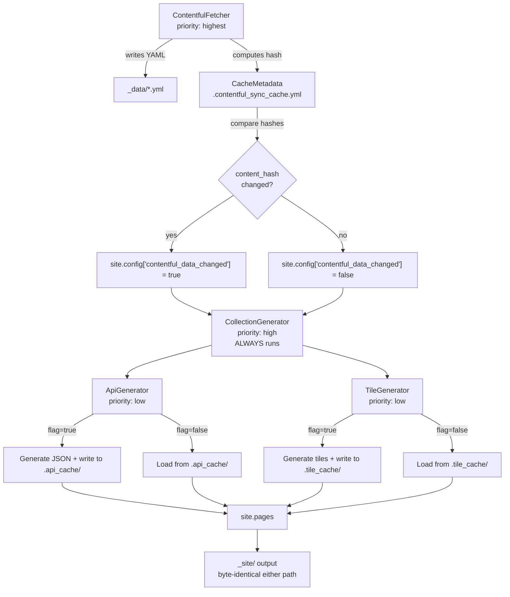

# Design Document: Conditional Build Regeneration

## Overview

This feature adds content-hash-based change detection to the paddelbuch Jekyll build pipeline, allowing the expensive `ApiGenerator` and `TileGenerator` plugins to skip regeneration when Contentful data hasn't changed. The mechanism works by:

1. Computing a SHA-256 hash of all YAML data files after `ContentfulFetcher` writes them
2. Comparing the hash against the previously stored hash in the sync cache metadata
3. Propagating a boolean change flag via `site.config['contentful_data_changed']`
4. Having `ApiGenerator` and `TileGenerator` check the flag and either regenerate (writing output to persistent cache directories) or load cached JSON output directly

The `CollectionGenerator` is explicitly excluded — it always runs because Jekyll page rendering depends on the `Document` objects it creates.

Cached generator output is stored in dot-prefixed subdirectories under `_data/` (`.api_cache/`, `.tile_cache/`) so that Amplify's existing `_data/**/*` cache directive preserves them between builds with zero config changes.

The central design constraint is **build output invariance**: the `_site/` output must be byte-identical whether generators run fresh or serve from cache.

## Architecture



### Plugin Execution Order

The existing priority system ensures correct ordering:

| Priority | Plugin | Behavior |
|----------|--------|----------|
| `:highest` | `ContentfulFetcher` | Fetches data, computes hash, sets change flag |
| `:high` | `CollectionGenerator` | Always runs, creates Jekyll Documents |
| `:low` | `ApiGenerator` | Checks flag, generates or loads from cache |
| `:low` | `TileGenerator` | Checks flag, generates or loads from cache |

### Force Regeneration

Two override mechanisms set the change flag to `true` regardless of hash comparison:
- Environment variable: `CONTENTFUL_FORCE_SYNC=true`
- Jekyll config: `force_contentful_sync: true`

Both are already handled by `ContentfulFetcher#force_sync?` — the change flag is simply set to `true` in these code paths.

## Components and Interfaces

### 1. CacheMetadata (modified)

**File:** `_plugins/cache_metadata.rb`

**Changes:** Add `content_hash` field to the persisted metadata and a method to compute the hash.

```ruby
class CacheMetadata
  attr_accessor :sync_token, :last_sync_at, :space_id, :environment, :content_hash

  # Compute SHA-256 over sorted YAML data files written by ContentfulFetcher.
  # Files are sorted by path to ensure deterministic ordering.
  # Returns the hex digest string.
  def compute_content_hash(yaml_files)
    digest = Digest::SHA256.new
    yaml_files.sort.each do |path|
      digest.update(File.read(path))
    end
    digest.hexdigest
  end
end
```

The `load` and `save` methods are extended to include `content_hash` in the YAML serialization. The cache file format becomes:

```yaml
sync_token: "..."
last_sync_at: "2025-01-15T10:30:00Z"
space_id: "abc123"
environment: "master"
content_hash: "a1b2c3d4..."
```

### 2. ContentfulFetcher (modified)

**File:** `_plugins/contentful_fetcher.rb`

**Changes:** After writing YAML files, compute the content hash, compare with stored hash, and set the change flag.

Key integration points in the `generate` method:

```ruby
def generate(site)
  @site = site
  @data_dir = File.join(site.source, '_data')
  
  # ... existing credential check, cache load, sync logic ...
  
  # After all YAML files are written (or skipped):
  # Set site.config['contentful_data_changed'] based on hash comparison
end
```

**Change flag logic by code path:**

| Code Path | Hash Computed? | Change Flag |
|-----------|---------------|-------------|
| Force sync | Yes (after fetch) | `true` |
| No cache / invalid cache | Yes (after fetch) | `true` |
| Environment mismatch | Yes (after fetch) | `true` |
| Sync API error (fallback) | Yes (after fetch) | `true` |
| Sync API: has changes | Yes (after fetch) | Compare hashes |
| Sync API: no changes | No | `false` |
| Missing credentials | No | Not set (nil) |

**YAML file collection:** The fetcher already knows which files it writes via `CONTENT_TYPES`. The file paths are collected from the `write_yaml` calls:

```ruby
CONTENT_TYPES.values.map { |c| File.join(@data_dir, "#{c[:filename]}.yml") }
                     .select { |p| File.exist?(p) }
```

### 3. ApiGenerator (modified)

**File:** `_plugins/api_generator.rb`

**Changes:** Wrap the `generate` method with cache-check logic.

```ruby
def generate(site)
  @site = site
  
  # ... existing duplicate-run skip for non-default language ...
  
  data_changed = site.config.fetch('contentful_data_changed', true)
  cache_dir = File.join(site.source, '_data', '.api_cache')
  
  if !data_changed && cache_available?(cache_dir)
    load_from_cache(cache_dir)
  else
    # Existing generation logic (unchanged)
    generate_fresh(cache_dir)
  end
end
```

**Cache write (during fresh generation):**
- After `add_json_page` creates a `PageWithoutAFile`, also write the same JSON content to `.api_cache/<filename>`
- The cache stores the raw JSON string — the exact bytes that would be set as `page.content`

**Cache read (when loading from cache):**
- Read each `.json` file from `.api_cache/`
- Create `PageWithoutAFile` objects with the cached content as `page.content`
- Set `page.data['layout'] = nil` (same as fresh generation)
- Reconstruct `site.data['last_updates']` and `@@cached_last_updates` from the cached `lastUpdateIndex.json`

**Build output invariance:** The cached JSON string is the exact string that was passed to `page.content` during fresh generation. Since Jekyll writes `page.content` verbatim for layout-less pages, the `_site/` output is byte-identical.

### 4. TileGenerator (modified)

**File:** `_plugins/tile_generator.rb`

**Changes:** Same pattern as ApiGenerator.

```ruby
def generate(site)
  @site = site
  
  # ... existing duplicate-run skip for non-default language ...
  
  data_changed = site.config.fetch('contentful_data_changed', true)
  cache_dir = File.join(site.source, '_data', '.tile_cache')
  
  if !data_changed && cache_available?(cache_dir)
    load_from_cache(cache_dir)
  else
    generate_fresh(cache_dir)
  end
end
```

**Cache directory structure mirrors the output structure:**

```
_data/.tile_cache/
  api/tiles/spots/de/index.json
  api/tiles/spots/de/3_2.json
  api/tiles/spots/en/index.json
  ...
  api/tiles/notices/de/index.json
  ...
```

**Cache write:** After `add_json_page(dir, filename, data)`, also write the JSON string to the corresponding path under `.tile_cache/`.

**Cache read:** Walk the `.tile_cache/` directory tree, reconstruct the `dir` and `filename` from the relative path, create `PageWithoutAFile` objects with the cached JSON as content.

**Note on `JSON.pretty_generate`:** TileGenerator uses `JSON.pretty_generate` while ApiGenerator uses `JSON.generate`. The cache stores the exact output string, so this difference is preserved transparently.

### 5. Shared Cache Helper Module

To avoid duplicating cache read/write logic, a small mixin module:

**File:** `_plugins/generator_cache.rb`

```ruby
module GeneratorCache
  def cache_available?(cache_dir)
    Dir.exist?(cache_dir) && !Dir.glob(File.join(cache_dir, '**', '*.json')).empty?
  end

  def write_cache_file(cache_dir, relative_path, content)
    path = File.join(cache_dir, relative_path)
    FileUtils.mkdir_p(File.dirname(path))
    File.write(path, content)
  end

  def read_cache_files(cache_dir)
    Dir.glob(File.join(cache_dir, '**', '*.json')).map do |path|
      relative = path.sub("#{cache_dir}/", '')
      { relative_path: relative, content: File.read(path) }
    end
  end

  def clear_cache(cache_dir)
    FileUtils.rm_rf(cache_dir)
    FileUtils.mkdir_p(cache_dir)
  end
end
```

### 6. Build Logging

All log messages use `Jekyll.logger.info` with the existing tag format.

| Event | Log Message |
|-------|-------------|
| Hash match | `Contentful: Content hash unchanged — setting change flag to false` |
| Hash mismatch | `Contentful: Content hash changed — setting change flag to true` |
| No previous hash | `Contentful: No previous content hash — setting change flag to true` |
| Force sync | `Contentful: Force sync — setting change flag to true` |
| Sync API no changes | `Contentful: Sync API reports no changes — setting change flag to false` |
| API cache hit | `API Generator: Using cached API files (N files loaded)` |
| API fresh gen | `API Generator: Generating JSON API files` |
| API cache miss | `API Generator: Cache empty/missing — performing full generation` |
| Tile cache hit | `Tile Generator: Using cached tile files (N files loaded)` |
| Tile fresh gen | `Tile Generator: Generating spatial tile files` |
| Tile cache miss | `Tile Generator: Cache empty/missing — performing full generation` |

## Data Models

### Cache Metadata File (`_data/.contentful_sync_cache.yml`)

```yaml
sync_token: "w5ZGzMZNIiMZMDcwYjBiN2VhZDY0..."
last_sync_at: "2025-01-15T10:30:00+00:00"
space_id: "abc123def456"
environment: "master"
content_hash: "e3b0c44298fc1c149afbf4c8996fb92427ae41e4649b934ca495991b7852b855"
```

### API Cache Directory (`_data/.api_cache/`)

```
_data/.api_cache/
  spots-de.json
  spots-en.json
  obstacles-de.json
  obstacles-en.json
  waterwayevents-de.json
  waterwayevents-en.json
  protectedareas-de.json
  protectedareas-en.json
  waterways-de.json
  waterways-en.json
  spottypes-de.json
  spottypes-en.json
  obstacletypes-de.json
  obstacletypes-en.json
  paddlecrafttypes-de.json
  paddlecrafttypes-en.json
  paddlingenvironmenttypes-de.json
  paddlingenvironmenttypes-en.json
  protectedareatypes-de.json
  protectedareatypes-en.json
  datasourcetypes-de.json
  datasourcetypes-en.json
  datalicensetypes-de.json
  datalicensetypes-en.json
  lastUpdateIndex.json
```

Each file contains the exact JSON string that would be set as `page.content` during fresh generation.

### Tile Cache Directory (`_data/.tile_cache/`)

```
_data/.tile_cache/
  api/tiles/spots/de/index.json
  api/tiles/spots/de/0_0.json
  api/tiles/spots/de/1_2.json
  ...
  api/tiles/spots/en/index.json
  ...
  api/tiles/notices/de/index.json
  ...
  api/tiles/protected/de/index.json
  ...
  api/tiles/obstacles/de/index.json
  ...
```

Each file contains the exact JSON string (pretty-printed, matching `JSON.pretty_generate` output) that would be set as `page.content`.

### Change Flag

Stored in `site.config['contentful_data_changed']` as a Ruby boolean (`true`/`false`) or `nil` (when ContentfulFetcher didn't run).

Generators treat `nil` as `true` (defensive default — regenerate when uncertain).


## Correctness Properties

*A property is a characteristic or behavior that should hold true across all valid executions of a system — essentially, a formal statement about what the system should do. Properties serve as the bridge between human-readable specifications and machine-verifiable correctness guarantees.*

### Property 1: Content hash determinism

*For any* set of YAML file contents and file paths, computing the content hash over the sorted paths should always produce the same SHA-256 digest. Reordering the input file list must not change the result.

**Validates: Requirements 1.1**

### Property 2: Change flag reflects hash comparison

*For any* pair of content hash values (computed and stored), the change flag must equal `true` when the hashes differ and `false` when they match. The flag must be stored in `site.config['contentful_data_changed']` after `ContentfulFetcher#generate` completes.

**Validates: Requirements 1.2, 1.3, 2.1**

### Property 3: Force sync overrides hash comparison

*For any* content hash state (matching, mismatching, or missing), when force sync is active (via `CONTENTFUL_FORCE_SYNC=true` environment variable or `force_contentful_sync: true` config), the change flag must be `true`.

**Validates: Requirements 6.1, 6.2**

### Property 4: API generator cache round-trip

*For any* valid site data (spots, obstacles, waterways, notices, protected areas, dimension types), generating API JSON fresh and writing to the cache, then loading from the cache on a subsequent run, must produce `PageWithoutAFile` objects with byte-identical `content` values and identical filenames.

**Validates: Requirements 3.1, 3.2, 3.4**

### Property 5: Tile generator cache round-trip

*For any* valid site data with geolocated entries, generating tile JSON fresh and writing to the cache, then loading from the cache on a subsequent run, must produce `PageWithoutAFile` objects with byte-identical `content` values and identical directory/filename paths.

**Validates: Requirements 4.1, 4.2, 4.4**

### Property 6: Build output invariance

*For any* valid Contentful dataset, the set of files written to `_site/` and their byte contents must be identical whether generators ran fresh or served from cache. No files may be added, removed, renamed, or have their content altered by the caching mechanism.

**Validates: Requirements 8.1, 8.2, 8.3**

### Property 7: CollectionGenerator independence

*For any* value of the change flag (`true`, `false`, or `nil`), the `CollectionGenerator` must execute and produce the same set of Jekyll `Document` objects.

**Validates: Requirements 9.1**

### Property 8: Change flag logging

*For any* code path that sets the change flag, `ContentfulFetcher` must emit an info-level log message containing the flag value and the reason (one of: hash match, hash mismatch, no previous hash, force sync, sync API no changes).

**Validates: Requirements 7.5**

### Property 9: Generator cache-hit logging

*For any* cache-hit scenario, the generator (ApiGenerator or TileGenerator) must emit an info-level log message that includes the number of cached files loaded. *For any* cache-miss or fresh-generation scenario, the generator must emit an info-level log message indicating full generation.

**Validates: Requirements 7.1, 7.2, 7.3, 7.4**

## Error Handling

### Corrupted Cache Files

If a cached JSON file cannot be read (I/O error, invalid encoding), the generator should:
1. Log a warning with the file path and error
2. Fall back to full generation for that generator
3. Clear and repopulate the cache directory

This ensures a corrupted cache never produces a broken build.

### Missing Cache Directory

When `cache_available?` returns `false` (directory missing or empty), generators fall back to full generation. This is the normal path for first builds and after cache eviction.

### Hash Computation Failure

If any YAML file listed in `CONTENT_TYPES` doesn't exist on disk when computing the hash (e.g., a fetch error caused a file to be skipped), `compute_content_hash` should only hash the files that exist. The resulting hash will differ from the previous one, triggering regeneration — which is the safe default.

### Concurrent Builds

Amplify runs one build at a time per branch, so concurrent write conflicts to cache directories are not a concern. No file locking is needed.

### Cache Staleness

The cache is keyed implicitly by the content hash. When data changes, the change flag is `true`, and generators overwrite the cache with fresh output. There is no TTL or explicit invalidation — the hash comparison is the sole staleness check.

## Testing Strategy

### Property-Based Testing

Use the `rantly` gem for property-based testing in Ruby (compatible with RSpec).

Each correctness property maps to one property-based test with a minimum of 100 iterations. Tests are tagged with comments referencing the design property.

**Configuration:**
```ruby
# Gemfile (test group)
gem 'rantly', '~> 2.0'
gem 'rspec-rantly', '~> 1.0'
```

**Test tag format:**
```ruby
# Feature: conditional-build-regeneration, Property 1: Content hash determinism
```

### Property Test Plan

| Property | Test Approach | Generator Strategy |
|----------|--------------|-------------------|
| P1: Hash determinism | Generate random file contents and paths, compute hash with different orderings, assert equality | Random strings for file contents, random path orderings |
| P2: Change flag correctness | Generate random hash pairs (equal and unequal), run flag logic, assert flag matches expectation | Random hex strings |
| P3: Force sync override | Generate random hash states, enable force sync, assert flag is always true | Random hash strings + boolean force flags |
| P4: API cache round-trip | Generate random site data, run fresh generation, write cache, load cache, compare page contents | Random YAML-like data structures |
| P5: Tile cache round-trip | Generate random geolocated data, run fresh generation, write cache, load cache, compare page contents | Random coordinates within Switzerland bounds |
| P6: Build output invariance | Generate data, run full pipeline twice (fresh then cached), compare all page objects | Composite of P4 and P5 generators |
| P7: CollectionGenerator independence | Set flag to random values, run CollectionGenerator, assert documents created | Random boolean/nil values |
| P8: Change flag logging | Run ContentfulFetcher with random hash states, capture log output, assert message present | Random hash strings + code path selectors |
| P9: Generator cache-hit logging | Run generators with/without cache, capture log output, assert correct messages | Random data + cache presence |

### Unit Tests

Unit tests complement property tests for specific examples and edge cases:

- **Edge case:** First build with no cache metadata file → flag is `true`
- **Edge case:** Cache directory exists but is empty → fallback to full generation
- **Edge case:** Missing Contentful credentials → flag is not set, generators default to `true`
- **Edge case:** Corrupted cache file (invalid JSON) → fallback to full generation
- **Example:** `compute_content_hash` with known file contents produces expected SHA-256 digest
- **Example:** Cache paths are `_data/.api_cache/` and `_data/.tile_cache/` (Requirements 5.1, 5.2)
- **Example:** `lastUpdateIndex.json` is correctly reconstructed from cache (for `site.data['last_updates']`)
- **Example:** Sync API reports no changes → hash is not recomputed (Requirement 1.4)

### Test File Organization

```
spec/
  plugins/
    cache_metadata_spec.rb        # P1, P2 + unit tests
    contentful_fetcher_spec.rb    # P2, P3, P8 + unit tests
    api_generator_cache_spec.rb   # P4, P6, P9 + unit tests
    tile_generator_cache_spec.rb  # P5, P6, P9 + unit tests
    collection_generator_spec.rb  # P7 + unit tests
    generator_cache_spec.rb       # Shared module unit tests
```
