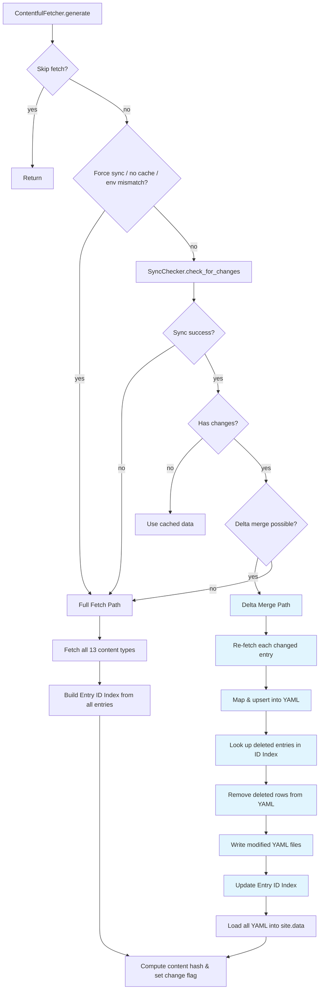

# Design Document: Contentful Delta Sync

## Overview

This feature replaces the current "re-fetch everything on any change" behaviour in `ContentfulFetcher` with a targeted delta merge strategy. When the Contentful Sync API reports changes, the system will:

1. Extract individual changed and deleted entries from the sync delta
2. Re-fetch each changed entry individually via `client.entry(id, locale: '*', include: 2)` to get resolved links
3. Map the re-fetched entry through `ContentfulMappers.flatten_entry` to produce locale rows
4. Upsert those rows into the corresponding YAML data file (match by `slug` + `locale`)
5. Remove deleted entries by looking up their `sys.id` in a persistent Entry ID Index
6. Fall back to a full fetch if any step fails

This minimises Contentful API calls from one-per-content-type (up to 13 paginated fetches of hundreds of entries each) to one-per-changed-entry. Unchanged content types require zero API calls.

### Key Design Decisions

- **Individual re-fetch over raw delta entries**: Sync delta entries lack resolved linked references. The mappers rely on `include: 2` to extract reference slugs (e.g., `waterway_slug`, `spotType_slug`). Re-fetching via `client.entry` with `include: 2` ensures the mapper output is identical to a full fetch.
- **Entry ID Index for deletions**: Deleted entries from Contentful contain only `sys` metadata (no `fields`, no `slug`). A persistent index mapping `sys.id → { content_type, slug }` is required to locate and remove the correct YAML rows.
- **Fail-safe fallback**: Any failure during delta merge (re-fetch error, mapping error, YAML write error, missing index entry) triggers a full fetch of all 13 content types. This guarantees data integrity at the cost of one slower build.
- **Content hash consistency**: The SHA-256 content hash is always computed over all YAML files after any sync operation (delta or full), ensuring the `contentful_data_changed` flag is accurate regardless of the sync path taken.

## Architecture

The delta sync feature modifies three existing modules and introduces no new files:



### Module Responsibilities

| Module | Current Role | Delta Sync Changes |
|--------|-------------|-------------------|
| `SyncChecker` | Returns `SyncResult` with change count and new token | Extract and classify delta items into changed/deleted lists grouped by content type; extend `SyncResult` struct |
| `ContentfulFetcher` | Orchestrates fetch, map, write | Add delta merge path: re-fetch individual entries, upsert/delete in YAML, build/maintain Entry ID Index |
| `CacheMetadata` | Persists sync token, timestamp, space/env, content hash | Add `entry_id_index` field for persistent ID→slug mapping |


## Components and Interfaces

### SyncChecker Module Changes

#### Extended `SyncResult` Struct

```ruby
SyncResult = Struct.new(
  :success, :has_changes, :new_token, :items_count, :error,
  :changed_entries,   # Hash { content_type_id => [entry, ...] }
  :deleted_entries,   # Hash { content_type_id => [entry, ...] }
  :unknown_content_types,  # Array of unknown content type IDs for logging
  keyword_init: true
) do
  def success?
    success
  end
end
```

#### `check_for_changes(client, sync_token, known_content_types)`

Updated signature accepts the set of known content type IDs (from `CONTENT_TYPES.keys`). The method:

1. Calls `client.sync(sync_token: sync_token)` and collects all pages
2. Iterates items, classifying each as changed or deleted based on `sys.type`:
   - `'Entry'` → changed entry (has `sys.contentType`)
   - `'DeletedEntry'` → deleted entry (has `sys.contentType`)
   - `'Asset'`, `'DeletedAsset'` → ignored (not used by this project)
3. Extracts `content_type_id` from `sys.contentType.sys.id`
4. Filters out entries whose `content_type_id` is not in `known_content_types`
5. Collects unknown content type IDs for warning logs
6. Groups results by `content_type_id`
7. Returns `SyncResult` with all fields populated

#### `initial_sync(client)` — unchanged

No changes needed. The initial sync path always triggers a full fetch.

### ContentfulFetcher Changes

#### New method: `perform_delta_merge(result, cache, space_id, environment)`

Orchestrates the delta merge path:

```ruby
def perform_delta_merge(result, cache, space_id, environment)
  log_unknown_content_types(result.unknown_content_types)
  log_delta_summary(result)

  # Phase 1: Re-fetch and upsert changed entries
  yaml_data = load_all_yaml_files
  result.changed_entries.each do |content_type_id, entries|
    config = CONTENT_TYPES[content_type_id]
    entries.each do |delta_entry|
      entry_id = delta_entry.sys[:id]
      re_fetched = client.entry(entry_id, locale: '*', include: 2)
      extra_args = config[:mapper] == :map_type ? [content_type_id] : []
      new_rows = ContentfulMappers.flatten_entry(re_fetched, config[:mapper], *extra_args)
      upsert_rows(yaml_data, config[:filename], new_rows)
      update_entry_id_index(cache, entry_id, new_rows.first['slug'], content_type_id)
      log_upsert(new_rows.first['slug'], content_type_id, existing?)
    end
  end

  # Phase 2: Remove deleted entries
  result.deleted_entries.each do |content_type_id, entries|
    entries.each do |deleted_entry|
      entry_id = deleted_entry.sys[:id]
      index_entry = cache.entry_id_index[entry_id]
      raise "Entry ID #{entry_id} not found in index" unless index_entry
      slug = index_entry['slug']
      remove_rows(yaml_data, CONTENT_TYPES[content_type_id][:filename], slug)
      cache.remove_from_entry_id_index(entry_id)
      log_deletion(slug, content_type_id)
    end
  end

  # Phase 3: Write modified files, load into site.data
  write_all_yaml_files(yaml_data)
  load_all_yaml_into_site_data

  # Phase 4: Compute hash and save cache
  compute_and_set_change_flag(cache, result.new_token, space_id, environment)

rescue StandardError => e
  Jekyll.logger.warn 'Contentful:', "Delta merge failed: #{e.message} -- falling back to full fetch"
  perform_full_sync_and_cache(cache, space_id, environment)
end
```

#### New method: `upsert_rows(yaml_data, filename, new_rows)`

For each new locale row, finds existing rows in `yaml_data[filename]` matching `slug` + `locale`. Replaces if found, appends if not.

#### New method: `remove_rows(yaml_data, filename, slug)`

Removes all rows from `yaml_data[filename]` where `row['slug'] == slug` (both `de` and `en` locale rows).

#### New method: `load_all_yaml_files`

Reads all 13 YAML data files into a hash `{ filename => [rows] }`. Falls back to full fetch if any expected file is missing.

#### New method: `load_all_yaml_into_site_data`

Reads all YAML files from disk and populates `site.data` using the same key structure as `write_yaml` (flat keys and nested `types/*` keys).

#### New method: `build_entry_id_index(entries_by_type)`

During full fetch, iterates all fetched entries and builds the index:

```ruby
def build_entry_id_index(entries_by_type)
  index = {}
  entries_by_type.each do |content_type_id, entries|
    entries.each do |entry|
      slug = ContentfulMappers.extract_slug(entry.fields_with_locales, entry)
      index[entry.sys[:id]] = { 'slug' => slug, 'content_type' => content_type_id }
    end
  end
  index
end
```

#### Modified `generate(site)` — delta merge branch

The existing incremental sync branch (where `result.has_changes` is true) is updated:

```ruby
# Current: re-fetches all content types
# New: attempts delta merge first, falls back to full fetch on failure
if result.has_changes
  if result.changed_entries.any? || result.deleted_entries.any?
    perform_delta_merge(result, cache, current_space_id, current_environment)
  else
    # Sync reported changes but no classifiable entries — full fetch
    fetch_and_write_content
    compute_and_set_change_flag(cache, result.new_token, current_space_id, current_environment)
  end
end
```

### CacheMetadata Changes

#### New field: `entry_id_index`

```ruby
attr_accessor :sync_token, :last_sync_at, :space_id, :environment,
              :content_hash, :entry_id_index
```

The `entry_id_index` is a Hash:

```ruby
{
  "abc123" => { "slug" => "spiez-beach", "content_type" => "spot" },
  "def456" => { "slug" => "aare",        "content_type" => "waterway" },
  ...
}
```

#### Updated `save` / `load`

The `entry_id_index` is serialized as part of the cache YAML file:

```yaml
---
sync_token: "..."
last_sync_at: "2025-03-24T07:30:28+01:00"
space_id: "mwuqd55n7yfb"
environment: "master"
content_hash: "1b78e58..."
entry_id_index:
  abc123:
    slug: "spiez-beach"
    content_type: "spot"
  def456:
    slug: "aare"
    content_type: "waterway"
```

#### New methods

- `add_to_entry_id_index(entry_id, slug, content_type)` — adds/updates an entry in the index
- `remove_from_entry_id_index(entry_id)` — removes an entry from the index
- `lookup_entry_id(entry_id)` — returns `{ 'slug' => ..., 'content_type' => ... }` or `nil`


## Data Models

### SyncResult (Extended)

| Field | Type | Description |
|-------|------|-------------|
| `success` | Boolean | Whether the sync API call succeeded |
| `has_changes` | Boolean | Whether the delta contains any items |
| `new_token` | String | New sync token for next incremental sync |
| `items_count` | Integer | Total number of items in the delta |
| `error` | Exception / nil | Error object if sync failed |
| `changed_entries` | Hash | `{ content_type_id => [Contentful::Entry, ...] }` — entries to upsert |
| `deleted_entries` | Hash | `{ content_type_id => [Contentful::Entry, ...] }` — entries to remove |
| `unknown_content_types` | Array | Content type IDs found in delta but not in `CONTENT_TYPES` |

### Entry ID Index (persisted in cache)

| Field | Type | Description |
|-------|------|-------------|
| Key: `entry_id` | String | Contentful `sys.id` (e.g., `"abc123"`) |
| Value: `slug` | String | Entry slug used in YAML data files |
| Value: `content_type` | String | Content type ID (e.g., `"spot"`, `"waterway"`) |

### YAML Data File Structure (unchanged)

Each YAML data file is an array of locale row hashes. A locale row is uniquely identified by the combination of `slug` + `locale`:

```yaml
- locale: de
  slug: spiez-beach
  name: Spiez Strandbad
  # ... mapper-specific fields
  createdAt: '2025-03-08T20:42:07Z'
  updatedAt: '2025-03-22T12:57:52Z'
- locale: en
  slug: spiez-beach
  name: Spiez Beach
  # ... mapper-specific fields
  createdAt: '2025-03-08T20:42:07Z'
  updatedAt: '2025-03-22T12:57:52Z'
```

The upsert operation matches on `slug` + `locale`. The delete operation matches on `slug` only (removes both locale rows).

### Cache Metadata File (extended)

The `.contentful_sync_cache.yml` file gains the `entry_id_index` key:

```yaml
---
sync_token: "CkzCjMOo..."
last_sync_at: '2026-03-24T07:30:28+01:00'
space_id: mwuqd55n7yfb
environment: master
content_hash: 1b78e58491ccd1354ef8d6221d59bdef32936c486d944e43711a4e95a4eaab6f
entry_id_index:
  abc123:
    slug: spiez-beach
    content_type: spot
  def456:
    slug: aare
    content_type: waterway
```

### Contentful Sync API Item Types

The Contentful Sync API returns items with these `sys.type` values:

| `sys.type` | Has `fields`? | Has `sys.contentType`? | Action |
|------------|--------------|----------------------|--------|
| `Entry` | Yes | Yes | Classify as changed entry |
| `DeletedEntry` | No | Yes | Classify as deleted entry |
| `Asset` | Yes | No | Ignore |
| `DeletedAsset` | No | No | Ignore |


## Correctness Properties

*A property is a characteristic or behavior that should hold true across all valid executions of a system — essentially, a formal statement about what the system should do. Properties serve as the bridge between human-readable specifications and machine-verifiable correctness guarantees.*

### Property 1: Delta item classification and grouping

*For any* collection of Contentful sync items (with random `sys.type` values of `Entry`, `DeletedEntry`, `Asset`, or `DeletedAsset`, and random `sys.contentType.sys.id` values drawn from both known and unknown content type IDs), the `check_for_changes` method should:
- Place all items with `sys.type == 'Entry'` and a known content type ID into `changed_entries`, grouped by content type ID
- Place all items with `sys.type == 'DeletedEntry'` and a known content type ID into `deleted_entries`, grouped by content type ID
- Exclude all items with unknown content type IDs from both lists
- Collect all unknown content type IDs in `unknown_content_types`
- Set `items_count` to the total number of items in the delta (including unknown types)
- Set `has_changes` to true if and only if the delta is non-empty

**Validates: Requirements 1.1, 1.2, 1.3, 1.4, 1.5, 2.1, 2.2**

### Property 2: Upsert preserves data and updates correctly

*For any* YAML data array of locale rows (with random slugs and locales) and *for any* set of new locale rows to upsert, after the upsert operation:
- Every new row's `slug` + `locale` combination is present in the result
- The values for upserted `slug` + `locale` pairs match the new rows exactly
- All rows whose `slug` + `locale` did not match any new row remain unchanged
- The total row count equals: original count + number of genuinely new slug+locale pairs (not already present)

**Validates: Requirements 3.3, 3.4, 7.3**

### Property 3: Deletion removes exactly the target slug rows

*For any* YAML data array of locale rows and *for any* slug present in that array, after the delete operation:
- No rows with the deleted slug remain in the result
- All rows with a different slug remain unchanged and in the same order
- The row count decreases by exactly the number of rows that had the deleted slug

**Validates: Requirements 3.6, 3.7, 7.4**

### Property 4: Entry ID Index round-trip through cache persistence

*For any* Entry ID Index (a hash mapping random entry IDs to `{ slug, content_type }` pairs), saving the index via `CacheMetadata#save` and loading it via `CacheMetadata#load` should produce an identical index.

**Validates: Requirements 7.1, 7.5**

### Property 5: Entry ID Index construction covers all entries

*For any* set of Contentful entries (with random `sys.id` values, random slugs, and random content type IDs from the known set), building the Entry ID Index from those entries should produce an index where every entry's `sys.id` maps to its correct slug and content type, and the index size equals the number of unique entry IDs.

**Validates: Requirements 7.2**

### Property 6: Content hash is identical regardless of sync path

*For any* set of YAML data files, the SHA-256 content hash computed over those files should be identical whether the files were produced by a full fetch or by applying a delta merge to a previous state — as long as the final file contents are byte-identical. Specifically: `compute_content_hash(files)` is a pure function of file contents, independent of how those files were produced.

**Validates: Requirements 5.1**


## Error Handling

### Delta Merge Failure Recovery

The delta merge path is wrapped in a `rescue StandardError` block. Any failure triggers a full fetch fallback:

| Failure Scenario | Trigger | Recovery |
|-----------------|---------|----------|
| Individual entry re-fetch fails | `client.entry` raises `Contentful::Error` | Log entry ID + content type, fall back to full fetch |
| Mapper raises error | `ContentfulMappers.flatten_entry` raises | Log error, fall back to full fetch |
| YAML file missing on disk | `File.read` raises `Errno::ENOENT` | Fall back to full fetch |
| YAML parse error | `YAML.safe_load` raises `Psych::SyntaxError` | Fall back to full fetch |
| Entry ID not in index | `cache.lookup_entry_id` returns `nil` | Log missing ID, fall back to full fetch |
| YAML write error | `File.write` raises `Errno::EACCES` or similar | Fall back to full fetch |

### Sync API Errors

Existing error handling is preserved:
- `check_for_changes` catches `StandardError` and returns `SyncResult(success: false, error: e)`
- `ContentfulFetcher` checks `result.success?` and falls back to full fetch on failure

### Unknown Content Types

When the sync delta contains entries with content type IDs not in `CONTENT_TYPES`:
- The entries are excluded from `changed_entries` and `deleted_entries`
- The unknown content type IDs are collected in `SyncResult#unknown_content_types`
- `ContentfulFetcher` logs a warning for each unknown content type ID
- This is not treated as an error — the delta merge proceeds with known types only

### Partial Delta Merge Prevention

The delta merge is atomic in the sense that if any step fails, the entire merge is abandoned and a full fetch is performed. There is no partial state where some content types are merged and others are not. This is achieved by:
1. Loading all YAML files into memory first
2. Performing all upserts and deletions in memory
3. Writing all modified files to disk only after all operations succeed
4. If any step fails before the write phase, no files are modified

## Testing Strategy

### Property-Based Testing

Property-based tests use **RSpec + Rantly** (already configured in the project). Each property test runs a minimum of 100 iterations.

| Property | Test File | What It Generates |
|----------|-----------|-------------------|
| P1: Delta classification | `spec/delta_sync_properties_spec.rb` | Random sync items with mixed types and content type IDs |
| P2: Upsert correctness | `spec/delta_sync_properties_spec.rb` | Random YAML arrays + random new locale rows |
| P3: Deletion correctness | `spec/delta_sync_properties_spec.rb` | Random YAML arrays + random slugs to delete |
| P4: Entry ID Index round-trip | `spec/delta_sync_properties_spec.rb` | Random index hashes |
| P5: Index construction | `spec/delta_sync_properties_spec.rb` | Random entry sets with IDs, slugs, content types |
| P6: Content hash equivalence | `spec/delta_sync_properties_spec.rb` | Random file contents written via two different paths |

Each property test is tagged with a comment referencing the design property:
```ruby
# Feature: contentful-delta-sync, Property 1: Delta item classification and grouping
# **Validates: Requirements 1.1, 1.2, 1.3, 1.4, 1.5, 2.1, 2.2**
```

### Unit Tests

Unit tests cover specific examples, edge cases, and integration points. They complement the property tests by verifying concrete scenarios:

| Area | Test File | Key Scenarios |
|------|-----------|---------------|
| SyncChecker delta extraction | `spec/sync_checker_spec.rb` | Empty delta, mixed item types, unknown content types, multi-page sync |
| SyncResult struct | `spec/sync_checker_spec.rb` | New fields present, backward compatibility with existing fields |
| ContentfulFetcher delta merge | `spec/contentful_fetcher_spec.rb` | Upsert existing entry, insert new entry, delete entry, mixed operations |
| ContentfulFetcher fallback | `spec/contentful_fetcher_spec.rb` | Re-fetch failure triggers full fetch, missing index entry triggers full fetch |
| ContentfulFetcher re-fetch | `spec/contentful_fetcher_spec.rb` | `client.entry` called with correct params, `map_type` gets content_type arg |
| CacheMetadata index | `spec/cache_metadata_spec.rb` | Save/load with index, add/remove/lookup operations |
| Logging | `spec/contentful_fetcher_spec.rb` | Delta summary logged, upsert/delete logged, unknown types warned, fallback reason logged |

### Test Configuration

- Property tests: minimum 100 iterations per property (Rantly default)
- All tests run via `bundle exec rspec`
- Tests use `tmpdir` for file system operations (no side effects on real `_data/`)
- Contentful client is always mocked (no real API calls in tests)

### Documentation Updates

The `docs/plugins.md` file will be updated to reflect:
- The new delta merge sync strategy in the `ContentfulFetcher` section
- The extended `SyncResult` struct in the `SyncChecker` section
- The new `entry_id_index` field in the `CacheMetadata` section
- The updated sync strategy flow (adding the delta merge step between "If changes" and "re-fetches all content")
