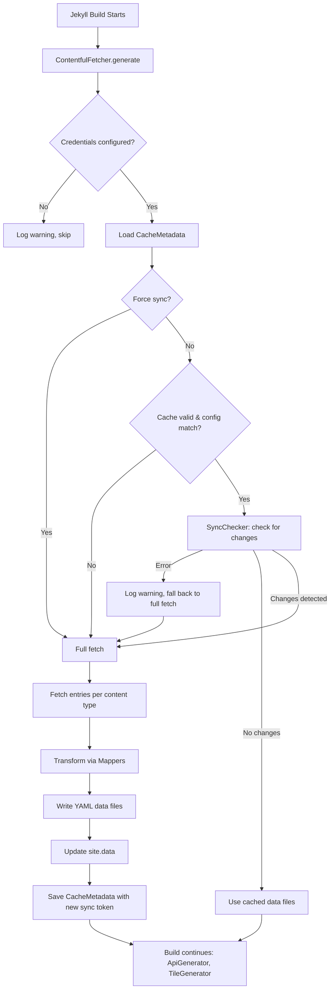

# Design Document: Contentful Sync Integration

## Overview

This design replaces the `jekyll-contentful-data-import` gem with a custom Jekyll Generator plugin (`ContentfulFetcher`) that fetches content from Contentful at build time, transforms entries using content-type-specific mappers, and writes YAML data files to `_data/`. The plugin uses Contentful's Sync API for incremental updates, persists sync state between builds, and includes SSL compatibility for Ruby 3.4+/OpenSSL 3.x.

The architecture follows the proven pattern from the Cloudy Pandas reference project, adapted for Paddelbuch's content types (spots, waterways, obstacles, protected areas, event notices, dimension types, and static pages). The plugin runs at highest priority so downstream generators (`ApiGenerator`, `TileGenerator`) can consume the fresh data.

Key design decisions:
- Single `ContentfulFetcher` generator class with `SyncChecker` module and `CacheMetadata` class extracted into separate files
- Reuse existing mapper logic from `contentful_mappers.rb`, refactored to work with the `contentful` gem's entry objects directly (instead of the `jekyll-contentful-data-import` mapper base class)
- Monkey-patch HTTP gem's SSL context to disable CRL checking on Ruby 3.4+
- Cache metadata stored as YAML in `_data/.contentful_sync_cache.yml`

## Architecture



## Components and Interfaces

### ContentfulFetcher (Jekyll Generator)

The main plugin class, registered as a Jekyll Generator with `priority :highest`.

```ruby
# _plugins/contentful_fetcher.rb
module Jekyll
  class ContentfulFetcher < Generator
    include SyncChecker

    safe true
    priority :highest

    CONTENT_TYPES = {
      'spot'                      => { filename: 'spots',                          mapper: :map_spot },
      'waterway'                  => { filename: 'waterways',                      mapper: :map_waterway },
      'obstacle'                  => { filename: 'obstacles',                      mapper: :map_obstacle },
      'protectedArea'             => { filename: 'protected_areas',                mapper: :map_protected_area },
      'waterwayEventNotice'       => { filename: 'notices',                        mapper: :map_event_notice },
      'spotType'                  => { filename: 'types/spot_types',               mapper: :map_type },
      'obstacleType'              => { filename: 'types/obstacle_types',           mapper: :map_type },
      'paddleCraftType'           => { filename: 'types/paddle_craft_types',       mapper: :map_type },
      'paddlingEnvironmentType'   => { filename: 'types/paddling_environment_types', mapper: :map_type },
      'protectedAreaType'         => { filename: 'types/protected_area_types',     mapper: :map_type },
      'dataSourceType'            => { filename: 'types/data_source_types',        mapper: :map_type },
      'dataLicenseType'           => { filename: 'types/data_license_types',       mapper: :map_type },
      'staticPage'                => { filename: 'static_pages',                   mapper: :map_static_page }
    }.freeze

    def generate(site)
      # 1. Check credentials
      # 2. Load cache metadata
      # 3. Determine if fetch needed (force sync, cache invalid, sync API check)
      # 4. If needed: fetch all content types, transform, write YAML, update site.data
      # 5. Save cache metadata with new sync token
    end

    private

    def contentful_configured?
      # Returns true if CONTENTFUL_SPACE_ID and CONTENTFUL_ACCESS_TOKEN are set
    end

    def force_sync?
      # Checks ENV['CONTENTFUL_FORCE_SYNC'] == 'true' or site.config['force_contentful_sync'] == true
    end

    def client
      # Memoized Contentful::Client instance
    end

    def fetch_and_write_content
      # Iterates CONTENT_TYPES, fetches entries, transforms, writes YAML
    end

    def fetch_entries(content_type)
      # client.entries(content_type: ct, locale: '*', include: 2, limit: 1000)
    end

    def write_yaml(filename, data)
      # Writes to _data/{filename}.yml and updates site.data
    end
  end
end
```

### SyncChecker Module

Encapsulates Contentful Sync API interactions. Included by `ContentfulFetcher`.

```ruby
# _plugins/sync_checker.rb
module SyncChecker
  SyncResult = Struct.new(:success, :has_changes, :new_token, :items_count, :error, keyword_init: true) do
    def success?
      success
    end
  end

  def check_for_changes(client, sync_token)
    # 1. client.sync(sync_token: sync_token)
    # 2. sync.first_page to get SyncPage
    # 3. Iterate pages collecting items
    # 4. Extract new token from final page's next_sync_url
    # Returns SyncResult
  rescue StandardError => e
    SyncResult.new(success: false, error: e)
  end

  def initial_sync(client)
    # 1. client.sync(initial: true)
    # 2. Iterate all pages to get final sync token
    # Returns SyncResult with has_changes: true
  rescue StandardError => e
    SyncResult.new(success: false, error: e)
  end

  private

  def collect_all_pages(sync)
    page = sync.first_page
    items = page.items.to_a
    while page.next_page?
      page = page.next_page
      items.concat(page.items.to_a)
    end
    [items, page]
  end

  def extract_sync_token(page)
    # Parse sync token from page.next_sync_url query parameter
  end
end
```

### CacheMetadata Class

Manages sync state persistence as YAML.

```ruby
# _plugins/cache_metadata.rb
class CacheMetadata
  CACHE_FILENAME = '.contentful_sync_cache.yml'

  attr_accessor :sync_token, :last_sync_at, :space_id, :environment

  def initialize(data_dir)
    @data_dir = data_dir
    @cache_path = File.join(data_dir, CACHE_FILENAME)
  end

  def load
    # Reads YAML, populates attributes, returns true/false
  end

  def save
    # Writes attributes as YAML to cache_path
  end

  def valid?
    # All required fields present and non-nil
    !sync_token.nil? && !last_sync_at.nil? && !space_id.nil? && !environment.nil?
  end

  def matches_config?(current_space_id, current_environment)
    space_id == current_space_id && environment == current_environment
  end
end
```

### ContentfulMappers Module (Refactored)

The existing `_plugins/contentful_mappers.rb` will be refactored to work standalone (without inheriting from `jekyll-contentful-data-import`'s `Base` class). Each mapper becomes a module method that takes a Contentful entry and returns a hash.

```ruby
# _plugins/contentful_mappers.rb
module ContentfulMappers
  module_function

  def map_spot(entry)
    # Returns hash with: slug, name, description (rich text HTML), location,
    # approximateAddress, country, confirmed, rejected, reference slugs,
    # locale, createdAt, updatedAt
  end

  def map_waterway(entry)
    # Returns hash with: slug, name, length, area, geometry (JSON string),
    # showInMenu, reference slugs, locale, createdAt, updatedAt
  end

  def map_obstacle(entry)
    # Returns hash with: slug, name, description, geometry, portageRoute,
    # portageDistance, portageDescription, isPortageNecessary, isPortagePossible,
    # reference slugs, locale, createdAt, updatedAt
  end

  def map_protected_area(entry)
    # Returns hash with: slug, name, geometry, isAreaMarked,
    # protectedAreaType slug, locale, createdAt, updatedAt
  end

  def map_event_notice(entry)
    # Returns hash with: slug, name, description, location, affectedArea,
    # startDate, endDate, waterway slugs, locale, createdAt, updatedAt
  end

  def map_type(entry)
    # Returns hash with: slug, name_de, name_en, locale, createdAt, updatedAt
  end

  def map_static_page(entry)
    # Returns hash with: slug, title, menu, menu_slug, content,
    # menuOrder, locale, createdAt, updatedAt
  end

  # Shared helpers
  def safe_field(entry, field_name)
    entry.respond_to?(field_name) ? entry.send(field_name) : nil
  rescue Contentful::Error => e
    nil
  end

  def extract_slug(entry)
    safe_field(entry, :slug) || entry.sys[:id]
  end

  def extract_location(location_field)
    return nil unless location_field
    { 'lat' => location_field.lat, 'lon' => location_field.lon }
  end

  def extract_reference_slug(ref)
    return nil unless ref
    safe_field(ref, :slug) || ref.sys[:id]
  end

  def extract_reference_slugs(refs)
    return [] unless refs.is_a?(Array)
    refs.map { |r| extract_reference_slug(r) }.compact
  end

  def extract_rich_text_html(field)
    # Converts Contentful rich text to HTML string
  end

  def base_fields(entry)
    {
      'locale' => entry.sys[:locale] || safe_field(entry, :locale),
      'createdAt' => entry.sys[:created_at]&.iso8601,
      'updatedAt' => entry.sys[:updated_at]&.iso8601
    }
  end
end
```

### SSL Patch Module

Applied conditionally for Ruby 3.4+ with OpenSSL 3.x.

```ruby
# _plugins/ssl_patch.rb
if RUBY_VERSION >= '3.4' || (defined?(OpenSSL::OPENSSL_LIBRARY_VERSION) &&
   OpenSSL::OPENSSL_LIBRARY_VERSION.start_with?('OpenSSL 3'))
  module HTTP
    class Connection
      alias_method :original_start_tls, :start_tls

      def start_tls(host, options)
        ssl_context = OpenSSL::SSL::SSLContext.new
        ssl_context.verify_mode = OpenSSL::SSL::VERIFY_PEER
        ssl_context.cert_store = OpenSSL::X509::Store.new
        ssl_context.cert_store.set_default_paths
        modified_options = options.dup
        modified_options = HTTP::Options.new(modified_options) unless modified_options.is_a?(HTTP::Options)
        original_start_tls(host, modified_options.with_ssl_context(ssl_context))
      end
    end
  end
end
```


## Data Models

### Cache Metadata File (`_data/.contentful_sync_cache.yml`)

```yaml
---
sync_token: "w5ZGw6JFwqZmVcKsE8Kow4grw45QdybCnV_Cg8OASMKpwo1UY8K8bsKFwqJrw7DDhcKnM2RDOVbDt1E-wo7CnDjChMKBwq7CqsOAwoZCwqnCvMOiZybCphLDqcK6wpY"
last_sync_at: "2025-01-15T10:30:00+00:00"
space_id: "abc123xyz"
environment: "master"
```

### Spot Data File (`_data/spots.yml`)

```yaml
- slug: "thunersee-spiez"
  name:
    de: "Thunersee Spiez"
    en: "Lake Thun Spiez"
  description: "<p>Launch point at Spiez...</p>"
  location:
    lat: 46.6863
    lon: 7.6803
  approximateAddress: "Seestrasse, 3700 Spiez"
  country: "CH"
  confirmed: true
  rejected: false
  waterway_slug: "thunersee"
  spotType_slug: "launch-point"
  paddlingEnvironmentType_slug: "lake"
  paddleCraftTypes:
    - "kayak"
    - "sup"
  eventNotices: []
  obstacles: []
  dataSourceType_slug: "community"
  dataLicenseType_slug: "cc-by-sa"
  locale: "de"
  createdAt: "2024-06-01T12:00:00Z"
  updatedAt: "2025-01-10T08:30:00Z"
```

### Waterway Data File (`_data/waterways.yml`)

```yaml
- slug: "thunersee"
  name:
    de: "Thunersee"
    en: "Lake Thun"
  length: 17.5
  area: 48.4
  geometry: '{"type":"Polygon","coordinates":[...]}'
  showInMenu: true
  paddlingEnvironmentType_slug: "lake"
  dataSourceType_slug: "official"
  dataLicenseType_slug: "cc-by-sa"
  locale: "de"
  createdAt: "2024-05-01T10:00:00Z"
  updatedAt: "2025-01-08T14:00:00Z"
```

### Type Data File (e.g., `_data/types/spot_types.yml`)

```yaml
- slug: "launch-point"
  name_de: "Einstiegsort"
  name_en: "Launch Point"
  locale: "de"
  createdAt: "2024-04-01T09:00:00Z"
  updatedAt: "2024-04-01T09:00:00Z"
```

### Contentful Sync API Response Model

The Contentful Ruby gem's Sync API uses a two-level structure:

1. `Contentful::Sync` — returned by `client.sync()`:
   - `first_page` → returns the first `SyncPage`

2. `Contentful::SyncPage` — individual page of sync results:
   - `items` → array of changed/new/deleted entries
   - `next_sync_url` → URL containing the new sync token
   - `next_page?` → true if more pages exist
   - `next_page` → fetches the next page

The `items` method exists on `SyncPage`, NOT on `Sync`. Code must call `sync.first_page` before accessing items.

```ruby
# Correct usage pattern:
sync = client.sync(sync_token: token)
page = sync.first_page
items = page.items.to_a
while page.next_page?
  page = page.next_page
  items.concat(page.items.to_a)
end
new_token = extract_token(page.next_sync_url)
```

### File Output Mapping

| Content Type             | Output File                                    |
|--------------------------|------------------------------------------------|
| spot                     | `_data/spots.yml`                              |
| waterway                 | `_data/waterways.yml`                          |
| obstacle                 | `_data/obstacles.yml`                          |
| protectedArea            | `_data/protected_areas.yml`                    |
| waterwayEventNotice      | `_data/notices.yml`                            |
| spotType                 | `_data/types/spot_types.yml`                   |
| obstacleType             | `_data/types/obstacle_types.yml`               |
| paddleCraftType          | `_data/types/paddle_craft_types.yml`           |
| paddlingEnvironmentType  | `_data/types/paddling_environment_types.yml`   |
| protectedAreaType        | `_data/types/protected_area_types.yml`         |
| dataSourceType           | `_data/types/data_source_types.yml`            |
| dataLicenseType          | `_data/types/data_license_types.yml`           |
| staticPage               | `_data/static_pages.yml`                       |


## Correctness Properties

*A property is a characteristic or behavior that should hold true across all valid executions of a system — essentially, a formal statement about what the system should do. Properties serve as the bridge between human-readable specifications and machine-verifiable correctness guarantees.*

### Property 1: Mapper field completeness

*For any* content type and any valid Contentful entry of that type, the mapper SHALL produce a hash containing all required fields for that content type (e.g., slug, name, description, location for spots; slug, name_de, name_en for types) plus the base fields locale, createdAt (ISO 8601), and updatedAt (ISO 8601).

**Validates: Requirements 2.1, 2.2, 2.3, 2.4, 2.5, 2.6, 2.7, 2.8, 2.9**

### Property 2: Mapper resilience to missing fields

*For any* Contentful entry where one or more fields are missing or raise a Contentful error, the mapper SHALL return nil for those fields and SHALL NOT raise an exception. The resulting hash SHALL still contain all expected keys.

**Validates: Requirements 2.10**

### Property 3: Sync result determines fetch behavior

*For any* sync result from the Contentful Sync API, fetching content SHALL occur if and only if the result indicates changes (non-empty items). When no changes are detected, existing data files SHALL be used without fetching.

**Validates: Requirements 3.2, 3.3**

### Property 4: Sync error triggers full fetch fallback

*For any* error raised during a Sync API check (network errors, API errors, timeout), the system SHALL fall back to a full content fetch rather than failing the build.

**Validates: Requirements 3.4**

### Property 5: Cache metadata YAML round-trip

*For any* valid CacheMetadata object (with sync_token, last_sync_at, space_id, and environment), serializing to YAML and then deserializing SHALL produce an equivalent CacheMetadata with identical field values.

**Validates: Requirements 4.5, 4.6**

### Property 6: Data file YAML round-trip

*For any* valid data structure produced by a mapper (array of hashes), writing to YAML with `YAML.dump` and reading back with `YAML.safe_load` SHALL produce an equivalent data structure.

**Validates: Requirements 9.8**

### Property 7: Force sync overrides cache state

*For any* cache metadata state (valid, invalid, or missing), when force sync is enabled via either `CONTENTFUL_FORCE_SYNC=true` environment variable or `force_contentful_sync: true` config option, the system SHALL perform a full content fetch.

**Validates: Requirements 5.1, 5.2, 5.3**

### Property 8: Configuration mismatch triggers full sync

*For any* cache metadata where the stored space_id differs from the current `CONTENTFUL_SPACE_ID` or the stored environment differs from the current `CONTENTFUL_ENVIRONMENT`, the system SHALL perform a full sync and SHALL NOT use the stored sync token.

**Validates: Requirements 6.1, 6.2**

### Property 9: Post-sync cache persistence

*For any* successful sync operation (initial, incremental, or forced), the cache metadata file SHALL be updated to contain the new sync token, a current timestamp, the current space_id, and the current environment.

**Validates: Requirements 4.1, 4.2, 5.2**

### Property 10: Cache validation rejects incomplete metadata

*For any* YAML file missing one or more required fields (sync_token, last_sync_at, space_id, environment), the CacheMetadata `valid?` method SHALL return false, triggering a full sync.

**Validates: Requirements 4.6**

### Property 11: Content type to file path mapping

*For all* 13 configured content types, the fetcher SHALL write the transformed data to the correct file path as specified in the CONTENT_TYPES mapping (e.g., spot → `_data/spots.yml`, spotType → `_data/types/spot_types.yml`), and SHALL update `site.data` with the same data.

**Validates: Requirements 1.7, 1.8, 9.1, 9.2, 9.3, 9.4, 9.5, 9.6, 9.7**

### Property 12: Sync page iteration completeness

*For any* Contentful Sync response spanning N pages, the SyncChecker SHALL collect items from all N pages and SHALL extract the sync token from the final page's `next_sync_url`.

**Validates: Requirements 3.7, 3.8**

### Property 13: Missing credentials graceful skip

*For any* combination of missing Contentful credentials (space ID, access token, or both), the fetcher SHALL log a warning and return without raising an exception, allowing the build to continue.

**Validates: Requirements 1.3**

## Error Handling

### Missing Credentials

When `CONTENTFUL_SPACE_ID` or `CONTENTFUL_ACCESS_TOKEN` is not set:
- Log a warning via `Jekyll.logger.warn`
- Return early from `generate` without fetching
- Build continues normally (maps will be empty but site builds)

### Sync API Errors

When the Sync API call fails (network timeout, invalid token, rate limiting):
- Catch `StandardError` in `check_for_changes`
- Return `SyncResult.new(success: false, error: e)`
- `ContentfulFetcher` detects `success? == false` and falls back to full fetch
- Log the error details and fallback action via `Jekyll.logger.warn`

### Invalid Cache Metadata

When `_data/.contentful_sync_cache.yml` is missing, corrupted, or has missing fields:
- `CacheMetadata#load` returns `false`
- `CacheMetadata#valid?` returns `false`
- System proceeds with full initial sync
- Log informational message about performing full sync and the reason

### Contentful API Errors During Fetch

When individual content type fetches fail:
- Catch `Contentful::Error` per content type
- Log warning with content type name and error message
- Continue fetching remaining content types
- Do not fail the entire build for a single content type failure

### Mapper Field Errors

When a field access raises `Contentful::Error` or `Contentful::EmptyFieldError`:
- `safe_field` helper catches the error and returns `nil`
- Mapper continues processing remaining fields
- Resulting hash has `nil` for the problematic field

### SSL/TLS Errors on Ruby 3.4+

When OpenSSL 3.x CRL verification fails:
- SSL patch module monkey-patches `HTTP::Connection#start_tls`
- Creates custom SSL context with `VERIFY_PEER` but without CRL checking
- Patch applied conditionally only on Ruby >= 3.4 or OpenSSL 3.x

## Testing Strategy

### Testing Framework

- **Unit/integration tests**: RSpec (`rspec` gem ~> 3.12)
- **Property-based tests**: Rantly (`rantly` gem ~> 2.0) integrated with RSpec
- **Run command**: `source /opt/homebrew/share/chruby/chruby.sh && chruby ruby-3.4.1 && bundle exec rspec`

### Dual Testing Approach

Unit tests and property-based tests are complementary:
- **Unit tests** verify specific examples, edge cases, integration points, and error conditions
- **Property tests** verify universal properties across randomly generated inputs (minimum 100 iterations each)

### Test Structure

```
spec/
  contentful_fetcher_spec.rb          # ContentfulFetcher generator integration tests
  cache_metadata_spec.rb              # CacheMetadata unit tests
  sync_checker_spec.rb                # SyncChecker module unit tests
  contentful_mappers_spec.rb          # Mapper unit tests per content type
  contentful_sync_properties_spec.rb  # Property-based tests for all correctness properties
```

### Property Test Configuration

Each property-based test must:
- Run a minimum of 100 iterations via Rantly
- Reference the design document property in a comment tag
- Use the format: `# Feature: contentful-sync-integration, Property {N}: {title}`

Example:
```ruby
# Feature: contentful-sync-integration, Property 5: Cache metadata YAML round-trip
it "round-trips cache metadata through YAML" do
  property_of {
    Rantly {
      {
        sync_token: string(:alpha, range(10, 50)),
        last_sync_at: Time.now.iso8601,
        space_id: string(:alpha, range(5, 20)),
        environment: choose('master', 'staging', 'development')
      }
    }
  }.check(100) { |data|
    cache = CacheMetadata.new(tmpdir)
    cache.sync_token = data[:sync_token]
    cache.last_sync_at = data[:last_sync_at]
    cache.space_id = data[:space_id]
    cache.environment = data[:environment]
    cache.save

    loaded = CacheMetadata.new(tmpdir)
    loaded.load
    expect(loaded.sync_token).to eq(data[:sync_token])
    expect(loaded.space_id).to eq(data[:space_id])
    expect(loaded.environment).to eq(data[:environment])
  }
end
```

### Unit Test Coverage

- **CacheMetadata**: load/save, valid?, matches_config?, missing file handling, corrupted YAML
- **SyncChecker**: initial_sync, check_for_changes, multi-page iteration, token extraction, error handling
- **ContentfulFetcher**: credential checking, force sync detection, fetch flow, site.data update
- **Mappers**: Each content type mapper with sample entries, missing fields, nil references
- **SSL Patch**: Verify patch applied on Ruby 3.4+, verify VERIFY_PEER mode

### Integration Test Approach

Integration tests will use mocked Contentful client responses (via RSpec doubles) to verify the full flow from `generate` through to YAML file output and `site.data` updates, without making actual API calls.
