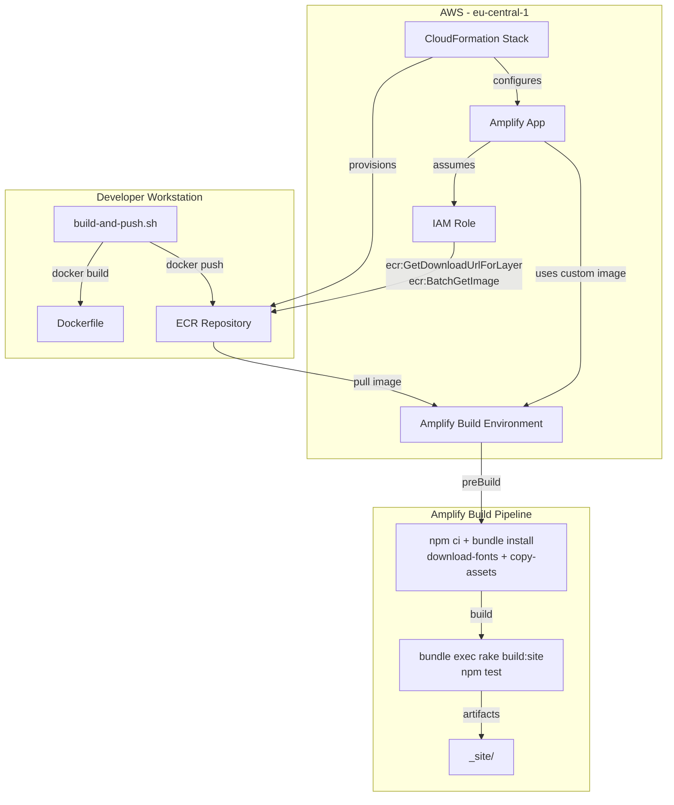

# Design Document: Custom Amplify Build Image

## Overview

This design introduces a custom Docker build image for the paddelbuch AWS Amplify application. The image pre-packages Ruby 3.4.9, Node.js 22, and all project dependencies (gems + npm packages) on an Amazon Linux 2023 base. It is stored in an ECR repository provisioned via CloudFormation and referenced by the Amplify app resource. A shell script automates building and pushing the image to ECR. The amplify.yml is simplified to remove RVM/NVM installation steps, relying on the pre-installed runtimes in the image.

The goal is to reduce build times by eliminating per-build installation of language runtimes while producing byte-identical site output.

### Key Design Decisions

1. **Single CloudFormation template** — The ECR repository, Amplify app changes, and IAM permissions live in one template (`infrastructure/custom-build-image.yaml`) separate from the existing `deploy/frontend-deploy.yaml`. This keeps the build-image infrastructure self-contained and avoids modifying the existing deployment stack.
2. **Amazon Linux 2023 base** — Matches the default Amplify build environment OS family, minimizing differences that could affect build output.
3. **Ruby compiled from source** — AL2023 does not ship Ruby 3.4.9 packages. Compiling from source with the exact version ensures parity with the current RVM-based build.
4. **Node.js from official binary archive** — The Node.js project publishes pre-built Linux x64 binaries. Using these avoids compiling from source and is more reliable than third-party repos.
5. **`bundle install` and `npm ci` retained in amplify.yml** — Even though dependencies are pre-installed in the image, running these at build time ensures the lock files are always honoured. With warm caches from the image, these commands complete in seconds.

## Architecture



### Build Flow

1. Developer runs `infrastructure/build-and-push.sh`
2. Script authenticates with ECR, builds the Docker image, tags it (`latest` + timestamp), and pushes both tags
3. CloudFormation stack provisions the ECR repo and configures the Amplify app to use the custom image
4. On each Amplify build, the custom image is pulled — Ruby 3.4.9 and Node.js 22 are already on PATH
5. `amplify.yml` runs `npm ci`, `bundle install`, asset scripts, then the Jekyll build and tests

## Components and Interfaces

### 1. CloudFormation Template (`infrastructure/custom-build-image.yaml`)

Provisions:
- **ECR Repository** — stores the custom build image; tag immutability disabled; lifecycle policy retains max 5 untagged images
- **IAM Policy** — grants the Amplify service role `ecr:GetDownloadUrlForLayer`, `ecr:BatchGetImage`, and `ecr:GetAuthorizationToken` permissions
- **Outputs** — ECR repository URI for use by the build script

The existing `deploy/frontend-deploy.yaml` Amplify app resource will be updated to add the `CustomImage` property pointing to the ECR repository URI. This is done by adding a new parameter `CustomBuildImageUri` (defaulting to empty string) and conditionally setting `CustomImage` when the parameter is provided.

**Parameters:**
| Parameter | Type | Description |
|-----------|------|-------------|
| RepositoryName | String | ECR repository name (default: `paddelbuch-build-image`) |

**Resources:**
| Resource | Type | Purpose |
|----------|------|---------|
| BuildImageRepository | AWS::ECR::Repository | Stores Docker images |
| BuildImagePolicy | AWS::ECR::Repository LifecyclePolicy | Retains max 5 untagged images |

**Outputs:**
| Output | Description |
|--------|-------------|
| RepositoryUri | Full ECR repository URI |
| RepositoryArn | ARN for IAM policy references |

### 2. Updated Amplify Template (`deploy/frontend-deploy.yaml`)

Changes to the existing template:
- New parameter `CustomBuildImageUri` (String, default empty)
- New condition `HasCustomImage` — true when `CustomBuildImageUri` is non-empty
- `PaddelBuchApp` resource gets `CustomImage` property set conditionally
- New `AmplifyEcrPolicy` resource (AWS::IAM::ManagedPolicy or inline policy on the Amplify service role) granting ECR pull permissions scoped to the build image repository

### 3. Dockerfile (`infrastructure/Dockerfile`)

```
Base: amazonlinux:2023

Layer 1 — System dependencies:
  gcc, gcc-c++, make, autoconf, bison, openssl-devel, readline-devel,
  zlib-devel, libyaml-devel, libffi-devel, gdbm-devel, tar, gzip, git,
  which, procps-ng

Layer 2 — Ruby 3.4.9:
  Download ruby-3.4.9.tar.gz from https://cache.ruby-lang.org
  ./configure --disable-install-doc && make -j$(nproc) && make install
  Verify: ruby --version

Layer 3 — Node.js 22:
  Download node-v22.x.x-linux-x64.tar.xz from https://nodejs.org
  Extract to /usr/local
  Verify: node --version && npm --version

Layer 4 — Gem dependencies:
  COPY Gemfile Gemfile.lock ./
  bundle install

Layer 5 — npm dependencies:
  COPY package.json package-lock.json ./
  npm ci

ENV PATH includes /usr/local/bin (Ruby + Node)
WORKDIR /app
```

### 4. Build and Push Script (`infrastructure/build-and-push.sh`)

```
#!/usr/bin/env bash
set -euo pipefail

PROFILE=paddelbuch-dev
REGION=eu-central-1
REPO_NAME=paddelbuch-build-image
TIMESTAMP=$(date +%Y%m%d%H%M%S)

# 1. Get ECR repository URI from CloudFormation output
# 2. Authenticate Docker with ECR
# 3. Build image: docker build -t $REPO_URI:latest -f infrastructure/Dockerfile .
# 4. Tag with timestamp: docker tag $REPO_URI:latest $REPO_URI:$TIMESTAMP
# 5. Push both tags
```

The script is run from the project root so that `COPY Gemfile ...` in the Dockerfile can access project files. The Dockerfile path is specified via `-f infrastructure/Dockerfile`.

### 5. Simplified `amplify.yml`

```yaml
version: 1
frontend:
  phases:
    preBuild:
      commands:
        - npm ci
        - npm run download-fonts
        - npm run copy-assets
        - bundle install
    build:
      commands:
        - bundle exec rake build:site
        - npm test
  artifacts:
    baseDirectory: _site
    files:
      - '**/*'
  cache:
    paths:
      - vendor/**/*
      - node_modules/**/*
      - _data/**/*
      - .jekyll-cache/**/*
```

Removed: `nvm install 22`, `rvm install 3.4.9`, `rvm use 3.4.9`.

### 6. Documentation (`docs/custom-amplify-build-image/`)

A single `README.md` covering:
- Prerequisites (AWS CLI, Docker, paddelbuch-dev profile)
- Deploying the CloudFormation stack
- Building and pushing the image
- Updating the Amplify app stack with the custom image URI
- Verifying the build
- Updating the image when dependencies change

## Data Models

This feature does not introduce application-level data models. The relevant "data" is infrastructure configuration:

### ECR Repository Configuration
```yaml
RepositoryName: paddelbuch-build-image
ImageTagMutability: MUTABLE
LifecyclePolicy:
  MaxUntaggedImages: 5
```

### Docker Image Tags
| Tag | Purpose |
|-----|---------|
| `latest` | Always points to the most recent build; used by Amplify |
| `YYYYMMDDHHmmss` | Immutable timestamp tag for rollback and audit |

### Amplify Custom Image Reference
```yaml
CustomImage: !Sub "${AccountId}.dkr.ecr.${Region}.amazonaws.com/${RepositoryName}:latest"
```


## Correctness Properties

*A property is a characteristic or behavior that should hold true across all valid executions of a system — essentially, a formal statement about what the system should do. Properties serve as the bridge between human-readable specifications and machine-verifiable correctness guarantees.*

Most acceptance criteria in this feature are structural checks on configuration files (CloudFormation YAML, Dockerfile, shell script, amplify.yml). These are best verified as specific examples rather than universally quantified properties. The one true property identified is:

### Property 1: No runtime version manager commands in build pipeline

*For any* command in the amplify.yml preBuild phase, the command shall not contain references to `rvm` or `nvm` (runtime version managers), since the custom image provides Ruby and Node.js directly on PATH.

**Validates: Requirements 5.1, 5.2, 4.3**

---

The remaining acceptance criteria are verified through example-based tests and integration checks:

- **CloudFormation structure** (1.1–1.4, 4.1–4.2): Verified by parsing the YAML and asserting specific resource types, properties, and outputs exist.
- **Dockerfile structure** (2.1–2.6): Verified by parsing the Dockerfile and asserting FROM base, Ruby/Node install commands, COPY instructions, and ENV settings.
- **Build script structure** (3.1–3.4): Verified by parsing the shell script and asserting ECR auth, docker build, tag, and push commands.
- **amplify.yml retained commands** (5.3–5.7): Verified by parsing the YAML and asserting specific commands are present in preBuild/build phases.
- **Version parity** (7.2–7.5): Verified by comparing versions referenced in the Dockerfile against `.ruby-version` and `Gemfile.lock`/`package-lock.json`.
- **Documentation** (6.1–6.4): Verified by human review.
- **Byte-identical output** (7.1, 7.6, 7.7): Verified by manual integration testing — building with both images and diffing `_site/`.

## Error Handling

### Build Script Errors

The build script uses `set -euo pipefail` to ensure any command failure immediately exits with a non-zero status. Specific error scenarios:

| Scenario | Handling |
|----------|----------|
| ECR authentication failure | `aws ecr get-login-password` fails → script exits with error message from AWS CLI |
| Docker build failure | `docker build` fails → script exits; partial image is not pushed |
| Docker push failure | `docker push` fails → script exits; the `latest` tag may or may not be updated depending on which push failed |
| Missing AWS profile | AWS CLI returns credential error → script exits |
| Missing Docker daemon | `docker` command not found or daemon not running → script exits |

### CloudFormation Deployment Errors

| Scenario | Handling |
|----------|----------|
| Stack creation failure | CloudFormation rolls back automatically; developer reviews events |
| ECR repository already exists | Use `--no-fail-on-empty-changeset` for updates; repository name collision returns a clear CF error |
| Invalid custom image URI | Amplify build fails at image pull; developer checks the URI in stack parameters |

### Amplify Build Errors

| Scenario | Handling |
|----------|----------|
| Custom image pull failure | Amplify reports image pull error in build logs; verify ECR permissions and image URI |
| `bundle install` version mismatch | Bundler reports conflict; rebuild and push the image with updated lock file |
| `npm ci` version mismatch | npm reports conflict; rebuild and push the image with updated lock file |

## Testing Strategy

### Unit / Example Tests

Example-based tests verify the structural correctness of generated configuration files. These are best implemented as simple assertion tests:

1. **CloudFormation template validation**
   - Template contains `AWS::ECR::Repository` resource
   - ECR repository has `ImageTagMutability: MUTABLE`
   - Lifecycle policy retains max 5 untagged images
   - Outputs section includes repository URI
   - Amplify app resource has conditional `CustomImage` property
   - IAM policy grants ECR pull permissions

2. **Dockerfile validation**
   - FROM line references `amazonlinux:2023`
   - Contains Ruby 3.4.9 source compilation commands
   - Contains Node.js 22 binary installation
   - COPYs Gemfile, Gemfile.lock, package.json, package-lock.json
   - Runs `bundle install` and `npm ci`
   - Sets PATH environment variable

3. **Build script validation**
   - Uses `paddelbuch-dev` AWS profile
   - Targets `eu-central-1` region
   - Contains `docker build`, `docker tag`, and `docker push` commands
   - Tags with both `latest` and timestamp format
   - Uses `set -euo pipefail`

4. **amplify.yml validation**
   - preBuild contains `npm ci`, `bundle install`, `npm run download-fonts`, `npm run copy-assets`
   - build contains `bundle exec rake build:site`, `npm test`
   - artifacts baseDirectory is `_site`
   - cache paths are preserved

5. **Version parity checks**
   - Ruby version in Dockerfile matches `.ruby-version` file
   - Node.js major version in Dockerfile is 22
   - Gemfile and Gemfile.lock are copied before `bundle install`
   - package.json and package-lock.json are copied before `npm ci`

### Property-Based Tests

Property-based tests use `fast-check` (JavaScript) for universal property verification. Each test runs a minimum of 100 iterations.

1. **Property 1: No runtime version manager commands in build pipeline**
   - Generate random sets of shell commands that include various rvm/nvm-like strings
   - Validate that the amplify.yml preBuild command validator correctly rejects commands containing `rvm` or `nvm`
   - Tag: **Feature: custom-amplify-build-image, Property 1: No runtime version manager commands in build pipeline**
   - Validates: Requirements 5.1, 5.2, 4.3

### Integration Tests (Manual)

These tests require AWS infrastructure and are performed manually:

1. Deploy CloudFormation stack and verify ECR repository exists
2. Build and push Docker image; verify it appears in ECR
3. Trigger Amplify build with custom image; verify build succeeds
4. Compare `_site/` output between default and custom image builds for byte-identical parity
