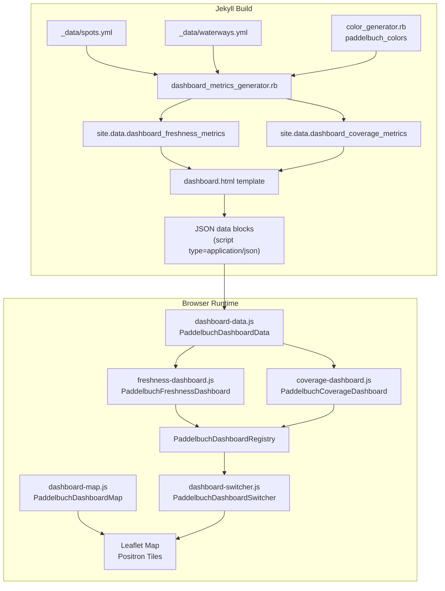

# Design Document: Data Quality Dashboards

## Overview

This feature adds a Data Quality Dashboards page to the Paddelbuch site under the "Open Data" navigation section. The page hosts two map-based dashboards — Data Freshness and Waterway Coverage — rendered on a shared Leaflet map with OpenStreetMap Positron tiles. A switcher control lets users toggle between dashboards.

The architecture is modular: each dashboard is a self-contained JS module conforming to a common interface (`activate`, `deactivate`, `getName`). The switcher auto-discovers registered dashboards, making it trivial to add future dashboards (including non-map types like tables or charts) without modifying switcher logic.

All metric computations (freshness median age, colour gradient, coverage segment classification) are performed at Jekyll build time by a Ruby plugin (`dashboard_metrics_generator.rb`). The browser JS only renders pre-computed data — no calculations happen client-side. All data originates from existing `_data/spots.yml` and `_data/waterways.yml` files — no additional Contentful API calls. All colours come from the central `PaddelbuchColors` global (via `site.data['paddelbuch_colors']` produced by `color_generator.rb`). All text is localised via `` tags and `_i18n/` files.

### Key design decisions

1. **Positron vector tiles via OpenFreeMap** — Use `https://tiles.openfreemap.org/styles/positron` (OpenFreeMap Positron style). This serves vector tiles via MapLibre GL JS, integrated into the existing Leaflet overlay architecture through the `maplibre-gl-leaflet` bridge plugin. Three new vendored assets are required: `maplibre-gl.js`, `maplibre-gl.css`, and `leaflet-maplibre-gl.js`. CSP requires `connect-src` for `tiles.openfreemap.org` (style JSON + vector tile PBF data) and `worker-src` for `blob:` (MapLibre GL JS uses web workers for tile parsing).

2. **Shared map instance** — A single Leaflet map is created once and shared across map-based dashboards. Each dashboard adds/removes its own layers on activate/deactivate. Non-map dashboards hide the map container and show their own DOM element.

3. **Dashboard registry pattern** — A `PaddelbuchDashboardRegistry` global array. Each dashboard module pushes itself onto the registry at load time. The switcher reads the registry to build tabs. Adding a new dashboard = adding a new `<script>` tag and module file.

4. **Build-time metric computation with cross-locale caching** — Freshness metrics (median age, gradient colour) and coverage metrics (covered/uncovered GeoJSON segments) are pre-computed by a Jekyll `Generator` plugin at build time. The numerical computations (median age, colour interpolation, Haversine distances, segment classification) are locale-independent — they depend on timestamps, coordinates, and geometry, not on waterway names. The plugin therefore computes all metrics once on the first locale pass and caches them in class-level variables (`@@cached_freshness`, `@@cached_coverage`). On subsequent locale passes, the plugin skips computation entirely and only swaps in the locale-specific waterway `name`. This follows the same compute-once-cache-across-locales pattern as `PrecomputeGenerator`. The Ruby plugin has access to `site.data['paddelbuch_colors']` (from `color_generator.rb`, priority :high) and all spot/waterway data. The browser JS receives fully computed metric hashes and only renders them — no `freshness-calculator.js` or `coverage-calculator.js` modules are needed.

5. **Coverage via LineString segmentation** — For the coverage dashboard, LineString waterways are split into segments and each segment is classified as covered/uncovered based on Haversine distance to the nearest spot. Polygon waterways (lakes) use their boundary ring. This avoids complex polygon intersection geometry.

6. **Jekyll page with `page.scripts`** — The dashboard page loads its JS modules via the `page.scripts` front matter array, following the existing pattern where the default layout renders page-specific scripts at the bottom of `<body>`.

## Architecture



### Vendor dependencies

The following vendored assets are added for OpenFreeMap vector tile support:

- `assets/js/vendor/maplibre-gl.js` — MapLibre GL JS library (renders vector tiles)
- `assets/css/vendor/maplibre-gl.css` — MapLibre GL CSS (required for the GL canvas)
- `assets/js/vendor/leaflet-maplibre-gl.js` — Bridge plugin connecting MapLibre GL to Leaflet (`@maplibre/maplibre-gl-leaflet`)

These are loaded in the default layout (`_layouts/default.html`) alongside the existing Leaflet assets:
- `maplibre-gl.css` is loaded in `<head>` after the Leaflet CSS
- `maplibre-gl.js` is loaded in `<body>` after `leaflet.js`
- `leaflet-maplibre-gl.js` is loaded after both Leaflet and MapLibre GL JS

### Module dependency order

Scripts are loaded in this order via `page.scripts` front matter:

1. `assets/js/dashboard-data.js` — Parses pre-computed JSON data blocks (freshness metrics, coverage metrics)
2. `assets/js/dashboard-map.js` — Creates the shared Positron Leaflet map (uses `L.maplibreGL` for the base layer)
3. `assets/js/freshness-dashboard.js` — Renders pre-computed freshness data (colours already computed)
4. `assets/js/coverage-dashboard.js` — Renders pre-computed coverage segments (GeoJSON already classified)
5. `assets/js/dashboard-switcher.js` — Reads registry, builds switcher UI, activates default

### Navigation integration

The dashboard page link is added to `header.html` in the Open Data dropdown, alongside the existing hardcoded API page link:

```html
<li>
  <a class="dropdown-item" href="{{ locale_prefix | append: '/offene-daten/datenqualitaet/' }}">
    <span class="nav-link"></span>
  </a>
</li>
```

## Components and Interfaces

### 1. Dashboard Metrics Generator (`_plugins/dashboard_metrics_generator.rb`)

A new `Jekyll::Generator` (priority :normal) that runs after `ContentfulFetcher` and `CollectionGenerator`. Follows the same compute-once-cache-across-locales pattern as `PrecomputeGenerator`:

The `jekyll-multiple-languages-plugin` calls `generate(site)` once per configured language (de, en). On each pass, `site.config['lang']` is set to the current locale. The numerical metric computations (median age, colour interpolation, Haversine distances, segment classification) are locale-independent — they depend on `updatedAt` timestamps, `location` coordinates, and waterway `geometry`, none of which vary by locale. Only the waterway `name` field differs between locales. The plugin therefore:

1. On the **first locale pass**: computes all metrics from the full (all-locale) dataset, deduplicating waterways and spots by `slug`/`waterway_slug`. Caches the results (keyed by waterway `slug`) in class-level variables `@@cached_freshness` and `@@cached_coverage`.
2. On **subsequent locale passes**: skips computation entirely.
3. On **both passes**: builds a locale-specific slug→name lookup from the current locale's waterways, clones the cached metrics, and swaps in the correct waterway `name` for the current locale.

```ruby
module Jekyll
  class DashboardMetricsGenerator < Generator
    safe true
    priority :normal

    # Class-level cache survives across locale passes within a single build.
    # Reset to nil at the start of each fresh build (Ruby class variables persist
    # for the lifetime of the Ruby process, but Jekyll's multi-language plugin
    # runs all locale passes within one process invocation).
    @@cached_freshness = nil
    @@cached_coverage = nil

    def generate(site)
      locale = site.config['lang'] || site.config['default_lang'] || 'de'
      colors = site.data['paddelbuch_colors'] || {}

      # Compute once on first locale pass, cache for reuse
      if @@cached_freshness.nil?
        all_spots = site.data['spots'] || []
        all_waterways = site.data['waterways'] || []

        # Deduplicate waterways by slug (they appear once per locale in the data)
        unique_waterways = deduplicate_by_slug(all_waterways)

        # Deduplicate spots by waterway_slug (updatedAt/location are identical across locales)
        spots_by_waterway = all_spots.group_by { |s| s['waterway_slug'] }
        unique_spots_by_waterway = deduplicate_spots_by_waterway(spots_by_waterway)

        @@cached_freshness = compute_freshness_metrics(unique_waterways, unique_spots_by_waterway, colors)
        @@cached_coverage = compute_coverage_metrics(unique_waterways, unique_spots_by_waterway)
      end

      # Localize: swap in locale-specific waterway names
      waterway_names = build_waterway_name_lookup(site.data['waterways'] || [], locale)

      site.data['dashboard_freshness_metrics'] = localize_metrics(@@cached_freshness, waterway_names)
      site.data['dashboard_coverage_metrics'] = localize_metrics(@@cached_coverage, waterway_names)
    end
  end
end
```

**Deduplication helpers** (private):
- `deduplicate_by_slug(waterways)` — Returns one waterway hash per unique `slug`, picking the first occurrence. Since geometry, length, and area are identical across locales, any locale's entry suffices for computation.
- `deduplicate_spots_by_waterway(spots_by_waterway)` — For each `waterway_slug` group, deduplicates spots so that each unique spot (by `slug`) appears once. Since `updatedAt` and `location` are identical across locales, any locale's entry suffices.

**Localisation helpers** (private):
- `build_waterway_name_lookup(waterways, locale)` — Filters waterways to the given locale and returns a `{ slug => name }` hash.
- `localize_metrics(cached_metrics, waterway_names)` — Deep-clones the cached metric array and replaces each entry's `name` field with the locale-specific name from the lookup. If a slug has no name in the current locale (data inconsistency), falls back to the slug string.

The plugin computes (on first pass only):

**a) Freshness metrics** — For each unique waterway (deduplicated by slug):
- Find all spots with matching `waterway_slug` (from deduplicated spot data)
- Compute the median age in days from their `updatedAt` timestamps relative to `Time.now`
- Determine the gradient colour using per-channel sRGB interpolation:
  - 0–1095 days: linear interpolation between `$green-1` and `$warning-yellow`
  - 1095–1826 days: linear interpolation between `$warning-yellow` and `$danger-red`
  - ≥1826 days: `$danger-red`
  - Zero spots: `$purple-1`
- Colour hex values are read from `site.data['paddelbuch_colors']` (keys: `green1`, `warningYellow`, `dangerRed`, `purple1`)
- Parse waterway geometry JSON string into a Ruby hash for output
- Store result keyed by waterway `slug` (name is set to a placeholder; localisation happens per-pass)

**b) Coverage metrics** — For each unique waterway (deduplicated by slug):
- Find all spots with matching `waterway_slug` (from deduplicated spot data)
- Parse waterway geometry JSON string
- For LineString geometries: walk the coordinate array, classify each segment (pair of consecutive points) by checking whether the midpoint is within 2000m (Haversine) of any spot
- For Polygon geometries: operate on the outer ring as a LineString
- Output pre-classified GeoJSON arrays for covered and uncovered segments
- Store result keyed by waterway `slug`

**Helper methods** (private, testable via RSpec):
- `median_age(timestamps, now)` — Compute median age in days from ISO 8601 timestamps
- `freshness_color(days, colors)` — Interpolate gradient colour hex string
- `haversine_distance(lat1, lon1, lat2, lon2)` — Haversine distance in metres
- `classify_segments(geometry, spots, radius)` — Classify geometry segments as covered/uncovered
- `deduplicate_by_slug(waterways)` — Deduplicate waterways by slug
- `deduplicate_spots_by_waterway(spots_by_waterway)` — Deduplicate spots per waterway group
- `build_waterway_name_lookup(waterways, locale)` — Build slug→name map for a locale
- `localize_metrics(cached_metrics, waterway_names)` — Clone cached metrics with locale-specific names

### 2. Dashboard Page (`offene-daten/datenqualitaet.html`)

A Jekyll page using the default layout:

```yaml
---
layout: default
title: Data Quality
pageName: data-quality
permalink: /offene-daten/datenqualitaet/
scripts:
  - /assets/js/dashboard-data.js
  - /assets/js/dashboard-map.js
  - /assets/js/freshness-dashboard.js
  - /assets/js/coverage-dashboard.js
  - /assets/js/dashboard-switcher.js
---
```

The page body contains:
- A `<div id="dashboard-switcher">` container for the tab buttons
- A `<div id="dashboard-map" class="map">` for the shared Leaflet map
- A `<div id="dashboard-content">` for non-map dashboard content
- A `<div id="dashboard-legend">` for the active dashboard's legend
- Two `<script type="application/json">` blocks embedding pre-computed metrics:
  - `<script type="application/json" id="freshness-data">` — Pre-computed freshness metrics per waterway from `site.data.dashboard_freshness_metrics`
  - `<script type="application/json" id="coverage-data">` — Pre-computed coverage segments per waterway from `site.data.dashboard_coverage_metrics`

### 3. Dashboard Module Interface

Every dashboard module must conform to this interface:

```javascript
{
  /** Unique identifier string */
  id: 'freshness',

  /** Returns the localised display name for the switcher tab */
  getName: function() { return '...'; },

  /** Whether this dashboard uses the shared map */
  usesMap: true,

  /**
   * Called when the dashboard becomes active.
   * @param {Object} context - { map: L.Map, contentEl: HTMLElement, legendEl: HTMLElement, data: Object }
   */
  activate: function(context) { /* add layers, render legend */ },

  /**
   * Called when the dashboard is deactivated.
   * Must clean up all layers, DOM content, and event listeners.
   */
  deactivate: function() { /* remove layers, clear legend */ }
}
```

Each module registers itself by pushing onto the global registry:

```javascript
(window.PaddelbuchDashboardRegistry = window.PaddelbuchDashboardRegistry || []).push(module);
```

### 4. Dashboard Switcher (`dashboard-switcher.js`)

Reads `PaddelbuchDashboardRegistry`, creates Bootstrap-styled tab buttons inside `#dashboard-switcher`, and manages activation/deactivation:

- On load: activates the first registered dashboard (freshness, by script order)
- On tab click: deactivates current dashboard, activates selected one
- Shows/hides the map container vs content container based on `usesMap`

### 5. Dashboard Map (`dashboard-map.js`)

Creates a Leaflet map in `#dashboard-map` with:
- Positron vector tiles via OpenFreeMap: `L.maplibreGL({ style: 'https://tiles.openfreemap.org/styles/positron' }).addTo(map)`
- Centre: `[46.801111, 8.226667]`, zoom: `8`
- Max bounds: `[[45.8, 5.9], [47.8, 10.5]]`, viscosity: `1.0`, minZoom: `7`
- Zoom control: bottom-right
- Attribution: `© OpenStreetMap contributors`

Exports `PaddelbuchDashboardMap` with `{ map, getMap() }`.

### 6. Dashboard Data (`dashboard-data.js`)

Parses the two pre-computed JSON data blocks from the page:
- Reads `#freshness-data` JSON block → array of freshness metric objects (slug, name, spotCount, medianAgeDays, color, geometry)
- Reads `#coverage-data` JSON block → array of coverage metric objects (slug, name, spotCount, coveredSegments, uncoveredSegments)
- Exposes `PaddelbuchDashboardData` with `{ freshnessMetrics, coverageMetrics }`.

No spot grouping, geometry parsing, or computation is performed — the data is ready to render.

### 7. Freshness Dashboard (`freshness-dashboard.js`)

On `activate`:
1. Read pre-computed freshness metrics from `PaddelbuchDashboardData.freshnessMetrics`
2. For each waterway metric: create `L.geoJSON` layer with the pre-computed `color` hex value
3. Bind popup: waterway name, spot count, median age (human-readable)
4. Add all layers to the map
5. Render legend in `#dashboard-legend`

On `deactivate`: remove all layers, clear legend.

### 8. Coverage Dashboard (`coverage-dashboard.js`)

On `activate`:
1. Read pre-computed coverage metrics from `PaddelbuchDashboardData.coverageMetrics`
2. For each waterway metric: create `L.geoJSON` layers from pre-classified `coveredSegments` (green) and `uncoveredSegments` (red)
3. Bind popup: waterway name, spot count
4. Add all layers to the map
5. Render legend in `#dashboard-legend`

On `deactivate`: remove all layers, clear legend.

### 9. Popup Styling

All popups use the existing Leaflet popup CSS classes (`popup-icon-div`, `popup-title`, `popup-btn`) to match the site's popup styling. The popup HTML is constructed in JS using the same class names and structure as `spot-popup.html`.

### 10. CSP Update

The `Content-Security-Policy` header in `deploy/frontend-deploy.yaml` must be updated for OpenFreeMap vector tiles. The current CSP is:

```
default-src 'self'; img-src 'self' data: raw.githubusercontent.com api.mapbox.com; style-src 'self'; script-src 'self'; font-src 'self' data:
```

Required additions:
- Add `connect-src 'self' tiles.openfreemap.org;` — for fetching the Positron style JSON and vector tile PBF data
- Add `worker-src 'self' blob:;` — MapLibre GL JS uses web workers for tile parsing

No changes to `img-src` are needed since vector tiles are fetched via `connect-src`, not loaded as images.

### 11. Default Layout Changes

The `_layouts/default.html` must load the MapLibre GL vendor assets alongside the existing Leaflet assets:

```html
<!-- In <head>, after Leaflet CSS -->
<link rel="stylesheet" href="{{ '/assets/css/vendor/maplibre-gl.css' | relative_url }}">

<!-- In <body>, after leaflet.js and before L.Control.Locate.min.js -->
<script src="{{ '/assets/js/vendor/maplibre-gl.js' | relative_url }}"></script>
<script src="{{ '/assets/js/vendor/leaflet-maplibre-gl.js' | relative_url }}"></script>
```

These are loaded globally (not conditionally) to keep the layout simple and consistent with how Leaflet is loaded. The MapLibre GL JS library and bridge plugin are only activated when `L.maplibreGL()` is called by `dashboard-map.js`.

### 12. i18n Additions

New keys added to both `_i18n/de.yml` and `_i18n/en.yml`:

```yaml
# Dashboard page
nav:
  data_quality_dashboards: "Datenqualität"  # / "Data Quality"

dashboards:
  title: "Datenqualität"  # / "Data Quality"
  freshness:
    name: "Datenaktualität"  # / "Data Freshness"
    legend_title: "Median-Alter der Einträge"  # / "Median Age of Entries"
    fresh: "Aktuell (0 Tage)"  # / "Fresh (0 days)"
    aging: "Alternd (3 Jahre)"  # / "Aging (3 years)"
    stale: "Veraltet (5+ Jahre)"  # / "Stale (5+ years)"
    no_data: "Keine Daten"  # / "No Data"
    popup_spots: "Einstiegsorte"  # / "Spots"
    popup_median_age: "Median-Alter"  # / "Median Age"
    popup_days: "Tage"  # / "days"
    popup_no_data: "Keine Daten vorhanden"  # / "No data available"
  coverage:
    name: "Abdeckung"  # / "Coverage"
    legend_title: "Abdeckung der Gewässer"  # / "Waterway Coverage"
    covered: "Abgedeckt (innerhalb 2 km)"  # / "Covered (within 2 km)"
    not_covered: "Nicht abgedeckt"  # / "Not Covered"
    popup_spots: "Einstiegsorte"  # / "Spots"
```

## Data Models

### Spot data (from `_data/spots.yml`, used by Ruby plugin at build time)

```ruby
{
  'name' => 'Spot Name',
  'slug' => 'spot-slug',
  'locale' => 'de',
  'updatedAt' => '2024-01-15T10:30:00Z',  # ISO 8601
  'waterway_slug' => 'zurichsee',
  'location' => { 'lat' => 47.3667, 'lon' => 8.5500 }
}
```

### Waterway data (from `_data/waterways.yml`, used by Ruby plugin at build time)

```ruby
{
  'name' => 'Zürichsee',
  'slug' => 'zurichsee',
  'locale' => 'de',
  'geometry' => '{"type":"Polygon","coordinates":[...]}',  # JSON string
  'length' => 40.0,  # km (rivers)
  'area' => 88.66    # km² (lakes)
}
```

### Pre-computed freshness metric (per waterway, output by Ruby plugin, consumed by JS)

```javascript
{
  slug: "zurichsee",
  name: "Zürichsee",
  spotCount: 12,
  medianAgeDays: 450,       // or null if no spots
  color: "#4ab31f",         // pre-computed hex colour (gradient or $purple-1)
  geometry: { type: "Polygon", coordinates: [...] }  // parsed GeoJSON object
}
```

### Pre-computed coverage metric (per waterway, output by Ruby plugin, consumed by JS)

```javascript
{
  slug: "zurichsee",
  name: "Zürichsee",
  spotCount: 12,
  coveredSegments: [ /* GeoJSON LineString features */ ],
  uncoveredSegments: [ /* GeoJSON LineString features */ ]
}
```

### Dashboard registry entry

```javascript
{
  id: "freshness",
  getName: function() { return "Data Freshness"; },
  usesMap: true,
  activate: function(context) { ... },
  deactivate: function() { ... }
}
```

## Correctness Properties

*A property is a characteristic or behavior that should hold true across all valid executions of a system — essentially, a formal statement about what the system should do. Properties serve as the bridge between human-readable specifications and machine-verifiable correctness guarantees.*

Properties 1–6 validate the Ruby plugin's build-time computation logic and are tested with RSpec + rantly. Properties 7–10 validate browser-side JS behavior and are tested with Jest + fast-check.

### Property 1: Median age computation correctness

*For any* non-empty array of valid ISO 8601 timestamps and any reference time, `median_age(timestamps, now)` shall return the median of the individual ages (in days). When the array length is odd, this is the middle value after sorting; when even, it is the average of the two middle values.

**Validates: Requirements 9.1, 9.2, 9.3, 3.2, 3.3**

### Property 2: Median age bounded by min and max

*For any* non-empty array of valid timestamps and any reference time, the computed median age shall be greater than or equal to the minimum age and less than or equal to the maximum age in the array.

**Validates: Requirements 9.5**

### Property 3: Freshness colour gradient correctness

*For any* non-negative number of days, `freshness_color(days, colors)` shall return: a colour linearly interpolated between `$green-1` and `$warning-yellow` when days is in [0, 1095]; a colour linearly interpolated between `$warning-yellow` and `$danger-red` when days is in (1095, 1826); and exactly `$danger-red` when days is ≥ 1826. At the anchor points (0, 1095, 1826), the colour shall exactly match the corresponding anchor colour.

**Validates: Requirements 3.4, 3.5, 3.6**

### Property 4: Coverage segment classification correctness

*For any* waterway geometry (LineString or Polygon) and any array of spot locations, every segment classified as "covered" by `classify_segments` shall have its midpoint within 2000 metres (Haversine) of at least one spot, and every segment classified as "uncovered" shall have its midpoint farther than 2000 metres from all spots.

**Validates: Requirements 10.1, 10.2, 4.2, 4.3, 4.4**

### Property 5: Haversine distance accuracy

*For any* two geographic coordinate pairs (lat/lon within valid ranges), the Haversine distance computed by `haversine_distance` shall be within 0.5% of the expected geodesic distance for the same coordinates (validated against the standard Haversine formula with Earth radius 6371 km).

**Validates: Requirements 10.3**

### Property 6: Single-spot coverage contiguity

*For any* waterway geometry and a single spot location, the segments classified as "covered" by `classify_segments` shall form a contiguous run (no uncovered segments between two covered segments).

**Validates: Requirements 10.5**

### Property 7: Switcher state management

*For any* sequence of dashboard selections from the registry, after each selection only the most recently selected dashboard's layers shall be present on the map (or its content visible in the content container), and all previously active dashboards shall have been deactivated with no residual layers or DOM content.

**Validates: Requirements 1.9, 7.6**

### Property 8: Switcher auto-discovery

*For any* number of dashboard modules registered in `PaddelbuchDashboardRegistry`, the switcher shall create exactly that many tab buttons, one per registered dashboard, without any code changes to the switcher module.

**Validates: Requirements 7.2**

### Property 9: Map/content container visibility

*For any* dashboard activation, if the dashboard's `usesMap` is `true`, the map container shall be visible and the content container hidden; if `usesMap` is `false`, the map container shall be hidden and the content container visible.

**Validates: Requirements 7.4, 7.5**

### Property 10: Translation key completeness

*For any* translation key referenced in the dashboard page template and JavaScript modules, that key shall exist in both `_i18n/de.yml` and `_i18n/en.yml` with a non-empty string value.

**Validates: Requirements 1.5**

## Error Handling

### Missing or malformed geometry

If a waterway's `geometry` field is `null`, empty, or fails JSON parsing, the Ruby plugin skips that waterway and logs a `Jekyll.logger.warn`. No metric entry is created for it. On the browser side, the dashboard renders only the waterways present in the pre-computed data. This prevents a single bad record from breaking the entire dashboard.

### Missing spot data fields

If a spot lacks `updatedAt`, `waterway_slug`, or `location` fields, the Ruby plugin excludes it from calculations. The freshness and coverage computations operate only on valid entries.

### Empty data sets

If `_data/spots.yml` or `_data/waterways.yml` is empty or contains no entries for the current locale, the Ruby plugin produces empty metric arrays. The browser dashboard renders an empty map with no layers. The legend still displays to explain what the colours would mean.

### Geometry type handling

The Ruby plugin's coverage computation handles both LineString (rivers) and Polygon (lakes) geometries. For Polygon geometries, it operates on the outer ring boundary. Unknown geometry types are skipped with a `Jekyll.logger.warn`.

### Colour computation edge cases

- `median_age` returns `nil` for empty arrays → triggers `$purple-1` colour (no data)
- Negative day values (future timestamps) are clamped to 0 for colour interpolation
- The colour interpolation function clamps the output to valid 0–255 RGB ranges
- Colour hex values are read from `site.data['paddelbuch_colors']` which is populated by `color_generator.rb` (priority :high, guaranteed to run before this plugin)

### Cross-locale cache lifecycle

The class-level cache (`@@cached_freshness`, `@@cached_coverage`) is only valid within a single Jekyll build. The `jekyll-multiple-languages-plugin` runs all locale passes (de, en) sequentially within one Ruby process invocation, so the cache naturally persists across passes. On a fresh build, `@@cached_freshness` starts as `nil` and triggers recomputation on the first locale pass. There is no explicit cache invalidation needed — each `jekyll build` invocation starts a new Ruby process, resetting all class variables. If the plugin execution order changes such that `color_generator.rb` (priority :high) has not yet run, the colours hash will be empty and the freshness colour computation will fall back to default values; however, this cannot happen under the current priority configuration.

### CSP violations

If the CSP header is not updated to include `tiles.openfreemap.org` in `connect-src` or `blob:` in `worker-src`, vector tiles will fail to load. Because OpenFreeMap uses vector tiles rendered via MapLibre GL JS, the failure mode is a blank map canvas (rather than grey placeholder tiles as with raster tiles). All Leaflet overlay layers (GeoJSON waterway geometries, popups) will still render correctly on top of the blank canvas. The attribution text will still be visible.

## Testing Strategy

### Dual testing approach

This feature requires both unit tests and property-based tests, split across two languages:

- **Ruby property-based tests** (RSpec + rantly): Verify universal properties of the build-time computation — median age, colour gradient, coverage classification, Haversine accuracy, single-spot contiguity. These test the `DashboardMetricsGenerator` plugin's helper methods.
- **Ruby unit tests** (RSpec): Verify specific examples and edge cases for the Ruby plugin — empty arrays, zero-spot waterways, anchor point colours, malformed geometry handling.
- **JS property-based tests** (Jest + fast-check): Verify universal properties of browser-side behavior — switcher state management, auto-discovery, container visibility, translation completeness.
- **JS unit tests** (Jest): Verify specific examples, edge cases, integration points — page structure, CSP configuration, legend rendering, popup HTML structure, empty data handling.

Both are complementary: unit tests catch concrete bugs at known values, property tests verify general correctness across the input space.

### Property-based testing configuration

**Ruby (Properties 1–6):**
- **Library**: rantly (already in the project's `Gemfile`)
- **Framework**: RSpec (already configured via `.rspec`)
- **Iterations**: Minimum 100 per property test (via `property_of { ... }.check(100)`)
- **Tagging**: Each property test includes a comment referencing the design property:
  - `# Feature: data-quality-dashboards, Property 1: Median age computation correctness`
  - `# Feature: data-quality-dashboards, Property 2: Median age bounded by min and max`
  - etc.
- **Each correctness property is implemented by a single property-based test**

**JS (Properties 7–10):**
- **Library**: fast-check (already in the project's `package.json`)
- **Iterations**: Minimum 100 per property test (`{ numRuns: 100 }`)
- **Tagging**: Each property test file includes a comment referencing the design property:
  - `// Feature: data-quality-dashboards, Property 7: Switcher state management`
  - `// Feature: data-quality-dashboards, Property 8: Switcher auto-discovery`
  - etc.
- **Each correctness property is implemented by a single property-based test**

### Test file locations

- Ruby property tests: `spec/plugins/dashboard_metrics_generator_property_spec.rb`
- Ruby unit tests: `spec/plugins/dashboard_metrics_generator_spec.rb`
- JS property tests: `_tests/property/dashboard-*.property.test.js`
- JS unit tests: `_tests/unit/dashboard-*.test.js`

### Unit test focus areas

**Ruby unit tests:**
- Empty timestamp array returns nil (Requirement 9.4)
- Empty spots array classifies entire geometry as uncovered (Requirement 10.4)
- Freshness colour at anchor points: 0 days = green-1, 1095 = warning-yellow, 1826 = danger-red (Requirements 3.4–3.7)
- Purple-1 colour for zero-spot waterways (Requirement 3.8)
- Malformed geometry JSON is skipped gracefully
- Plugin filters data by current locale
- Cross-locale caching: metrics output is identical (same slug, spotCount, medianAgeDays, color, geometry/segments) regardless of which locale pass runs first — only the `name` field differs per locale
- Deduplication: `deduplicate_by_slug` returns one entry per unique slug; `deduplicate_spots_by_waterway` returns one spot per unique slug per waterway group
- Localisation: `localize_metrics` correctly swaps names for the given locale and falls back to slug when name is missing

**JS unit tests:**
- Dashboard page front matter and permalink (Requirements 1.1, 1.6)
- Navigation link in header.html (Requirement 1.2)
- Translation keys exist in both locale files (Requirement 1.3)
- Positron tile configuration via `L.maplibreGL` and OpenFreeMap style URL (Requirement 2.1)
- Map centre and bounds configuration (Requirements 2.2, 2.3)
- CSP header includes `tiles.openfreemap.org` in `connect-src` and `blob:` in `worker-src` (Requirement 8.4)
- Popup HTML uses existing CSS classes (Requirement 6.5)
- Legend DOM structure (Requirements 3.9, 4.6)
- No Contentful API calls in JS modules (Requirement 5.3)
- Dashboard-data.js reads pre-computed JSON blocks (no computation)

### Property test mapping

| Property | Test file | Language | Validates |
|---|---|---|---|
| P1: Median age computation | `dashboard_metrics_generator_property_spec.rb` | Ruby | 9.1, 9.2, 9.3 |
| P2: Median age invariant | `dashboard_metrics_generator_property_spec.rb` | Ruby | 9.5 |
| P3: Colour gradient | `dashboard_metrics_generator_property_spec.rb` | Ruby | 3.4, 3.5, 3.6 |
| P4: Coverage classification | `dashboard_metrics_generator_property_spec.rb` | Ruby | 10.1, 10.2, 4.2–4.4 |
| P5: Haversine accuracy | `dashboard_metrics_generator_property_spec.rb` | Ruby | 10.3 |
| P6: Single-spot contiguity | `dashboard_metrics_generator_property_spec.rb` | Ruby | 10.5 |
| P7: Switcher state | `dashboard-switcher-state.property.test.js` | JS | 1.9, 7.6 |
| P8: Switcher auto-discovery | `dashboard-switcher-discovery.property.test.js` | JS | 7.2 |
| P9: Container visibility | `dashboard-switcher-visibility.property.test.js` | JS | 7.4, 7.5 |
| P10: Translation completeness | `dashboard-i18n.property.test.js` | JS | 1.5 |
