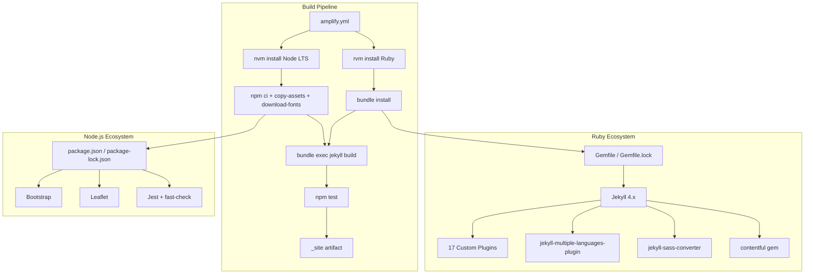
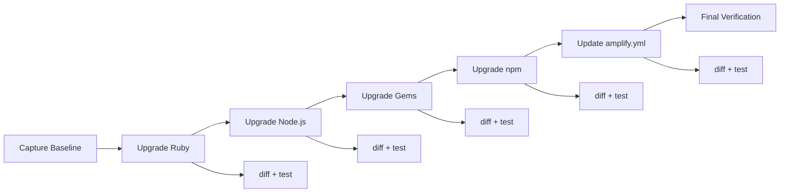

# Design Document: Dependency Version Upgrade

## Overview

This design covers upgrading all runtime and development dependencies in the Paddelbuch Jekyll project to their latest stable versions while ensuring zero changes to the generated site output. The upgrade spans two runtime environments (Ruby, Node.js), their respective package ecosystems (RubyGems, npm), 17 custom Jekyll plugins, and the AWS Amplify CI/CD pipeline.

The core constraint is site integrity: the `_site` output after all upgrades must be byte-for-byte identical to a pre-upgrade baseline. This drives a "baseline-diff-fix" approach where we capture the build output before any changes, perform upgrades incrementally, and diff after each step.

### Current State

| Component | Current Version |
|---|---|
| Ruby | 3.4.1 (via chruby) |
| Node.js | 18 (via nvm in Amplify) |
| Jekyll | 4.4.1 |
| Bundler | 2.6.2 |
| Bootstrap | 5.3.2 |
| Leaflet | 1.9.4 |
| leaflet.locatecontrol | 0.79.0 |
| Jest | 29.7.0 |
| jest-environment-jsdom | 30.2.0 |
| fast-check | 3.22.0 |
| RSpec | 3.13.2 |
| Rantly | 2.0.0 |

### Target State

All components upgraded to their latest stable/LTS versions at time of execution. Specific target versions will be determined during implementation since new releases may appear between design and execution.

### Design Decisions

1. **Incremental upgrade order**: Ruby → Node.js → Gems → npm packages. Runtime upgrades first because package upgrades may depend on runtime features.
2. **Baseline-diff approach**: Capture `_site` before any changes. After each upgrade step, rebuild and diff against baseline. Fix any differences before proceeding.
3. **No version pinning relaxation**: Keep pessimistic version constraints (`~>`) in Gemfile. Use exact versions for frontend dependencies in package.json (Bootstrap, Leaflet) to avoid accidental drift.
4. **Test-first verification**: Run both test suites after each upgrade step, not just at the end.

## Architecture

The upgrade does not change the system architecture. The existing architecture remains:

### Upgrade Sequence

## Components and Interfaces

### Files Modified

| File | Change |
|---|---|
| `.ruby-version` | Update to latest stable Ruby |
| `Gemfile` | Update version constraints |
| `Gemfile.lock` | Regenerated by `bundle update` |
| `package.json` | Update dependency versions |
| `package-lock.json` | Regenerated by `npm install` |
| `amplify.yml` | Update `nvm install` and `rvm install`/`rvm use` version numbers |
| `_plugins/*.rb` | Only if breaking API changes require fixes |
| `_tests/**/*.test.js` | Only if test framework API changes require fixes |
| `spec/**/*_spec.rb` | Only if test framework API changes require fixes |
| `jest.config.js` | Only if Jest config API changes |

### Custom Plugins (Compatibility Surface)

The 17 plugins in `_plugins/` use these Jekyll/Ruby APIs that could be affected:

- `Jekyll::Generator` subclasses (api_generator, collection_generator, color_generator, contentful_fetcher, favicon_generator, sitemap_generator, tile_generator)
- `Jekyll::Converter` (potentially via sass-converter)
- `Liquid::Tag` / `Liquid::Filter` (locale_filter, waterway_filters)
- `Contentful::Client` API (contentful_fetcher, contentful_mappers)
- Ruby stdlib: `Net::HTTP`, `JSON`, `FileUtils`, `Digest` (various plugins)
- `Dotenv` (env_loader)

### npm Scripts (Compatibility Surface)

- `scripts/copy-vendor-assets.js` — copies Bootstrap/Leaflet from `node_modules/` to `assets/`. Path changes in new package versions could break this.
- `scripts/download-google-fonts.js` — downloads fonts. Uses Node.js APIs.

## Data Models

No data model changes. The upgrade does not alter any data structures, collection schemas, or Contentful mappings. The `_data/`, `_spots/`, `_waterways/`, `_obstacles/`, and `_notices/` directories remain unchanged.

The only "data" affected are the dependency manifests themselves:

- `Gemfile` + `Gemfile.lock` — Ruby dependency graph
- `package.json` + `package-lock.json` — Node.js dependency graph
- `.ruby-version` — Ruby version specifier
- `amplify.yml` — Build pipeline version references

## Correctness Properties

*A property is a characteristic or behavior that should hold true across all valid executions of a system — essentially, a formal statement about what the system should do. Properties serve as the bridge between human-readable specifications and machine-verifiable correctness guarantees.*

### Property 1: Build Output Invariance

*For any* valid set of dependency upgrades applied to the project, building the Jekyll site after the upgrades shall produce a `_site` directory that is identical in directory structure and file contents to the Pre_Upgrade_Baseline captured before any upgrades were applied.

**Validates: Requirements 1.1, 1.2, 1.3, 1.4, 1.5**

### Property 2: Pipeline Version Consistency

*For any* Ruby version specified in `.ruby-version`, the `amplify.yml` build pipeline shall reference that exact same version string in both its `rvm install` and `rvm use` commands.

**Validates: Requirements 2.3, 8.1**

### Property 3: Test Count Preservation

*For any* test suite (RSpec or Jest), the number of test examples/cases after all dependency upgrades shall be greater than or equal to the number of test examples/cases before the upgrades.

**Validates: Requirements 7.5, 7.6**

## Error Handling

### Upgrade Failures

| Scenario | Handling |
|---|---|
| `bundle update` fails due to dependency conflict | Identify conflicting gems, upgrade incrementally (one gem at a time), resolve conflicts by adjusting version constraints |
| `npm install` fails due to peer dependency conflict | Use `npm install --legacy-peer-deps` as fallback, or upgrade conflicting packages together |
| Jekyll build fails after gem upgrade | Check build error output, identify breaking API change in plugin, fix plugin code, re-run build |
| Test suite fails after upgrade | Distinguish between test framework API changes (fix test code) vs. actual regressions (fix source code or revert upgrade) |
| Site diff shows differences after upgrade | Identify which dependency caused the diff, adjust source code or plugin to restore identical output |

### Rollback Strategy

Each upgrade step is performed on a Git branch. If an upgrade step cannot be resolved:

1. Revert the specific dependency change
2. Pin to the last working version
3. Document the incompatibility for future retry
4. Proceed with remaining upgrades

### Known Risk Areas

- **jekyll-sass-converter**: Sass compilation changes between versions can produce slightly different CSS whitespace. The `style: compressed` setting in `_config.yml` mitigates this but doesn't eliminate all risk.
- **Bootstrap major version**: Bootstrap 5.3.x → 5.4.x (if available) could change compiled CSS. Since Bootstrap CSS is copied via `copy-vendor-assets.js`, the vendor CSS files will change if the Bootstrap version changes.
- **Liquid template engine**: Jekyll pins Liquid `~> 4.0`. A Liquid minor version bump could change whitespace handling in templates.
- **jest-environment-jsdom**: Already at 30.2.0 while Jest is at 29.7.0 — this version mismatch may need attention during the Jest upgrade.

## Testing Strategy

### Dual Testing Approach

Both unit/example tests and property-based tests are used. The project already has established test suites in both ecosystems:

- **RSpec + Rantly** (Ruby): 13+ spec files including property-based tests
- **Jest + fast-check** (JS): 40+ property test files, 8+ unit test files

### Pre-Upgrade Baseline Capture

Before any upgrades:
1. Run `bundle exec rspec` and record test count
2. Run `npm test` and record test count
3. Run `bundle exec jekyll build` and capture `_site/` as baseline

### Per-Step Verification

After each upgrade step:
1. `bundle exec jekyll build` — must succeed
2. `diff -r _site/ _site_baseline/` — must show no differences
3. `bundle exec rspec` — must pass with >= baseline test count
4. `npm test` — must pass with >= baseline test count

### Property-Based Testing

The project uses:
- **Rantly** (`~> 2.0`) for Ruby property-based tests
- **fast-check** (`^3.22.0`) for JavaScript property-based tests

Each property test must run a minimum of 100 iterations.

Property tests must be tagged with a comment referencing the design property:
- **Feature: dependency-version-upgrade, Property 1: Build Output Invariance**
- **Feature: dependency-version-upgrade, Property 2: Pipeline Version Consistency**
- **Feature: dependency-version-upgrade, Property 3: Test Count Preservation**

### Property Test Implementation

**Property 1 (Build Output Invariance)**: This is verified by the baseline diff process rather than a randomized property test, since the "input space" is the fixed project source. The verification is: build site, diff against baseline, assert no differences.

**Property 2 (Pipeline Version Consistency)**: Implemented as a property-based test that generates random valid Ruby version strings, writes them to a mock `.ruby-version`, and verifies that a parser/updater function produces matching `rvm install` and `rvm use` commands in the amplify.yml structure.

**Property 3 (Test Count Preservation)**: Verified by capturing test counts before and after upgrades. The counts are compared as part of the upgrade verification process.

### Unit Test Focus

Unit tests should cover:
- Specific plugin compatibility after API changes
- Edge cases in version parsing
- Integration points between plugins and upgraded gems
- Copy-vendor-assets script with new package directory structures
