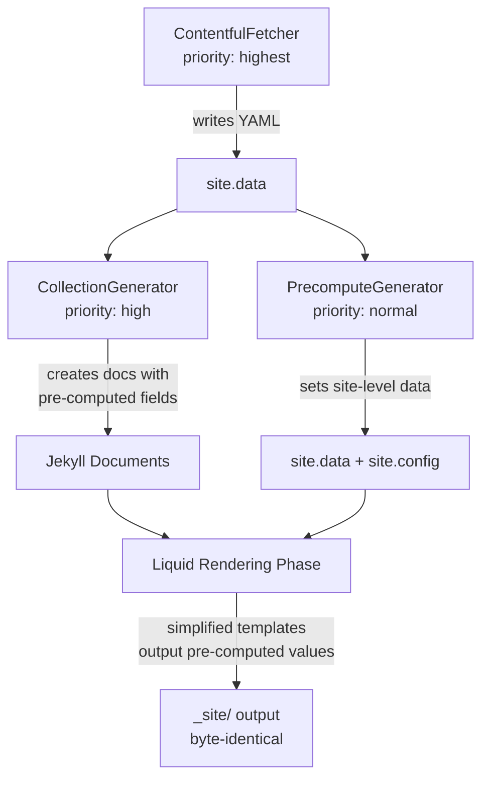

# Design Document: Liquid Template Pre-computation

## Overview

This feature reduces Jekyll build time by moving repeated Liquid computations into Ruby generator plugins. The current build spends ~690 seconds in the Liquid rendering phase, processing ~2815 pages. Much of this time is spent on operations whose results depend only on site-level data and the current locale — not on per-page content. By pre-computing these values in Ruby during the generate phase, we eliminate thousands of redundant Liquid `| where` filter scans, conditional branches, and JSON construction loops.

The approach has two parts:

1. **CollectionGenerator enhancements** — resolve type names, icon metadata, waterway names, and event notice lists per-document during document creation (runs once per document, not once per page render)
2. **New PrecomputeGenerator plugin** — compute site-level data that is identical across all pages within a locale: header navigation arrays, map config JSON strings, locale prefix

The Liquid templates are then simplified to output pre-computed values directly. The HTML output must remain byte-identical.

## Architecture



### Plugin Execution Order

| Priority | Plugin | What it pre-computes |
|----------|--------|---------------------|
| `:highest` | `ContentfulFetcher` | Fetches data, writes YAML to `site.data` |
| `:high` | `CollectionGenerator` | Per-document: type names, icon metadata, waterway names, active notices |
| `:normal` | `PrecomputeGenerator` | Per-locale: header nav data, map config JSON, layer control JSON, locale prefix |
| `:low` | `ApiGenerator` | JSON API files (unchanged) |
| `:low` | `TileGenerator` | Spatial tile files (unchanged) |

### What Moves from Liquid to Ruby

| Current Liquid Operation | Frequency | Moves To | New Access Pattern |
|--------------------------|-----------|----------|-------------------|
| `site.data.types.spot_types \| where: "slug" \| first` | 722 spots × 2 langs | CollectionGenerator | `page.spot_type_name` |
| `site.data.types.paddle_craft_types \| where: "slug" \| first` (in loop) | ~2166 lookups | CollectionGenerator | `page.paddle_craft_type_names` |
| `site.data.types.obstacle_types \| where: "slug" \| first` | 274 obstacles × 2 langs | CollectionGenerator | `page.obstacle_type_name` |
| spot-icon.html 6-way if/elsif + locale branching | 722 spots × 2 langs | CollectionGenerator | `page.spot_icon_name`, `page.spot_icon_alt` |
| `site.data.waterways \| where: "slug" \| where: "locale" \| first` | ~996 spots+obstacles × 2 langs | CollectionGenerator | `page.waterway_name` |
| Notice waterway slug loop in notice.html | 15 notices × 2 langs | CollectionGenerator | `page.notice_waterways` |
| Event notice filtering in event-list.html | 250 waterways × 2 langs | CollectionGenerator | `page.active_notices` |
| `locale_prefix` conditional | ~10 includes × 2815 pages | PrecomputeGenerator | `site.locale_prefix` |
| `top_lakes_by_area` filter in header.html | 2815 pages | PrecomputeGenerator | `site.data['nav_top_lakes']` |
| `top_rivers_by_length` filter in header.html | 2815 pages | PrecomputeGenerator | `site.data['nav_top_rivers']` |
| Static pages `\| where \| sort` in header.html | 2815 pages × 2 menus | PrecomputeGenerator | `site.data['nav_open_data_pages']`, `site.data['nav_about_pages']` |
| map-data-config JSON block in detail-map-layers.html | ~1800 detail pages × 2 langs | PrecomputeGenerator | `site.data['map_data_config_json']` |
| layer-control-config JSON block in layer-control.html | ~1800 detail pages × 2 langs | PrecomputeGenerator | `site.data['layer_control_config_json']` |
| map-data-config JSON block in map-init.html | 2 pages (home × 2 langs) | PrecomputeGenerator | `site.data['map_data_config_json']` |

## Components and Interfaces

### 1. CollectionGenerator (modified)

**File:** `_plugins/collection_generator.rb`

**Changes:** Add pre-computation methods called during document creation. Build lookup hashes once per `generate` call for O(1) access.

```ruby
def generate(site)
  current_locale = site.config['lang'] || site.config['default_lang'] || 'de'

  # Build O(1) lookup hashes once
  @type_lookup = build_type_lookup(site.data, current_locale)
  @waterway_lookup = build_waterway_lookup(site.data['waterways'], current_locale)
  @craft_type_lookup = build_craft_type_lookup(site.data, current_locale)

  # ... existing collection iteration ...
  # Inside create_document, call pre-compute methods
end
```

**New lookup hash builders:**

```ruby
# Returns { slug => translated_name } for a given type category
def build_type_lookup(data, locale)
  name_key = locale == 'en' ? 'name_en' : 'name_de'
  result = {}
  %w[spot_types obstacle_types paddle_craft_types].each do |type_key|
    types = data.dig('types', type_key)
    next unless types.is_a?(Array)
    result[type_key] = {}
    types.each do |t|
      next unless t['locale'] == locale && t['slug']
      result[type_key][t['slug']] = t[name_key] || t['name_de'] || t['slug']
    end
  end
  result
end

def build_waterway_lookup(waterways, locale)
  return {} unless waterways.is_a?(Array)
  lookup = {}
  waterways.each do |w|
    lookup[w['slug']] = w if w['locale'] == locale
  end
  lookup
end

def build_craft_type_lookup(data, locale)
  name_key = locale == 'en' ? 'name_en' : 'name_de'
  types = data.dig('types', 'paddle_craft_types')
  return {} unless types.is_a?(Array)
  lookup = {}
  types.each do |t|
    next unless t['locale'] == locale && t['slug']
    lookup[t['slug']] = t[name_key] || t['name_de'] || t['slug']
  end
  lookup
end
```

**Pre-computation in `create_document`:**

For spots:
```ruby
if collection.label == 'spots'
  precompute_spot_fields(doc, entry, current_locale)
end
```

```ruby
def precompute_spot_fields(doc, entry, locale)
  slug = entry['spotType_slug'] || entry['spot_type_slug']
  is_rejected = entry['rejected']

  # Spot type name
  if is_rejected
    doc.data['spot_type_name'] = get_translation(locale, 'spot_types.no_entry')
  else
    doc.data['spot_type_name'] = @type_lookup.dig('spot_types', slug) || slug
  end

  # Paddle craft type names (resolved array)
  craft_slugs = entry['paddleCraftTypes'] || []
  doc.data['paddle_craft_type_names'] = craft_slugs.map { |cs| @craft_type_lookup[cs] || cs }

  # Icon name and alt text
  icon = resolve_spot_icon(slug, is_rejected, locale)
  doc.data['spot_icon_name'] = icon[:name]
  doc.data['spot_icon_alt'] = icon[:alt]

  # Waterway name
  if entry['waterway_slug'] && @waterway_lookup[entry['waterway_slug']]
    doc.data['waterway_name'] = @waterway_lookup[entry['waterway_slug']]['name']
  end
end
```

For obstacles:
```ruby
if collection.label == 'obstacles'
  precompute_obstacle_fields(doc, entry, locale)
end
```

```ruby
def precompute_obstacle_fields(doc, entry, locale)
  slug = entry['obstacleType_slug']
  doc.data['obstacle_type_name'] = @type_lookup.dig('obstacle_types', slug) || slug if slug

  if entry['waterway_slug'] && @waterway_lookup[entry['waterway_slug']]
    doc.data['waterway_name'] = @waterway_lookup[entry['waterway_slug']]['name']
  end
end
```

For waterways:
```ruby
if collection.label == 'waterways'
  precompute_waterway_notices(doc, entry, site, locale)
end
```

```ruby
def precompute_waterway_notices(doc, entry, site, locale)
  notices = site.data['notices']
  return unless notices.is_a?(Array)

  today = Date.today.strftime('%Y-%m-%d')
  waterway_slug = entry['slug']

  active = notices.select do |n|
    n['locale'] == locale &&
      n['endDate'] && n['endDate'].to_s >= today &&
      n['waterways']&.include?(waterway_slug)
  end

  doc.data['active_notices'] = active.map do |n|
    { 'name' => n['name'], 'slug' => n['slug'], 'endDate' => n['endDate'] }
  end
end
```

For notices:
```ruby
if collection.label == 'notices'
  precompute_notice_waterways(doc, entry, locale)
end
```

```ruby
def precompute_notice_waterways(doc, entry, locale)
  ww_slugs = entry['waterways'] || []
  doc.data['notice_waterways'] = ww_slugs.filter_map do |slug|
    ww = @waterway_lookup[slug]
    { 'name' => ww['name'], 'slug' => ww['slug'] } if ww
  end
end
```

**Icon resolution (replaces spot-icon.html branching):**

```ruby
SPOT_ICON_MAP = {
  'einstieg-ausstieg' => { name: 'entryexit', alt_de: 'Ein-/Ausstiegsorte Symbol', alt_en: 'Entry and exit spot icon' },
  'nur-einstieg'      => { name: 'entry',     alt_de: 'Einstiegsorte Symbol',       alt_en: 'Entry spot icon' },
  'nur-ausstieg'      => { name: 'exit',      alt_de: 'Ausstiegsorte Symbol',       alt_en: 'Exit spot icon' },
  'rasthalte'         => { name: 'rest',       alt_de: 'Rasthalte Symbol',           alt_en: 'Rest spot icon' },
  'notauswasserungsstelle' => { name: 'emergency', alt_de: 'Notauswasserungsstelle Symbol', alt_en: 'Emergency exit spot icon' }
}.freeze

def resolve_spot_icon(type_slug, is_rejected, locale)
  if is_rejected
    { name: 'noentry', alt: locale == 'en' ? 'No entry spot icon' : 'Kein Zutritt Symbol' }
  else
    entry = SPOT_ICON_MAP[type_slug] || SPOT_ICON_MAP['einstieg-ausstieg']
    { name: entry[:name], alt: locale == 'en' ? entry[:alt_en] : entry[:alt_de] }
  end
end
```

**Translation access:** The `get_translation` helper reads from `site.parsed_translations` (populated by the multi-language plugin's `:pre_render` hook). However, since CollectionGenerator runs during the generate phase (before `:pre_render`), translations may not be loaded yet. Instead, we hardcode the two known values needed (`spot_types.no_entry`) or load the YAML file directly:

```ruby
def get_translation(locale, key)
  @translations ||= {}
  @translations[locale] ||= YAML.load_file(File.join(@site.source, '_i18n', "#{locale}.yml"))
  @translations[locale].dig(*key.split('.'))
end
```

### 2. PrecomputeGenerator (new)

**File:** `_plugins/precompute_generator.rb`

**Priority:** `:normal` (runs after CollectionGenerator at `:high`, before rendering)

```ruby
module Jekyll
  class PrecomputeGenerator < Generator
    safe true
    priority :normal

    def generate(site)
      locale = site.config['lang'] || site.config['default_lang'] || 'de'
      default_lang = site.config['default_lang'] || 'de'

      # Requirement 2: Locale prefix
      site.config['locale_prefix'] = (locale != default_lang) ? "/#{locale}" : ''

      # Requirement 3: Header navigation data
      precompute_header_nav(site, locale)

      # Requirement 4: Map configuration JSON
      precompute_map_config_json(site, locale)
    end

    private

    def precompute_header_nav(site, locale)
      waterways = site.data['waterways'] || []

      # Top 10 lakes by area, then sorted alphabetically
      site.data['nav_top_lakes'] = waterways
        .select { |w| w['locale'] == locale && w['paddlingEnvironmentType_slug'] == 'see' && w['showInMenu'] == true }
        .sort_by { |w| -(w['area'] || 0) }
        .first(10)
        .sort_by { |w| w['name'].to_s.downcase }

      # Top 10 rivers by length, then sorted alphabetically
      site.data['nav_top_rivers'] = waterways
        .select { |w| w['locale'] == locale && w['paddlingEnvironmentType_slug'] == 'fluss' && w['showInMenu'] == true }
        .sort_by { |w| -(w['length'] || 0) }
        .first(10)
        .sort_by { |w| w['name'].to_s.downcase }

      # Static pages for menus
      static_pages = site.data['static_pages'] || []
      site.data['nav_open_data_pages'] = static_pages
        .select { |p| p['locale'] == locale && p['menu_slug'] == 'offene-daten' }
        .sort_by { |p| p['menuOrder'] || 0 }

      site.data['nav_about_pages'] = static_pages
        .select { |p| p['locale'] == locale && p['menu_slug'] == 'ueber' }
        .sort_by { |p| p['menuOrder'] || 0 }
    end

    def precompute_map_config_json(site, locale)
      default_lang = site.config['default_lang'] || 'de'
      locale_prefix = (locale != default_lang) ? "/#{locale}" : ''
      name_key = "name_#{locale}"

      # Paddle craft types for dimension config
      craft_types = (site.data.dig('types', 'paddle_craft_types') || [])
        .select { |t| t['locale'] == locale }
      craft_options = craft_types.map { |ct| { slug: ct['slug'], label: ct[name_key] || ct['name_de'] } }

      # Spot type dimension options (hardcoded slugs, translated labels)
      spot_type_options = if locale == 'en'
        [
          { slug: 'einstieg-ausstieg', label: 'Entry & Exit Spots' },
          { slug: 'nur-einstieg', label: 'Entry Only Spots' },
          { slug: 'nur-ausstieg', label: 'Exit Only Spots' },
          { slug: 'rasthalte', label: 'Rest Spots' },
          { slug: 'notauswasserungsstelle', label: 'Emergency Exit Spots' }
        ]
      else
        [
          { slug: 'einstieg-ausstieg', label: 'Ein-/Ausstiegsorte' },
          { slug: 'nur-einstieg', label: 'Einstiegsorte' },
          { slug: 'nur-ausstieg', label: 'Ausstiegsorte' },
          { slug: 'rasthalte', label: 'Rasthalte' },
          { slug: 'notauswasserungsstelle', label: 'Notauswasserungsstelle' }
        ]
      end

      layer_labels = if locale == 'en'
        { noEntry: 'No Entry Spots', eventNotices: 'Event Notices', obstacles: 'Obstacles', protectedAreas: 'Protected Areas' }
      else
        { noEntry: 'Keine Zutritt Orte', eventNotices: 'Gewässerereignisse', obstacles: 'Hindernisse', protectedAreas: 'Schutzgebiete' }
      end

      map_data_config = {
        locale: locale,
        dimensionConfigs: [
          {
            key: 'spotType',
            label: locale == 'en' ? 'Spot Type' : 'Ortstyp',
            options: spot_type_options
          },
          {
            key: 'paddleCraftType',
            label: locale == 'en' ? 'Paddle Craft Type' : 'Paddelboottyp',
            options: craft_options
          }
        ],
        layerLabels: layer_labels
      }

      site.data['map_data_config_json'] = JSON.generate(map_data_config)

      # Layer control config
      pa_types = (site.data.dig('types', 'protected_area_types') || [])
        .select { |t| t['locale'] == locale }
      pa_names = {}
      pa_types.each { |t| pa_names[t['slug']] = t[name_key] || t['name_de'] }

      layer_control_config = {
        currentLocale: locale,
        localePrefix: locale_prefix,
        protectedAreaTypeNames: pa_names
      }

      site.data['layer_control_config_json'] = JSON.generate(layer_control_config)
    end
  end
end
```

### 3. Template Changes

All template changes replace Liquid computation with direct output of pre-computed values. The HTML structure, CSS classes, attributes, and content remain identical.

**`_layouts/spot.html`** — Remove type lookup block, use `page.spot_type_name`. Remove waterway lookup block, use `page.waterway_slug` and `page.waterway_name`. Simplify spot-icon include to use pre-computed values.

**`_layouts/obstacle.html`** — Remove type lookup block, use `page.obstacle_type_name`. Remove waterway lookup block, use `page.waterway_slug` and `page.waterway_name`.

**`_layouts/notice.html`** — Remove waterway lookup loop, use `page.notice_waterways`.

**`_includes/spot-detail-content.html`** — Remove locale_prefix computation (use `site.locale_prefix`). Replace paddle craft type `| where` loop with iteration over `include.spot.paddle_craft_type_names`. Remove waterway `| where` lookup (use `include.waterway_name` / `include.waterway_slug` passed from layout or `include.spot.waterway_name`).

**`_includes/obstacle-detail-content.html`** — Remove locale_prefix computation. Use pre-computed waterway name.

**`_includes/notice-detail-content.html`** — Remove locale_prefix computation. Use pre-computed waterway data.

**`_includes/event-list.html`** — Remove entire notice filtering loop. Iterate over `include.waterway_slug` replaced by `page.active_notices`.

**`_includes/spot-icon.html`** — Replace 6-way if/elsif chain with direct use of `include.icon_name` and `include.icon_alt` (passed from layout using pre-computed values). The include becomes a simple `` tag with variable substitution.

**`_includes/header.html`** — Remove locale_prefix computation. Replace `top_lakes_by_area` and `top_rivers_by_length` filter calls with `site.data.nav_top_lakes` and `site.data.nav_top_rivers`. Replace `| where | sort` for static pages with `site.data.nav_open_data_pages` and `site.data.nav_about_pages`.

**`_includes/detail-map-layers.html`** — Replace the entire `<script type="application/json" id="map-data-config">` block with `{{ site.data.map_data_config_json }}`.

**`_includes/layer-control.html`** — Replace the `<script type="application/json" id="layer-control-config">` block with `{{ site.data.layer_control_config_json }}`.

**`_includes/map-init.html`** — Replace the `<script type="application/json" id="map-data-config">` block with `{{ site.data.map_data_config_json }}`.

**All includes using locale_prefix** — Replace the `` block with `` (single assignment, no conditional).

## Data Models

### Pre-computed Document Fields (set in CollectionGenerator)

| Collection | Field | Type | Source |
|-----------|-------|------|--------|
| spots | `spot_type_name` | String | Resolved from `types/spot_types` by slug + locale |
| spots | `paddle_craft_type_names` | Array[String] | Resolved from `types/paddle_craft_types` by slugs + locale |
| spots | `spot_icon_name` | String | Resolved from SPOT_ICON_MAP by type slug + rejected |
| spots | `spot_icon_alt` | String | Resolved from SPOT_ICON_MAP by type slug + rejected + locale |
| spots | `waterway_name` | String | Resolved from waterways by `waterway_slug` + locale |
| obstacles | `obstacle_type_name` | String | Resolved from `types/obstacle_types` by slug + locale |
| obstacles | `waterway_name` | String | Resolved from waterways by `waterway_slug` + locale |
| waterways | `active_notices` | Array[Hash] | Filtered from notices by waterway slug + future endDate |
| notices | `notice_waterways` | Array[Hash] | Resolved from waterways by slugs + locale |

### Pre-computed Site-Level Data (set in PrecomputeGenerator)

| Key | Type | Description |
|-----|------|-------------|
| `site.config['locale_prefix']` | String | `""` for default lang, `"/en"` for English |
| `site.data['nav_top_lakes']` | Array[Hash] | Top 10 lakes for header nav |
| `site.data['nav_top_rivers']` | Array[Hash] | Top 10 rivers for header nav |
| `site.data['nav_open_data_pages']` | Array[Hash] | Open data menu pages |
| `site.data['nav_about_pages']` | Array[Hash] | About menu pages |
| `site.data['map_data_config_json']` | String | Complete JSON for map-data-config script tag |
| `site.data['layer_control_config_json']` | String | Complete JSON for layer-control-config script tag |

## Correctness Properties

### Property 1: Spot type name resolution equivalence

*For any* spot document with a `spotType_slug` value and locale, the pre-computed `spot_type_name` must equal the value that the current Liquid `| where: "slug" | first` lookup would produce. For rejected spots, it must equal the `spot_types.no_entry` translation for the current locale.

**Validates: Requirements 1.1, 1.4, 1.6**

### Property 2: Paddle craft type names resolution equivalence

*For any* spot document with a `paddleCraftTypes` array and locale, the pre-computed `paddle_craft_type_names` array must contain the same translated names in the same order as the current Liquid `| where` loop would produce.

**Validates: Requirements 1.2, 1.6**

### Property 3: Obstacle type name resolution equivalence

*For any* obstacle document with an `obstacleType_slug` value and locale, the pre-computed `obstacle_type_name` must equal the value that the current Liquid `| where: "slug" | first` lookup would produce.

**Validates: Requirements 1.3, 1.7**

### Property 4: Spot icon resolution equivalence

*For any* spot type slug and rejected status combination, the pre-computed `spot_icon_name` and `spot_icon_alt` must match the values that the current `spot-icon.html` if/elsif chain would produce.

**Validates: Requirements 1.5, 1.6**

### Property 5: Locale prefix equivalence

*For any* language and default language combination, the pre-computed `site.locale_prefix` must equal the value that the current Liquid `` conditional would produce.

**Validates: Requirements 2.1, 2.2, 2.3**

### Property 6: Header navigation data equivalence

*For any* set of waterway data and static page data with a given locale, the pre-computed `nav_top_lakes`, `nav_top_rivers`, `nav_open_data_pages`, and `nav_about_pages` arrays must contain the same entries in the same order as the current Liquid filter calls and `| where | sort` operations would produce.

**Validates: Requirements 3.1, 3.2, 3.3, 3.4, 3.5**

### Property 7: Map config JSON equivalence

*For any* set of type data and locale, the pre-computed `map_data_config_json` string, when parsed as JSON, must produce an object structurally identical to the JSON that the current Liquid template would generate.

**Validates: Requirements 4.1, 4.3, 4.5**

### Property 8: Layer control config JSON equivalence

*For any* set of protected area type data and locale, the pre-computed `layer_control_config_json` string, when parsed as JSON, must produce an object structurally identical to the JSON that the current Liquid template would generate.

**Validates: Requirements 4.2, 4.4**

### Property 9: Waterway event notice filtering equivalence

*For any* waterway slug, set of notices, and current date, the pre-computed `active_notices` array must contain the same notices (by slug) as the current Liquid filtering loop in `event-list.html` would produce.

**Validates: Requirements 5.1, 5.2**

### Property 10: Waterway name resolution equivalence

*For any* document with a `waterway_slug` and locale, the pre-computed `waterway_name` must equal the name field of the waterway that the current Liquid `| where: "slug" | where: "locale" | first` lookup would return.

**Validates: Requirements 6.1, 6.2, 6.3**

### Property 11: Notice waterway resolution equivalence

*For any* notice document with a `waterways` array and locale, the pre-computed `notice_waterways` array must contain the same waterway objects (name and slug) as the current Liquid loop in `notice.html` would produce.

**Validates: Requirements 7.1, 7.2**

## Error Handling

### Missing Type Data

If a type slug cannot be found in the lookup hash (e.g., data inconsistency), the pre-computation falls back to using the raw slug string as the display name. This matches the current Liquid behavior where `` is the fallback.

### Missing Waterway Data

If a `waterway_slug` cannot be resolved, `waterway_name` is not set on the document. The Liquid templates already handle this with `` conditionals, which continue to work when `waterway_name` is nil.

### Missing Translation Files

If the `_i18n/<locale>.yml` file cannot be loaded for rejected spot type name resolution, the generator logs a warning and falls back to the slug string. This is a defensive measure — in practice the translation files always exist.

### Empty Data Arrays

All pre-computation methods handle nil/empty arrays gracefully, returning empty arrays or nil values. The Liquid templates already handle empty states with `` guards.

## Testing Strategy

### Property-Based Testing

Use the `rantly` gem for property-based testing in Ruby (compatible with RSpec). Each correctness property maps to one or more property-based tests with a minimum of 100 iterations.

### Property Test Plan

| Property | Test Approach | Generator Strategy |
|----------|--------------|-------------------|
| P1: Spot type name | Generate random spot type slugs and locales, compare Ruby lookup vs simulated Liquid lookup | Random slugs from known set + random unknown slugs |
| P2: Craft type names | Generate random arrays of craft type slugs, compare resolved names | Random subsets of known slugs + unknown slugs |
| P3: Obstacle type name | Generate random obstacle type slugs and locales | Random slugs from known set |
| P4: Spot icon | Generate all spot type slug × rejected × locale combinations | Exhaustive + random unknown slugs |
| P5: Locale prefix | Generate random lang/default_lang pairs | Random 2-letter codes |
| P6: Header nav | Generate random waterway datasets with varying areas/lengths | Random waterway hashes |
| P7: Map config JSON | Generate random craft type datasets | Random type arrays |
| P8: Layer control JSON | Generate random PA type datasets | Random type arrays |
| P9: Notice filtering | Generate random notice datasets with varying dates and waterway associations | Random dates and slug arrays |
| P10: Waterway name | Generate random waterway datasets and slug lookups | Random waterway hashes |
| P11: Notice waterways | Generate random notice waterway arrays | Random slug arrays |

### Test File Organization

```
spec/
  plugins/
    precompute_generator_spec.rb     # P5, P6, P7, P8 + unit tests
    collection_precompute_spec.rb    # P1, P2, P3, P4, P9, P10, P11 + unit tests
```

### Integration Verification

After implementation, a full local build should be run with `--verbose` to compare the HTML output of a sample of pages (e.g., 5 spots, 5 waterways, 5 obstacles, 5 notices) against the pre-optimization output. The `diff` of the `_site/` directories should show zero differences in HTML content.
