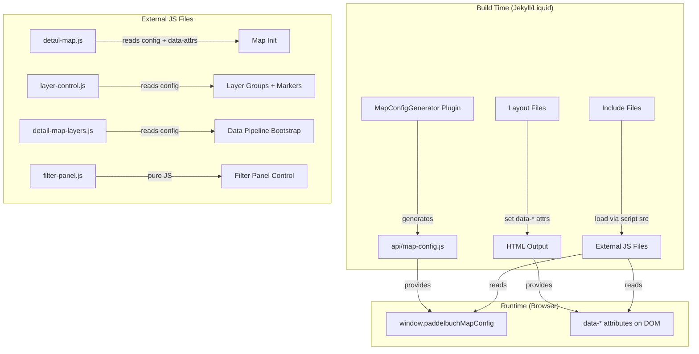

# Design Document: Liquid Rendering Optimization

## Overview

This design externalizes inline JavaScript from Liquid templates into static `.js` files under `assets/js/`. The core problem: Jekyll's Liquid engine parses hundreds of lines of JavaScript on every page render even though only a handful of values (locale, coordinates, geometry JSON) are truly dynamic. By moving the static JS logic into external files and passing dynamic values via HTML `data-*` attributes and the existing `window.paddelbuchMapConfig` object, we eliminate Liquid processing of ~965 lines of JavaScript per detail page render.

### Files Produced

| External JS File | Source | Purpose |
|---|---|---|
| `assets/js/layer-control.js` | `_includes/layer-control.html` | Layer group creation, marker/popup factories |
| `assets/js/detail-map-layers.js` | `_includes/detail-map-layers.html` | Data loading bootstrap, filter init |
| `assets/js/filter-panel.js` | `_includes/filter-panel.html` | Custom Leaflet filter panel control |
| `assets/js/detail-map.js` | 4× `_layouts/*.html` | Unified map init for spot/obstacle/waterway/notice |

### Dynamic Value Passing Strategy

- **`window.paddelbuchMapConfig`**: Extended with site-level settings (tile URL, center, zoom, attribution). Already loaded on every page via `api/map-config.js`.
- **`data-*` attributes**: Page-specific values (coordinates, geometry JSON, page type, locale) set on the map container `<div>` by the Liquid template. The external JS reads these at init time.

## Architecture



### Data Flow

1. **Build time**: `MapConfigGenerator` writes `window.paddelbuchMapConfig` with tile URL, center, zoom, max zoom, attribution, plus existing locale-specific configs.
2. **Build time**: Layout templates emit a map container `<div>` with `data-*` attributes for page-specific values (coordinates, geometry, page type, locale).
3. **Build time**: Include templates emit `<script src="...">` tags instead of inline `<script>` blocks.
4. **Runtime**: External JS files read `window.paddelbuchMapConfig` for site settings and `data-*` attributes for page-specific values.

## Components and Interfaces

### 1. MapConfigGenerator Plugin (Extended)

**File**: `_plugins/map_config_generator.rb`

**Changes**: Add site-level settings to the generated config object.

```ruby
# New top-level keys added to window.paddelbuchMapConfig:
{
  "tileUrl": "https://{s}.tile.openstreetmap.org/{z}/{x}/{y}.png",
  "center": { "lat": 46.801111, "lon": 8.226667 },
  "defaultZoom": 8,
  "maxZoom": 20,
  "attribution": "&copy; <a href=\"...\">Mapbox</a> ..."
}
```

These are read from `site.config` values (`mapbox_url`, `map.center.lat`, etc.) and written once at build time.

### 2. detail-map.js (New)

**File**: `assets/js/detail-map.js`

Unified map initialization for all four detail page types. Reads configuration from:
- `window.paddelbuchMapConfig` for tile URL, center, zoom, attribution
- `data-*` attributes on the map container element for page-specific values

**Interface**:
```javascript
// Reads from map container element:
// data-page-type: "spot" | "obstacle" | "waterway" | "notice"
// data-locale: "de" | "en"
// data-lat, data-lon: spot coordinates (spot only)
// data-spot-type: spot type slug (spot only)
// data-spot-name, data-spot-slug: spot identifiers (spot only)
// data-rejected: "true"/"false" (spot only)
// data-spot-json: JSON string of spot data for popup (spot only)
// data-geometry: GeoJSON string (obstacle, waterway, notice)
// data-portage-route: GeoJSON string (obstacle only)
// data-location-lat, data-location-lon: fallback coordinates (notice only)
//
// Sets: window.paddelbuchMap
```

**Shared code path**: Tile layer creation, attribution, zoom control positioning, locate control configuration — identical across all four page types today.

**Type-specific logic**:
- `spot`: Center on coordinates, zoom 15, add marker with popup
- `obstacle`: Fit bounds to geometry polygon, render with obstacle style, optionally render portage route
- `waterway`: Fit bounds to geometry (no polygon rendered)
- `notice`: Fit bounds to affected area polygon with event notice style, fallback to location or default center

### 3. layer-control.js (New)

**File**: `assets/js/layer-control.js`

Extracted from `_includes/layer-control.html`. The only Liquid interpolations were `{{ map_var }}` (always `window.paddelbuchMap`) and `{{ current_locale }}` / locale prefix.

**Interface**:
```javascript
// Reads locale from:
// 1. data-locale attribute on script tag or container
// 2. window.paddelbuchMapConfig locale detection
//
// Sets globals: window.paddelbuchLayerGroups, window.paddelbuchFilterByLocale,
//   window.paddelbuchAddSpotMarker, window.paddelbuchAddEventNoticeMarker,
//   window.paddelbuchAddObstacleLayer, window.paddelbuchAddProtectedAreaLayer,
//   window.paddelbuchCurrentLocale
```

### 4. detail-map-layers.js (New)

**File**: `assets/js/detail-map-layers.js`

Extracted from the `<script>` block in `_includes/detail-map-layers.html`. The only Liquid interpolation was `{{ current_locale }}` as a fallback.

**Interface**:
```javascript
// Reads locale from window.paddelbuchCurrentLocale (set by layer-control.js)
// Falls back to data-locale attribute on script tag
// Depends on: window.paddelbuchMap, window.paddelbuchLayerGroups,
//   PaddelbuchFilterEngine, PaddelbuchFilterPanel, PaddelbuchDataLoader,
//   PaddelbuchSpatialUtils, PaddelbuchZoomLayerManager
```

### 5. filter-panel.js (New)

**File**: `assets/js/filter-panel.js`

Extracted from `_includes/filter-panel.html`. Contains zero Liquid interpolations — it's pure JavaScript already. The extraction is straightforward: move the IIFE into an external file.

**Interface**:
```javascript
// Exposes: window.PaddelbuchFilterPanel.init(map, dimensionConfigs, layerToggles)
// No Liquid dependencies
```

### 6. Modified Include Files

**`_includes/layer-control.html`**: Reduced to `<script>` tags loading dependencies + `layer-control.js`. A single `<div>` or `<script>` tag with `data-locale` attribute passes the locale. Zero inline JS with Liquid.

**`_includes/detail-map-layers.html`**: Reduced to `<script>` tags loading the dependency chain + `detail-map-layers.js`. Zero inline JS with Liquid.

**`_includes/filter-panel.html`**: Reduced to a single `<script src="...">` tag. Zero inline JS.

### 7. Modified Layout Files

**`_layouts/spot.html`**, **`_layouts/obstacle.html`**, **`_layouts/waterway.html`**, **`_layouts/notice.html`**: Each reduced to:
1. A map container `<div>` with `data-*` attributes for page-specific values
2. A `<script src="assets/js/detail-map.js">` tag
3. The `` call
4. Zero inline `<script>` blocks with Liquid interpolation

## Data Models

### Extended MapConfig Object

```javascript
window.paddelbuchMapConfig = {
  // NEW: Site-level settings (Requirement 5)
  tileUrl: "https://{s}.tile.openstreetmap.org/{z}/{x}/{y}.png",
  center: { lat: 46.801111, lon: 8.226667 },
  defaultZoom: 8,
  maxZoom: 20,
  attribution: "&copy; <a href='...'>Mapbox</a> ...",

  // EXISTING: Locale-specific configs
  de: {
    dimensions: [...],
    layerLabels: {...},
    protectedAreaTypeNames: {...}
  },
  en: {
    dimensions: [...],
    layerLabels: {...},
    protectedAreaTypeNames: {...}
  }
};
```

### Map Container Data Attributes

```html
<!-- Spot example -->
<div id="spot-map" class="map"
  data-page-type="spot"
  data-locale="{{ current_locale }}"
  data-lat="{{ lat }}"
  data-lon="{{ lon }}"
  data-spot-type="{{ spot_type_slug }}"
  data-spot-name="{{ spot.name | escape }}"
  data-spot-slug="{{ spot.slug }}"
  data-rejected="{{ is_rejected | default: false }}"
  data-spot-json='{{ spot_json }}'>
</div>

<!-- Obstacle example -->
<div id="obstacle-map" class="map"
  data-page-type="obstacle"
  data-locale="{{ current_locale }}"
  data-geometry='{{ obstacle.geometry | jsonify }}'
  data-portage-route='{{ obstacle.portageRoute | jsonify }}'>
</div>

<!-- Waterway example -->
<div id="waterway-map" class="map"
  data-page-type="waterway"
  data-locale="{{ current_locale }}"
  data-geometry='{{ waterway.geometry | jsonify }}'>
</div>

<!-- Notice example -->
<div id="notice-map" class="map"
  data-page-type="notice"
  data-locale="{{ current_locale }}"
  data-geometry='{{ notice.affectedArea | jsonify }}'
  data-location-lat="{{ lat }}"
  data-location-lon="{{ lon }}">
</div>
```

### Locale Passing via Layer Control

```html
<!-- In _includes/layer-control.html (after extraction) -->
<script data-locale="{{ current_locale }}" src="{{ '/assets/js/layer-control.js' | relative_url }}"></script>
```

The script reads its own `data-locale` attribute via `document.currentScript.getAttribute('data-locale')`.


## Correctness Properties

*A property is a characteristic or behavior that should hold true across all valid executions of a system — essentially, a formal statement about what the system should do. Properties serve as the bridge between human-readable specifications and machine-verifiable correctness guarantees.*

### Property 1: External JS files contain no Liquid tags

*For any* file in the set {`layer-control.js`, `detail-map-layers.js`, `filter-panel.js`, `detail-map.js`}, the file content shall contain zero Liquid interpolation tags (`{{`, `}}`, ``).

**Validates: Requirements 1.5, 2.4, 4.10, 5.6**

### Property 2: Modified templates contain zero inline script blocks with Liquid interpolation

*For any* file in the set of modified layout files (`spot.html`, `obstacle.html`, `waterway.html`, `notice.html`) and modified include files (`layer-control.html`, `detail-map-layers.html`, `filter-panel.html`), there shall be no `<script>` block whose body contains Liquid interpolation tags (`{{` or `{%`). Script tags with only a `src` attribute are permitted.

**Validates: Requirements 1.6, 2.5, 3.3, 4.15**

### Property 3: Map container data-page-type is valid

*For any* detail layout file in {`spot.html`, `obstacle.html`, `waterway.html`, `notice.html`}, the map container element shall have a `data-page-type` attribute whose value is exactly one of `spot`, `obstacle`, `waterway`, or `notice`, matching the layout's page type.

**Validates: Requirements 4.3**

### Property 4: detail-map.js initializes map correctly per page type

*For any* valid page type and its associated data attributes (spot with coordinates, obstacle with geometry, waterway with geometry, notice with geometry/location/fallback), `detail-map.js` shall:
- Read tile URL, center, zoom, and attribution from `window.paddelbuchMapConfig`
- Read page-specific values from `data-*` attributes
- For `spot`: center on the provided coordinates at zoom 15 and add a marker
- For `obstacle`: fit bounds to the geometry polygon and render it
- For `waterway`: fit bounds to the geometry without rendering a polygon
- For `notice`: fit bounds to the affected area polygon, falling back to location coordinates, then to the default map center
- For all types: display the correct locale-specific locate control tooltip

**Validates: Requirements 4.4, 4.11, 4.12, 4.13, 4.14, 6.4**

### Property 5: MapConfig contains all required site-level settings

*For any* generated `api/map-config.js` output, the `window.paddelbuchMapConfig` object shall contain the keys `tileUrl`, `center` (with `lat` and `lon`), `defaultZoom`, `maxZoom`, and `attribution`, all with non-empty values matching the corresponding `_config.yml` settings.

**Validates: Requirements 5.1, 5.2, 5.3, 5.4, 5.5**

### Property 6: Map center and zoom equivalence

*For any* detail page type and valid page data, the map center coordinates and initial zoom level produced by `detail-map.js` reading from data attributes and MapConfig shall be identical to the values that the original inline Liquid-interpolated JavaScript would have produced.

**Validates: Requirements 6.1**

### Property 7: Spot popup content equivalence

*For any* spot data object (with name, slug, type, rejected status, description, address, paddle craft types, and coordinates), the popup HTML generated by `detail-map.js` shall be identical to the popup HTML that the original inline spot layout JavaScript would have generated.

**Validates: Requirements 6.2**

### Property 8: Liquid template content reduction

*For any* modified layout or include file, the number of characters inside `<script>` blocks that require Liquid processing shall be strictly less after extraction than before extraction.

**Validates: Requirements 7.1**

## Error Handling

### Missing Data Attributes

External JS files must handle missing or malformed `data-*` attributes gracefully:
- Missing `data-page-type`: Log a warning, do not initialize the map.
- Missing `data-geometry`: For obstacle/waterway/notice, fall back to default map center and zoom.
- Missing `data-lat`/`data-lon`: For spot, log a warning and do not add a marker.
- Malformed JSON in `data-geometry` or `data-spot-json`: Catch parse errors, log a warning, continue with default map view.

### Missing MapConfig

If `window.paddelbuchMapConfig` is not available (e.g., `api/map-config.js` failed to load):
- Use hardcoded fallback values for tile URL, center, zoom, and attribution.
- Log a warning to the console.

### Script Loading Order

External JS files depend on Leaflet and other modules being loaded first. The include files control script loading order via `<script>` tag sequencing. If a dependency is missing:
- `detail-map.js`: Check for `L` (Leaflet) global before init, retry with setTimeout if not available.
- `layer-control.js`: Already has retry logic for `window.paddelbuchMap`.
- `detail-map-layers.js`: Already has retry logic for `window.paddelbuchMap` and `window.paddelbuchLayerGroups`.

## Testing Strategy

### Unit Tests (Examples and Edge Cases)

Unit tests verify specific structural and behavioral examples:

- Verify each external JS file exists at the expected path after build
- Verify each modified include/layout file loads the external JS via `<script src="...">`
- Verify the MapConfig output contains all required site-level keys
- Verify each layout's map container has the correct `data-*` attributes
- Verify `detail-map.js` handles missing geometry gracefully (falls back to default center)
- Verify `detail-map.js` handles malformed JSON in data attributes without crashing
- Verify the notice page fallback chain: geometry → location → default center
- Verify build time is less than the pre-extraction baseline

### Property-Based Tests

Property-based tests verify universal properties across generated inputs. Use `fast-check` (JavaScript) for browser-side JS testing.

Each property test must:
- Run a minimum of 100 iterations
- Reference its design document property in a comment tag
- Use the format: `Feature: liquid-rendering-optimization, Property {N}: {title}`

Property tests to implement:

1. **Feature: liquid-rendering-optimization, Property 1: External JS files contain no Liquid tags** — Generate random substrings of the external JS files and verify none contain `{{`, `}}`, ``. (Note: this is more naturally a static analysis check, but can be expressed as a property over file content.)

2. **Feature: liquid-rendering-optimization, Property 4: detail-map.js initializes map correctly per page type** — For any randomly generated page type and valid data attributes, verify the map init function produces the correct center, zoom, and layer configuration.

3. **Feature: liquid-rendering-optimization, Property 5: MapConfig contains all required site-level settings** — For any valid site config (randomized tile URL, center coordinates, zoom levels), verify the MapConfigGenerator output contains all required keys with correct values.

4. **Feature: liquid-rendering-optimization, Property 6: Map center and zoom equivalence** — For any randomly generated spot coordinates, obstacle geometry bounds, waterway geometry bounds, or notice geometry/location, verify the external JS produces the same center and zoom as the original inline code would have.

5. **Feature: liquid-rendering-optimization, Property 7: Spot popup content equivalence** — For any randomly generated spot data object, verify the popup HTML from the external JS path matches the popup HTML from the original inline code path.

### Testing Library

- **Property-based testing**: `fast-check` for JavaScript
- **Test runner**: The project's existing test infrastructure, or standalone with Node.js
- **Static analysis**: File content checks can use simple grep/regex in the test suite
