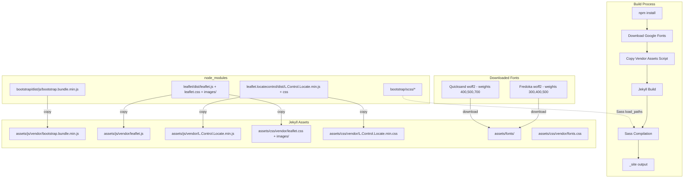

# Design Document: Local Asset Bundling

## Overview

This design describes how to bundle all external CDN dependencies locally within the Paddel Buch Jekyll site: Bootstrap CSS/JS (5.3.2), Leaflet CSS/JS (1.9.4), Leaflet Locate Control CSS/JS (0.79.0), and Google Fonts (Fredoka, Quicksand). The solution uses npm packages for vendor libraries, Node.js scripts for asset copying and font downloading, Jekyll's Sass load paths for Bootstrap SCSS compilation, and updates to the Amplify build pipeline. After implementation, the site makes zero external requests for CSS, JS, or font resources.

## Architecture



## Components and Interfaces

### 1. Package Management (package.json)

Add vendor dependencies to the existing `package.json`:

```json
{
  "dependencies": {
    "bootstrap": "5.3.2",
    "leaflet": "1.9.4",
    "leaflet.locatecontrol": "0.79.0"
  },
  "scripts": {
    "copy-assets": "node scripts/copy-vendor-assets.js",
    "download-fonts": "node scripts/download-google-fonts.js",
    "test": "jest",
    "test:watch": "jest --watch",
    "test:property": "jest --testPathPattern=property"
  }
}
```

Design decision: Bootstrap is added as a full dependency (not devDependency) because its SCSS sources and JS bundle are needed at build time to produce site assets. Leaflet and Leaflet Locate Control are also full dependencies for the same reason.

### 2. Vendor Asset Copy Script (scripts/copy-vendor-assets.js)

A single Node.js script that copies all vendor assets from `node_modules` to Jekyll asset directories:

| Source (node_modules) | Destination (Jekyll assets) |
|---|---|
| `bootstrap/dist/js/bootstrap.bundle.min.js` | `assets/js/vendor/bootstrap.bundle.min.js` |
| `leaflet/dist/leaflet.js` | `assets/js/vendor/leaflet.js` |
| `leaflet/dist/leaflet.css` | `assets/css/vendor/leaflet.css` |
| `leaflet/dist/images/*.png` | `assets/css/vendor/images/*.png` |
| `leaflet.locatecontrol/dist/L.Control.Locate.min.js` | `assets/js/vendor/L.Control.Locate.min.js` |
| `leaflet.locatecontrol/dist/L.Control.Locate.min.css` | `assets/css/vendor/L.Control.Locate.min.css` |

Design decision: Leaflet images are placed in `assets/css/vendor/images/` so that the relative `images/` path references in `leaflet.css` resolve correctly without CSS modification. This avoids fragile URL rewriting.

The script:
- Creates destination directories if they don't exist
- Copies files using `fs.copyFileSync`
- Logs each copied file for build visibility
- Exits with non-zero code on any failure

### 3. Google Fonts Download Script (scripts/download-google-fonts.js)

Node.js script that downloads Google Font files and generates local `@font-face` CSS:

- Downloads Fredoka (weights 300, 400, 500) in woff2 format to `assets/fonts/`
- Downloads Quicksand (weights 400, 500, 700) in woff2 format to `assets/fonts/`
- Generates `assets/css/vendor/fonts.css` with `@font-face` declarations using relative paths to `../../fonts/`
- Uses the Google Fonts CSS API with a woff2 user-agent to get direct woff2 URLs
- Names font files descriptively: `fredoka-300.woff2`, `quicksand-400.woff2`, etc.

Design decision: Fonts are downloaded at build time rather than committed to the repo. This keeps the repo lightweight and makes version updates straightforward. The woff2 format is chosen because it has universal modern browser support and the best compression.

### 4. Jekyll Sass Configuration (_config.yml)

Update the existing sass config to add `node_modules` as a load path:

```yaml
sass:
  sass_dir: _sass
  style: compressed
  load_paths:
    - node_modules
```

This allows `@import "bootstrap/scss/bootstrap"` in SCSS files to resolve from `node_modules/bootstrap/scss/bootstrap`.

### 5. SCSS Import Structure (assets/css/application.scss)

Update the existing entry point to import Bootstrap SCSS before custom styles:

```scss
---
# Front matter required for Jekyll to process this file
---

// Import Bootstrap from node_modules (resolved via load_paths)
@import "bootstrap/scss/bootstrap";

@import "settings/settings";
@import "util/util";
@import "components/components";
@import "pages/pages";

// ... existing styles
```

Design decision: Bootstrap is imported first so that its variables, mixins, and utility classes are available to all subsequent custom SCSS. The existing `_sass/settings/_fonts.scss` already defines `$font-default` and `$font-heading` using Quicksand and Fredoka family names, which will match the locally-served font files.

### 6. Layout Updates (_layouts/default.html)

Replace all CDN references with local asset paths:

| Current CDN Reference | Replacement |
|---|---|
| Google Fonts `<link>` tags (preconnect + CSS) | `<link rel="stylesheet" href="{{ '/assets/css/vendor/fonts.css' \| relative_url }}">` |
| Bootstrap CSS from cdn.jsdelivr.net | Removed (compiled into `application.css` via Sass) |
| Leaflet CSS from unpkg.com | `<link rel="stylesheet" href="{{ '/assets/css/vendor/leaflet.css' \| relative_url }}">` |
| Leaflet Locate Control CSS from cdn.jsdelivr.net | `<link rel="stylesheet" href="{{ '/assets/css/vendor/L.Control.Locate.min.css' \| relative_url }}">` |
| Bootstrap JS from cdn.jsdelivr.net | `<script src="{{ '/assets/js/vendor/bootstrap.bundle.min.js' \| relative_url }}"></script>` |
| Leaflet JS from unpkg.com | `<script src="{{ '/assets/js/vendor/leaflet.js' \| relative_url }}"></script>` |
| Leaflet Locate Control JS from cdn.jsdelivr.net | `<script src="{{ '/assets/js/vendor/L.Control.Locate.min.js' \| relative_url }}"></script>` |

The `integrity` and `crossorigin` attributes are removed since assets are now self-hosted.

### 7. Amplify Build Configuration (deploy/frontend-deploy.yaml)

Update the Amplify app's build spec to run npm and asset scripts before Jekyll:

```yaml
BuildSpec: |
  version: 1
  frontend:
    phases:
      preBuild:
        commands:
          - nvm use 18
          - npm install
          - npm run download-fonts
          - npm run copy-assets
          - bundle install
      build:
        commands:
          - bundle exec jekyll build
    artifacts:
      baseDirectory: _site
      files:
        - '**/*'
    cache:
      paths:
        - node_modules/**/*
        - vendor/**/*
```

Design decision: The `BuildSpec` property is added to the `AWS::Amplify::App` resource in the CloudFormation template. This keeps the build configuration in the same IaC template that defines the Amplify app, rather than requiring a separate `amplify.yml` file in the repo root.

### 8. Content Security Policy Update (deploy/frontend-deploy.yaml)

Update the CSP header in the CloudFormation custom headers to remove CDN domains:

Current CSP allows: `unpkg.com` in `img-src` and `style-src`
Updated CSP: Only `'self'` for styles, scripts, fonts, and images (plus `data:` for inline images used by Leaflet).

```
default-src 'self'; img-src 'self' data: raw.githubusercontent.com api.mapbox.com; style-src 'self' 'unsafe-inline'; script-src 'self' 'unsafe-inline'; font-src 'self' data:
```

## Data Models

No new data models are required. This feature modifies build configuration, asset paths, and deployment settings only. The vendor assets (CSS, JS, fonts, images) are static files copied during the build process.

## Correctness Properties

*A property is a characteristic or behavior that should hold true across all valid executions of a system — essentially, a formal statement about what the system should do. Properties serve as the bridge between human-readable specifications and machine-verifiable correctness guarantees.*

Most acceptance criteria in this feature are example-based (verifying specific files exist, specific config values are set, or specific CDN references are absent). After prework analysis and redundancy reflection, two universal properties emerged:

### Property 1: Vendor CSS path validity

*For any* `url()` reference in any vendor CSS file (Leaflet CSS, Leaflet Locate Control CSS, generated fonts CSS), the referenced path SHALL resolve to an existing file relative to the CSS file's location in the assets directory.

This combines the Leaflet image path requirement (3.5) and the font path requirement (5.5) into a single property: all vendor CSS files must have valid, resolvable asset references.

**Validates: Requirements 3.5, 5.5**

### Property 2: Layout contains no external CDN references

*For any* `href` or `src` attribute value in the built layout HTML, the URL SHALL NOT contain any of the following external domains: `cdn.jsdelivr.net`, `unpkg.com`, `fonts.googleapis.com`, `fonts.gstatic.com`. All CSS, JavaScript, and font asset references SHALL use local relative paths.

This consolidates requirements 8.1–8.5 into a single property: the layout must be entirely free of external CDN dependencies.

**Validates: Requirements 8.1, 8.2, 8.3, 8.4, 8.5**

## Error Handling

| Error Condition | Handling Strategy |
|---|---|
| `npm install` fails (network/registry issue) | Build fails with npm error output in Amplify logs; no partial state |
| Font download fails (Google Fonts API unavailable) | `download-google-fonts.js` exits with non-zero code and descriptive error; build stops before Jekyll |
| Font download returns non-woff2 content | Script validates response content-type; exits with error if unexpected |
| Copy script source file missing (package not installed) | `copy-vendor-assets.js` checks file existence before copy; exits with non-zero code listing missing files |
| Copy script destination directory creation fails | `fs.mkdirSync` with `recursive: true`; script exits with error on permission issues |
| Sass load path misconfigured | Jekyll build fails with clear Sass import error showing the unresolved path |
| Bootstrap SCSS version mismatch | Pinned to exact version `5.3.2` in `package.json`; `npm install` ensures correct version |
| Leaflet images not found at runtime | Browser shows broken image icons for map markers; detectable via visual inspection and Property 1 |
| CSP blocks local resources | Updated CSP allows `'self'`; browser console shows CSP violations if misconfigured |

## Testing Strategy

### Property-Based Testing

Property-based testing library: **fast-check** (already in devDependencies) with **Jest** (already configured).

Each property test runs a minimum of 100 iterations and is tagged with the design property it validates.

Property 1 (Vendor CSS path validity) is tested by:
1. Parsing all vendor CSS files in `assets/css/vendor/`
2. Extracting all `url()` references from the CSS content
3. For each URL, resolving the relative path from the CSS file's directory
4. Asserting the resolved path points to an existing file

Property 2 (Layout CDN-free) is tested by:
1. Parsing the layout HTML file
2. Extracting all `href` and `src` attribute values
3. For each URL, asserting it does not match any banned CDN domain pattern
4. Asserting all asset URLs (CSS/JS/font) use relative paths

### Unit Tests

Unit tests complement property tests for specific examples and edge cases:

- **Copy script tests**: Verify each specific file is copied to the correct destination after running the script
- **Font download tests**: Verify the generated `fonts.css` contains the expected 6 `@font-face` declarations (Fredoka 300/400/500, Quicksand 400/500/700)
- **Config tests**: Verify `_config.yml` contains `load_paths: [node_modules]` in the sass section
- **Layout tests**: Verify specific local asset paths are present in the layout HTML
- **CSP tests**: Verify the CSP header string in the CloudFormation template contains `'self'` and does not contain banned CDN domains
- **Build order tests**: Verify the Amplify build spec runs npm install, download-fonts, copy-assets before Jekyll build

### Manual Verification

After implementation, verify locally:
1. Run `npm install && npm run download-fonts && npm run copy-assets`
2. Run Jekyll build: `source /opt/homebrew/share/chruby/chruby.sh && chruby ruby-3.4.1 && bundle exec jekyll build`
3. Verify `_site/` contains all vendor assets
4. Verify no CDN references in built HTML
5. Visual check: fonts render, map works, navbar toggles, locate button functions
