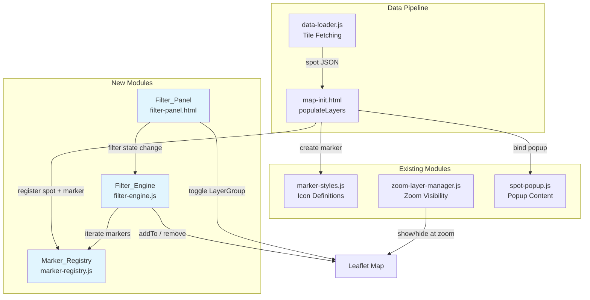

# Design Document: Multi-Dimension Spot Filter

## Overview

This feature replaces the existing Leaflet `L.control.layers` control with a custom Filter_Panel that supports multi-dimensional AND-based spot filtering. The current implementation uses separate `LayerGroup` instances per spot type and toggles entire groups on/off. The new system introduces a Marker_Registry that tracks individual markers with their metadata, a Filter_Engine that evaluates visibility per marker across multiple filter dimensions, and a Filter_Panel UI that renders dimension checkbox groups dynamically from a configuration array.

The key architectural shift is from layer-group-based toggling (add/remove entire groups) to marker-level toggling (add/remove individual markers via `addTo(map)` / `marker.remove()`). Non-spot layers (rejected spots, event notices, obstacles, protected areas) remain as `LayerGroup` instances with independent toggles.

### Design Decisions

1. **Marker-level visibility over LayerGroup toggling**: The existing approach assigns each spot to exactly one LayerGroup by spot type. Multi-dimensional filtering (spot type AND craft type) cannot be expressed with LayerGroups alone because a single marker would need to belong to multiple groups simultaneously. Instead, each marker is stored individually in the Marker_Registry and shown/hidden directly on the map.

2. **Configuration-driven dimensions**: Filter dimensions are defined in a configuration array rather than hard-coded. This allows adding new dimensions (e.g., paddling environment type) by appending an entry to the config without modifying the Filter_Engine or Filter_Panel code.

3. **Rejected spots excluded from multi-dimension filtering**: Rejected spots have a fundamentally different UX intent (hidden by default, opt-in). They remain in their own `LayerGroup` with an independent toggle, never evaluated by the Filter_Engine.

4. **Preserve existing non-spot layer architecture**: Event notices, obstacles, and protected areas continue to use `LayerGroup` instances. The zoom-layer-manager continues to manage obstacle/protected area visibility at zoom thresholds. The Filter_Panel toggles for these layers operate in conjunction with zoom rules.

## Architecture



### Module Responsibilities

| Module | File | Responsibility |
|--------|------|----------------|
| Marker_Registry | `assets/js/marker-registry.js` | Stores spot markers with metadata. Provides iteration and lookup by slug. |
| Filter_Engine | `assets/js/filter-engine.js` | Accepts dimension config array. Evaluates AND-logic across active dimensions. Toggles marker visibility on the map. |
| Filter_Panel | `_includes/filter-panel.html` | Replaces `layer-control.html`. Renders dimension checkbox groups from config. Renders non-spot layer toggles. Emits filter state changes to Filter_Engine. |
| map-init.html | `_includes/map-init.html` | Modified to register spots in Marker_Registry instead of adding to LayerGroups. Calls Filter_Engine on new data. |

### Data Flow

1. `data-loader.js` fetches tile JSON → returns spot arrays
2. `map-init.html` `populateLayers()` creates a Leaflet marker per spot, registers it in `Marker_Registry` with metadata
3. `Filter_Engine.evaluateMarker()` checks the new marker against current `Filter_State` and calls `addTo(map)` or skips
4. User toggles a checkbox in `Filter_Panel` → `Filter_Panel` updates `Filter_State` → calls `Filter_Engine.applyFilters()` → iterates all markers in `Marker_Registry`, calling `addTo(map)` or `marker.remove()` per marker

## Components and Interfaces

### Marker_Registry (`assets/js/marker-registry.js`)

```javascript
window.PaddelbuchMarkerRegistry = {
  /**
   * Register a spot marker with its metadata.
   * No-op if slug already registered (deduplication).
   * @param {string} slug - Unique spot identifier
   * @param {L.Marker} marker - Leaflet marker instance
   * @param {Object} metadata - { spotType_slug, paddleCraftTypes, paddlingEnvironmentType_slug }
   */
  register: function(slug, marker, metadata) {},

  /**
   * Check if a slug is already registered.
   * @param {string} slug
   * @returns {boolean}
   */
  has: function(slug) {},

  /**
   * Iterate over all registered entries.
   * @param {Function} callback - function(slug, marker, metadata)
   */
  forEach: function(callback) {},

  /**
   * Get the count of registered markers.
   * @returns {number}
   */
  size: function() {}
};
```

### Filter_Engine (`assets/js/filter-engine.js`)

```javascript
window.PaddelbuchFilterEngine = {
  /**
   * Initialize with dimension configuration and map reference.
   * @param {Array} dimensionConfigs - Array of dimension config objects
   * @param {L.Map} map - Leaflet map instance
   */
  init: function(dimensionConfigs, map) {},

  /**
   * Get the current filter state.
   * @returns {Object} - { dimensionKey: Set of selected slugs, ... }
   */
  getFilterState: function() {},

  /**
   * Update selected options for a dimension.
   * @param {string} dimensionKey - e.g. 'spotType', 'paddleCraftType'
   * @param {string} optionSlug - The slug being toggled
   * @param {boolean} selected - Whether the option is now selected
   */
  setOption: function(dimensionKey, optionSlug, selected) {},

  /**
   * Re-evaluate visibility for all markers in the registry.
   * Calls addTo(map) or marker.remove() per marker.
   */
  applyFilters: function() {},

  /**
   * Evaluate a single marker against current filter state.
   * @param {Object} metadata - Spot metadata from registry
   * @returns {boolean} - true if marker should be visible
   */
  evaluateMarker: function(metadata) {}
};
```

#### Dimension Configuration Object

```javascript
{
  key: 'spotType',                    // Unique dimension identifier
  label: 'Spot Type',                 // Display label (localized)
  options: [                          // Available filter options
    { slug: 'einstieg-ausstieg', label: 'Ein-/Ausstiegsorte' },
    // ...
  ],
  matchFn: function(metadata, selectedSlugs) {
    // Returns true if spot passes this dimension
    return selectedSlugs.has(metadata.spotType_slug);
  }
}
```

### Filter_Panel (`_includes/filter-panel.html`)

The Filter_Panel is a Leaflet custom control (`L.Control.extend`) positioned at `topleft`. It renders:

1. A collapsible container with a toggle button
2. Spot filter section: one `<fieldset>` per dimension, each containing checkboxes generated from the dimension config
3. Layer toggle section: independent checkboxes for rejected spots, event notices, obstacles, protected areas

```javascript
window.PaddelbuchFilterPanel = {
  /**
   * Create and add the filter panel control to the map.
   * @param {L.Map} map
   * @param {Array} dimensionConfigs - Dimension configuration array
   * @param {Object} layerToggles - { key, label, layerGroup, defaultChecked }[]
   */
  init: function(map, dimensionConfigs, layerToggles) {}
};
```

### Integration Changes to `map-init.html`

The `populateLayers` function changes from adding spots to LayerGroups to:

1. Creating a marker (same as today)
2. Registering it in `PaddelbuchMarkerRegistry` with metadata
3. Calling `PaddelbuchFilterEngine.evaluateMarker()` to decide initial visibility

Non-spot data (notices, obstacles, protected areas) continues to use LayerGroups as today.

## Data Models

### Filter_State

```javascript
// Internal state managed by Filter_Engine
{
  spotType: Set(['einstieg-ausstieg', 'nur-einstieg', ...]),      // selected slugs
  paddleCraftType: Set(['seekajak', 'kanadier', 'stand-up-paddle-board'])
}
```

When a dimension's Set is empty, that dimension is treated as inactive (all spots pass).

### Marker_Registry Entry

```javascript
// Internal storage per registered spot
{
  slug: 'bootsrampe-hafen-yverdon',
  marker: L.Marker,          // Leaflet marker instance
  metadata: {
    spotType_slug: 'einstieg-ausstieg',
    paddleCraftTypes: ['stand-up-paddle-board', 'kanadier', 'seekajak'],
    paddlingEnvironmentType_slug: 'see'   // stored for future use
  }
}
```

### Dimension Configuration (built at init time from Jekyll data)

```javascript
[
  {
    key: 'spotType',
    label: '{{ localized_spot_type_label }}',
    options: [
      { slug: 'einstieg-ausstieg', label: '{{ localized }}' },
      { slug: 'nur-einstieg', label: '{{ localized }}' },
      { slug: 'nur-ausstieg', label: '{{ localized }}' },
      { slug: 'rasthalte', label: '{{ localized }}' },
      { slug: 'notauswasserungsstelle', label: '{{ localized }}' }
    ],
    matchFn: function(meta, selected) {
      return selected.has(meta.spotType_slug);
    }
  },
  {
    key: 'paddleCraftType',
    label: '{{ localized_craft_type_label }}',
    options: [
      { slug: 'seekajak', label: '{{ localized }}' },
      { slug: 'kanadier', label: '{{ localized }}' },
      { slug: 'stand-up-paddle-board', label: '{{ localized }}' }
    ],
    matchFn: function(meta, selected) {
      // Spot passes if its paddleCraftTypes array intersects with selected set
      var types = meta.paddleCraftTypes || [];
      for (var i = 0; i < types.length; i++) {
        if (selected.has(types[i])) return true;
      }
      return false;
    }
  }
]
```


## Correctness Properties

*A property is a characteristic or behavior that should hold true across all valid executions of a system — essentially, a formal statement about what the system should do. Properties serve as the bridge between human-readable specifications and machine-verifiable correctness guarantees.*

### Property 1: AND-logic evaluation across active dimensions

*For any* set of spot metadata and *for any* filter state (with any number of dimensions, each having zero or more selected options), `evaluateMarker(metadata)` shall return `true` if and only if the spot satisfies every dimension that has at least one option selected. A dimension with no options selected (empty set) shall be treated as inactive and shall not affect the result.

**Validates: Requirements 1.2, 1.5**

### Property 2: Spot type match function

*For any* spot with a `spotType_slug` value and *for any* set of selected spot type slugs, the spot type match function shall return `true` if and only if the spot's `spotType_slug` is a member of the selected set.

**Validates: Requirements 2.5**

### Property 3: Paddle craft type match function — set intersection

*For any* spot with a `paddleCraftTypes` array and *for any* set of selected paddle craft type slugs, the paddle craft type match function shall return `true` if and only if the intersection of the spot's `paddleCraftTypes` array and the selected set is non-empty.

**Validates: Requirements 3.5**

### Property 4: Marker registry round-trip

*For any* spot slug, Leaflet marker, and metadata object (containing `spotType_slug`, `paddleCraftTypes`, and `paddlingEnvironmentType_slug`), after calling `register(slug, marker, metadata)`, iterating with `forEach` shall yield an entry with the same slug, marker reference, and metadata values.

**Validates: Requirements 4.1, 4.2, 4.4**

### Property 5: Marker registry deduplication

*For any* sequence of `register` calls where some slugs appear more than once, `size()` shall equal the number of unique slugs in the sequence, and `forEach` shall visit each unique slug exactly once.

**Validates: Requirements 4.3, 9.3**

### Property 6: Rejected spots excluded from filter evaluation

*For any* spot where `rejected` equals `true`, the spot shall not be registered in the Marker_Registry and shall not be evaluated by the Filter_Engine. Rejected spots shall only be managed via the noEntry LayerGroup toggle.

**Validates: Requirements 6.1**

### Property 7: Filter engine does not alter non-spot layers

*For any* filter state change and subsequent call to `applyFilters()`, the visibility state of non-spot LayerGroups (event notices, obstacles, protected areas) on the map shall remain unchanged.

**Validates: Requirements 7.4**

### Property 8: Filter panel renders checkbox groups from configuration

*For any* valid dimension configuration array with N dimensions, the Filter_Panel shall render exactly N `<fieldset>` elements in the spot filter section, each containing a number of checkboxes equal to the number of options in that dimension's configuration.

**Validates: Requirements 8.3**

## Error Handling

| Scenario | Handling |
|----------|----------|
| Spot missing `spotType_slug` | Skip registration in Marker_Registry; log warning. Marker is not created. |
| Spot missing `paddleCraftTypes` | Register with empty array `[]`. The craft type dimension match function treats missing/empty arrays as not matching any selected craft type. |
| Spot missing `location` | Skip marker creation entirely (existing behavior preserved). |
| Duplicate slug registration | `Marker_Registry.register()` silently ignores the duplicate (no-op). |
| Empty dimension config array | Filter_Engine treats all dimensions as inactive; all registered spots are visible. |
| Dimension `matchFn` throws | Catch exception, treat dimension as not matched for that spot, log warning. This prevents a single bad match function from breaking all filtering. |
| Filter_Panel init before map ready | Retry with `setTimeout` polling (same pattern as existing `layer-control.html`). |
| `paddleCraftTypes` is not an array | Coerce to empty array before match evaluation. |

## Testing Strategy

### Property-Based Testing

Property-based tests use [fast-check](https://github.com/dubzzz/fast-check) (JavaScript PBT library). Each property test runs a minimum of 100 iterations with randomly generated inputs.

Each test is tagged with a comment referencing the design property:
```
// Feature: multi-dimension-spot-filter, Property N: <property title>
```

| Property | Test Description | Generator Strategy |
|----------|------------------|--------------------|
| Property 1 | Generate random metadata objects and random filter states with 1–5 dimensions, each with 0–10 selected slugs. Assert `evaluateMarker` result matches manual AND-logic check. | `fc.record` for metadata, `fc.array(fc.string())` for selected sets |
| Property 2 | Generate random `spotType_slug` and random set of selected slugs. Assert match function returns `selectedSet.has(slug)`. | `fc.string()` for slug, `fc.uniqueArray(fc.string())` for set |
| Property 3 | Generate random `paddleCraftTypes` array and random selected set. Assert match returns true iff intersection is non-empty. | `fc.array(fc.string())` for both |
| Property 4 | Generate random slug, mock marker, and metadata. Register, then forEach and verify the entry exists with correct values. | `fc.string()` for slug, `fc.record` for metadata |
| Property 5 | Generate a sequence of (slug, marker, metadata) tuples with intentional slug duplicates. Register all, assert `size()` equals unique slug count. | `fc.array(fc.tuple(...))` with constrained slug pool |
| Property 6 | Generate spots with `rejected: true`. Verify they are not registered in Marker_Registry after the data pipeline processes them. | `fc.record` with `rejected: fc.constant(true)` |
| Property 7 | Set up mock map with non-spot LayerGroups. Call `applyFilters()` with various filter states. Assert non-spot LayerGroup add/remove was never called. | Mock LayerGroups with call tracking |
| Property 8 | Generate random dimension config arrays with 1–5 dimensions, each with 1–8 options. Init Filter_Panel, count rendered fieldsets and checkboxes. | `fc.array(fc.record(...))` for configs |

### Unit Tests

Unit tests complement property tests by covering specific examples, edge cases, and integration points:

- Default filter state: all spot types and all craft types selected on page load
- Toggling a single spot type hides only spots of that type
- Toggling a single craft type hides spots that don't support that craft type
- AND-logic: unchecking "seekajak" in craft type AND "rasthalte" in spot type hides rest spots that only support seekajak
- Empty dimension edge case: unchecking all options in one dimension makes that dimension inactive
- Rejected spot toggle: toggling adds/removes noEntry LayerGroup independently
- Non-spot layer toggles: each toggle adds/removes its LayerGroup
- Popup open collapses the filter panel
- Zoom-layer-manager continues to hide obstacles/protected areas below zoom 12 even when their toggles are checked
- New spots from tile loading are immediately filtered against current state
- Deduplication: loading the same tile twice doesn't create duplicate markers
