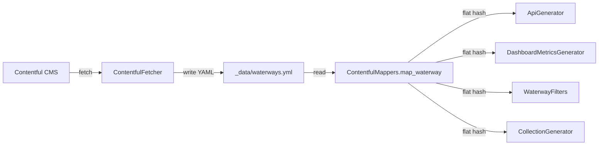

# Design Document: navigable-by-paddlers

## Overview

This feature integrates the Contentful `navigableByPaddlers` boolean field into the Paddelbuch Jekyll build pipeline. The field is a tri-state value (`true`, `false`, or `nil`) on waterway entries. Waterways explicitly marked as not navigable (`false`) are excluded from dashboards, listing pages, and detail page generation, while `true` and `nil` (unset) waterways continue to appear everywhere. The field is always included in the API JSON output regardless of its value.

The change touches five existing Ruby components in `_plugins/`:

1. `ContentfulMappers.map_waterway` — extracts the field from Contentful
2. `Jekyll::ApiGenerator` — includes the field in JSON output
3. `Jekyll::DashboardMetricsGenerator` — filters non-navigable waterways from metrics
4. `Jekyll::WaterwayFilters` — filters non-navigable waterways from listing pages
5. `Jekyll::CollectionGenerator` — skips detail page generation for non-navigable waterways

The design follows the existing patterns in each component: the mapper adds a new key to the flat hash, the API generator passes it through in `transform_waterway`, the dashboard generator adds a reject clause alongside the existing wildwasser filter, the filters add a reject clause to each method's select chain, and the collection generator skips entries during document creation.

## Architecture

The existing data flow is a linear pipeline:



The `navigableByPaddlers` field flows through this pipeline as a new key in the waterway hash. No new components or architectural changes are needed — each existing component gains a small filtering or pass-through addition.

### Filtering logic

The filtering rule is consistent across all consumers:

- `navigableByPaddlers == false` → exclude
- `navigableByPaddlers == true` → include
- `navigableByPaddlers == nil` → include (backwards-compatible default)

This means the filter condition is simply: `waterway['navigableByPaddlers'] != false`

The API generator is the exception — it outputs all waterways regardless of the field value.

## Components and Interfaces

### 1. ContentfulMappers.map_waterway

**Current signature:** `map_waterway(entry, fields, locale, *_extra) → Hash`

**Change:** Add one line to the returned hash:

```ruby
'navigableByPaddlers' => resolve_field(fields, :navigable_by_paddlers, locale)
```

The `resolve_field` helper already handles `nil` (unset) fields by returning `nil`, and boolean values pass through unchanged. No default value coercion (like `|| false`) is applied — the field must preserve the tri-state (`true` / `false` / `nil`).

### 2. Jekyll::ApiGenerator — transform_waterway

**Current signature:** `transform_waterway(item) → Hash` (private)

**Change:** Add one line to the result hash:

```ruby
result['navigableByPaddlers'] = item['navigableByPaddlers']
```

This passes through `true`, `false`, or `nil` directly. Ruby's `JSON.generate` serializes `nil` as `null`, which satisfies Requirement 2.4.

### 3. Jekyll::DashboardMetricsGenerator

**Current location:** Inside `generate(site)`, after the wildwasser exclusion filter.

**Change:** Add a second reject clause:

```ruby
unique_waterways = unique_waterways.reject { |w| w['navigableByPaddlers'] == false }
```

This is placed immediately after the existing wildwasser filter. Both freshness and coverage metrics use the same `unique_waterways` array, so a single filter point covers both dashboards.

### 4. Jekyll::WaterwayFilters

**Change:** Add `w['navigableByPaddlers'] != false` to the `.select` chain in all four public methods:

- `top_lakes_by_area` — add to existing select
- `top_rivers_by_length` — add to existing select
- `lakes_alphabetically` — add to existing select
- `rivers_alphabetically` — add to existing select

Example for `lakes_alphabetically`:

```ruby
def lakes_alphabetically(waterways, locale)
  return [] if waterways.nil? || waterways.empty?
  waterways
    .select { |w| w['locale'] == locale && w['paddlingEnvironmentType_slug'] == 'see' && w['navigableByPaddlers'] != false }
    .sort_by { |w| w['name'].to_s.downcase }
end
```

### 5. Jekyll::CollectionGenerator

**Current location:** Inside `generate(site)`, in the `COLLECTIONS.each` loop, within the `locale_entries.each` block.

**Change:** Add a skip condition for waterway entries:

```ruby
locale_entries.each do |entry|
  slug = entry['slug']
  next unless slug && !slug.empty?
  next if collection_name == 'waterways' && entry['navigableByPaddlers'] == false

  doc = create_document(site, collection, entry, slug, config[:page_name], current_locale)
  collection.docs << doc
end
```

This only applies to the `waterways` collection — other collections (spots, obstacles, notices, static_pages) are unaffected.

## Data Models

### Waterway hash (after mapping)

The waterway hash gains one new key. All other keys remain unchanged.

| Key | Type | Source | Description |
|-----|------|--------|-------------|
| `navigableByPaddlers` | `Boolean` or `NilClass` | Contentful field `navigable_by_paddlers` | `true` = navigable, `false` = not navigable, `nil` = unset |

### API JSON output (waterways-{locale}.json)

Each waterway object gains one new field:

```json
{
  "slug": "thunersee",
  "navigableByPaddlers": true,
  ...
}
```

When the field is unset in Contentful, the JSON output is:

```json
{
  "slug": "some-canal",
  "navigableByPaddlers": null,
  ...
}
```

### YAML data file (_data/waterways.yml)

The YAML file gains the `navigableByPaddlers` key per waterway entry. The ContentfulFetcher writes whatever the mapper returns, so no changes to the fetcher are needed — the mapper change propagates automatically.


## Correctness Properties

*A property is a characteristic or behavior that should hold true across all valid executions of a system — essentially, a formal statement about what the system should do. Properties serve as the bridge between human-readable specifications and machine-verifiable correctness guarantees.*

### Property 1: Mapper tri-state preservation

*For any* Contentful waterway entry with `navigable_by_paddlers` set to `true`, `false`, or unset (`nil`), the hash returned by `ContentfulMappers.map_waterway` shall contain a `navigableByPaddlers` key whose value is identical to the input field value.

**Validates: Requirements 1.1, 1.2, 1.3, 1.4**

### Property 2: API transformer tri-state pass-through

*For any* waterway hash containing a `navigableByPaddlers` key with value `true`, `false`, or `nil`, the hash returned by `ApiGenerator#transform_waterway` shall contain a `navigableByPaddlers` key with the same value.

**Validates: Requirements 2.1, 2.2, 2.3, 2.4**

### Property 3: Dashboard metrics non-navigable exclusion

*For any* set of waterways with mixed `navigableByPaddlers` values (`true`, `false`, `nil`), the freshness and coverage metrics produced by `DashboardMetricsGenerator` shall contain no waterway whose `navigableByPaddlers` value is `false`, and shall contain every non-wildwasser waterway whose `navigableByPaddlers` value is `true` or `nil` (and has valid geometry).

**Validates: Requirements 3.1, 3.2, 3.3, 4.1, 4.2, 4.3**

### Property 4: WaterwayFilters non-navigable exclusion

*For any* array of waterway hashes with mixed `navigableByPaddlers` values, all four WaterwayFilters methods (`rivers_alphabetically`, `lakes_alphabetically`, `top_lakes_by_area`, `top_rivers_by_length`) shall return no waterway where `navigableByPaddlers` equals `false`, and shall include every waterway where `navigableByPaddlers` is `true` or `nil` that matches the method's other selection criteria (locale, type, showInMenu).

**Validates: Requirements 5.1, 5.2, 5.3, 5.4, 5.5, 5.6**

### Property 5: CollectionGenerator non-navigable exclusion

*For any* set of waterway data entries with mixed `navigableByPaddlers` values, the `CollectionGenerator` shall produce no document for a waterway where `navigableByPaddlers` equals `false`, and shall produce a document for every waterway where `navigableByPaddlers` is `true` or `nil`.

**Validates: Requirements 6.1, 6.2, 6.3**

## Error Handling

This feature introduces no new error conditions. The `navigableByPaddlers` field is a simple boolean/nil value with no parsing, validation, or external dependencies beyond what already exists.

Specific considerations:

- **Missing field in Contentful:** `resolve_field` returns `nil` when the field is absent. This is the desired behavior — `nil` means "include the waterway" (backwards-compatible).
- **Unexpected field type:** If Contentful somehow returns a non-boolean value (e.g., a string), the `== false` comparison will not match, so the waterway will be included. This is a safe default.
- **Existing waterways without the field:** All existing waterways that don't have the field set will have `navigableByPaddlers: nil` after mapping. They will continue to appear in all outputs, preserving current behavior.

## Testing Strategy

### Dual Testing Approach

Both unit tests and property-based tests are required for comprehensive coverage.

**Unit tests** (RSpec examples) cover:
- Specific examples for each tri-state value (`true`, `false`, `nil`) in each component
- Edge cases: empty waterway arrays, waterways with only non-navigable entries
- Integration between mapper output and downstream consumers

**Property-based tests** (RSpec + Rantly) cover:
- Universal properties across randomly generated waterway data with mixed `navigableByPaddlers` values
- Each correctness property (1–5) is implemented as a single property-based test

### Property-Based Testing Configuration

- Library: **Rantly** (already in Gemfile, used by existing property specs)
- Minimum iterations: **100** per property test
- Each test is tagged with a comment referencing the design property:
  - Format: `Feature: navigable-by-paddlers, Property {number}: {property_text}`

### Test File Locations

Tests follow the existing project conventions:

| Property | Test File | Description |
|----------|-----------|-------------|
| Property 1 | `spec/contentful_mappers_spec.rb` | New examples + property test in the existing `map_waterway` describe block |
| Property 2 | `spec/plugins/api_generator_spec.rb` | New property test for `transform_waterway` pass-through |
| Property 3 | `spec/plugins/dashboard_metrics_generator_property_spec.rb` | New property test for non-navigable exclusion |
| Property 4 | `spec/plugins/waterway_filters_spec.rb` | New property test covering all four filter methods |
| Property 5 | `spec/collection_generator_spec.rb` | New property test for document generation filtering |
