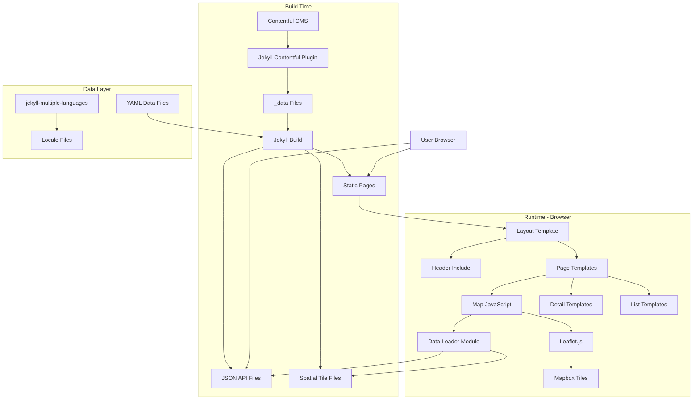
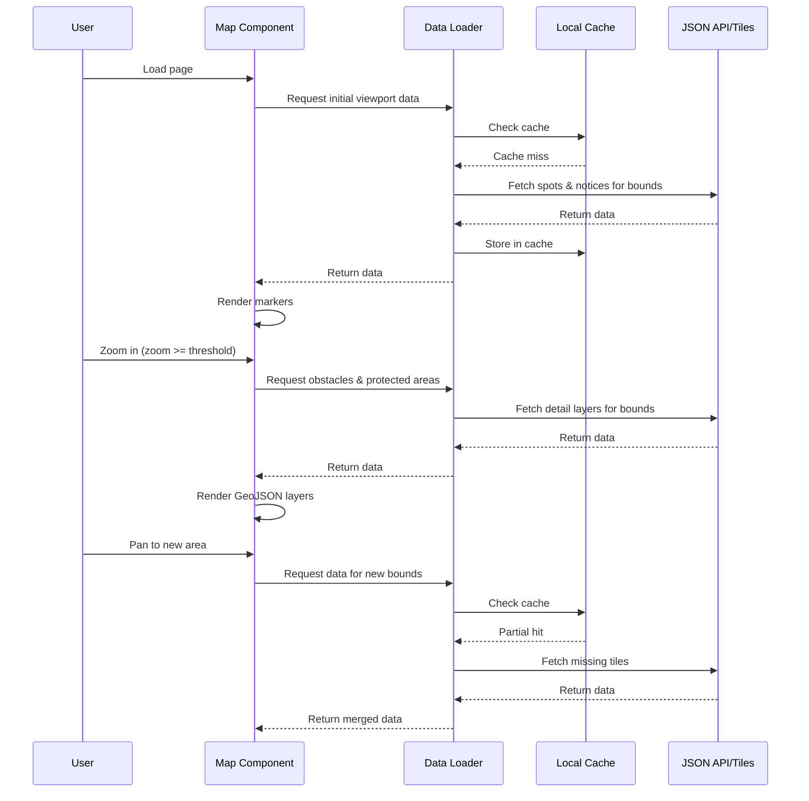
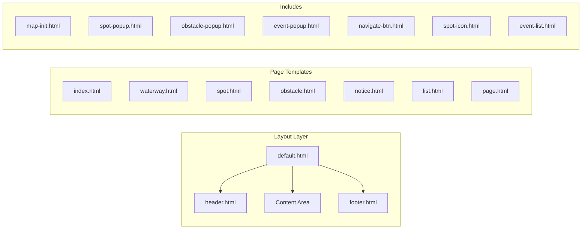
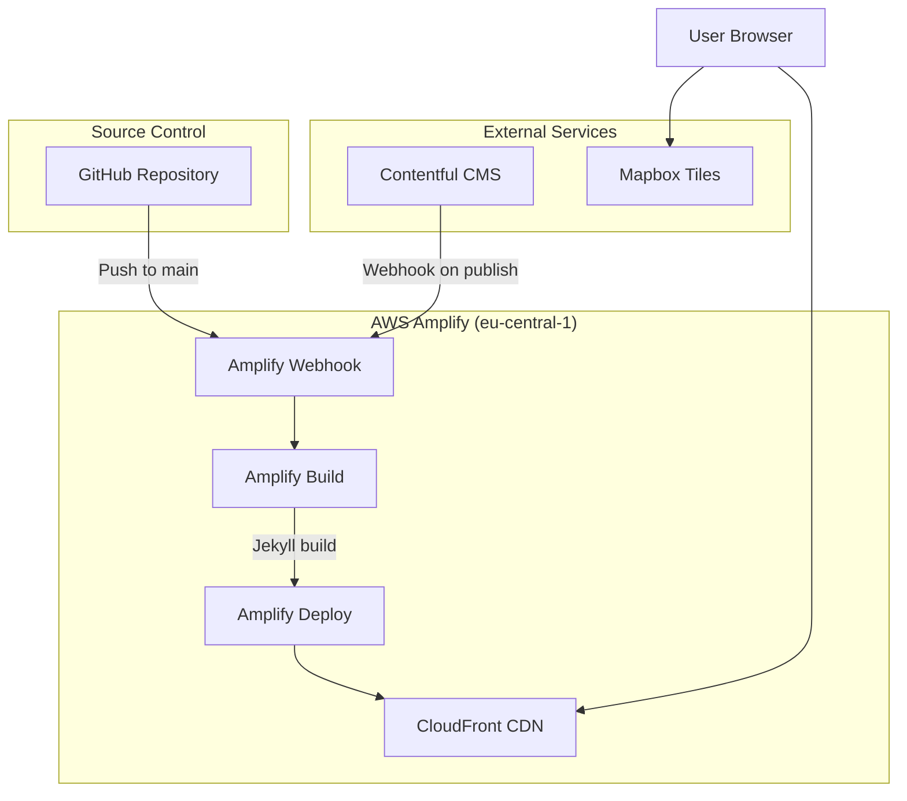

# Design Document

## Overview

Paddel Buch is a Jekyll-based static site that provides an interactive map interface for Swiss paddle sports enthusiasts. The application fetches data from Contentful CMS at build time using a custom data plugin and generates static pages with embedded map functionality using Leaflet.js. The system supports bilingual content (German/English) and exposes data through a JSON API. Map data is loaded dynamically based on viewport and zoom level to optimize performance.

### Key Design Decisions

1. **Static Site Generation (SSG)**: Using Jekyll for build-time data fetching and static page generation ensures fast load times and SEO optimization
2. **Headless CMS**: Contentful provides a flexible content management system with built-in localization support
3. **Client-Side Mapping**: Leaflet.js with Mapbox tiles provides interactive mapping without server-side dependencies
4. **Collection-Based Routing**: Jekyll's collections with permalink configuration enables human-readable URLs
5. **JSON API**: Build-time generation of JSON files provides a simple, cacheable API without runtime infrastructure
6. **Dynamic Data Loading**: Map data is loaded on-demand based on viewport bounds and zoom level to improve initial page load performance and reduce memory usage
7. **Spatial Indexing**: Data is organized into spatial tiles to enable efficient viewport-based queries
8. **AWS Amplify Hosting**: Site is built and deployed using AWS Amplify in the eu-central-1 region for reliable, scalable hosting with CI/CD

## Architecture



### Dynamic Data Loading Architecture

The map implements a lazy loading strategy to optimize performance:



### Spatial Tiling Strategy

Data is organized into spatial tiles at build time for efficient viewport-based loading:

- **Tile Grid**: Switzerland is divided into a grid of tiles (approximately 10km x 10km each)
- **Tile Naming**: `/api/tiles/{layer}/{z}/{x}/{y}.json` where z is zoom level, x/y are tile coordinates
- **Layer Types**:
  - `spots`: All spot types (loaded at all zoom levels)
  - `notices`: Event notices (loaded at all zoom levels)
  - `obstacles`: Obstacles and portage routes (loaded at zoom >= 12)
  - `protected`: Protected areas (loaded at zoom >= 12)

### Zoom-Based Layer Visibility

| Layer | Min Zoom | Load Strategy |
|-------|----------|---------------|
| Spots (all types) | 0 | Viewport-based, on-demand |
| Event Notices | 0 | Viewport-based, on-demand |
| Obstacles | 12 | Viewport-based, on-demand when zoom threshold reached |
| Protected Areas | 12 | Viewport-based, on-demand when zoom threshold reached |
| Portage Routes | 12 | Loaded with obstacles |

### Template Architecture



## Components and Interfaces

### Core Templates

#### Default Layout (`_layouts/default.html`)
- **Purpose**: Provides consistent page structure with header, content area, and footer
- **Variables**: `page.title`, `page.lang`, `page.pageName`
- **Responsibilities**: 
  - Sets HTML lang attribute based on current language
  - Includes meta tags for SEO
  - Renders header include
  - Wraps content in Bootstrap grid
  - Includes JavaScript dependencies (Leaflet, Bootstrap)

#### Header Include (`_includes/header.html`)
- **Purpose**: Site navigation with responsive menu
- **Data Sources**: `site.data.waterways`, `site.data.static_pages`
- **Responsibilities**:
  - Renders logo and brand
  - Renders navigation dropdowns (Lakes, Rivers, Open Data, About)
  - Filters waterways by `showInMenu` flag and environment type
  - Renders language switcher
  - Handles responsive collapse behavior via Bootstrap

#### Map Initialization (`_includes/map-init.html`)
- **Purpose**: Initialize Leaflet map with all data layers
- **Parameters**: `center`, `bounds`, `zoom`
- **Data Sources**: `site.data.spots`, `site.data.obstacles`, `site.data.protected_areas`, `site.data.event_notices`
- **Responsibilities**:
  - Creates Leaflet map instance with Mapbox tiles
  - Creates layer groups for each spot type
  - Renders GeoJSON layers for obstacles, protected areas, event areas
  - Provides layer control for toggling visibility
  - Creates marker icons based on spot type
  - Filters data by current language

### Popup Includes

#### Spot Popup (`_includes/spot-popup.html`)
- **Variables**: `spot.name`, `spot.location`, `spot.description`, `spot.slug`, `spot.approximateAddress`, `spot.spotType`, `spot.paddleCraftType`
- **Renders**: Spot icon, name, description excerpt, GPS, address, copy buttons, navigation button, details link

#### Obstacle Popup (`_includes/obstacle-popup.html`)
- **Variables**: `obstacle.name`, `obstacle.isPortagePossible`, `obstacle.slug`
- **Renders**: Name, portage status, details link

#### Event Notice Popup (`_includes/event-popup.html`)
- **Variables**: `notice.name`, `notice.location`, `notice.description`, `notice.slug`, `notice.startDate`, `notice.endDate`
- **Renders**: Name, description excerpt, dates, details link

#### Rejected Spot Popup (`_includes/rejected-popup.html`)
- **Variables**: `spot.name`, `spot.description`, `spot.slug`
- **Renders**: Name, rejection reason

### Page Templates

#### Index Page (`index.html`)
- **Purpose**: Home page with full-screen map
- **Map Settings**: Centered on Switzerland (46.801111, 8.226667), bounded to Swiss territory
- **Layout**: Full-width map

#### Waterway Detail (`_layouts/waterway.html`)
- **Purpose**: Display waterway details with bounded map
- **Data**: Waterway geometry, associated event notices
- **Layout**: Map (8 cols) + Details panel (4 cols)
- **Collection**: `_waterways/`

#### Spot Detail (`_layouts/spot.html`)
- **Purpose**: Display spot details with centered map
- **Data**: Full spot information including paddle craft types
- **Special Handling**: Rejected spots show rejection reason
- **Collection**: `_spots/`

#### Obstacle Detail (`_layouts/obstacle.html`)
- **Purpose**: Display obstacle details with portage information
- **Data**: Obstacle geometry, portage route, associated spots
- **Collection**: `_obstacles/`

#### Event Notice Detail (`_layouts/notice.html`)
- **Purpose**: Display event notice details
- **Data**: Affected area geometry, dates, description
- **Collection**: `_notices/`

### Utility Includes

#### Navigate Button (`_includes/navigate-btn.html`)
- **Variables**: `lat`, `lon`
- **Purpose**: Opens external navigation to coordinates

#### Spot Icon (`_includes/spot-icon.html`)
- **Variables**: `type`, `variant` (light/dark)
- **Purpose**: Renders appropriate SVG icon based on spot type

#### Event Notice List (`_includes/event-list.html`)
- **Variables**: `waterway_slug`
- **Purpose**: Renders list of active event notices for a waterway

### JavaScript Modules

#### Map Module (`assets/js/map.js`)
- Initializes Leaflet map
- Manages layer groups and controls
- Handles marker creation with appropriate icons
- Renders GeoJSON layers with styling
- Listens for `moveend` and `zoomend` events to trigger data loading
- Manages zoom-based layer visibility

#### Data Loader Module (`assets/js/data-loader.js`)
- **Purpose**: Manages dynamic loading of map data based on viewport and zoom level
- **Key Functions**:
  - `loadDataForBounds(bounds, zoom, locale)`: Fetches data for the current viewport
  - `getTilesForBounds(bounds)`: Calculates which spatial tiles intersect the viewport
  - `fetchTile(layer, z, x, y)`: Fetches a single tile from the API
  - `mergeData(existing, new)`: Merges newly loaded data with existing data
  - `shouldLoadLayer(layer, zoom)`: Determines if a layer should be loaded at current zoom
- **Caching Strategy**:
  - Maintains an in-memory cache of loaded tiles
  - Cache key: `{layer}-{z}-{x}-{y}-{locale}`
  - Prevents duplicate fetches for already-loaded tiles
- **Debouncing**: Viewport change events are debounced (300ms) to prevent excessive API calls during rapid pan/zoom

#### Spatial Utils Module (`assets/js/spatial-utils.js`)
- **Purpose**: Utility functions for spatial calculations
- **Key Functions**:
  - `boundsToTileCoords(bounds, zoom)`: Converts Leaflet bounds to tile coordinates
  - `tileCoordsToBounds(x, y, zoom)`: Converts tile coordinates back to bounds
  - `pointInBounds(point, bounds)`: Checks if a point is within bounds
  - `expandBounds(bounds, factor)`: Expands bounds by a factor for pre-loading

#### Marker Styles (`assets/js/marker-styles.js`)
- Defines Leaflet icon configurations for each spot type
- Icon types: Entry/Exit, Entry Only, Exit Only, Rest, Emergency, No Entry, Event Notice

#### Layer Styles (`assets/js/layer-styles.js`)
- Defines GeoJSON styling for map layers
- Styles: Lake, Protected Area, Obstacle, Portage Route, Event Notice Area

#### Clipboard Module (`assets/js/clipboard.js`)
- Handles copy-to-clipboard functionality for GPS coordinates and addresses

## Data Models

### Contentful Content Types (mapped to Jekyll Data)

Data is fetched from Contentful at build time and stored in `_data/` directory as YAML files.

#### Spot (`_data/spots_de.yml`, `_data/spots_en.yml`)
```yaml
- slug: string
  locale: 'en' | 'de'
  name: string
  description: string (HTML)
  location:
    lat: number
    lon: number
  approximateAddress: string
  country: string
  confirmed: boolean
  rejected: boolean
  waterway_slug: string
  spotType_slug: string
  paddlingEnvironmentType_slug: string
  paddleCraftTypes: string[] (slugs)
  eventNotices: string[] (slugs)
  obstacles: string[] (slugs)
  dataSourceType_slug: string
  dataLicenseType_slug: string
  createdAt: string
  updatedAt: string
```

#### Waterway (`_data/waterways_de.yml`, `_data/waterways_en.yml`)
```yaml
- slug: string
  locale: 'en' | 'de'
  name: string
  length: number
  area: number
  geometry: string (GeoJSON)
  showInMenu: boolean
  paddlingEnvironmentType_slug: string
  dataSourceType_slug: string
  dataLicenseType_slug: string
  createdAt: string
  updatedAt: string
```

#### Obstacle (`_data/obstacles_de.yml`, `_data/obstacles_en.yml`)
```yaml
- slug: string
  locale: 'en' | 'de'
  name: string
  description: string (HTML)
  geometry: string (GeoJSON)
  portageRoute: string (GeoJSON) | null
  portageDistance: number
  portageDescription: string (HTML)
  isPortageNecessary: boolean
  isPortagePossible: boolean
  obstacleType_slug: string
  waterway_slug: string
  spots: string[] (slugs)
  createdAt: string
  updatedAt: string
```

#### WaterwayEventNotice (`_data/notices_de.yml`, `_data/notices_en.yml`)
```yaml
- slug: string
  locale: 'en' | 'de'
  name: string
  description: string (HTML)
  location:
    lat: number
    lon: number
  affectedArea: string (GeoJSON)
  startDate: string
  endDate: string
  waterways: string[] (slugs)
  createdAt: string
  updatedAt: string
```

#### ProtectedArea (`_data/protected_areas_de.yml`, `_data/protected_areas_en.yml`)
```yaml
- slug: string
  locale: 'en' | 'de'
  name: string
  geometry: string (GeoJSON)
  protectedAreaType_slug: string
  isAreaMarked: boolean
  createdAt: string
  updatedAt: string
```

### Dimension Types (`_data/types/`)

```yaml
# spot_types.yml
- slug: 'einstieg-ausstieg' | 'nur-einstieg' | 'nur-ausstieg' | 'rasthalte' | 'notauswasserungsstelle'
  name_de: string
  name_en: string

# paddling_environment_types.yml
- slug: 'see' | 'fluss'
  name_de: string
  name_en: string

# obstacle_types.yml, protected_area_types.yml, paddle_craft_types.yml, etc.
- slug: string
  name_de: string
  name_en: string
```

### API Output Schema

JSON API files are generated during build and placed in `/api/` directory:
- **Full Dataset Files**: Complete data exports for each entity type (for data consumers who want all data)
  - `/api/spots-{locale}.json`: All spots
  - `/api/obstacles-{locale}.json`: All obstacles
  - `/api/notices-{locale}.json`: All event notices
  - `/api/protected-areas-{locale}.json`: All protected areas
  - `/api/waterways-{locale}.json`: All waterways
- **Dimension Tables**: Arrays of type objects with slug and name
- **Last Update Index**: Object mapping table names to ISO timestamps
- **Spatial Tiles**: Tile-based JSON files for viewport-based loading (used by the map interface)

### Spatial Tile Schema

Tiles are generated at build time and stored in `/api/tiles/{layer}/{locale}/`:

```
/api/tiles/
├── spots/
│   ├── de/
│   │   ├── index.json          # Tile index with bounds
│   │   ├── 0_0.json            # Tile at grid position (0,0)
│   │   ├── 0_1.json
│   │   └── ...
│   └── en/
│       └── ...
├── notices/
│   ├── de/
│   └── en/
├── obstacles/
│   ├── de/
│   └── en/
└── protected/
    ├── de/
    └── en/
```

#### Tile Index Schema (`index.json`)
```json
{
  "gridSize": { "cols": 10, "rows": 8 },
  "bounds": {
    "north": 47.8,
    "south": 45.8,
    "east": 10.5,
    "west": 5.9
  },
  "tileSize": { "lat": 0.25, "lon": 0.46 },
  "tiles": [
    { "x": 0, "y": 0, "count": 15, "bounds": {...} },
    { "x": 0, "y": 1, "count": 8, "bounds": {...} }
  ]
}
```

#### Tile Data Schema (`{x}_{y}.json`)
```json
{
  "tile": { "x": 0, "y": 0 },
  "bounds": { "north": 47.8, "south": 47.55, "east": 6.36, "west": 5.9 },
  "data": [
    {
      "slug": "spot-slug",
      "name": "Spot Name",
      "location": { "lat": 47.6, "lon": 6.1 },
      "spotType_slug": "einstieg-ausstieg",
      "description_excerpt": "First paragraph...",
      "approximateAddress": "Address",
      "paddleCraftTypes": ["kayak", "canoe"]
    }
  ]
}
```

### Jekyll Collections Configuration

```yaml
# _config.yml
collections:
  spots:
    output: true
    permalink: /einstiegsorte/:slug/
  waterways:
    output: true
    permalink: /gewaesser/:slug/
  obstacles:
    output: true
    permalink: /hindernisse/:slug/
  notices:
    output: true
    permalink: /gewaesserereignisse/:slug/
```


## Correctness Properties

*A property is a characteristic or behavior that should hold true across all valid executions of a system-essentially, a formal statement about what the system should do. Properties serve as the bridge between human-readable specifications and machine-verifiable correctness guarantees.*

Based on the acceptance criteria analysis, the following correctness properties have been identified:

### Property 1: Spot Marker Icon Assignment

*For any* spot with a valid spot type, the Map_System shall assign the marker icon that corresponds to that spot type (entry-exit, entry-only, exit-only, rest, emergency, or no-entry for rejected spots).

**Validates: Requirements 2.1, 2.2, 2.3, 2.4, 2.5, 2.6**

### Property 2: Spot Popup Contains Required Information

*For any* spot displayed on the map, the popup shall contain the spot name, a description excerpt (first paragraph), GPS coordinates, approximate address, and list of paddle craft types.

**Validates: Requirements 3.1**

### Property 3: Spot Detail Page Contains Required Information

*For any* non-rejected spot, the detail page shall display the full description, GPS coordinates, approximate address, waterway link, paddle craft types, and last updated timestamp.

**Validates: Requirements 3.6**

### Property 4: Rejected Spot Shows Rejection Reason

*For any* spot marked as rejected, the detail page shall display the rejection reason (from description field) instead of standard spot information fields.

**Validates: Requirements 3.7**

### Property 5: Waterway Menu Sorting and Limiting

*For any* set of waterways marked for menu display, lakes shall be sorted by area descending and limited to 10, and rivers shall be sorted by length descending and limited to 10.

**Validates: Requirements 4.1, 4.2**

### Property 6: Waterway List Alphabetical Sorting

*For any* list of waterways (lakes or rivers), the items shall be sorted alphabetically by name in ascending order.

**Validates: Requirements 4.3, 4.4**

### Property 7: Waterway Detail Map Bounds

*For any* waterway with a geometry, the detail page map bounds shall be calculated from the waterway's GeoJSON geometry.

**Validates: Requirements 4.6**

### Property 8: Obstacle Portage Route Conditional Rendering

*For any* obstacle with a portage route defined, the Map_System shall render the portage route as a GeoJSON line layer. For obstacles without a portage route, no portage line shall be rendered.

**Validates: Requirements 5.2**

### Property 9: Obstacle Popup Contains Required Information

*For any* obstacle displayed on the map, the popup shall contain the obstacle name and portage possibility status (Yes, No, or Unknown).

**Validates: Requirements 5.3**

### Property 10: Obstacle Detail Page Contains Required Information

*For any* obstacle, the detail page shall display the obstacle type, GPS coordinates (center of geometry), waterway link, and last updated timestamp. If description exists, it shall be displayed.

**Validates: Requirements 5.4**

### Property 11: Obstacle Portage Information Display

*For any* obstacle with portage information (portageRoute, portageDescription, portageDistance), the detail page shall display the portage distance, description, exit spot link, and re-entry spot link.

**Validates: Requirements 5.5**

### Property 12: Protected Area Popup Contains Required Information

*For any* protected area displayed on the map, the popup shall contain the protected area name and type.

**Validates: Requirements 6.2**

### Property 13: Event Notice Date Filtering

*For any* set of waterway event notices, only notices where the end date is in the future (relative to current date) shall be displayed on the map.

**Validates: Requirements 7.1**

### Property 14: Event Notice Dual Rendering

*For any* active event notice (future end date), the Map_System shall render both a marker at the notice location and a GeoJSON polygon for the affected area.

**Validates: Requirements 7.2**

### Property 15: Event Notice Popup Contains Required Information

*For any* event notice displayed on the map, the popup shall contain the notice name, description excerpt, start date, and end date.

**Validates: Requirements 7.3**

### Property 16: Event Notice Detail Page Contains Required Information

*For any* event notice, the detail page shall display the full description, start date, end date, and last updated timestamp.

**Validates: Requirements 7.4**

### Property 17: Waterway Event Notice List Filtering

*For any* waterway detail page, the event notice list shall contain only notices that affect that waterway AND have an end date in the future.

**Validates: Requirements 7.5**

### Property 18: Locale Content Filtering

*For any* data query with a language locale parameter, the returned content shall only include items where locale matches the specified locale.

**Validates: Requirements 8.3**

### Property 19: Date Locale Formatting

*For any* date displayed in the application, the format shall match the current locale: 'en-UK' format for English locale, 'de-DE' format for German locale.

**Validates: Requirements 8.5**

### Property 20: API Data Sorting

*For any* JSON API response, the data array shall be sorted by the slug field in ascending alphabetical order.

**Validates: Requirements 9.4**

### Property 21: URL Pattern Generation

*For any* entity with a slug, the generated URL shall follow the correct pattern: spots use /einstiegsorte/{slug}, waterways use /gewaesser/{slug}, obstacles use /hindernisse/{slug}, event notices use /gewaesserereignisse/{slug}, and static pages use /{menu}/{slug}.

**Validates: Requirements 13.1, 13.2, 13.3, 13.4, 13.5**

### Property 22: Viewport Data Loading Completeness

*For any* map viewport bounds, all spots and event notices whose location falls within those bounds shall be loaded and displayed on the map.

**Validates: Requirements 2.1-2.6, 7.1**

### Property 23: Zoom-Based Layer Visibility

*For any* zoom level below the threshold (zoom < 12), obstacles and protected areas shall not be loaded or displayed. *For any* zoom level at or above the threshold (zoom >= 12), obstacles and protected areas within the viewport shall be loaded and displayed.

**Validates: Requirements 5.1, 6.1**

### Property 24: Tile Coverage Completeness

*For any* entity in the dataset, there shall exist exactly one spatial tile that contains that entity based on its location coordinates.

**Validates: Requirements 2.1-2.6, 5.1, 6.1, 7.1**

### Property 25: Data Loading Idempotence

*For any* sequence of viewport changes that returns to the same bounds and zoom level, the displayed data shall be identical regardless of the path taken.

**Validates: Requirements 2.1-2.6, 5.1, 6.1, 7.1**

## Error Handling

### Data Loading Errors

1. **Missing Contentful Data**: If Contentful data is unavailable at build time, the Jekyll Contentful plugin will fail with descriptive error messages
2. **Invalid GeoJSON**: If geometry data is malformed, Leaflet will log console errors but continue rendering other layers
3. **Missing Description**: Templates check for null/undefined description fields before attempting to render using Liquid conditionals

### Runtime Errors

1. **JavaScript Availability**: Map functionality gracefully degrades if JavaScript is disabled, showing static content
2. **Missing Locale Data**: jekyll-multiple-languages plugin falls back to default language (German) if translation keys are missing
3. **Invalid Coordinates**: Map JavaScript validates lat/lon before creating markers

### User-Facing Error States

1. **Map Loading**: Display "Loading map..." message while Leaflet initializes
2. **404 Pages**: Custom 404.html page for invalid URLs
3. **Empty Lists**: List templates handle empty data gracefully with conditional rendering

## Testing Strategy

### Unit Testing

Unit tests using **Jest** should cover:
- JavaScript utility functions (date formatting, coordinate validation)
- Data transformation functions
- Marker icon selection logic
- GeoJSON parsing and validation

### Property-Based Testing

Property-based tests using **fast-check** library should verify:
- Marker icon assignment logic (Property 1)
- Sorting algorithms for waterway lists (Properties 5, 6)
- Date filtering logic for event notices (Properties 13, 17)
- Locale filtering logic (Property 18)
- URL pattern generation (Property 21)
- API data sorting (Property 20)
- Viewport data loading completeness (Property 22)
- Zoom-based layer visibility (Property 23)
- Tile coverage completeness (Property 24)
- Data loading idempotence (Property 25)

Each property-based test should:
- Run a minimum of 100 iterations
- Generate random but valid input data
- Verify the property holds for all generated inputs
- Be tagged with the corresponding property number from this design document

### Integration Testing

Integration tests should verify:
- Jekyll build completes successfully with sample data
- Generated HTML pages contain expected content
- Navigation links resolve correctly
- Language switching generates correct URLs

### Visual/Manual Testing

Some requirements cannot be automatically tested and require manual verification:
- Responsive layout behavior (Requirements 10.1-10.4)
- Map interaction (panning, zooming)
- Clipboard functionality
- External navigation opening

### Test File Organization

```
_tests/
├── unit/
│   ├── util.test.js
│   ├── marker-styles.test.js
│   ├── data-transformers.test.js
│   ├── data-loader.test.js
│   └── spatial-utils.test.js
├── property/
│   ├── spot-markers.property.test.js
│   ├── waterway-sorting.property.test.js
│   ├── event-filtering.property.test.js
│   ├── locale-filtering.property.test.js
│   ├── url-generation.property.test.js
│   ├── api-sorting.property.test.js
│   ├── viewport-loading.property.test.js
│   ├── zoom-visibility.property.test.js
│   └── tile-coverage.property.test.js
└── integration/
    ├── build.test.js
    ├── navigation.test.js
    └── dynamic-loading.test.js
```

### Build Verification

The Jekyll build process should be tested to ensure:
- All collections generate expected number of pages
- JSON API files are generated with correct structure
- Localized versions of pages are generated for both languages
- Assets are compiled and minified correctly

## Deployment Architecture

### AWS Amplify Configuration

The site is deployed using AWS Amplify Hosting in the `eu-central-1` region.



### Amplify Build Specification (`amplify.yml`)

```yaml
version: 1
frontend:
  phases:
    preBuild:
      commands:
        - ruby -v
        - gem install bundler
        - bundle install
    build:
      commands:
        - bundle exec jekyll build
  artifacts:
    baseDirectory: _site
    files:
      - '**/*'
  cache:
    paths:
      - vendor/**/*
```

### Environment Configuration

| Variable | Description | Source |
|----------|-------------|--------|
| `CONTENTFUL_SPACE_ID` | Contentful space identifier | Amplify Environment Variables |
| `CONTENTFUL_ACCESS_TOKEN` | Contentful delivery API token | Amplify Environment Variables |
| `CONTENTFUL_ENVIRONMENT` | Contentful environment (master/preview) | Amplify Environment Variables |
| `MAPBOX_URL` | Mapbox tile URL with access token | Amplify Environment Variables |
| `SITE_URL` | Production site URL | Amplify Environment Variables |

### Deployment Triggers

1. **Git Push**: Automatic deployment on push to `main` branch
2. **Contentful Webhook**: Automatic rebuild when content is published in Contentful
3. **Manual**: Manual deployment via Amplify Console

### Branch Strategy

| Branch | Environment | URL |
|--------|-------------|-----|
| `main` | Production | https://www.paddelbuch.ch |
| `develop` | Preview | https://develop.paddelbuch.ch |
| Feature branches | Preview | https://{branch}.paddelbuch.ch |

### CDN and Caching

- Static assets cached at CloudFront edge locations
- JSON API files cached with appropriate cache headers
- HTML pages served with short TTL for content freshness
- Spatial tile files cached aggressively (long TTL) as they only change on rebuild
