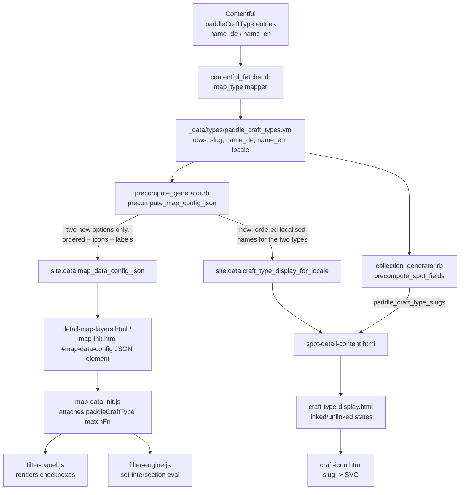
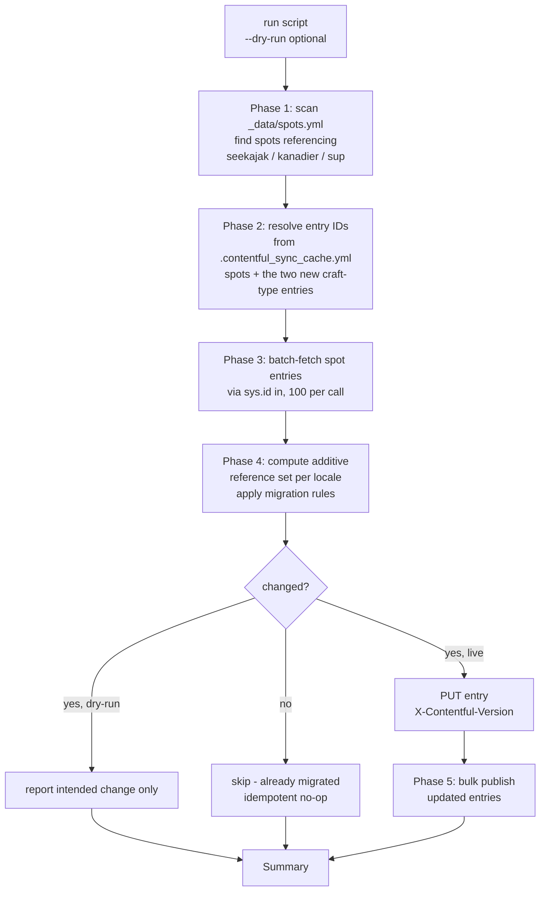

# Design Document

## Overview

This feature replaces the three legacy paddle craft types (`seekajak`, `kanadier`,
`stand-up-paddle-board`) with two new types (`klappbar-und-aufblasbar`, `hardshell`)
across the Paddelbuch frontend, and performs a one-time additive migration of existing
spot references in Contentful.

The change touches four surfaces:

1. **Filter UI** — the build-time `Dimension_Config_Generator`
   (`_plugins/precompute_generator.rb`) must emit exactly the two new craft-type options
   (with icons and localised labels), while the existing client-side `Filter_Panel`
   (`assets/js/filter-panel.js`) and `Filter_Engine` (`assets/js/filter-engine.js`)
   continue to behave unchanged.
2. **Spot detail page** — the paddle-craft-type row inside `spot-details-table`
   (`_includes/spot-detail-content.html`) is removed and replaced by a new
   `Craft_Type_Display` partial rendered directly above the table, showing both new types
   side by side with linked/unlinked visual states.
3. **Craft icon mapping** — `_includes/craft-icon.html` gains slug→SVG mappings for the two
   new slugs.
4. **Contentful migration** — a one-time, idempotent, dry-run-capable CMA script (modelled
   on `scripts/truncate_spot_location_precision.rb`) that additively adds the new type
   references to spots based on their existing legacy references.

### Key design principle: data-driven, additive, behaviour-preserving

The legacy Contentful `paddleCraftType` entries are **not deleted**. The frontend simply
stops presenting them, and the migration only **adds** references. Because the
`Filter_Engine` and `Filter_Panel` are already fully generic over whatever options the
`Dimension_Config_Generator` produces, the behavioural requirements (Requirement 2) are
satisfied by narrowing the generated option set — no client logic changes are required.

### Research notes (grounded in the current codebase)

- **Filter data flow is already generic.** `precompute_map_config_json` builds
  `craft_options` by mapping every locale-filtered `paddle_craft_types` data row to
  `{ slug, label }`, then merges a hard-coded `craft_type_meta` hash to attach
  `icon`/`iconOnly`. The client (`map-data-init.js`) parses `map_data_config_json`, attaches
  the `paddleCraftType` `matchFn` (set-intersection over `meta.paddleCraftTypes`), and hands
  the config to `filter-panel.js`/`filter-engine.js`. **Implication:** to list exactly the
  two new types we only change the generator's option-building logic and the
  `craft_type_meta` hash; no JS changes are needed.
- **`Filter_Engine` default semantics already match Requirement 2.** `evaluateMarker` skips a
  dimension when its selected set is empty (`selected.size === 0`), and `init` selects all
  options by default. So "all selected" and "none selected" both impose no restriction, and a
  strict subset applies set-intersection — exactly Requirements 2.1–2.5. This is confirmed by
  the existing property test `filter-engine-craft-type-match.property.test.js`.
- **Spot craft data is precomputed.** `collection_generator.rb#precompute_spot_fields` sets
  `doc.data['paddle_craft_type_slugs']` (the raw slug array from `entry['paddleCraftTypes']`)
  and `paddle_craft_type_names` (resolved via `build_craft_type_lookup`). The
  `Craft_Type_Display` needs the two new types' localised names **regardless** of whether a
  given spot links them, so a new precomputed, locale-scoped list is required (mirroring the
  existing `spot_tip_types_for_locale` pattern).
- **Icon assets.** `assets/images/icons/` contains `kayak-dark.svg`, `canoe-dark.svg`,
  `sup-dark.svg`, etc. The required `foldables-dark.svg` and `hardshell-dark.svg`
  **already exist** in the repository — they were committed on the Feature_Branch
  `feat/paddlecraft-types-change` — so no icon creation is needed; implementation only relies
  on their presence (a test guards against accidental removal).
- **CMA script pattern is established.** `scripts/truncate_spot_location_precision.rb` shows
  the canonical five-phase pattern: read local cache → resolve entry IDs from
  `.contentful_sync_cache.yml` → batch-fetch via `sys.id[in]` → `PUT` with
  `X-Contentful-Version` → bulk publish; with `--dry-run` and `--slug` flags and `~0.15s` rate
  limiting. The migration script follows this pattern exactly.
- **Colours.** `_sass/settings/_paddelbuch_colours.scss` defines `$green-1: #07753f` and
  `$danger-red: #c40200`, used for the tick and cross indicators respectively.

## Architecture

### Build-time and client-side data flow (Filter UI + Spot detail)



### One-time Contentful migration flow



### Components changed vs unchanged

| Component | File | Change |
|---|---|---|
| Dimension_Config_Generator | `_plugins/precompute_generator.rb` | **Modified** — restrict craft options to the two new slugs (ordered), update `craft_type_meta`, add label fallback, add `craft_type_display_for_locale` |
| Craft_Icon_Include | `_includes/craft-icon.html` | **Modified** — add two slug→icon cases |
| Spot_Detail_Content | `_includes/spot-detail-content.html` | **Modified** — remove old craft-type row, render `Craft_Type_Display` above table |
| Craft_Type_Display | `_includes/craft-type-display.html` | **New** — side-by-side vertical entries with linked/unlinked states |
| Spot detail styles | `_sass/pages/_spot-details.scss` | **Modified** — add `Craft_Type_Display` styles; remove obsolete `craft-type-list`/`craft-type-title` rules |
| Migration script | `scripts/add_paddle_craft_type_references.rb` | **New** — one-time additive CMA migration |
| Icon assets | `assets/images/icons/foldables-dark.svg`, `hardshell-dark.svg` | **Existing** — already committed on branch `feat/paddlecraft-types-change`; no creation needed |
| Filter_Panel | `assets/js/filter-panel.js` | **Unchanged** — generic `iconOnly` rendering already supports craft options |
| Filter_Engine | `assets/js/filter-engine.js` | **Unchanged** — generic set-intersection semantics already satisfy Requirement 2 |
| map-data-init.js | `assets/js/map-data-init.js` | **Unchanged** — `paddleCraftType` matchFn already correct |
| Statistics_Dashboard | `assets/js/statistics-dashboard.js` | **Modified** — add two new craft icon mappings (`klappbar-und-aufblasbar`, `hardshell`) to `PADDLE_CRAFT_ICONS` |

## Components and Interfaces

### 1. Dimension_Config_Generator (`_plugins/precompute_generator.rb`)

Within `precompute_map_config_json`, replace the current data-driven, all-types
`craft_options` construction with an **ordered allow-list** approach.

Define module-level constants:

```ruby
# Ordered list of the two supported (new) paddle craft type slugs.
NEW_CRAFT_TYPE_SLUGS = %w[klappbar-und-aufblasbar hardshell].freeze

# Standalone icon metadata for the two new craft types (no coloured circle).
NEW_CRAFT_TYPE_META = {
  'klappbar-und-aufblasbar' => { icon: '/assets/images/icons/foldables-dark.svg', iconOnly: true },
  'hardshell'               => { icon: '/assets/images/icons/hardshell-dark.svg', iconOnly: true }
}.freeze
```

Build the options by iterating `NEW_CRAFT_TYPE_SLUGS` in order (guaranteeing exactly two
options, correct order, and exclusion of legacy slugs — Requirements 1.1, 1.2, 1.6):

```ruby
craft_by_slug = craft_types.each_with_object({}) { |ct, h| h[ct['slug']] = ct }

craft_options = NEW_CRAFT_TYPE_SLUGS.map do |slug|
  ct = craft_by_slug[slug]
  # Requirements 1.3 / 1.4 localised label; 1.7 fallback to slug when empty/absent
  raw_label = ct && ct[name_key]
  label = (raw_label.nil? || raw_label.to_s.strip.empty?) ? slug : raw_label
  meta = NEW_CRAFT_TYPE_META[slug]
  { slug: slug, label: label, icon: meta[:icon], iconOnly: meta[:iconOnly] }
end
```

- `name_key` is already `"name_#{locale}"` in the method, so English/German labels are
  selected per build locale (Requirements 1.3, 1.4).
- The icon assignment satisfies Requirement 1.5.
- The `iconOnly: true` branch in `filter-panel.js` renders each option's standalone icon plus
  its localised label as a single checkbox-labelled control, preserving the current rendering
  (Requirement 1.6).

**New precomputed list for the Spot detail display** (added in `precompute_map_config_json`,
mirroring the existing `spot_tip_types_for_locale`):

```ruby
site.data['craft_type_display_for_locale'] = NEW_CRAFT_TYPE_SLUGS.map do |slug|
  ct = craft_by_slug[slug]
  raw = ct && ct[name_key]
  name = (raw.nil? || raw.to_s.strip.empty?) ? slug : raw
  { 'slug' => slug, 'name' => name, 'icon' => NEW_CRAFT_TYPE_META[slug][:icon] }
end
```

This provides the ordered pair of `{slug, name, icon}` entries the `Craft_Type_Display`
iterates, independent of any given spot's references.

### 2. Filter_Panel and Filter_Engine (client, unchanged)

No code change. Rationale, tied to requirements:

- **Requirement 2.1** — `filter-panel.js` sets `checkbox.checked = true` for every option;
  `filter-engine.js#init` seeds each dimension's selected set with all option slugs.
- **Requirements 2.2 & 2.4** — `evaluateMarker` `continue`s (imposes no restriction) when the
  dimension's selected set is empty; the "all selected" case is treated as unrestricted because
  every spot's referenced slug is in the selected set. (For the two-option craft dimension,
  "all selected" and "none selected" both yield no restriction.)
- **Requirement 2.3 & 2.5** — for a strict subset, the `paddleCraftType` `matchFn` returns true
  iff `meta.paddleCraftTypes ∩ selected ≠ ∅`.
- **Requirement 2.6** — `evaluateMarker` returns false as soon as any active dimension fails
  (AND across dimensions = set intersection of per-dimension survivors).

### 3. Craft_Icon_Include (`_includes/craft-icon.html`)

Add two `when` branches to the existing `case include.slug`:

```liquid

  

  
```

The include already appends `-dark.svg` and maps to `/assets/images/icons/`, producing
`/assets/images/icons/foldables-dark.svg` (Requirement 3.1) and
`/assets/images/icons/hardshell-dark.svg` (Requirement 3.2). The existing `else` branch sets
`craft_icon = nil` and the trailing `` guard already renders no element for
unknown slugs (Requirement 3.3).

> **Asset dependency:** `foldables-dark.svg` and `hardshell-dark.svg` already exist under
> `assets/images/icons/` (committed on branch `feat/paddlecraft-types-change`), so no icon
> creation is required. The legacy `kayak-dark.svg` / `canoe-dark.svg` / `sup-dark.svg`
> `when` branches may be retained or removed; they are no longer reachable via the two new
> options but retaining them is harmless. This design removes them for clarity.

### 4. Craft_Type_Display (`_includes/craft-type-display.html`, new)

A new partial that renders exactly two vertical entries side by side (Requirements 4.1–4.6,
5.1–5.6). It receives the spot and reads `site.data.craft_type_display_for_locale`.

```liquid




<div class="craft-type-display">
  
    
    
    <div class="craft-type-entry is-linkedis-unlinked">
      <span class="craft-type-entry-name">{{ ct.name | escape }}</span>
      
      
        <span class="craft-type-indicator craft-type-indicator--linked" aria-hidden="true">
          <svg class="craft-type-indicator-icon craft-type-indicator-icon--check" viewBox="0 0 16 16" fill="none" stroke="currentColor" stroke-width="2.5" stroke-linecap="square" stroke-linejoin="miter"><path d="M2 9 L6 13 L14 3" /></svg>
        </span>
        <span class="visually-hidden"></span>
      
        <span class="craft-type-indicator craft-type-indicator--unlinked" aria-hidden="true">
          <svg class="craft-type-indicator-icon craft-type-indicator-icon--cross" viewBox="0 0 16 16" fill="none" stroke="currentColor" stroke-width="2.5" stroke-linecap="square" stroke-linejoin="miter"><path d="M3 3 L13 13 M13 3 L3 13" /></svg>
        </span>
        <span class="visually-hidden"></span>
      
    </div>
  
</div>
```

> **Indicator glyphs.** The linked/unlinked indicators use inline **squared SVG** shapes
> (a check `M2 9 L6 13 L14 3` and a cross `M3 3 L13 13 M13 3 L3 13`) with
> `stroke-linecap="square"` / `stroke-linejoin="miter"` rather than the curvy `&#10003;` /
> `&#10007;` glyph characters, to match the site's squared design. They use
> `fill="none"` and `stroke="currentColor"` so the existing `--linked` / `--unlinked`
> colour classes still drive the green (`$green-1`) check and red (`$danger-red`) cross
> (Requirements 5.2, 5.4). The name → icon → indicator order is unchanged (Requirement 5.6).

> **Row alignment.** The display uses a **CSS grid with `subgrid`**: `.craft-type-display`
> is a two-column, three-row grid (name / icon / indicator) and each `.craft-type-entry`
> spans those three shared rows via `grid-template-rows: subgrid`. This keeps the name,
> icon and indicator rows aligned across both craft types at all widths, even when the
> longer `klappbar-und-aufblasbar` name wraps to two lines (the shared name row grows for
> both entries, so both icons and both indicators stay level).

Interface / contract:

- **Input:** `include.spot` (must expose `paddle_craft_type_slugs`, already precomputed by
  `collection_generator.rb`).
- **Data source:** `site.data.craft_type_display_for_locale` (ordered `[klappbar, hardshell]`).
- **Linked determination:** `linked_slugs contains ct.slug` — evaluated independently per entry
  (Requirement 5.5).
- **Vertical order per entry:** name → icon → indicator (Requirement 5.6).
- **Localised name / fallback:** name comes from the precomputed list, which already applies the
  slug fallback (Requirements 4.4, 4.5).
- The icon element carries a `craft-type-icon` styling hook; greying for the unlinked state is
  applied via the `.is-unlinked` parent (Requirements 5.1, 5.3).

### 5. Spot_Detail_Content (`_includes/spot-detail-content.html`)

- **Remove** the entire first `<tr>` block containing `craft-type-title` /
  `craft-type-list` (Requirement 4.6).
- **Insert** the `Craft_Type_Display` directly above the `<table class="spot-details-table">`
  element (Requirement 4.1), after the spot description / tip banners:

```liquid


<!-- Spot Details Table -->
<table class="spot-details-table">
  ...
```

### 6. Spot detail styles (`_sass/pages/_spot-details.scss`)

Add `Craft_Type_Display` styles and remove the now-unused `.craft-type-list` /
`.craft-type-title` rules.

```scss
.craft-type-display {
  // grid + subgrid keeps the name / icon / indicator rows aligned across both
  // entries at all widths, even when one name wraps to two lines.
  display: grid;
  grid-template-columns: repeat(2, minmax(0, 1fr));
  grid-template-rows: auto auto auto;   // name / icon / indicator
  column-gap: 2em;
  row-gap: 0.4em;
  justify-items: center;
  max-width: 24em;
  margin: 1em auto 1.25em;
}

.craft-type-entry {
  display: grid;
  grid-template-rows: subgrid;   // share the three rows above
  grid-row: span 3;
  row-gap: 0.4em;
  justify-items: center;
  align-content: start;
  text-align: center;
  color: $swisscanoe-blue;

  .craft-icon { width: 100px; height: 50px; }
}

.craft-type-entry-name { align-self: end; }   // single-line name sits above its icon

.craft-type-entry.is-unlinked .craft-icon {
  filter: grayscale(100%);
  opacity: 0.4;             // greyed-out appearance (Requirement 5.3)
}

.craft-type-indicator {
  line-height: 1;

  &--linked   { color: $green-1; }     // Requirement 5.2 (via currentColor)
  &--unlinked { color: $danger-red; }  // Requirement 5.4 (via currentColor)
}

// Squared SVG tick / cross; em-based so it scales, inherits colour via currentColor.
.craft-type-indicator-icon { display: block; width: 1.4em; height: 1.4em; }
```

### 7. Contentful migration script (`scripts/add_paddle_craft_type_references.rb`, new)

Modelled directly on `scripts/truncate_spot_location_precision.rb`. It is a run-once,
automated CLI process (Requirement 6.1) with `--dry-run` (Requirement 6.9) and `--slug`
options, reading credentials from `.env.development`.

**Migration rule (pure core, additive):**

```ruby
LEGACY_TO_NEW = {
  'kanadier'              => 'hardshell',
  'seekajak'              => 'hardshell',
  'stand-up-paddle-board' => 'klappbar-und-aufblasbar'
}.freeze

# Given the spot's current craft-type slugs, return the set of slugs to add.
def additions_for(existing_slugs)
  existing = existing_slugs.to_a
  LEGACY_TO_NEW.each_with_object([]) do |(legacy, new_slug), adds|
    next unless existing.include?(legacy)          # rule triggers only on legacy match
    next if existing.include?(new_slug)            # Requirement 6.6 - no duplicate
    next if adds.include?(new_slug)
    adds << new_slug
  end
end
```

- Requirement 6.2: any spot with `kanadier` or `seekajak` gets `hardshell` added.
- Requirement 6.3: any spot with `stand-up-paddle-board` gets `klappbar-und-aufblasbar` added.
- Requirement 6.4: additive — the CMA update appends new Links to the existing array; existing
  references are never removed.
- Requirement 6.5: if no legacy slug matches, `additions_for` returns `[]` and the spot is
  skipped (no write).
- Requirement 6.6 / 6.7: dedupe against existing references makes a second run a no-op
  (idempotent).

**Phases (mirroring the reference script):**

1. **Scan** `_data/spots.yml` for spots whose `paddleCraftTypes` contains any legacy slug;
   dedupe by slug.
2. **Resolve entry IDs** from `.contentful_sync_cache.yml`:
   - spot slug → entry_id (`content_type == 'spot'`)
   - the two new craft-type slugs → entry_id (`content_type == 'paddleCraftType'`), needed to
     build the reference `Link` objects.
3. **Batch-fetch** the candidate spot entries via `GET /entries?sys.id[in]=...` (100 per call).
4. **Compute + write:** for each entry, per locale key present on the CMA `paddleCraftType`
   field, resolve current linked slugs (via the entry-ID→slug index), compute `additions_for`,
   and if non-empty append `{ sys: { type: 'Link', linkType: 'Entry', id: <new_type_id> } }`.
   In live mode `PUT /entries/{id}` with `X-Contentful-Version`; in dry-run, only report
   (Requirement 6.9). Rate-limit `sleep 0.15`.
5. **Bulk publish** updated entries via `POST /bulk_actions/publish` with individual-publish
   fallback (Requirement 6.8).

**Reference-resolution note:** the CMA `paddleCraftType` field stores an array of entry
`Link`s per locale. To compare existing references by slug, the script builds an
`entry_id → slug` map from the sync cache's `entry_id_index` (filtered to
`content_type == 'paddleCraftType'`) and inverts it to get `slug → entry_id` for constructing
new Links. If a required new-type entry ID cannot be resolved from the cache, the script aborts
with a clear message instructing the user to run a fresh Contentful sync first.

### 8. Localisation (`_i18n/de.yml`, `_i18n/en.yml`)

The craft-type **names** are sourced from Contentful data (`name_de`/`name_en`), so no new name
keys are required. The `Craft_Type_Display` reuses existing `labels.yes` / `labels.no`
(present in both locale files) for the visually-hidden accessible text accompanying the
tick/cross. The obsolete `labels.potentially_usable_by` key becomes unused once the old row is
removed; it may be left in place (harmless) or removed.

### 9. Statistics_Dashboard (`assets/js/statistics-dashboard.js`)

The dashboard renders one figure per paddle craft type and resolves each figure's icon through a
hardcoded slug→icon map, `PADDLE_CRAFT_ICONS`. Today that map covers only the three legacy slugs:

```javascript
const PADDLE_CRAFT_ICONS = {
  'seekajak': '/assets/images/icons/kayak-dark.svg',
  'kanadier': '/assets/images/icons/canoe-dark.svg',
  'stand-up-paddle-board': '/assets/images/icons/sup-dark.svg'
};
```

Add mappings for the two new slugs:

```javascript
const PADDLE_CRAFT_ICONS = {
  // Legacy slugs retained (see below)
  'seekajak': '/assets/images/icons/kayak-dark.svg',
  'kanadier': '/assets/images/icons/canoe-dark.svg',
  'stand-up-paddle-board': '/assets/images/icons/sup-dark.svg',
  // New craft type slugs
  'klappbar-und-aufblasbar': '/assets/images/icons/foldables-dark.svg',
  'hardshell': '/assets/images/icons/hardshell-dark.svg'
};
```

**Why the legacy mappings are retained.** Unlike the Filter UI (which is narrowed to exactly the
two new options) and the Spot detail display (which always renders exactly the two new types), the
Statistics_Dashboard is driven by whatever per-craft-type figures the build-time metrics produce.
Because the migration is **additive** and the legacy Contentful `paddleCraftType` entries are
**not deleted**, the metrics may still contain figures for legacy slugs alongside the new ones. The
dashboard may therefore show a mix of legacy and new craft-type figures, so the legacy mappings are
kept to ensure legacy figures continue to resolve their icons rather than falling through to the
no-icon fallback.

**Graceful fallback.** `renderFigure` only emits the `` element when the resolved icon source
is truthy:

```javascript
function renderFigure(slug, count, label) {
  const iconSrc = PADDLE_CRAFT_ICONS[slug]; // undefined for unmapped slugs
  // ...
  if (iconSrc) {
    // append 
  }
  // count value and label are always rendered
}
```

An unmapped slug yields `undefined`, so no icon image is appended and rendering completes without
error, while the figure's count value and label are still rendered. This is the existing behaviour
and satisfies Requirements 8.3 and 8.4. The two added mappings satisfy Requirements 8.1 and 8.2.

## Data Models

### Paddle craft type data row (`_data/types/paddle_craft_types.yml`)

Produced by `contentful_mappers.rb#map_type`; one row per `(entry, locale)`:

```yaml
- entry_id: "<contentful-id>"
  locale: "de"            # or "en"
  slug: "hardshell"
  name_de: "Hartschale"
  name_en: "Hardshell"
  _raw_description: "<json string>"
```

### Filter dimension option (in `map_data_config_json`)

For the `paddleCraftType` dimension, each option after this change:

```json
{ "slug": "klappbar-und-aufblasbar",
  "label": "<localised name or slug fallback>",
  "icon": "/assets/images/icons/foldables-dark.svg",
  "iconOnly": true }
```

The `paddleCraftType` dimension's `options` array contains exactly these two entries, ordered
`klappbar-und-aufblasbar` then `hardshell`.

### New precomputed display list (`site.data.craft_type_display_for_locale`)

```ruby
[
  { 'slug' => 'klappbar-und-aufblasbar', 'name' => '<localised>', 'icon' => '/assets/images/icons/foldables-dark.svg' },
  { 'slug' => 'hardshell',               'name' => '<localised>', 'icon' => '/assets/images/icons/hardshell-dark.svg' }
]
```

### Spot document craft fields (`collection_generator.rb`)

```ruby
doc.data['paddle_craft_type_slugs'] # => e.g. ['seekajak', 'hardshell']  (raw from Contentful)
doc.data['paddle_craft_type_names'] # => resolved localised names (used by old row; no longer rendered)
```

`Craft_Type_Display` reads only `paddle_craft_type_slugs` for the membership test.

### Contentful spot `paddleCraftType` field (CMA representation)

```json
"paddleCraftType": {
  "de-CH": [ { "sys": { "type": "Link", "linkType": "Entry", "id": "<craftTypeId>" } } ],
  "en-GB": [ { "sys": { "type": "Link", "linkType": "Entry", "id": "<craftTypeId>" } } ]
}
```

The migration appends new `Link` objects to each locale's array (additive), never removing
existing links.

### Migration rule mapping

| Existing legacy reference | Reference added | Requirement |
|---|---|---|
| `kanadier` | `hardshell` | 6.2 |
| `seekajak` | `hardshell` | 6.2 |
| `stand-up-paddle-board` | `klappbar-und-aufblasbar` | 6.3 |
| none of the above | (none) | 6.5 |
| target new type already present | (none — no duplicate) | 6.6 |


## Correctness Properties

*A property is a characteristic or behavior that should hold true across all valid executions
of a system — essentially, a formal statement about what the system should do. Properties serve
as the bridge between human-readable specifications and machine-verifiable correctness
guarantees.*

**Property reflection.** The prework identified many closely related criteria. They are
consolidated to remove redundancy:

- Filter option generation (1.1, 1.2, 1.5) collapse into one option-construction property;
  producing exactly the two ordered new slugs inherently excludes legacy slugs.
- Label localisation and slug fallback (1.3, 1.4, 1.7) collapse into one locale-parameterised
  labelling property.
- Filter engine default/subset/reselect semantics (2.2, 2.3, 2.4, 2.5) collapse into one
  set-intersection property whose empty-selected branch covers the "no restriction" cases.
- Icon mapping criteria (3.1, 3.2, 3.3) collapse into one totality property.
- All Craft_Type_Display content and linked/unlinked-state criteria (4.2–4.5, 5.1–5.5) collapse
  into one comprehensive display property; structural placement/order (4.1, 4.6, 5.6) are
  example-based, not properties.
- Migration criteria split into three non-overlapping guarantees: rule + additivity (6.2–6.4),
  no-op/no-duplicate on the first run (6.5, 6.6), and idempotence on re-run (6.7).
- Statistics dashboard icon resolution (8.1, 8.2, 8.3, 8.4) collapse into one totality-with-fallback
  property over craft-type slugs (Property 12): the two mapped slugs resolve their icons and any
  unmapped slug renders without an icon and without error. This mirrors the icon-mapping totality
  shape of Property 7 but targets a distinct component (`PADDLE_CRAFT_ICONS` in
  `statistics-dashboard.js`) with a different fallback surface, so it is not redundant with
  Property 7.
- Non-property criteria: 6.1 (SMOKE), 6.8 & 6.9 (INTEGRATION, mock-based), 7.1 (VCS constraint).

### Property 1: Filter dimension lists exactly the two new craft options, ordered, with correct icons

*For any* paddle craft type dataset (in any order, with or without legacy rows, with or without
the two new rows), the generated `paddleCraftType` dimension SHALL contain exactly two options
whose slugs are `klappbar-und-aufblasbar` then `hardshell` in that order, with no legacy slug
present, and with icons `/assets/images/icons/foldables-dark.svg` and
`/assets/images/icons/hardshell-dark.svg` respectively.

**Validates: Requirements 1.1, 1.2, 1.5**

### Property 2: Filter option labels are localised with slug fallback

*For any* paddle craft type dataset and *for any* build locale in `{de, en}`, each generated
craft option's label SHALL equal that new type's name for the locale (`name_en` for English,
`name_de` for German), except that when the locale name is empty, whitespace-only, or absent the
label SHALL equal the option's slug.

**Validates: Requirements 1.3, 1.4, 1.7**

### Property 3: Filter panel renders one control per option, in order

*For any* dimension configuration, the `Filter_Panel` SHALL render exactly one checkbox-labelled
control per option, in the same order as the configuration, each control carrying its option's
assigned icon and localised label.

**Validates: Requirements 1.6**

### Property 4: Craft filter options default to selected

*For any* craft dimension configuration, after `Filter_Engine` initialisation the dimension's
selected set SHALL contain every option slug (all options selected by default).

**Validates: Requirements 2.1**

### Property 5: Craft dimension applies set-intersection with empty-selection meaning no restriction

*For any* spot `paddleCraftTypes` array and *for any* selected set of craft slugs, the
`Filter_Engine` SHALL consider the craft dimension satisfied if and only if either the selected
set contains every option (or is empty) — imposing no restriction — or the intersection of the
spot's `paddleCraftTypes` array with the selected set is non-empty.

**Validates: Requirements 2.2, 2.3, 2.4, 2.5**

### Property 6: Spot visibility is the AND across all active dimensions

*For any* set of active filter dimensions and *for any* spot, the `Filter_Engine` SHALL show the
spot if and only if every active dimension's match function returns true for that spot (set
intersection across dimensions).

**Validates: Requirements 2.6**

### Property 7: Craft icon mapping is total and correct

*For any* slug, the `Craft_Icon_Include` SHALL render an `` pointing at
`/assets/images/icons/foldables-dark.svg` when the slug is `klappbar-und-aufblasbar`, at
`/assets/images/icons/hardshell-dark.svg` when the slug is `hardshell`, and SHALL render no icon
element for any other slug.

**Validates: Requirements 3.1, 3.2, 3.3**

### Property 8: Craft_Type_Display reflects independent linked state for both new types

*For any* spot, the `Craft_Type_Display` SHALL render exactly two entries in the order
`klappbar-und-aufblasbar` then `hardshell`; each entry SHALL show that type's icon and its
localised name (or the slug when the localised name is empty or absent); and, determined
independently for each entry, an entry whose slug is contained in the spot's
`paddle_craft_type_slugs` SHALL render a non-greyed icon and a `$green-1` tick indicator, while
an entry whose slug is not contained SHALL render a greyed icon and a `$danger-red` cross
indicator.

**Validates: Requirements 4.2, 4.3, 4.4, 4.5, 5.1, 5.2, 5.3, 5.4, 5.5**

### Property 9: Migration is rule-correct and additive

*For any* set of existing craft-type slugs on a spot, the migration SHALL produce a result set
that (a) contains `hardshell` if and only if the existing set contains `kanadier` or `seekajak`
relative to the additions, (b) contains `klappbar-und-aufblasbar` if the existing set contains
`stand-up-paddle-board`, and (c) is a superset of the existing set (every existing reference is
retained).

**Validates: Requirements 6.2, 6.3, 6.4**

### Property 10: Migration is a no-op without legacy matches and never duplicates

*For any* set of existing craft-type slugs, if the set contains none of `kanadier`, `seekajak`,
or `stand-up-paddle-board` then the migration result SHALL equal the existing set unchanged; and
whenever a target new type is already present in the existing set, the migration SHALL NOT add a
duplicate reference to it.

**Validates: Requirements 6.5, 6.6**

### Property 11: Migration is idempotent

*For any* set of existing craft-type slugs, applying the migration twice SHALL produce the same
result set as applying it once (`apply(apply(x)) == apply(x)`).

**Validates: Requirements 6.7**

### Property 12: Statistics dashboard resolves craft-type icons with graceful fallback

*For any* craft-type slug, the statistics dashboard renders
`/assets/images/icons/foldables-dark.svg` for `klappbar-und-aufblasbar`,
`/assets/images/icons/hardshell-dark.svg` for `hardshell`, and for any slug absent from
`PADDLE_CRAFT_ICONS` renders the figure with no icon image and without error.

**Validates: Requirements 8.1, 8.2, 8.3, 8.4**

## Error Handling

### Build-time (Ruby plugins)

- **Missing or malformed craft-type data.** If `site.data['types']['paddle_craft_types']` is
  absent or a new-type row is missing for the build locale, the option-construction and
  `craft_type_display_for_locale` builders MUST still emit the two ordered options/entries,
  falling back to the slug as the label/name (Requirements 1.7, 4.5). No exception is raised;
  the guard `craft_by_slug[slug]` may be `nil` and the fallback branch handles it.
- **Missing icon asset.** If `foldables-dark.svg` / `hardshell-dark.svg` were absent, Jekyll
  would still build but the `` would render with a broken source. Both icons already exist
  in the repository (committed on branch `feat/paddlecraft-types-change`); an asset-existence
  check in the test suite guards against accidental removal (regression).

### Client-side (Filter engine/panel)

- The existing `evaluateMarker` wraps each `matchFn` in `try/catch` and treats a throwing
  dimension as "not matched", logging a warning. This behaviour is unchanged and continues to
  protect against malformed metadata.

### Spot detail rendering (Liquid)

- When `spot.paddle_craft_type_slugs` is `nil` or empty, the `contains` test is simply false for
  both entries, so both render the unlinked state. No error occurs; this is the correct
  behaviour for a spot with no craft references.

### Migration script (CMA)

- **Missing local cache** (`_data/spots.yml` or `.contentful_sync_cache.yml`): abort early with a
  clear message instructing the user to run a Contentful sync first (mirrors the reference
  script).
- **Unresolved new-type entry IDs**: if the two new craft-type slugs cannot be resolved to entry
  IDs from the sync cache, abort before any writes — new references cannot be constructed safely.
- **CMA request failures**: on non-2xx `PUT`, log the error, increment an error counter, and
  continue with remaining entries (per-entry isolation). Version conflicts (HTTP 409) are surfaced
  in the summary.
- **Bulk publish batching**: Contentful bulk actions are limited to 200 entities per request
  (a single oversized publish is rejected with HTTP 422), so the publish step chunks the updated
  entries into batches of 100 (`CMA_BATCH`) — mirroring the Phase 3 fetch — and sends each batch
  as its own `POST /bulk_actions/publish` with an `entities.sys.type: "Array"` payload.
- **Bulk publish failure**: fall back to individual `PUT /entries/{id}/published` with per-entry
  error logging, matching the reference script. The fallback is scoped to the entries of the
  failing batch only, and the response body is logged alongside the status code to aid diagnosis.
- **Rate limiting**: `sleep 0.15` between writes to respect the CMA ~10 req/s limit.
- **Dry-run safety**: in `--dry-run`, no `PUT` or publish request is issued; only intended changes
  are printed (Requirement 6.9).

## Testing Strategy

This feature mixes pure logic (migration rule algebra, filter set-intersection, icon mapping,
display linked-state) — which is ideal for **property-based testing (PBT)** — with a small amount
of structural rendering and external-service wiring — which is better served by **example-based**
and **integration/mock** tests. The repository already uses `fast-check` with Jest under
`_tests/property/`, and this feature's tests follow that convention.

### Property-based tests (fast-check, ≥ 100 iterations each)

Each property below is implemented as a **single** property-based test, tagged with a comment in
the form `// Feature: paddlecraft-types-change, Property {n}: {property text}` and its
`**Validates: Requirements X.Y**` reference. Minimum 100 iterations (`{ numRuns: 100 }`).

| Property | Suggested test file | Notes / reuse |
|---|---|---|
| P1 Option generation | `_tests/property/craft-filter-options.property.test.js` | Model the generator's ordered allow-list logic; generate random craft data. |
| P2 Label localisation + fallback | `_tests/property/craft-filter-labels.property.test.js` | Generators include empty/whitespace/missing names. |
| P3 Panel renders per option | reuse `filter-panel-rendering.property.test.js` pattern | jsdom + Leaflet mocks already established. |
| P4 Default selected | `_tests/property/craft-filter-default-selected.property.test.js` | Assert engine selected set == all options after init. |
| P5 Craft set-intersection | extend `filter-engine-craft-type-match.property.test.js` | Existing test already covers this; keep/adjust for two-option set. |
| P6 AND across dimensions | reuse `filter-engine-and-logic.property.test.js` | Existing; unchanged. |
| P7 Icon mapping totality | `_tests/property/craft-icon-mapping.property.test.js` | Model the `case` logic; random slugs (known + unknown). |
| P8 Display linked-state | `_tests/property/craft-type-display.property.test.js` | Model the display include; generate spot slug sets {none, klappbar, hardshell, both}. |
| P9 Migration rule + additivity | `_tests/property/paddle-craft-migration-rules.property.test.js` | Model `additions_for`; assert superset + rule membership. |
| P10 Migration no-op / no-dup | same migration test file | Boundary generators (no legacy; target already present). |
| P11 Migration idempotency | same migration test file | `apply(apply(x)) == apply(x)`. |
| P12 Dashboard icon resolution + fallback | `_tests/property/statistics-dashboard-craft-icons.property.test.js` | Model `PADDLE_CRAFT_ICONS` lookup + `renderFigure` guard; generate mapped and unmapped slugs. |

The pure migration rule (`additions_for` / `apply`) SHOULD be implemented so the same algorithm
is exercised by both the Ruby script and the JS property tests (a small JS model mirroring the
Ruby logic is acceptable, matching how the repo models Ruby/Liquid behaviour in JS property
tests today).

### Example-based / structural unit tests

- **4.1 placement**: render a representative non-rejected spot page and assert the
  `.craft-type-display` element appears before `.spot-details-table` in document order.
- **4.6 removal**: assert the rendered `.spot-details-table` contains no `.craft-type-list` or
  `.craft-type-title` elements.
- **5.6 vertical order**: assert each `.craft-type-entry` renders children in order
  name → icon → indicator.
- **Icon-asset existence**: assert `assets/images/icons/foldables-dark.svg` and
  `hardshell-dark.svg` exist (guards Requirement 1.5 / 3.1 / 3.2 assets).

### Integration / mock-based tests (migration side effects)

- **6.8 publish**: with a mocked CMA client, run the migration over a fixture spot that requires
  an addition; assert a publish request is issued for the updated entry (1–3 representative
  examples).
- **6.9 dry-run**: with a mocked CMA client, run in `--dry-run` over the same fixture; assert zero
  `PUT`/publish requests are issued and that the intended change is reported to stdout.

### Existing tests to update

The additive migration and the frontend presentation change alter the ground truth assumed by
several existing property tests. The following updates are required. They fall into three groups:
invalidated behaviour (must change), coverage extension (should change), and fixture refresh
(representativeness only, not correctness).

**Invalidated behaviour — must update:**

- **`_tests/property/spot-detail.property.test.js`** — its model asserts the OLD behaviour: that a
  craft-type section is present only when the spot has craft types, and that the number of rendered
  craft-type items matches the length of the spot's craft-type array. Under the new design the
  `Craft_Type_Display` **always** renders exactly the two new types, each in a linked or unlinked
  state independent of how many craft types the spot references. The two impacted cases —
  "detail page includes paddle craft types when spot has them" and "empty paddle craft types array
  results in no craft types section" — assert the now-invalid conditional-presence/length model and
  MUST be removed or replaced. The new behaviour is fully covered by **Property 8**
  (`craft-type-display.property.test.js`), so these assertions are not re-added here.

**Coverage extension — should update:**

- **`_tests/property/filter-engine-craft-type-match.property.test.js`** — a generic
  set-intersection model that maps to **Property 5**. Extend it to include a two-option craft
  dimension scenario (matching the new `{klappbar-und-aufblasbar, hardshell}` option set) so the
  reduced-cardinality dimension is exercised. This is an additive extension with **no behavioural
  regression** — the underlying set-intersection semantics are unchanged.

**Fixture refresh — representativeness only (no correctness change):**

The following tests hardcode the legacy slug set `['seekajak', 'kanadier', 'stand-up-paddle-board']`
purely as fixture data. Update these fixtures to the two new slugs (`klappbar-und-aufblasbar`,
`hardshell`) — or a mix that includes them — so the tests no longer reference removed craft types.
No behavioural assertions change:

- `_tests/property/filter-engine-non-spot-isolation.property.test.js`
- `_tests/property/marker-registry-round-trip.property.test.js`
- `_tests/property/marker-registry-deduplication.property.test.js`
- `_tests/property/filter-rejected-spots-exclusion.property.test.js`

**Verification — invariant to preserve (no change needed, but must not regress):**

- **`_tests/property/rejected-spot.property.test.js`** asserts that rejected spots do **not** show
  craft types. This invariant remains valid and MUST be preserved: the `Craft_Type_Display` is
  added only to `_includes/spot-detail-content.html` (the non-rejected detail partial) and is
  **not** added to `_includes/rejected-spot-content.html`. Implementation MUST NOT introduce the
  display into the rejected-spot partial; this test guards that boundary.

**No update needed:**

- **`spec/plugins/api_generator_api_structure_spec.rb`** (Ruby) uses legacy slugs only as fixtures,
  and the API generator itself is unchanged by this feature, so no update is required.

### Manual / process verification

- **6.1** single-execution automation and **7.1** feature-branch constraint are verified during
  implementation/review (the script runs non-interactively; all changes land on
  `feat/paddlecraft-types-change`).
