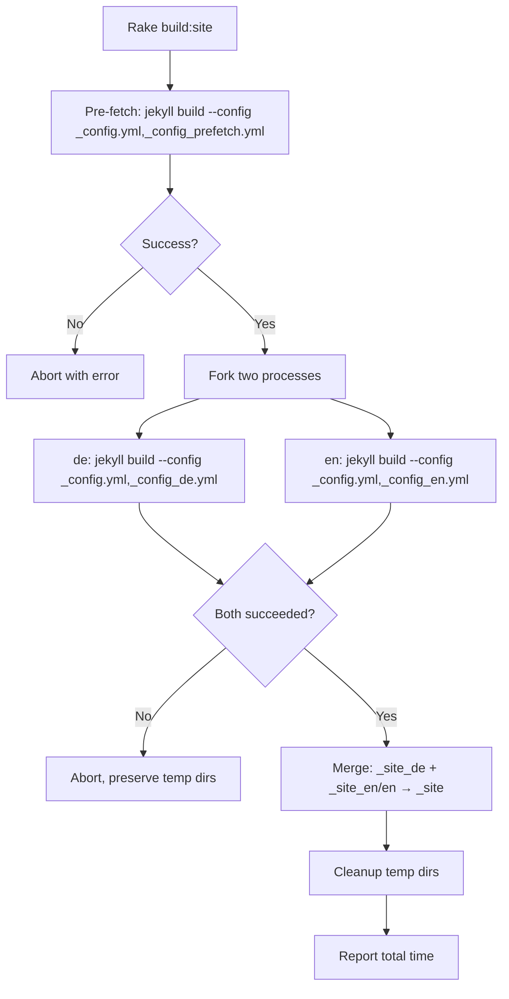
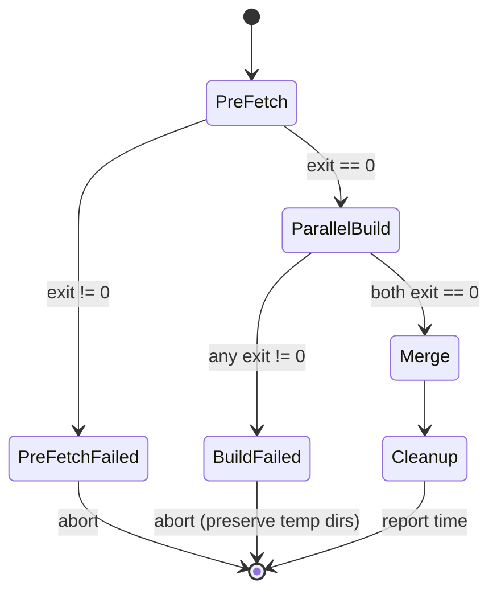

# Design Document: Parallel Locale Builds

## Overview

This design replaces the sequential two-locale build performed by `jekyll-multiple-languages-plugin` with two independent, parallel Jekyll OS processes — one per locale (de, en). The outputs are merged into a single `_site/` directory that is byte-identical to the current sequential build.

The pipeline has four stages:

1. **Pre-fetch** — A single Jekyll invocation triggers `ContentfulFetcher` to populate `_data/` with fresh YAML. This process builds nothing else of value; its sole purpose is to warm the Contentful cache so both parallel builds skip the API call.
2. **Parallel build** — Two `bundle exec jekyll build` processes run concurrently, each with a locale-specific config overlay (`_config_de.yml`, `_config_en.yml`) that restricts `languages` to a single entry and redirects `destination` to a temporary directory.
3. **Merge** — The two output trees are combined into `_site/`. The `de` build provides the root and all locale-independent paths (`assets/`, `api/`). The `en` build contributes only its `en/` subdirectory.
4. **Cleanup** — Temporary directories `_site_de/` and `_site_en/` are removed (only on success).

### Expected build time improvement

| Phase | Sequential (current) | Parallel (new) |
|---|---|---|
| Contentful fetch | ~22s | ~22s (pre-fetch) |
| de render | ~60s | ~60s (concurrent) |
| en render | ~70s | ~70s (concurrent) |
| Merge | — | ~2s |
| **Total** | **~157s** | **~94s** |

Wall-clock savings: ~63s (~40%).

### Design rationale

Running two separate OS processes avoids the `jekyll-multiple-languages-plugin`'s shared-state mutation problem entirely. Each process gets its own `Site` object, its own Liquid context, and its own output directory. No plugin code needs to change. The merge step is a simple file copy because the plugin already places `en` pages under an `en/` subdirectory within the destination.

## Architecture



### Process orchestration

The Rakefile `build:site` task is the Build_Orchestrator. It uses Ruby's `Process.spawn` to launch the two Jekyll builds as child processes, capturing stdout/stderr with locale-prefixed labels. `Process.waitpid2` collects exit statuses. If either returns non-zero, the task aborts without merging.

For the `amplify.yml` CI pipeline, the build phase calls `bundle exec rake build:site` instead of `bundle exec jekyll build --verbose`. This keeps the CI config simple and delegates all orchestration to the Rakefile.

## Components and Interfaces

### 1. Per-locale config override files

Three new YAML files committed to the repo root alongside `_config.yml`:

**`_config_prefetch.yml`** — Used only for the pre-fetch step. Builds to a throwaway destination and restricts to the default locale so only one language pass runs. Sets `destination: _site_prefetch` and `languages: ["de"]`. The output is discarded; the only side-effect is populating `_data/`.

```yaml
# Pre-fetch config: triggers ContentfulFetcher, output is discarded
languages: ["de"]
destination: _site_prefetch
```

**`_config_de.yml`** — German locale build.

```yaml
languages: ["de"]
destination: _site_de
```

**`_config_en.yml`** — English locale build. Sets `baseurl: "/en"` so the multi-language plugin generates pages under the `/en/` prefix within `_site_en/`. (The plugin's `process` method sets `@dest = dest + "/" + lang` for non-default languages, so `en` pages land in `_site_en/en/`.)

```yaml
languages: ["en"]
destination: _site_en
baseurl: "/en"
```

Note: `exclude_from_localizations` is inherited from `_config.yml` and does not need to be repeated.

### 2. Build_Orchestrator (Rakefile `build:site` task)

The updated `build:site` task replaces the current `Jekyll::Commands::Build.process({})` call with a multi-step pipeline:

```ruby
namespace :build do
  desc "Build the Jekyll site (parallel locale builds)"
  task :site do
    start_time = Process.clock_gettime(Process::CLOCK_MONOTONIC)

    # Step 1: Pre-fetch Contentful data
    prefetch_and_validate!

    # Step 2: Parallel locale builds
    run_parallel_builds!

    # Step 3: Merge outputs
    merge_outputs!

    # Step 4: Cleanup
    cleanup_temp_dirs!

    elapsed = Process.clock_gettime(Process::CLOCK_MONOTONIC) - start_time
    puts "Build complete in #{elapsed.round(1)}s"
  end
end
```

Each helper method aborts with a descriptive error on failure.

**`prefetch_and_validate!`** — Runs `bundle exec jekyll build --config _config.yml,_config_prefetch.yml` synchronously. Verifies exit status 0. Removes `_site_prefetch/` afterwards (its output is not needed).

**`run_parallel_builds!`** — Spawns two child processes:
- `bundle exec jekyll build --config _config.yml,_config_de.yml`
- `bundle exec jekyll build --config _config.yml,_config_en.yml`

Uses `Process.spawn` with stdout/stderr piped through a prefixing wrapper (e.g., `[de]` / `[en]`). Waits for both with `Process.waitpid2`. If either exits non-zero, reports which locale failed and aborts without cleaning up temp dirs.

**`merge_outputs!`** — Uses `FileUtils`:
1. `rm_rf('_site')` then `mkdir_p('_site')`
2. `cp_r('_site_de/.', '_site')` — copies all de output (root pages, assets, api)
3. `cp_r('_site_en/en', '_site/en')` — copies only the `en/` subtree

This ensures `assets/` and `api/` come exclusively from the `de` build, matching the current behavior where `exclude_from_localizations` prevents the plugin from localizing those paths.

**`cleanup_temp_dirs!`** — Removes `_site_de/`, `_site_en/`, and `_site_prefetch/` (if still present).

### 3. ContentfulFetcher caching behavior

No changes to `ContentfulFetcher` are needed. The pre-fetch step writes YAML to `_data/` and updates `.contentful_sync_cache.yml`. When the parallel builds start, each process's `ContentfulFetcher.generate` method:
1. Loads the cache metadata
2. Calls `check_for_changes` with the stored sync token
3. Gets back `has_changes: false` (no new Contentful changes since the pre-fetch)
4. Logs "Using cached content" and sets `contentful_data_changed = false`
5. Skips all API calls

Both processes read `_data/*.yml` files — these are read-only during the build, so no race condition exists.

### 4. amplify.yml update

The build phase changes from:
```yaml
build:
  commands:
    - bundle exec jekyll build --verbose
    - npm test
```
to:
```yaml
build:
  commands:
    - bundle exec rake build:site
    - npm test
```

The `preBuild` phase, artifacts, and cache paths remain unchanged.

### 5. README.md update

The "Building for Production" section is updated to document `bundle exec rake build:site` as the primary build command, explain the parallel build pipeline, and list the new config files in the project structure.

## Data Models

### Per-locale config override schema

Each `_config_<lang>.yml` file is a minimal YAML document that overrides specific keys from `_config.yml` when passed via Jekyll's `--config` flag (later files win):

| Key | Type | `_config_de.yml` | `_config_en.yml` | `_config_prefetch.yml` |
|---|---|---|---|---|
| `languages` | `string[]` | `["de"]` | `["en"]` | `["de"]` |
| `destination` | `string` | `_site_de` | `_site_en` | `_site_prefetch` |
| `baseurl` | `string` | *(not set, inherits `""`)* | `"/en"` | *(not set)* |

### Temporary directory layout

After the parallel build step, before merging:

```
_site_de/                  # de build output
├── index.html             # German homepage
├── einstiegsorte/         # German spot pages
├── gewaesser/             # German waterway pages
├── assets/                # Locale-independent (CSS, JS, images)
├── api/                   # JSON API files
└── ...

_site_en/                  # en build output
└── en/                    # Plugin places non-default locale under /en/
    ├── index.html         # English homepage
    ├── einstiegsorte/     # English spot pages
    ├── gewaesser/         # English waterway pages
    ├── assets/            # Duplicate (discarded during merge)
    ├── api/               # Duplicate (discarded during merge)
    └── ...
```

After merge:

```
_site/                     # Final merged output
├── index.html             # From _site_de
├── einstiegsorte/         # From _site_de
├── assets/                # From _site_de (only copy)
├── api/                   # From _site_de (only copy)
└── en/                    # From _site_en/en/
    ├── index.html
    ├── einstiegsorte/
    └── ...
```

### Build process state machine




## Correctness Properties

*A property is a characteristic or behavior that should hold true across all valid executions of a system — essentially, a formal statement about what the system should do. Properties serve as the bridge between human-readable specifications and machine-verifiable correctness guarantees.*

### Property 1: Config merge preserves non-overridden keys

*For any* locale config override file (`_config_de.yml` or `_config_en.yml`) and *for any* key present in `_config.yml` that is not explicitly set in the override file, loading the merged config via `--config _config.yml,_config_<lang>.yml` shall produce a value for that key identical to the value in `_config.yml` alone.

**Validates: Requirements 1.3, 1.4**

### Property 2: Merge produces correct file set from both builds

*For any* file present in `_site_de/`, that file shall exist at the same relative path in `_site/` with identical content after the merge step. *For any* file present in `_site_en/en/`, that file shall exist at `_site/en/<relative_path>` with identical content. No files from `_site_en/` outside the `en/` subdirectory shall appear in `_site/` (ensuring excluded paths like `assets/` and `api/` come exclusively from the de build).

**Validates: Requirements 4.2, 4.3, 4.4, 8.1**

### Property 3: Parallel build output equivalence

*For any* page produced by the current sequential build, the parallel build shall produce a file at the same path with byte-identical content, and vice versa — the parallel build shall produce no files that the sequential build does not. The set of files and their contents shall be identical between the two build approaches.

**Validates: Requirements 5.1, 5.2, 5.3**

### Property 4: File permissions preserved during merge

*For any* file copied during the merge step, the file permissions (mode bits) in `_site/` shall be identical to the permissions of the source file in the temporary build directory (`_site_de/` or `_site_en/`).

**Validates: Requirements 4.6**

### Property 5: Failure isolation preserves existing state

*For any* build step (pre-fetch, de build, or en build) that exits with a non-zero status, the `_site/` directory shall not be created or modified, and the temporary output directories (`_site_de/`, `_site_en/`) shall be preserved for debugging.

**Validates: Requirements 3.3, 6.3, 10.1, 10.2, 10.3, 10.4**

## Error Handling

### Pre-fetch failure

If the pre-fetch Jekyll build exits non-zero (e.g., Contentful API unreachable, invalid credentials), the orchestrator prints the captured stderr with a `[prefetch]` prefix and aborts with `exit 1`. No parallel builds are started. No temporary directories need cleanup since none were created yet.

### Locale build failure

If either parallel build exits non-zero:
- The orchestrator waits for both processes to finish (does not kill the other).
- It reports which locale(s) failed, including the exit code.
- It preserves `_site_de/` and `_site_en/` so the developer can inspect partial output.
- It does not create or modify `_site/`.
- It exits with status 1.

If both builds fail, both failures are reported.

### Merge failure

If the merge step fails (e.g., disk full, permission denied during `cp_r`):
- The orchestrator reports the error.
- Partial `_site/` content may exist but is not guaranteed to be complete.
- Temporary directories are preserved.
- Exit status 1.

### ContentfulFetcher cache race condition (non-issue)

Both parallel builds read `_data/*.yml` and `.contentful_sync_cache.yml` concurrently. Since the pre-fetch step has already written these files and neither parallel build modifies them (the fetcher detects "no changes" and skips writing), there is no write-write or read-write race. Both processes operate on stable, read-only data files.

### `.jekyll-cache` contention

Both parallel builds share the same `.jekyll-cache/` directory. Jekyll's cache is keyed by file path and content, so both builds reading/writing the same cache entries is safe — they produce identical cache values for identical inputs. In the unlikely event of a write collision, Jekyll handles it gracefully (cache miss → regenerate).

## Testing Strategy

### Dual testing approach

This feature requires both unit tests and property-based tests:

- **Unit tests** (RSpec): Verify specific examples, edge cases, and error conditions — config file content, merge step behavior with known directory structures, failure handling scenarios.
- **Property-based tests** (RSpec + Rantly): Verify universal properties across generated inputs — config merge preservation, merge correctness over arbitrary file trees, file permission preservation.

### Property-based testing configuration

- **Library**: Rantly (already in the project's Gemfile as a test dependency)
- **Iterations**: Minimum 100 per property test
- **Tagging**: Each property test is tagged with a comment referencing the design property:
  - `# Feature: parallel-locale-builds, Property 1: Config merge preserves non-overridden keys`
  - `# Feature: parallel-locale-builds, Property 2: Merge produces correct file set from both builds`
  - etc.
- **Each correctness property is implemented by a single property-based test**

### Unit test focus areas

- Config file content validation (Requirements 1.1, 1.2, 1.5)
- Pre-fetch step populates `_data/` (Requirement 2.2)
- Orchestrator aborts on pre-fetch failure (Requirement 2.4)
- Temp directory cleanup on success (Requirement 4.5)
- Temp directory preservation on failure (Requirements 10.1–10.4)
- Rakefile preserves existing `serve` and `audit` tasks (Requirements 6.4, 6.5)
- `amplify.yml` content validation (Requirements 7.1–7.4)

### Integration test

- A full end-to-end comparison: run the sequential build, run the parallel build, diff the two `_site/` directories. This validates Property 3 (output equivalence) at the integration level. This test is manual / CI-only due to build time.
