# Design Document: Quality and Tooling Hardening

## Overview

This design implements the eight requirements as a set of strictly internal improvements. No user-facing HTML, compiled CSS, or JavaScript behaviour changes (Requirement 0). The work introduces tooling (linters/formatters), modernises the SCSS module system, removes duplication of constants and logic, consolidates i18n strings, strengthens the test suite, and corrects documentation drift.

The project context relevant to this design:

- **JavaScript**: vanilla, no build toolchain, IIFE-to-global module pattern, must remain CSP-compliant (`script-src 'self' https://tinylytics.app`, no `unsafe-inline`/`unsafe-eval`).
- **SCSS**: compiled by `jekyll-sass-converter` (Dart Sass) with `load_paths: [node_modules]`; Bootstrap pulled from `node_modules`.
- **Ruby**: `_plugins/` generators/filters already follow established conventions (`frozen_string_literal`, `safe true`, declared priorities).
- **Tests**: RSpec + Rantly (Ruby) and Jest + fast-check (JS); property-based testing is a first-class practice.
- **Prior specs** (all completed) already addressed shared HTML utils, the colour generator, SEO tags, CSP inline-script extraction, the `DD MMM YYYY` date decision, and more. This design deliberately does **not** revisit those.

## Architecture

```mermaid
graph TD
    subgraph "Tooling Layer (NEW)"
        RC[".rubocop.yml"] --> RT["rake lint"]
        EL["eslint.config.js"] --> NL["npm run lint"]
        SL[".stylelintrc.json"] --> NL
    end

    subgraph "SCSS Layer"
        APP["assets/css/application.scss"] -->|"@use"| SET["_sass/settings/*"]
        APP -->|"@use"| UTIL["_sass/util/*"]
        APP -->|"@use"| COMP["_sass/components/*"]
        APP -->|"@use"| PAGES["_sass/pages/*"]
        APP -->|"scoped import"| BS["bootstrap"]
    end

    subgraph "Geo Constants (single source)"
        CFG["_config.yml: map bounds + tile size"] --> TG["tile_generator.rb"]
        CFG --> GEN["NEW: geo_constants include/JSON"]
        GEN -->|"build-time JSON"| SU["spatial-utils.js"]
    end

    subgraph "JS Dedup + Tests"
        LC["layer-control.js"] -->|"delegates to"| PM["spot/obstacle/event-notice popup.js"]
        PM -->|"Dual_Export"| JT["Jest tests require real module"]
        SU -->|"Dual_Export"| JT
    end

    subgraph "i18n"
        DE["_i18n/de.yml"] --> KP["NEW: key-parity test"]
        EN["_i18n/en.yml"] --> KP
    end

    subgraph "Docs"
        CSPDOC[".kiro/steering/csp.md"] -->|"accurate CSP"| TRUTH["deploy/frontend-deploy.yaml"]
        CDNTEST["layout-cdn-free test"] -->|"host allowlist"| DEFLAYOUT["_layouts/default.html"]
    end
```



No new architectural patterns are introduced. The only new build-time artifact is a Geo_Constants JSON exposure analogous to the existing `color_generator.rb` → `color-vars.html` → `window.PaddelbuchColors` mechanism.

## Components and Interfaces

### 1. Linting and Formatting (Requirement 1)

The guiding principle is **codify existing conventions, do not impose new ones** — adoption must not force behavioural churn.

#### 1a. RuboCop (`.rubocop.yml`)
- `gem "rubocop", "~> 1.x"` in the `:development` group.
- Target `TargetRubyVersion` matching the project's Ruby (3.4).
- Enable the layout/lint departments that match existing style; disable or relax cops that would demand large rewrites (e.g. `Metrics/MethodLength`, `Metrics/ClassLength`, `Metrics/AbcSize`) given the existing large generators. `Style/FrozenStringLiteralComment` is already satisfied.
- Inline `# rubocop:disable` only where a pattern is intentional (e.g. the inline `rescue` in `contentful_mappers.rb` may be refactored or annotated).
- `Rakefile` gains a `lint` task: `sh "bundle exec rubocop"`.

#### 1b. ESLint (`eslint.config.js`, flat config)
- `eslint` in `devDependencies`.
- Flat config with `languageOptions.globals` for the browser plus the project's own globals (`L`, `window.Paddelbuch*`, `Chart`).
- `sourceType: "script"` (not module) and rules that **allow** `var` and the IIFE-to-global pattern; `no-unused-vars`, `no-undef` (with declared globals), `eqeqeq` as warnings initially.
- `assets/js/vendor/**` is ignored.

#### 1c. Stylelint (`.stylelintrc.json`)
- `stylelint` + `stylelint-config-standard-scss` in `devDependencies`.
- Enable `block-no-empty` (catches the empty BEM placeholder rulesets) and keep BEM-friendly selector rules; ignore `assets/css/vendor/**`.
- `package.json` `lint` script: `eslint assets/js && stylelint "_sass/**/*.scss" "assets/css/**/*.scss"`.

#### 1d. Baseline strategy
Running each linter for the first time will surface pre-existing violations. The design treats this as: auto-fix what is safe (formatting, trailing whitespace), fix small genuine issues, and for anything that would risk behaviour or require large refactors, record an explicit baseline (config exclusion or inline disable with a comment). The end state is a linter that **exits clean** so it can later be wired into CI.

### 2. SCSS Module System Migration (Requirement 2)

Convert first-party partials from `@import` to `@use`/`@forward`:

- `_sass/settings/_settings.scss` becomes a `@forward` barrel for `colors`, `fonts`, `dimensions`, `paddelbuch_colours`. Likewise `_components.scss` and `_util.scss` use `@forward`.
- Files that consume variables (`$swisscanoe-blue`, `$font-default`, `$menu-height`, etc.) add `@use "../settings" as *;` (or a namespace) so members resolve under Dart Sass module scope rather than the global `@import` namespace.
- `assets/css/application.scss` replaces its `@import` chain with `@use` of the four barrels.

**Bootstrap**: today `@import "bootstrap/scss/bootstrap"` pulls the whole framework. The migration uses Bootstrap's documented partial-import approach — `@import "bootstrap/scss/functions"; @import "bootstrap/scss/variables"; @import "bootstrap/scss/mixins";` then only the component partials actually used (reboot, grid, nav/navbar, dropdown, buttons, tables as required). Bootstrap 5.3's SCSS still ships `@import`-based partials, so `@import` for the Bootstrap vendor entry points is acceptable; only **first-party** partials move to `@use`. The chosen component set is validated by diffing compiled CSS against the baseline (Requirement 0 / Property 2).

> Risk note: if scoping Bootstrap to a component subset produces any compiled-CSS difference for components in use, the safe fallback is to keep the full Bootstrap import and limit this requirement to the first-party `@use` migration. Requirement 0 governs.

### 3. Geo Constants Single Source (Requirement 3)

`_config.yml` already holds `map.bounds` and the design adds the tile-size step values there (or a dedicated `tiles:` block) as the **authoritative source**.

- **Ruby**: `tile_generator.rb` reads bounds and tile size from `site.config` instead of the inline `SWITZERLAND_BOUNDS` / `TILE_SIZE` constants. (Defaults retained as a fallback for safety.)
- **Browser**: a small build-time exposure — mirroring the `color-vars.html` pattern — emits the same values as JSON into a `<script type="application/json">` element, and `spatial-utils.js` reads them (with its current literals kept only as a fallback). Alternatively, a Jekyll-rendered `_data` value already available to includes is injected where `spatial-utils.js` is loaded.

Either way the contract is: **one YAML source → Ruby config + browser JSON**. Property 3 asserts the two consumers compute identical tile coordinates.

### 4. layer-control.js De-duplication (Requirement 4)

`layer-control.js` currently contains full "fallback" popup reimplementations inside `addSpotMarker`, `addObstacleLayer`, and `addEventNoticeMarker` (used only "if module not loaded"). Since `map-init.html` and the detail layouts always load the Popup_Modules first, these fallbacks are unreachable in practice and have already drifted (the event-notice fallback interpolates raw dates).

**Design**: replace each large fallback block with a minimal, safe guard:

```javascript
function buildSpotPopup(spot) {
  if (window.PaddelbuchSpotPopup) {
    return spot.rejected
      ? window.PaddelbuchSpotPopup.generateRejectedSpotPopupContent(spot, currentLocale)
      : window.PaddelbuchSpotPopup.generateSpotPopupContent(spot, currentLocale);
  }
  // Minimal graceful degradation — escaped title only, no duplicate implementation
  return '<div><span class="popup-title"><h1>' +
    PaddelbuchHtmlUtils.escapeHtml(spot.name || '') + '</h1></span></div>';
}
```

The same shape applies to obstacle and event-notice paths. Under normal operation (all modules present) the rendered popup is byte-identical to today (Property 4); the only behavioural change is in the degenerate module-missing case, which is acceptable graceful degradation.

### 5. i18n Consolidation + Key Parity (Requirement 5)

#### 5a. Key-parity test (the concrete, high-value deliverable)
A new test recursively flattens both Translation_Files to dotted key paths and asserts the two sets are equal, reporting any key present in one but not the other. Implemented in Ruby (RSpec) since it operates on the YAML files directly:

```ruby
# spec/i18n_key_parity_spec.rb
de = flatten_keys(YAML.safe_load_file('_i18n/de.yml'))
en = flatten_keys(YAML.safe_load_file('_i18n/en.yml'))
expect(de - en).to be_empty   # keys missing from en
expect(en - de).to be_empty   # keys missing from de
```

#### 5b. Hardcoded-string audit + opportunistic consolidation
The Popup_Modules (`spotTypeNames`, craft names, `strings`) and `precompute_generator.rb` (`spot_type_options`, `layer_labels`) hold parallel `de`/`en` literals. These exist partly because popups are built client-side under CSP and partly for precomputation. The design **documents** every such location and, where a single build-time origin is feasible without CSP/Requirement-0 risk, routes them through the i18n system (e.g. precompute reads from `_i18n` during the build, or popups read labels already present in the CSP-safe JSON config emitted for the map). Where consolidation is not cleanly possible, the rationale is recorded (Requirement 5.5) rather than forcing brittle changes. This requirement's *guaranteed* outcome is the parity test (5a); consolidation is best-effort and regression-gated.

### 6. Test Rigour (Requirement 6)

#### 6a. Dual exports + de-mirroring
Append the Dual_Export to modules currently mirrored by tests (at minimum `spatial-utils.js`; extend to others as their Mirror_Tests are converted):

```javascript
// at the very end of the IIFE module, after global assignment
if (typeof module !== 'undefined' && module.exports) {
  module.exports = global.PaddelbuchSpatialUtils;
}
```

Then rewrite `_tests/unit/spatial-utils.test.js` and `_tests/property/spot-popup.property.test.js` to `require()` the real module and assert against it. The newer `_tests/unit/spot-popup-utils.test.js` already demonstrates this pattern, so the conversion aligns with existing precedent.

#### 6b. Coverage threshold
Run `jest --coverage` to measure current coverage, then set a `coverageThreshold.global` floor in `jest.config.js` slightly below the measured values (so the gate ratchets without immediately failing). This makes coverage regressions fail the build.

#### 6c. Integration directory
Either add one genuine integration test under `_tests/integration/` (e.g. a data-loader + spatial-utils + filter-engine interaction test) or remove the empty directory and its `.gitkeep` so the structure does not advertise an unimplemented suite. The design prefers adding one small real integration test.

### 7. Documentation Accuracy (Requirement 7)

- **`.kiro/steering/csp.md`**: update the rules to state that `script-src` and `connect-src` include `https://tinylytics.app` (analytics), reconciling the doc with `deploy/frontend-deploy.yaml`. Remove the absolute "self only / no runtime external script" wording.
- **`_config.yml`**: remove the stale `_scripts/` exclude entry; keep `scripts/`.
- **Comments**: correct the date-format header comments in `_plugins/locale_filter.rb` and `assets/js/date-utils.js` to describe the intentional `DD MMM YYYY` standard; drop the misleading "Property 19 / DD.MM.YYYY / DD/MM/YYYY" descriptions of *current* behaviour.
- **`assets/js/date-utils.js` `numeric` format**: confirm via grep that no display path uses the `numeric` (DD.MM.YYYY/DD/MM/YYYY) output, then remove the `numeric` format entirely. No rendered date changes (Requirement 0). NOTE: the completed `best-practices-cleanup` Property 7 asserts `numeric → DD.MM.YYYY`; removing `numeric` requires updating that test in lockstep.
- **i18n steering doc**: update its "Date Formatting" section to the `DD MMM YYYY` standard.
- **`layout-cdn-free.property.test.js`**: broaden detection to flag any `http(s)://` or `//` host in first-party `href`/`src` (including `.js?query` URLs), with an explicit allowlist containing `tinylytics.app` so the intentional analytics reference passes while any *new* external reference fails.

### 8. Polish (Requirement 8)

- **`package.json`**: remove `_id`; add `"engines": { "node": ">=20" }` (or the project's supported line); normalise pinning (choose exact pins to match the lockfile-driven `npm ci` flow, or document the caret strategy) ; optionally `"private": true` if the package is not published.
- **`console.log`**: replace diagnostic logs in `layer-control.js` (and any other first-party module) with removal or `console.warn`/`console.error` where they signal real problems.
- **`color-vars.js`**: wrap in the standard `(function(global){ 'use strict'; … })(window)` pattern and guard `JSON.parse` in a `try/catch`.
- **Falsy coordinate checks**: change `if (!lat || !lon)` to explicit `null`/`undefined`/`NaN` checks so `0` is valid.
- **Scripts**: change `ENV.fetch('CONTENTFUL_ENVIRONMENT', 'dev')` to default `'master'` in the `scripts/*.rb` maintenance scripts.
- **Sitemap (optional)**: add `<lastmod>` from `updatedAt` and `xhtml:link rel="alternate" hreflang` entries; keep output schema-valid.

## Data Models

No persistent data models are introduced. One new ephemeral build-time artifact: the Geo_Constants JSON exposure (mirroring `paddelbuch_colors`):

```json
{
  "bounds": { "north": 47.8, "south": 45.8, "east": 10.5, "west": 5.9 },
  "tileSize": { "lat": 0.25, "lon": 0.46 }
}
```

Generated from the single `_config.yml` source on each build; not committed.

## Correctness Properties

*A property is a characteristic that should hold across all valid executions — a machine-verifiable statement of intended behaviour.*

### Property 1: Linters run cleanly on the tree
*For any* configured linter (RuboCop, ESLint, Stylelint) executed against the current source tree, the linter shall exit with a success status (no errors), confirming the configuration is valid and the baseline is clean.
**Validates: Requirements 1.7, 1.8**

### Property 2: SCSS migration preserves compiled output
*For any* first-party SCSS entry compiled before and after the `@use` migration, the set of effective compiled CSS rules shall be equivalent, and the compile shall emit no first-party `@import` deprecation warning.
**Validates: Requirements 2.2, 2.5**

### Property 3: Geo constants agree across Ruby and JS
*For any* point within the Switzerland bounds, the tile coordinate `(x, y)` computed by the Ruby Tile_Generator and by the browser Spatial_Utils_Module shall be identical, given both derive from the single authoritative Geo_Constants source.
**Validates: Requirements 3.1, 3.4**

### Property 4: Popup output unchanged after de-duplication
*For any* spot, obstacle, or event-notice data object, the popup HTML produced under normal operation (all Popup_Modules loaded) after removing the layer-control fallbacks shall equal the popup HTML produced before the change.
**Validates: Requirements 4.2, 4.4**

### Property 5: Translation key parity
*For any* pair of Translation_Files, the set of dotted key paths in `de.yml` shall equal the set in `en.yml`; if they differ, the parity test shall fail and report the differing key paths.
**Validates: Requirements 5.1, 5.2**

### Property 6: Dual export round-trip
*For any* module given a Dual_Export, requiring it in Node shall return the same public API object that is attached to the global when the module is loaded in a browser-like (jsdom) environment.
**Validates: Requirements 6.1, 6.2**

### Property 7: Coverage threshold enforcement
*For any* test run with coverage enabled, when measured coverage is below the configured `coverageThreshold`, the run shall exit non-zero; when at or above, it shall exit zero.
**Validates: Requirements 6.3, 6.4**

### Property 8: CDN-free detection with allowlist
*For any* first-party `href`/`src` value in `_layouts/default.html`, the CDN_Free_Test shall pass if and only if the host is local (relative/`/assets/`) or appears in the explicit external allowlist (`tinylytics.app`); any other external host shall cause the test to fail.
**Validates: Requirements 7.6**

### Property 9: Coordinate validity
*For any* marker coordinate, the validity check shall treat a finite number (including exactly `0`) as present and shall reject `null`, `undefined`, `NaN`, and `Infinity`.
**Validates: Requirements 8.4**

## Error Handling

- **Linters**: configuration errors fail loudly during setup; the baseline strategy ensures a clean exit thereafter. Auto-fix is applied only where behaviour-neutral.
- **SCSS migration**: if a `@use` conversion or Bootstrap scoping produces any compiled-CSS diff for in-use components, revert that step to the full import (Requirement 0 precedence) and keep only the safe first-party `@use` changes.
- **Geo constants**: Ruby and JS retain their current literals as fallbacks if the config value or injected JSON is absent, so a missing source degrades to today's behaviour rather than breaking tiling.
- **layer-control de-dup**: the minimal degradation path binds an escaped-title popup (or none) when a Popup_Module is missing; it never throws.
- **Key-parity / coverage tests**: these are *intended* to fail when their invariant is violated — that is the feature, not an error to suppress.
- **color-vars.js**: the new `try/catch` around `JSON.parse` logs a warning and leaves `window.PaddelbuchColors` unset (consumers already fall back to `{}`).

## Testing Strategy

### Dual approach
- **Unit tests** verify specific examples and configuration facts (e.g. `.rubocop.yml` exists; `_scripts/` not in exclude; coverage threshold present; date comments updated).
- **Property-based tests** verify universal invariants (fast-check for JS, Rantly for Ruby), minimum **100 iterations**, each annotated with a `Feature: quality-and-tooling-hardening, Property N` comment. Each correctness property maps to exactly one property test.

### Property test library
- JavaScript: `fast-check` + Jest.
- Ruby: `rantly` + RSpec.

### Property → test mapping

| Property | Type | Tool | File |
|---|---|---|---|
| P1: Linters run clean | Unit/CI | shell + Jest/RSpec assertions | `_tests/unit/linter-config.test.js`, `spec/rubocop_config_spec.rb` |
| P2: SCSS output preserved | Unit | Jest (compiled-CSS diff vs baseline) | `_tests/unit/scss-compile-parity.test.js` |
| P3: Geo constants agree | Property | fast-check + Rantly | `_tests/property/geo-constants-parity.property.test.js`, `spec/plugins/tile_generator_geo_spec.rb` |
| P4: Popup output unchanged | Property | fast-check | `_tests/property/layer-control-popup-parity.property.test.js` |
| P5: Translation key parity | Unit/Property | RSpec | `spec/i18n_key_parity_spec.rb` |
| P6: Dual export round-trip | Unit | Jest | `_tests/unit/dual-export.test.js` |
| P7: Coverage threshold | Unit/CI | Jest config assertion | `_tests/unit/jest-config.test.js` |
| P8: CDN-free w/ allowlist | Property | fast-check | `_tests/property/layout-cdn-free.property.test.js` (extended) |
| P9: Coordinate validity | Property | fast-check | `_tests/property/coordinate-validity.property.test.js` |

### Regression safety
- Capture a pre-change baseline of `_site/` (or at least `application.css` and representative rendered pages) and diff after each requirement to enforce Requirement 0.
- Run the full existing suites (`bundle exec rspec`, `npm test`) at every checkpoint; they must stay green.
