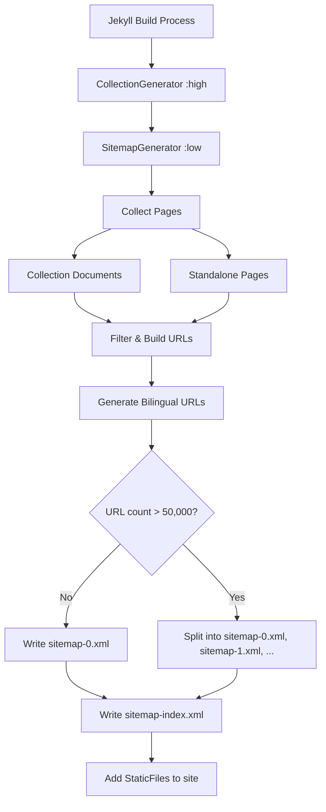

# Design Document: Sitemap Generation

## Overview

This feature adds a custom Jekyll Generator plugin (`SitemapGenerator`) that produces XML sitemap files during the Jekyll build process. The plugin generates a `sitemap-index.xml` referencing one or more `sitemap-N.xml` sub-sitemaps, following the sitemaps.org protocol.

The generator collects URLs from all five collections (spots, waterways, obstacles, notices, static_pages) and standalone HTML pages, produces bilingual URLs (German at root, English under `/en/`), and writes valid XML output to the `_site/` directory. It integrates with the existing `jekyll-multiple-languages-plugin` configuration for locale handling.

Key design decisions:
- Implemented as a single Ruby file in `_plugins/` following the existing plugin pattern (see `collection_generator.rb`)
- Runs at `:low` priority to ensure `CollectionGenerator` (`:high`) has already populated collections
- Uses Jekyll's `StaticFile` mechanism to write output files into `_site/`
- Splits sub-sitemaps at the 50,000 URL limit per the sitemaps.org spec
- All URL construction is centralized in a helper method for testability

## Architecture



The plugin follows the same architectural pattern as `CollectionGenerator`: a single `Jekyll::Generator` subclass that reads site data and writes output. No Liquid templates are used — XML is built directly in Ruby using string interpolation for simplicity and performance.

## Components and Interfaces

### SitemapGenerator (Jekyll::Generator)

**File:** `_plugins/sitemap_generator.rb`

```ruby
module Jekyll
  class SitemapGenerator < Generator
    safe true
    priority :low

    MAX_URLS_PER_SITEMAP = 50_000

    def generate(site)
    def collect_urls(site)
    def collection_urls(site)
    def standalone_urls(site)
    def bilingual_urls(site, base_paths)
    def exclude_page?(page)
    def build_url(site, path)
    def ensure_trailing_slash(path)
    def write_sitemap_index(site, sitemap_files)
    def write_sub_sitemap(site, urls, index)
    def render_url_entry(url)
    def render_sub_sitemap_xml(url_entries)
    def render_sitemap_index_xml(site, sitemap_filenames)
  end
end
```

### Method Responsibilities

| Method | Input | Output | Description |
|--------|-------|--------|-------------|
| `generate(site)` | Jekyll::Site | void | Entry point. Orchestrates URL collection, splitting, and file writing. Wraps in begin/rescue to log errors without failing the build. |
| `collect_urls(site)` | Jekyll::Site | Array\<String\> | Returns deduplicated list of absolute URLs by combining collection and standalone URLs through bilingual expansion. |
| `collection_urls(site)` | Jekyll::Site | Array\<String\> | Iterates all 5 collections, returns base paths (e.g., `/gewaesser/aare/`). |
| `standalone_urls(site)` | Jekyll::Site | Array\<String\> | Iterates `site.pages`, filters out excluded pages, returns base paths. |
| `bilingual_urls(site, base_paths)` | Jekyll::Site, Array\<String\> | Array\<String\> | For each base path, produces default locale URL and `/en/`-prefixed URL. Respects `exclude_from_localizations`. |
| `exclude_page?(page)` | Jekyll::Page | Boolean | Returns true if page is 404, under assets/, under api/, has `sitemap: false`, or doesn't produce HTML. |
| `build_url(site, path)` | Jekyll::Site, String | String | Combines `site.config['url']` with path, ensures trailing slash. |
| `ensure_trailing_slash(path)` | String | String | Appends `/` if not already present (skips paths ending in `.html` or `.xml`). |
| `write_sub_sitemap(site, urls, index)` | Jekyll::Site, Array\<String\>, Integer | String | Renders XML, writes file, returns filename. |
| `write_sitemap_index(site, sitemap_files)` | Jekyll::Site, Array\<String\> | void | Renders index XML referencing all sub-sitemaps, writes file. |

### Integration Points

- **CollectionGenerator**: Must run first (priority `:high`) to populate `site.collections[*].docs`
- **jekyll-multiple-languages-plugin**: Reads `site.config['languages']`, `site.config['default_lang']`, and `site.config['exclude_from_localizations']`
- **Jekyll StaticFile**: Output files are added via `site.static_files` so they appear in `_site/`

## Data Models

### URL Entry Structure

Each URL in the sub-sitemap is represented as a simple absolute URL string. The XML rendering adds the fixed `<changefreq>` and `<priority>` values:

```xml
<url>
  <loc>https://www.paddelbuch.ch/gewaesser/aare/</loc>
  <changefreq>daily</changefreq>
  <priority>0.7</priority>
</url>
```

### Configuration Dependencies

| Config Key | Source | Example Value | Usage |
|------------|--------|---------------|-------|
| `url` | `_config.yml` | `https://www.paddelbuch.ch` | Base URL for absolute URLs |
| `languages` | `_config.yml` | `["de", "en"]` | Determines which locale prefixes to generate |
| `default_lang` | `_config.yml` | `de` | Default locale gets no prefix |
| `exclude_from_localizations` | `_config.yml` | `["assets", "api"]` | Directories excluded from `/en/` generation |
| `collections` | `_config.yml` | `{spots: ..., waterways: ...}` | Collections to include |

### Output Files

| File | Content | Location |
|------|---------|----------|
| `sitemap-index.xml` | Sitemap index with `<sitemap>` entries | `_site/sitemap-index.xml` |
| `sitemap-0.xml` | URL set with `<url>` entries (up to 50,000) | `_site/sitemap-0.xml` |
| `sitemap-N.xml` | Additional URL sets if needed | `_site/sitemap-N.xml` |


## Correctness Properties

*A property is a characteristic or behavior that should hold true across all valid executions of a system — essentially, a formal statement about what the system should do. Properties serve as the bridge between human-readable specifications and machine-verifiable correctness guarantees.*

### Property 1: URL entry rendering contains required metadata

*For any* valid absolute URL string, rendering it as a URL entry XML fragment SHALL produce a string containing a `<loc>` element with the full URL, a `<changefreq>daily</changefreq>` element, and a `<priority>0.7</priority>` element.

**Validates: Requirements 2.3, 2.4, 2.5**

### Property 2: All collection documents are included

*For any* set of documents across the five collections (spots, waterways, obstacles, notices, static_pages), the collected URLs SHALL contain the URL for every document in every collection.

**Validates: Requirements 3.1, 3.2, 3.3, 3.4, 3.5**

### Property 3: Bilingual URL generation

*For any* included page path that is not under an excluded-from-localization directory, the generated URL list SHALL contain both the default locale URL (no prefix) and the alternate locale URL (with `/en/` prefix) for that path.

**Validates: Requirements 5.1, 5.2**

### Property 4: URL well-formedness

*For any* generated URL in the sitemap, the URL SHALL start with the configured site URL (`https://www.paddelbuch.ch`) and SHALL end with a trailing slash.

**Validates: Requirements 6.1, 6.2**

### Property 5: No duplicate URLs

*For any* set of input pages (collections + standalone), the final list of URLs written to sub-sitemap files SHALL contain no duplicate entries.

**Validates: Requirements 6.4**

### Property 6: Sitemap splitting at 50,000 URLs

*For any* total URL count N, the generator SHALL produce `ceil(N / 50,000)` sub-sitemap files, each containing at most 50,000 URL entries, and the sitemap index SHALL reference exactly that many sub-sitemaps.

**Validates: Requirements 1.3, 1.4**

### Property 7: Pages with sitemap:false are excluded

*For any* page that has `sitemap: false` in its front matter, that page's URL SHALL NOT appear in any sub-sitemap file.

**Validates: Requirements 4.5**

### Property 8: Standalone HTML pages are included

*For any* standalone page that produces HTML output and is not excluded (not 404, not under assets/, not under api/, not sitemap:false), its URL SHALL appear in the generated sitemap.

**Validates: Requirements 4.1**

## Error Handling

| Scenario | Behavior | Requirement |
|----------|----------|-------------|
| Exception during sitemap generation | Log error via `Jekyll.logger.error`, allow build to continue without sitemap files | 7.4 |
| No collections populated | Generate sitemap with only standalone page URLs | Graceful degradation |
| No standalone pages | Generate sitemap with only collection URLs | Graceful degradation |
| Empty site (no pages at all) | Generate valid sitemap-index.xml with one empty sitemap-0.xml | Graceful degradation |
| Missing `url` in `_config.yml` | Fall back to empty string, log warning | 6.1 |
| Missing `languages` config | Fall back to `["de"]` (default locale only) | 5.3 |
| Page with nil/empty URL | Skip the page, do not include in sitemap | 6.2 |

The `generate` method wraps its entire body in a `begin/rescue => e` block:

```ruby
def generate(site)
  # ... sitemap generation logic ...
rescue => e
  Jekyll.logger.error "SitemapGenerator:", "Error generating sitemap: #{e.message}"
  Jekyll.logger.debug "SitemapGenerator:", e.backtrace.join("\n")
end
```

## Testing Strategy

### Test Framework

- **Unit & Property Tests:** RSpec with Rantly (already in Gemfile: `rantly ~> 2.0`)
- **Test File:** `spec/sitemap_generator_spec.rb`
- **Pattern:** Follows existing conventions in `spec/collection_generator_spec.rb` — uses `Dir.mktmpdir`, builds minimal Jekyll sites, and tests generator methods directly

### Property-Based Tests (Rantly)

Each correctness property maps to a single property-based test using `property_of { ... }.check(100)`. Each test MUST run a minimum of 100 iterations.

Each test MUST be tagged with a comment in the format:
`# Feature: sitemap-generation, Property N: <property text>`

| Property | Test Approach | Generator Strategy |
|----------|--------------|-------------------|
| 1: URL entry rendering | Generate random URL strings, call `render_url_entry`, verify XML contains `<loc>`, `<changefreq>daily`, `<priority>0.7` | Random alphanumeric path segments joined with `/` |
| 2: Collection document inclusion | Generate random documents across random collections, run `collection_urls`, verify all document URLs present | Random slug strings assigned to random collection types |
| 3: Bilingual URL generation | Generate random base paths, call `bilingual_urls`, verify both default and `/en/` prefixed URLs exist | Random path segments |
| 4: URL well-formedness | Generate random paths, call `build_url`, verify starts with site URL and ends with `/` | Random path strings with/without trailing slashes |
| 5: No duplicate URLs | Generate page sets with potential duplicate paths, run `collect_urls`, verify uniqueness | Random paths with deliberate duplicates mixed in |
| 6: Sitemap splitting | Generate random URL counts (including > 50,000), verify correct number of sub-sitemaps and max size | Random integers for URL count |
| 7: sitemap:false exclusion | Generate pages with random `sitemap` front matter values, run exclusion filter, verify excluded when false | Random boolean/nil values for sitemap front matter |
| 8: Standalone HTML inclusion | Generate random standalone pages (HTML and non-HTML), run filter, verify HTML pages included | Random page objects with varying extensions |

### Unit Tests (Examples & Edge Cases)

| Test | What it verifies | Requirement |
|------|-----------------|-------------|
| Generates sitemap-index.xml | File exists in output | 1.1 |
| Generates sitemap-0.xml | File exists in output | 2.1 |
| Index XML has correct namespace | xmlns matches sitemaps.org | 1.2 |
| Sub-sitemap XML has correct namespace | xmlns matches sitemaps.org | 2.2 |
| XML declaration present | `<?xml version="1.0" encoding="UTF-8"?>` | 6.3 |
| 404 page excluded | 404.html URL not in output | 4.2 |
| Assets pages excluded | Pages under assets/ not in output | 4.3 |
| API pages excluded | Pages under api/ not in output | 4.4 |
| Plugin priority is :low | `SitemapGenerator.priority` check | 7.2 |
| Error handling doesn't crash build | Simulate error, verify no exception raised | 7.4 |

### Test Execution

```bash
source /opt/homebrew/share/chruby/chruby.sh && chruby ruby-3.4.1 && bundle exec rspec spec/sitemap_generator_spec.rb
```
