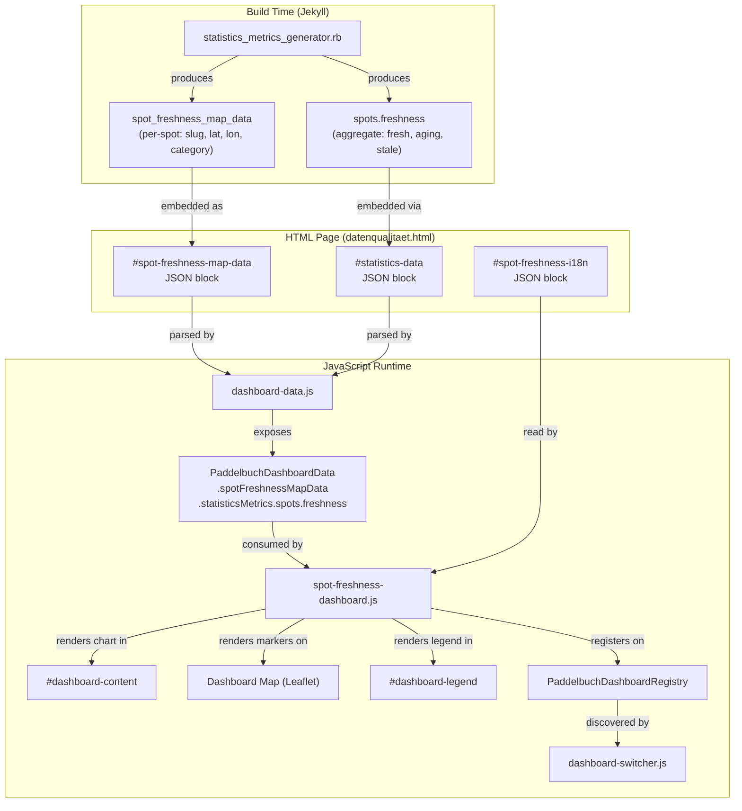

# Design Document: Spot Freshness Dashboard

## Overview

The Spot Freshness Dashboard is a new dashboard module on the data quality page (`datenqualitaet.html`) that consolidates spot-level freshness visualisation into a single view. It combines:

1. A horizontal stacked bar chart (migrated from the Statistics Dashboard) showing aggregate freshness counts.
2. A Leaflet map with shaped, colour-coded markers for every non-rejected spot with valid location and date data.
3. A shared legend that explains both the chart colours and the map marker shapes.

The dashboard integrates into the existing dashboard registry/switcher system and is the first dashboard to require both the map and content containers visible simultaneously. All freshness categories and colours reuse the same definitions as the Waterway Freshness Dashboard, sourced from `PaddelbuchColors`.

### Key Design Decisions

- **Dual-container visibility**: The dashboard switcher's `updateContainerVisibility` function currently implements a binary toggle (map XOR content). A new `usesBoth` flag (or equivalent) on the module signals the switcher to show both containers. This is a minimal, backward-compatible change.
- **Build-time data pipeline**: Per-spot freshness map data (slug, lat/lon, category) is pre-computed by the existing `statistics_metrics_generator.rb` plugin and embedded as a JSON block, avoiding client-side recomputation.
- **SVG markers via Leaflet `divIcon`**: Marker shapes (circle, triangle, square) are rendered as inline SVG inside Leaflet `divIcon` elements. Leaflet's `divIcon` applies styles programmatically, which is CSP-compliant (`element.style` assignment is not restricted by `style-src 'self'`). CSS classes handle sizing and positioning.
- **Chart migration, not duplication**: The spot freshness chart code is removed from `statistics-dashboard.js` and recreated in the new module. The Statistics Dashboard loses its freshness sub-section entirely.

## Architecture



### Script Loading Order

The new `spot-freshness-dashboard.js` must load after `dashboard-data.js` and `dashboard-map.js` but before `dashboard-switcher.js`. It is added to the page's `scripts` front matter list:

```yaml
scripts:
  - /assets/js/dashboard-data.js
  - /assets/js/dashboard-map.js
  - /assets/js/vendor/chart.umd.js
  - /assets/js/statistics-dashboard.js
  - /assets/js/freshness-dashboard.js
  - /assets/js/coverage-dashboard.js
  - /assets/js/spot-freshness-dashboard.js   # NEW
  - /assets/js/dashboard-switcher.js
```

## Components and Interfaces

### 1. Spot Freshness Dashboard Module (`spot-freshness-dashboard.js`)

The new module follows the established dashboard module interface pattern.

```javascript
// Module interface (registered on PaddelbuchDashboardRegistry)
{
  id: 'spot-freshness',
  getName: function() { /* returns localised name from #spot-freshness-i18n */ },
  usesMap: true,
  usesBoth: true,  // NEW flag: signals switcher to show map AND content
  activate: function(context) { /* renders chart, markers, legend */ },
  deactivate: function() { /* destroys chart, removes markers, clears legend/content */ }
}
```

**activate(context)** responsibilities:
- Read spot freshness map data from `PaddelbuchDashboardData.spotFreshnessMapData`
- Read aggregate freshness counts from `PaddelbuchDashboardData.statisticsMetrics.spots.freshness`
- Render the horizontal stacked bar chart in `#dashboard-content` using Chart.js
- Create Leaflet `divIcon` markers for each spot and add them to a `L.layerGroup` on the map
- Render the shared legend in `#dashboard-legend`
- Set `#dashboard-title` and `#dashboard-description`

**deactivate()** responsibilities:
- Destroy Chart.js instance
- Remove the marker layer group from the map
- Clear `#dashboard-legend`, `#dashboard-content`, `#dashboard-title`, `#dashboard-description`

### 2. Dashboard Switcher Modification (`dashboard-switcher.js`)

The `updateContainerVisibility` function is extended to check for a `usesBoth` flag:

```javascript
function updateContainerVisibility(dashboard) {
  var showMap = dashboard.usesMap || dashboard.usesBoth;
  var showContent = !dashboard.usesMap || dashboard.usesBoth;

  if (mapEl) mapEl.style.display = showMap ? '' : 'none';
  if (contentEl) contentEl.style.display = showContent ? '' : 'none';
}
```

Existing dashboards are unaffected: `usesMap: true` still hides content, `usesMap: false` still hides map. Only when `usesBoth: true` are both shown.

### 3. Statistics Dashboard Modification (`statistics-dashboard.js`)

Remove the spot freshness sub-section rendering:
- Remove `FRESHNESS_COLOR_MAP`
- Remove `buildFreshnessSegments()`
- Remove the freshness `renderBarSection()` call from `activate()`
- Remove freshness-related i18n keys from `getStrings()` defaults

### 4. Dashboard Data Module Modification (`dashboard-data.js`)

Add parsing of the new `#spot-freshness-map-data` JSON block:

```javascript
var spotFreshnessMapData = parseJsonBlock('spot-freshness-map-data');

global.PaddelbuchDashboardData = {
  freshnessMetrics: freshnessMetrics,
  coverageMetrics: coverageMetrics,
  statisticsMetrics: statisticsMetrics,
  spotFreshnessMapData: spotFreshnessMapData  // NEW
};
```

### 5. Build-Time Data Generator (`statistics_metrics_generator.rb`)

Extend `compute_metrics` to produce per-spot freshness map data:

```ruby
def compute_spot_freshness_map_data(spots)
  now = Time.now
  spots.filter_map do |spot|
    next if spot['rejected'] == true
    location = spot['location']
    next if location.nil? || location['lat'].nil? || location['lon'].nil?
    updated_at = spot['updatedAt']
    next if updated_at.nil?

    days = [(now - Time.parse(updated_at)) / 86_400.0, 0].max
    category = if days <= 730.5 then 'fresh'
               elsif days <= 1826.25 then 'aging'
               else 'stale'
               end

    { 'slug' => spot['slug'], 'lat' => location['lat'], 'lon' => location['lon'], 'category' => category }
  end
end
```

The result is exposed as `site.data['dashboard_spot_freshness_map_data']` and embedded in the HTML page as a JSON block.

### 6. Marker Shape Rendering

Markers use Leaflet `L.divIcon` with inline SVG for each shape. The SVG fill colour is set programmatically via the Leaflet API (not via HTML `style` attributes), which is CSP-compliant.

```javascript
// Shape SVG templates (fill is injected at runtime)
var SHAPES = {
  fresh:  function(color) { return '<svg width="14" height="14" viewBox="0 0 14 14"><circle cx="7" cy="7" r="6" fill="' + color + '" stroke="#fff" stroke-width="1"/></svg>'; },
  aging:  function(color) { return '<svg width="14" height="14" viewBox="0 0 14 14"><polygon points="7,1 13,13 1,13" fill="' + color + '" stroke="#fff" stroke-width="1"/></svg>'; },
  stale:  function(color) { return '<svg width="14" height="14" viewBox="0 0 14 14"><rect x="1" y="1" width="12" height="12" fill="' + color + '" stroke="#fff" stroke-width="1"/></svg>'; }
};
```

The `divIcon` HTML content is set via Leaflet's `html` option, which uses `innerHTML` assignment internally — this is not restricted by CSP `style-src`.

### 7. HTML Page Changes (`datenqualitaet.html`)

Add to the page:
- A `<script type="application/json" id="spot-freshness-map-data">` block with the pre-computed spot data
- A `<script type="application/json" id="spot-freshness-i18n">` block with localised strings
- The new JS file in the `scripts` front matter

### 8. i18n Strings

New i18n keys under `dashboards.spot_freshness`:

| Key | German Default | Purpose |
|-----|---------------|---------|
| `name` | Einstiegsort-Aktualität | Dashboard tab name |
| `description` | Aktualität der einzelnen Einstiegsorte. | Dashboard description |
| `fresh` | Aktuell (≤ 2 Jahre) | Legend: Fresh label |
| `aging` | Alternd (2–5 Jahre) | Legend: Aging label |
| `stale` | Veraltet (> 5 Jahre) | Legend: Stale label |
| `chart_title` | Aktualität der Einstiegsorte | Chart section heading |

## Data Models

### Spot Freshness Map Data (build-time → runtime)

Each entry in the `#spot-freshness-map-data` JSON array:

```json
{
  "slug": "string",
  "lat": "number",
  "lon": "number",
  "category": "fresh | aging | stale"
}
```

**Source**: `statistics_metrics_generator.rb` → `site.data['dashboard_spot_freshness_map_data']`
**Consumer**: `dashboard-data.js` → `PaddelbuchDashboardData.spotFreshnessMapData`

### Aggregate Freshness Counts (existing, unchanged)

Nested inside `statisticsMetrics.spots.freshness`:

```json
{
  "fresh": "number",
  "aging": "number",
  "stale": "number"
}
```

### Freshness Category Mapping

| Category | Threshold (days since updatedAt) | Colour Key | Marker Shape |
|----------|----------------------------------|------------|-------------|
| Fresh | ≤ 730.5 (≤ 2 years) | `green1` | Circle |
| Aging | 730.5 – 1826.25 (2–5 years) | `warningYellow` | Triangle |
| Stale | > 1826.25 (> 5 years) | `dangerRed` | Square |

### Dashboard Module Interface (existing pattern)

```typescript
interface DashboardModule {
  id: string;
  getName(): string;
  usesMap: boolean;
  usesBoth?: boolean;  // NEW optional flag
  activate(context: DashboardContext): void;
  deactivate(): void;
}

interface DashboardContext {
  map: L.Map;
  contentEl: HTMLElement;
  legendEl: HTMLElement;
  data: PaddelbuchDashboardData;
}
```


## Correctness Properties

*A property is a characteristic or behavior that should hold true across all valid executions of a system — essentially, a formal statement about what the system should do. Properties serve as the bridge between human-readable specifications and machine-verifiable correctness guarantees.*

### Property 1: Dual-container visibility on activation

*For any* dashboard module with `usesBoth: true`, when activated via the dashboard switcher, both the `#dashboard-map` and `#dashboard-content` containers should have `display` not equal to `'none'`.

**Validates: Requirements 2.1**

### Property 2: Container visibility reverts on dashboard switch

*For any* sequence where a `usesBoth` dashboard is activated followed by a non-`usesBoth` dashboard, the second activation should restore the standard single-container visibility: if `usesMap` is true then content is hidden and map is shown, if `usesMap` is false then map is hidden and content is shown.

**Validates: Requirements 2.2**

### Property 3: Chart colours match PaddelbuchColors

*For any* `PaddelbuchColors` configuration, the spot freshness chart datasets should use `colors.green1` for the Fresh segment, `colors.warningYellow` for the Aging segment, and `colors.dangerRed` for the Stale segment — with no hardcoded hex values.

**Validates: Requirements 3.2, 5.4**

### Property 4: Chart data reflects pre-computed metrics

*For any* freshness metrics object `{ fresh: F, aging: A, stale: S }`, the chart should render three dataset segments whose percentage values correspond to `F / (F+A+S) * 100`, `A / (F+A+S) * 100`, and `S / (F+A+S) * 100` respectively.

**Validates: Requirements 3.3**

### Property 5: Chart destroyed on deactivation

*For any* activation followed by deactivation of the Spot Freshness Dashboard, all Chart.js instances created during activation should be destroyed (no lingering chart references).

**Validates: Requirements 3.4, 8.2**

### Property 6: Marker count equals valid spots

*For any* array of spot data entries, the number of markers added to the map should equal the count of entries that are non-rejected AND have a non-null `location` (with valid `lat` and `lon`) AND have a non-null `updatedAt` value. Spots failing any of these conditions should produce zero markers.

**Validates: Requirements 4.1, 4.5, 4.6**

### Property 7: Marker shape and colour match freshness category

*For any* spot with a valid `updatedAt` and `location`, the marker should use the correct shape (circle for Fresh, triangle for Aging, square for Stale) and the correct colour from `PaddelbuchColors` (`green1` for Fresh, `warningYellow` for Aging, `dangerRed` for Stale) based on the spot's computed freshness category.

**Validates: Requirements 4.2, 4.3**

### Property 8: Legend has exactly three entries

*For any* spot data input (including empty data), the shared legend should always render exactly three entries: Fresh, Aging, and Stale. The "No Data" category from the Waterway Freshness Dashboard should never appear.

**Validates: Requirements 5.2**

### Property 9: Generator produces correct per-spot freshness data

*For any* set of spot data, the build-time generator should produce an output entry for each spot that is non-rejected, has a valid `location`, and has a valid `updatedAt`. Each output entry should contain `slug`, `lat`, `lon`, and a `category` value that matches the freshness threshold rules (≤ 730.5 days → fresh, 730.5–1826.25 → aging, > 1826.25 → stale).

**Validates: Requirements 6.1**

### Property 10: i18n fallback to German defaults

*For any* i18n JSON block content (including absent block, empty object, or object with missing keys), the `getStrings()` function should return a complete strings object where every key has a non-empty value, falling back to the German default when the i18n source is missing or incomplete.

**Validates: Requirements 7.2, 1.2**

### Property 11: All UI elements cleared on deactivation

*For any* activation followed by deactivation of the Spot Freshness Dashboard, the `#dashboard-legend`, `#dashboard-content`, `#dashboard-title`, and `#dashboard-description` elements should all have empty content, and the map should have no markers from this dashboard.

**Validates: Requirements 8.1, 8.3, 5.5**

### Property 12: No inline style attributes in rendered HTML

*For any* spot data input, the HTML rendered by the Spot Freshness Dashboard (legend, chart container, markers) should not contain any `style="..."` attributes. All styling must be applied via CSS classes or Leaflet's programmatic style API.

**Validates: Requirements 9.2, 9.4**

## Error Handling

### Missing or Malformed Data

| Scenario | Handling |
|----------|----------|
| `#spot-freshness-map-data` JSON block missing | `dashboard-data.js` returns empty array; dashboard renders chart only (zero markers) |
| `#spot-freshness-i18n` JSON block missing | `getStrings()` returns German defaults |
| `PaddelbuchDashboardData.statisticsMetrics.spots.freshness` missing | Chart renders with zero counts for all segments |
| Individual spot entry missing `lat`, `lon`, or `category` | Entry skipped during marker creation |
| `PaddelbuchColors` missing colour keys | Fallback to grey (`#999999`) consistent with existing `getColor()` pattern in statistics dashboard |
| Chart.js not loaded | `createStackedBarChart` returns null; chart area remains empty, map still works |
| Leaflet map not available | Markers are not created; chart and legend still render |

### Deactivation Safety

- `deactivate()` is idempotent: calling it multiple times has no adverse effect
- Chart destruction is wrapped in try/catch (following existing pattern in `statistics-dashboard.js`)
- Layer group removal uses Leaflet's `remove()` which is safe to call on already-removed layers

## Testing Strategy

### Unit Tests

Unit tests verify specific examples, edge cases, and integration points:

- Dashboard module registers with id `spot-freshness` on the registry (Req 1.1)
- Module exposes `activate` and `deactivate` as functions (Req 1.3)
- Statistics dashboard no longer contains freshness chart rendering (Req 3.5)
- Legend renders SVG shapes (not plain swatches) for each category (Req 5.3)
- HTML page contains `#spot-freshness-map-data` JSON block (Req 6.2)
- HTML page contains `#spot-freshness-i18n` JSON block (Req 7.1)
- `usesBoth` flag is set to `true` on the module (Req 2.3)

### Property-Based Tests

Property-based tests verify universal properties across randomly generated inputs. Each property test must:
- Run a minimum of 100 iterations
- Reference its design document property in a tag comment
- Use a property-based testing library (fast-check for JavaScript, Hypothesis for the Ruby generator)

Each correctness property (Properties 1–12) is implemented by a single property-based test.

**JavaScript tests** (fast-check):
- Properties 1–8, 10–12: Test the dashboard module, switcher, and rendering logic with generated spot data, colour configurations, and i18n content

**Ruby tests** (Hypothesis via rspec-hypothesis, or property-based approach with random data):
- Property 9: Test `compute_spot_freshness_map_data` with generated spot arrays

**Tag format**: `Feature: spot-freshness-dashboard, Property {number}: {property_text}`

Example:
```javascript
// Feature: spot-freshness-dashboard, Property 6: Marker count equals valid spots
fc.assert(fc.property(
  fc.array(spotArbitrary),
  (spots) => {
    // ... activate dashboard with spots, count markers, compare to valid spot count
  }
), { numRuns: 100 });
```
