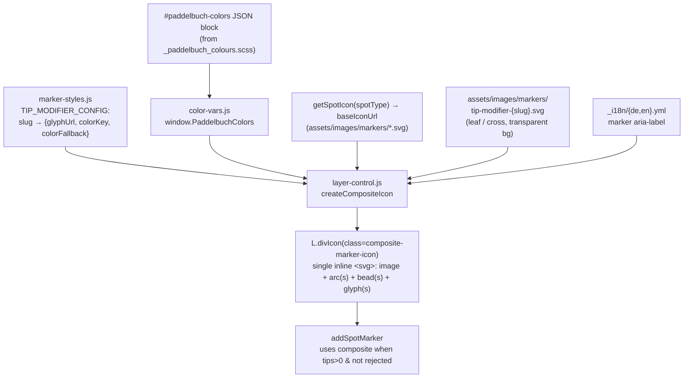

# Design Document: Spot Tip Marker Redesign

## Overview

This redesign replaces the map's tip **Modifier_Icon** rendering. Today, `createCompositeIcon()` in `assets/js/layer-control.js` builds an HTML string of stacked `` elements — a base marker image plus one absolutely-positioned modifier image per tip — and wraps it in a Leaflet `DivIcon`. The modifier images are positioned with inline `style="position:absolute;left:…;top:…"`, which the deployed CSP (`style-src 'self'`) blocks, and they use circular disc artwork that floats at the marker corners.

The new design composes a **single inline `<svg>`** per tipped marker (a `Composite_Icon`) that draws, in one coordinate system:

1. the **Base_Marker_Icon** (referenced as an `<image>`),
2. an open **Halo** arc that hugs the head from shoulder to shoulder,
3. one **Bead** (white circle, coloured stroke) per applicable tip, seated on the Halo, and
4. one **Tip_Glyph** (`<image>`) inside each Bead.

All positioning uses SVG geometry and presentation attributes (no inline `style`), so it is CSP-clean. Colours are resolved from `window.PaddelbuchColors` (the palette single source of truth, `_sass/settings/_paddelbuch_colours.scss`). The exact geometry is transcribed from the approved **Reference_Mockup** (`.kiro/specs/spot-tip-marker-redesign/reference/marker-modifier-mockups.html`, symbols `m-opt3b`, `m-opt3b-1tip`, `m-opt3b-rest`, `g-leaf-*`, `g-cross-*`).

Non-tipped markers and rejected markers are **unchanged** — they continue to use the standard `L.icon` from `PaddelbuchMarkerStyles.getSpotIcon()`.

## Scope

**In scope (client-side rendering only):**
- `assets/js/marker-styles.js` — `TIP_MODIFIER_CONFIG` shape.
- `assets/js/layer-control.js` — `createCompositeIcon()`; `addSpotMarker()` integration point (icon-builder call + accessible label).
- `assets/images/markers/tip-modifier-swiss-canoe-eco-tip.svg`, `assets/images/markers/tip-modifier-swiss-canoe-tip.svg` — glyph artwork.
- `_sass/components/_map.scss` — `.composite-marker-icon` container styling (if any CSS is needed).
- `_i18n/de.yml`, `_i18n/en.yml` — accessible-label strings.
- `_tests/property/spot-tip-modifier-offsets.property.test.js`, `_tests/property/spot-tip-composite-marker.property.test.js` — updated tests.
- `docs/frontend.md`, `docs/testing.md` — documentation.

**Out of scope (unchanged):** Contentful/data pipeline, `spotTipType_slugs` on spots, the filter panel/engine, the `spotTipType` dimension config, marker registry metadata, tip banners on the detail page, the API, and the `assets/images/tips/` banner assets.

## Architecture



`addSpotMarker()` keeps its current decision logic: build the composite only when `!isRejected && tipSlugs.length > 0 && PaddelbuchMarkerStyles`; otherwise use the standard `getSpotIcon(spotType, isRejected)`. Marker-registry metadata (including `spotTipType_slugs`) and the `marker.click` beacon are unchanged.

## Coordinate system and geometry (transcribed from the Reference_Mockup)

The Composite_Icon `<svg>` uses **`viewBox="-20 -24 92 116"`** (width 92, height 116). The Base_Marker_Icon is drawn into `x=0 y=0 width=52 height=84` (its native viewBox), so the pin tip sits at `(26, 83)` and the head circle is centred at `(26, 26)` with radius ~25.

All values below are in this viewBox coordinate space and match the mockup exactly.

### Halo arc (radius 29, centred on the head)

The arc endpoints are the pin's neck-shoulders projected onto radius 29 — `(10.59, 50.56)` (left) and `(41.41, 50.56)` (right) — with apex `(26, -3)`. Stroke width `2.5`, `stroke-linecap="round"`, `fill="none"`.

| Tips | Arc path(s) |
|------|-------------|
| 1 tip | Full horseshoe, single colour = tip colour: `M10.59,50.56 A29,29 0 1 1 41.41,50.56` |
| 2 tips | Left half (colour = tip[0]): `M10.59,50.56 A29,29 0 0 1 26,-3` — Right half (colour = tip[1]): `M26,-3 A29,29 0 0 1 41.41,50.56` |

### Beads (radius 9, white fill, stroke = tip colour, stroke-width 1.5)

| Tips | Bead centres |
|------|--------------|
| 1 tip | `(26, -6)` |
| 2 tips | tip[0] `(3.5, 3.5)`, tip[1] `(48.5, 3.5)` |

The 2-tip Bead centres sit at ~radius 32 from the head centre (slightly proud of the r29 arc) so the upper-right Bead clears the entry/exit arrowhead (which reaches ~radius 20). The arc threads through each Bead's lower edge, so the Beads read as seated on the Halo. Beads are drawn **after** the arc so they render on top.

### Tip_Glyphs (`<image>`, 12×12, centred on the bead)

Each glyph is placed at `x = beadCx − 6`, `y = beadCy − 6`, `width=12 height=12`, `href` = the tip's `tip-modifier-{slug}.svg`.

| Tips | Glyph placements |
|------|------------------|
| 1 tip | `(20, -12)` |
| 2 tips | tip[0] `(-2.5, -2.5)`, tip[1] `(42.5, -2.5)` |

The **glyph SVG files** are authored so the glyph is centred within their own viewBox with a clear margin, reproducing the mockup framing:
- **Leaf** (`tip-modifier-swiss-canoe-eco-tip.svg`): the visible Layer-1 leaf path from the eco banner, `fill="#07753f"`, with the viewBox padded so the leaf occupies ~80% of the box (mockup used `viewBox="-98 -73 1180 1180"` around the leaf path). The hidden/zero-opacity embedded PNG layer from the banner is **excluded**.
- **Cross** (`tip-modifier-swiss-canoe-tip.svg`): the cross path from the corner of the Swiss Canoe banner, `fill="#1b1e43"`, framed as in the mockup (`viewBox="1.5 -0.5 23 23"` around the cross path).

### Sizing / anchor (preserve current on-screen appearance)

The Base_Marker_Icon must render at the same on-screen size as a standard marker (~32 px wide) and stay anchored at the pin tip.

- Scale `k = 32 / 52 ≈ 0.6154` px per viewBox unit.
- `<svg>` pixel size / `iconSize` ≈ `[92·k, 116·k]` ≈ `[57, 71]`.
- `iconAnchor` = pin tip position in px from the icon's top-left = `((26 − (−20))·k, (83 − (−24))·k)` ≈ `[28.3, 65.9]`.
- `popupAnchor` ≈ `[0, −58]` (tune so the popup opens just above the marker top, matching the prior `[0, −53]` behaviour).

These are guidance values; the implementer SHOULD verify against a running map that (a) a tipped marker's pin aligns pixel-for-pixel with an adjacent non-tipped marker of the same spot type, and (b) the popup opens in the same place. The invariants (pin anchored at tip; pin ~32 px wide) are the acceptance test, not the exact float values.

## Components and Interfaces

### 1. `assets/js/marker-styles.js` — revised `TIP_MODIFIER_CONFIG`

Replace the disc config (`offset`, `size`) with glyph + colour. Keep `basePath` and the `PaddelbuchMarkerStyles.TIP_MODIFIER_CONFIG` export.

```javascript
// Single authoritative source: maps each tip slug to its glyph asset and colour.
// colorKey indexes window.PaddelbuchColors (from _paddelbuch_colours.scss);
// colorFallback mirrors the token for graceful degradation when the palette is unavailable.
var TIP_MODIFIER_CONFIG = {
  'swiss-canoe-eco-tip': {
    glyphUrl: basePath + 'tip-modifier-swiss-canoe-eco-tip.svg',
    colorKey: 'green-1',
    colorFallback: '#07753f'
  },
  'swiss-canoe-tip': {
    glyphUrl: basePath + 'tip-modifier-swiss-canoe-tip.svg',
    colorKey: 'swisscanoe-blue',
    colorFallback: '#1b1e43'
  }
};
```

> **Note on `colorKey`:** it must match a key present in the `#paddelbuch-colors` JSON block that `color-vars.js` parses. Confirm the emitted keys (they mirror the SCSS variable names — e.g. `green-1`, `swisscanoe-blue`); if the block does not currently emit these tokens, extend the include that generates it so they are present. `colorFallback` guarantees correct rendering regardless.

A small colour resolver (in `marker-styles.js` or `layer-control.js`):

```javascript
function resolveTipColor(cfg) {
  var palette = (typeof window !== 'undefined' && window.PaddelbuchColors) || {};
  return palette[cfg.colorKey] || cfg.colorFallback;
}
```

### 2. `assets/js/layer-control.js` — rewritten `createCompositeIcon`

Signature becomes `createCompositeIcon(baseIconUrl, tipSlugs, ariaLabel)`. It builds a single inline `<svg>` string (no inline `style`), using only slugs that have a config entry.

Structure of the produced markup (illustrative — final geometry per the tables above):

```html
<svg viewBox="-20 -24 92 116" role="img" aria-label="{escaped localized label}"
     xmlns="http://www.w3.org/2000/svg" xmlns:xlink="http://www.w3.org/1999/xlink">
  <image href="{baseIconUrl}" xlink:href="{baseIconUrl}" x="0" y="0" width="52" height="84" />
  <!-- Halo arc segment(s): one path for 1 tip, two for 2 tips; stroke = tip colour(s) -->
  <path d="…" fill="none" stroke="{color}" stroke-width="2.5" stroke-linecap="round" />
  <!-- Per applicable tip: bead + glyph -->
  <circle cx="…" cy="…" r="9" fill="#fff" stroke="{color}" stroke-width="1.5" />
  <image href="{glyphUrl}" xlink:href="{glyphUrl}" x="…" y="…" width="12" height="12" />
</svg>
```

Rules:
- Filter `tipSlugs` to those present in `TIP_MODIFIER_CONFIG` (skip unknown slugs; Requirement 6.4). Let `applied` = the filtered list.
- `applied.length === 1` → single top-centre bead + full-horseshoe arc in that tip's colour.
- `applied.length === 2` → upper-left/upper-right beads + split arc, each segment/bead in its tip's colour.
- `applied.length === 0` → **do not** build a composite; caller falls back to the standard icon.
- `applied.length > 2` → **not required** by current data (only two tip types exist). Define a bounded behaviour: render the first two applicable tips as the 2-tip layout (documented limitation), and leave a clear extension point (see Error Handling). This SHALL be covered by a note, not by unbounded geometry.
- Escape the `aria-label` and any interpolated values with the existing `PaddelbuchHtmlUtils.escapeHtml` before injecting into the markup string.
- Return `L.divIcon({ html, className: 'composite-marker-icon', iconSize, iconAnchor, popupAnchor })` with the sizing from the "Sizing / anchor" section.

Include both `href` and `xlink:href` on `<image>` for maximum browser compatibility.

`addSpotMarker()` changes:
- Build the localised `ariaLabel` (see i18n below) from `spot.name` and the localised tip labels, then pass it to `createCompositeIcon`.
- Decision logic otherwise unchanged: composite only when `!isRejected && tipSlugs.length > 0 && window.PaddelbuchMarkerStyles`.

### 3. Glyph SVG assets

- `assets/images/markers/tip-modifier-swiss-canoe-eco-tip.svg` — green leaf glyph only, transparent background, framed per the mockup (leaf ~80% of viewBox). Source: the visible leaf path of `assets/images/tips/tip-banner-swiss-canoe-eco-tip.svg`. **Exclude** the hidden zero-opacity embedded raster ("Moon") layer.
- `assets/images/markers/tip-modifier-swiss-canoe-tip.svg` — navy cross glyph only, transparent background. Source: the cross path from the corner of `assets/images/tips/tip-banner-swiss-canoe-tip.svg`.

These replace the current disc-style files of the same names.

### 4. `_sass/components/_map.scss` — `.composite-marker-icon`

The existing rule (`position: relative; background: transparent; border: none;`) can be simplified: with a single self-contained `<svg>` there is no absolute-positioning context to establish. Keep `background: transparent; border: none;` and add `overflow: visible;` only if needed. No per-marker styling belongs here (all geometry is in the SVG). No inline styles are introduced.

### 5. i18n — accessible label

Add matching keys to `_i18n/de.yml` and `_i18n/en.yml`, following the existing `map.*` accessibility-label convention (e.g. `map.spot_map_label`). Example:

```yaml
# de.yml
map:
  spot_with_tips_label: "%{spot}, Tipps: %{tips}"
# en.yml
map:
  spot_with_tips_label: "%{spot}, tips: %{tips}"
```

The client builds `%{tips}` by joining the localised Spot_Tip_Type labels (available from the `spotTipType` dimension config in `map_data_config_json` / map-data-init) for the spot's slugs. Because the label template is consumed in JavaScript, it must be made available to the client (e.g. via an existing translated-strings JSON block the map already uses, or by resolving the label entirely from data the client already has). The design constraint (Requirement 5.4) is that tip names come from existing localised data, not hard-coded JS.

## Data Models

### `TIP_MODIFIER_CONFIG` entry (new shape)

| Field | Type | Description |
|-------|------|-------------|
| `glyphUrl` | String | Absolute `/assets/images/markers/tip-modifier-{slug}.svg` path for the Tip_Glyph. |
| `colorKey` | String | Key into `window.PaddelbuchColors` (mirrors an `_paddelbuch_colours.scss` token). |
| `colorFallback` | String | Hex mirroring the token, used when the palette key is unavailable. |

Removed vs. old shape: `iconUrl` (renamed `glyphUrl`), `offset` (deleted), `size` (deleted).

### Composite_Icon geometry (constants, per the mockup)

| Constant | Value |
|----------|-------|
| viewBox | `-20 -24 92 116` |
| base image box | `x=0 y=0 w=52 h=84` |
| arc radius | `29` (centre `26,26`) |
| arc shoulders / apex | `(10.59, 50.56)` / `(41.41, 50.56)` / `(26, -3)` |
| bead radius / stroke | `9` / `1.5` |
| 1-tip bead centre | `(26, -6)` |
| 2-tip bead centres | `(3.5, 3.5)`, `(48.5, 3.5)` |
| glyph box | `12 × 12`, centred on bead |

## Correctness Properties

### Property 1: Composite_Icon is CSP-clean (no inline styles)
*For any* non-empty set of tip slugs with config entries, the markup returned by `createCompositeIcon` shall contain **no** `style=` attribute.
**Validates: Requirements 3.1, 3.2**

### Property 2: Bead and glyph count matches applicable tips
*For any* array of tip slugs, let `applied` be the subset present in `TIP_MODIFIER_CONFIG` (capped at 2). The Composite_Icon SVG shall contain exactly `applied.length` `<circle>` beads and exactly `applied.length` glyph `<image>` elements, and each glyph `<image>` `href` shall equal the `glyphUrl` of the corresponding applied slug. Slugs absent from the config contribute no bead/glyph.
**Validates: Requirements 1.1, 6.4, 7.2**

### Property 3: Colours resolve from the palette with fallback
*For any* applied tip, the stroke colour used for its bead and its Halo segment shall equal `PaddelbuchColors[colorKey]` when that key exists, and `colorFallback` otherwise.
**Validates: Requirements 4.1, 4.2, 4.3**

### Property 4: Halo layout by tip count
*For any* `applied` list, `applied.length === 1` shall produce exactly one arc `<path>` and a single top-centre bead; `applied.length === 2` shall produce two arc `<path>` segments and upper-left + upper-right beads. Bead centres and arc paths shall equal the constants in the geometry table.
**Validates: Requirements 1.5, 1.6, 1.4**

### Property 5: Anchored at the pin tip
The `iconAnchor` of the returned `DivIcon` shall correspond to the pin-tip position `(26, 83)` in the viewBox, mapped through the icon's pixel scale, so a tipped marker points at the same geographic pixel as a standard marker.
**Validates: Requirement 1.9**

### Property 6: Non-empty localised accessible name
*For any* spot passed to the composite builder with a name and ≥1 applicable tip, the produced `<svg>` shall carry a non-empty `aria-label` (and `role="img"`).
**Validates: Requirements 5.1, 5.3**

## Error Handling

- **Unknown tip slug (no config entry):** skipped when building `applied`; no bead/glyph, no error (Requirement 6.4).
- **Zero applicable tips:** `createCompositeIcon` is not used; `addSpotMarker` falls back to the standard `L.icon`.
- **More than two applicable tips:** current data has only two tip types. Render the first two as the 2-tip layout and document the limitation; the code SHALL include a clearly marked extension point (e.g. a comment/TODO and a single place where bead/arc positions are computed) so a future spec can add a 3+ layout. No unbounded/overlapping geometry is emitted.
- **`PaddelbuchColors` missing/malformed:** `color-vars.js` already degrades gracefully (leaves the global unset); `resolveTipColor` falls back to `colorFallback`.
- **Missing glyph SVG file:** the `<image>` shows nothing (transparent) — a deploy-time asset issue, consistent with the existing convention that per-tip SVGs are design assets. No console error.
- **Missing localised label string:** fall back to a spot-name-only or generic localised label; never emit an empty `aria-label`.

## Testing Strategy

JavaScript tests use the project's existing tooling (Jest + fast-check) under `_tests/property/`. Update the two existing marker tests and add CSP/a11y assertions.

| Property | Test file | Notes |
|----------|-----------|-------|
| P1 CSP-clean | `_tests/property/spot-tip-composite-marker.property.test.js` | Assert no `style=` in the composite markup. |
| P2 bead/glyph count | `_tests/property/spot-tip-composite-marker.property.test.js` | Generate random slug arrays (known + unknown); assert bead/glyph counts and `href`s; unknown slugs skipped. |
| P3 colour resolution | `_tests/property/spot-tip-composite-marker.property.test.js` | Stub `window.PaddelbuchColors` present/absent; assert palette-then-fallback. |
| P4 halo layout | `_tests/property/spot-tip-composite-marker.property.test.js` | 1-tip vs 2-tip arc/bead geometry equals the constants. |
| P6 accessible name | `_tests/property/spot-tip-composite-marker.property.test.js` | Assert non-empty `aria-label` + `role="img"`. |
| config shape | `_tests/property/spot-tip-modifier-offsets.property.test.js` | Repurpose/rename: assert every `TIP_MODIFIER_CONFIG` entry has `glyphUrl` + colour and **no** `offset`/`size`. |

**Existing tests that must be reconciled:** the current `spot-tip-modifier-offsets.property.test.js` asserts unique per-tip offsets — that assertion is now obsolete and must be replaced (or the file renamed) to assert the new config shape. `spot-tip-composite-marker.property.test.js` currently asserts `` layering with offset styles — it must be rewritten for the SVG composition.

### Integration verification (manual, after implementation)

1. Load the main map; a spot with one tip shows a single top-centre bead on an open halo; a spot with two tips shows the split-colour halo with upper-left/upper-right beads.
2. Beads do not cover the pin's glyph; the neck is clear.
3. A tipped marker's pin aligns with an adjacent non-tipped marker of the same type; clicking opens the popup just above the marker.
4. Rejected spots and no-tip spots are visually unchanged.
5. In the browser console/network panel, confirm **no CSP violations** for the map markers.
6. Compare against `.kiro/specs/spot-tip-marker-redesign/reference/marker-modifier-mockups.html` (the `m-opt3b*` markers) for geometry/colour parity.
