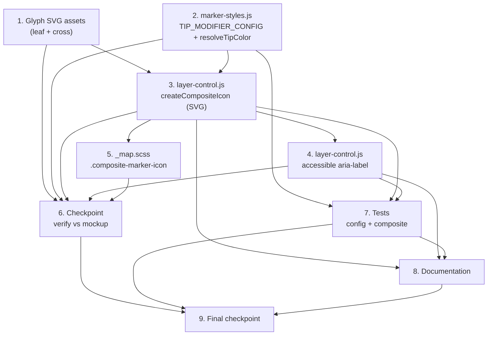

# Implementation Plan: Spot Tip Marker Redesign

## Overview

Replace the circular corner-badge tip Modifier_Icons with the approved open-**Halo** design (single inline `<svg>` Composite_Icon), superseding `spot-tips` Requirement 4. This is a **client-side rendering change only** — no data-pipeline, filter, API, or tip-banner changes.

The approved visual is captured in `.kiro/specs/spot-tip-marker-redesign/reference/marker-modifier-mockups.html` (symbols `m-opt3b`, `m-opt3b-1tip`, `m-opt3b-rest`, `g-leaf-*`, `g-cross-*`) — use it as the geometry/colour source of truth. All geometry constants are in `design.md` § "Coordinate system and geometry".

Language/tooling: vanilla JavaScript (IIFE-to-global, ES5/ES6, no build) and SVG assets; JS tests use Jest + fast-check under `_tests/property/`. Must comply with the CSP, JavaScript, colour, and i18n steering.

## Tasks

- [ ] 1. Glyph SVG assets — new leaf and cross artwork
  - [ ] 1.1 Replace `assets/images/markers/tip-modifier-swiss-canoe-eco-tip.svg` with the green leaf glyph
    - Use the visible Layer-1 leaf path from `assets/images/tips/tip-banner-swiss-canoe-eco-tip.svg`, `fill="#07753f"`, transparent background, glyph only (no disc)
    - Frame the leaf to ~80% of the viewBox (mockup used `viewBox="-98 -73 1180 1180"` around the leaf path) so there is a clear margin inside the bead
    - **Exclude** the hidden, zero-opacity embedded raster ("Moon") layer from the source banner
    - _Requirements: 2.1, 2.3, 2.4, 2.5, 4.4_
  - [ ] 1.2 Replace `assets/images/markers/tip-modifier-swiss-canoe-tip.svg` with the navy cross glyph
    - Use the cross path from the corner of `assets/images/tips/tip-banner-swiss-canoe-tip.svg`, `fill="#1b1e43"`, transparent background, glyph only (no disc)
    - Frame as in the mockup (`viewBox="1.5 -0.5 23 23"` around the cross path)
    - _Requirements: 2.2, 2.3, 2.5, 4.4_

- [ ] 2. `marker-styles.js` — revised `TIP_MODIFIER_CONFIG`
  - [ ] 2.1 Redefine `TIP_MODIFIER_CONFIG` with the new shape
    - Each entry: `{ glyphUrl: basePath + 'tip-modifier-{slug}.svg', colorKey, colorFallback }`; remove `offset` and `size`
    - `swiss-canoe-eco-tip` → `colorKey: 'green-1'`, `colorFallback: '#07753f'`; `swiss-canoe-tip` → `colorKey: 'swisscanoe-blue'`, `colorFallback: '#1b1e43'`
    - Keep the `PaddelbuchMarkerStyles.TIP_MODIFIER_CONFIG` export
    - _Requirements: 6.1, 6.2, 6.3, 4.1, 4.2_
  - [ ] 2.2 Add a `resolveTipColor(cfg)` helper
    - Return `window.PaddelbuchColors[cfg.colorKey]` when present, else `cfg.colorFallback`
    - Export it (or place it in `layer-control.js`) so the composite builder can use it
    - _Requirements: 4.2, 4.3_
  - [ ] 2.3 Verify the `#paddelbuch-colors` JSON block emits the needed keys
    - Confirm `color-vars.js` / the include that generates `#paddelbuch-colors` exposes `green-1` and `swisscanoe-blue`; if not, extend that include to include them
    - _Requirements: 4.2_

- [ ] 3. `layer-control.js` — SVG-based `createCompositeIcon`
  - [ ] 3.1 Rewrite `createCompositeIcon(baseIconUrl, tipSlugs, ariaLabel)` to build a single inline `<svg>`
    - `viewBox="-20 -24 92 116"`, `role="img"`, escaped `aria-label`; base marker via `<image href xlink:href width=52 height=84>`
    - Filter `tipSlugs` to those in `TIP_MODIFIER_CONFIG` → `applied` (cap at 2; see 3.3)
    - Draw Halo arc(s), Bead(s), and Tip_Glyph `<image>`(s) per the geometry tables in `design.md` (1-tip and 2-tip layouts), colours via `resolveTipColor`
    - **No inline `style` attributes** anywhere in the markup; escape interpolated values with `PaddelbuchHtmlUtils.escapeHtml`
    - Return `L.divIcon({ html, className: 'composite-marker-icon', iconSize, iconAnchor, popupAnchor })` with sizing from design.md (pin ~32px wide, anchored at pin tip)
    - _Requirements: 1.1, 1.2, 1.3, 1.4, 1.5, 1.6, 1.9, 3.1, 3.2, 3.3, 6.4_
  - [ ] 3.2 Verify anchor/size parity on a running map
    - Confirm a tipped marker's pin aligns pixel-for-pixel with an adjacent non-tipped marker of the same spot type, and the popup opens just above the marker (tune `iconAnchor`/`popupAnchor` if needed)
    - _Requirements: 1.9, 1.10_
  - [ ] 3.3 Handle the >2-tip case with a bounded fallback + extension point
    - Render the first two applicable tips using the 2-tip layout; add a clearly-marked comment/extension point where bead/arc positions are computed so a future spec can add a 3+ layout
    - _Requirements: 6.4 (graceful), design.md § Error Handling_

- [ ] 4. `layer-control.js` — accessible label in `addSpotMarker`
  - [ ] 4.1 Build a localised `ariaLabel` and pass it to `createCompositeIcon`
    - Compose from `spot.name` + the localised Spot_Tip_Type labels for the spot's slugs (from the `spotTipType` dimension config / map-data-init — do not hard-code tip names in JS)
    - Fall back to a spot-name-only or generic localised label if tip labels are unavailable; never emit an empty label
    - Keep the existing composite-vs-standard decision logic and marker-registry metadata unchanged
    - _Requirements: 5.1, 5.3, 5.4_
  - [ ] 4.2 Add the accessible-label string to both locale files
    - Add `map.spot_with_tips_label` (with `%{spot}` / `%{tips}` interpolation) to `_i18n/de.yml` and `_i18n/en.yml` with matching key structure; make it available to the client via the mechanism the map already uses for translated strings
    - _Requirements: 5.2_

- [ ] 5. `_sass/components/_map.scss` — composite container
  - [ ] 5.1 Simplify `.composite-marker-icon`
    - Keep `background: transparent; border: none;`; drop `position: relative` (no longer needed); add `overflow: visible;` only if required by testing
    - Ensure no inline styles are introduced anywhere in the marker path
    - _Requirements: 3.1, 3.2_

- [ ] 6. Checkpoint — Verify rendering against the mockup
  - Run the local site, open the main map, and compare tipped markers (1-tip and 2-tip) against `.kiro/specs/spot-tip-marker-redesign/reference/marker-modifier-mockups.html`; confirm no CSP violations in the console. Ask the user if questions arise.

- [ ] 7. Tests — update to the new model
  - [ ] 7.1 Update/replace `_tests/property/spot-tip-modifier-offsets.property.test.js`
    - Remove the obsolete unique-offset assertion; assert every `TIP_MODIFIER_CONFIG` entry has `glyphUrl` and a colour (`colorKey` + `colorFallback`) and **no** `offset`/`size`. Rename the file if a more accurate name is warranted (update references)
    - **Property (config shape):** validates the single-source config no longer carries offsets
    - _Requirements: 7.1_
  - [ ] 7.2 Rewrite `_tests/property/spot-tip-composite-marker.property.test.js` for the SVG composition
    - **Property 2 (bead/glyph count):** for random slug arrays (known + unknown), assert the composite SVG has exactly `applied.length` beads and `applied.length` glyph `<image>`s with correct `href`s; unknown slugs skipped
    - **Property 1 (CSP-clean):** assert the markup contains no `style=` attribute
    - **Property 3 (colour):** stub `window.PaddelbuchColors` present/absent; assert palette-then-fallback colour
    - **Property 4 (halo layout):** assert 1-tip vs 2-tip arc/bead geometry equals the design constants
    - **Property 6 (a11y):** assert non-empty `aria-label` and `role="img"`
    - _Requirements: 7.2, 7.3, 7.4, 7.5_

- [ ] 8. Documentation updates
  - [ ] 8.1 Update `docs/frontend.md`
    - Describe the SVG-based Composite_Icon in `layer-control.js`, the revised `TIP_MODIFIER_CONFIG` shape in `marker-styles.js`, and colour sourcing via `PaddelbuchColors`
    - Reference `.kiro/specs/spot-tip-marker-redesign/reference/marker-modifier-mockups.html` as the visual source of truth for the marker tip design
    - _Requirements: 8.1, 8.3_
  - [ ] 8.2 Update `docs/testing.md`
    - Reflect the updated/renamed marker property test files
    - _Requirements: 8.2_

- [ ] 9. Final checkpoint — Ensure all tests pass
  - Run the JS test suite and a full local build; confirm all tests pass and there are no CSP violations. Ask the user if questions arise.

## Task Dependency Graph

The redesign is a single client-side rendering change, so the graph is shallow. Two tracks can start in parallel and both converge on the `createCompositeIcon` rewrite (Task 3), which is the critical-path node.

### Ordering notes

- **Parallel start:** Task 1 (glyph assets) and Task 2 (config + `resolveTipColor`) have no dependencies and may be done concurrently or in either order.
- **Convergence:** Task 3 (`createCompositeIcon`) needs both the glyph assets (Task 1, for the `<image>` hrefs and visual check) and the revised config/colour helper (Task 2). It is on the critical path.
- **After the composite builder:** Task 4 (aria-label in `addSpotMarker`) and Task 5 (`.composite-marker-icon` SCSS) both follow Task 3 and are independent of each other.
- **Checkpoint 6** gates on the full render path (Tasks 1–5) before the visual comparison against the Reference_Mockup.
- **Tests (Task 7):** the config-shape test (7.1) only needs Task 2; the composite-marker test (7.2) needs Tasks 3 and 4.
- **Docs (Task 8)** should follow the final code shapes (Tasks 2–4) and ideally the test rename (Task 7) so referenced file names are accurate.
- **Final checkpoint (Task 9)** gates on Tasks 6, 7, and 8.

## Notes

- Each task references the requirements it satisfies for traceability.
- `.kiro/specs/spot-tip-marker-redesign/reference/marker-modifier-mockups.html` is the authoritative visual reference; `design.md` § geometry lists the exact constants transcribed from it.
- This spec supersedes `spot-tips` Requirement 4 only; do not modify the tip banners, filter, data pipeline, or API.
- Keep changes CSP-compliant (no inline `style`, no `eval`), colours sourced from `_sass/settings/_paddelbuch_colours.scss` via `PaddelbuchColors`, and all user-facing strings translated in both `_i18n/de.yml` and `_i18n/en.yml`.
