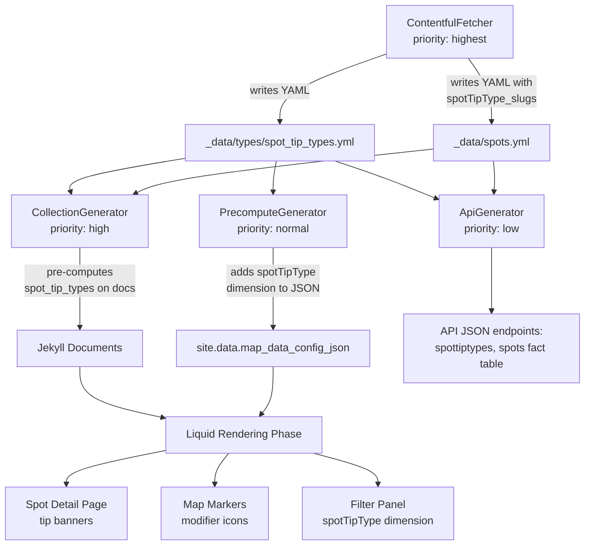

# Design Document: Spot Tips

## Overview

This feature adds advisory tip support to paddle spots. Each spot can reference zero or more Spot Tip Types defined in Contentful. The feature touches four site areas: the filter panel (new spot tips dimension), the spot detail page (tip banners), the map markers (modifier icons), and the JSON API (new dimension table + spot field).

The implementation follows the established data pipeline pattern: Contentful → YAML → CollectionGenerator pre-computation → PrecomputeGenerator JSON config → Liquid templates + client-side JS. A new `spotTipType` content type is fetched by ContentfulFetcher, stored as `_data/types/spot_tip_types.yml`, and the `spotTips` reference field on spots is resolved to a `spotTipType_slugs` array. The PrecomputeGenerator adds a `spotTipType` dimension config to the `map_data_config_json`, and the CollectionGenerator pre-computes resolved tip type data on each spot document.

## Architecture



### Plugin Execution Order (unchanged priorities, new work highlighted)

| Priority | Plugin | Spot Tips Work |
|----------|--------|----------------|
| `:highest` | `ContentfulFetcher` | Fetch `spotTipType` entries → `spot_tip_types.yml`; include `spotTips` refs on spots → `spotTipType_slugs` |
| `:high` | `CollectionGenerator` | Pre-compute `spot_tip_types` (resolved array of type hashes) on each spot document |
| `:normal` | `PrecomputeGenerator` | Add `spotTipType` dimension config to `map_data_config_json`; pre-compute tip type data for templates |
| `:low` | `ApiGenerator` | Generate `spottiptypes-{locale}.json` dimension table; add `spotTipType` field to spots fact table |

## Components and Interfaces

### 1. ContentfulFetcher — New Content Type + Spot Field

**File:** `_plugins/contentful_fetcher.rb`

Add `spotTipType` to the `CONTENT_TYPES` hash:

```ruby
'spotTipType' => { filename: 'types/spot_tip_types', mapper: :map_type }
```

**File:** `_plugins/contentful_mappers.rb`

The existing `map_type` mapper already handles the `name`, `slug`, `createdAt`, `updatedAt` fields. For `spotTipType`, the `description` rich text field needs to be included. Extend `map_type` to handle `spotTipType`:

```ruby
def map_type(entry, fields, locale, content_type = nil)
  result = {
    'slug' => extract_slug(fields, entry),
    'name_de' => resolve_field(fields, :name, 'de'),
    'name_en' => resolve_field(fields, :name, 'en')
  }

  case content_type
  when 'paddleCraftType', 'dataSourceType'
    desc_field = resolve_field(fields, :description, locale)
    result['_raw_description'] = serialize_raw_rich_text(desc_field)
  when 'dataLicenseType'
    result['summaryUrl'] = resolve_field(fields, :summary_url, locale)
    result['fullTextUrl'] = resolve_field(fields, :full_text_url, locale)
  when 'spotTipType'
    desc_field = resolve_field(fields, :description, locale)
    result['description_de'] = extract_rich_text_html(resolve_field(fields, :description, 'de'))
    result['description_en'] = extract_rich_text_html(resolve_field(fields, :description, 'en'))
    result['_raw_description'] = serialize_raw_rich_text(desc_field)
  end

  result
end
```

The `map_spot` mapper needs to extract the `spotTips` reference field:

```ruby
'spotTipType_slugs' => extract_reference_slugs(resolve_field(fields, :spot_tips, locale))
```

**File:** `_config.yml`

Add `spotTipType` to the contentful content_types:

```yaml
spotTipType:
  mapper: TypeMapper
  filename: "types/spot_tip_types"
```

### 2. CollectionGenerator — Pre-compute Spot Tip Data

**File:** `_plugins/collection_generator.rb`

Build a spot tip type lookup hash alongside the existing type lookups:

```ruby
@spot_tip_type_lookup = build_spot_tip_type_lookup(site.data, current_locale)
```

```ruby
def build_spot_tip_type_lookup(data, locale)
  types = data.dig('types', 'spot_tip_types')
  return {} unless types.is_a?(Array)
  name_key = locale == 'en' ? 'name_en' : 'name_de'
  desc_key = "description_#{locale}"
  lookup = {}
  types.each do |t|
    next unless t['locale'] == locale && t['slug']
    lookup[t['slug']] = {
      'slug' => t['slug'],
      'name' => t[name_key] || t['name_de'] || t['slug'],
      'description' => t[desc_key]
    }
  end
  lookup
end
```

In `precompute_spot_fields`, resolve the tip types:

```ruby
tip_slugs = entry['spotTipType_slugs'] || []
doc.data['spot_tip_types'] = tip_slugs.filter_map { |slug| @spot_tip_type_lookup[slug] }
```

This gives each spot document a `spot_tip_types` array of hashes with `slug`, `name`, and `description` — ready for direct use in Liquid templates without per-page lookups.

### 3. PrecomputeGenerator — spotTipType Dimension Config

**File:** `_plugins/precompute_generator.rb`

In `precompute_map_config_json`, add the `spotTipType` dimension config after the existing dimensions. The tip types are read from `site.data.types.spot_tip_types` and filtered by locale:

```ruby
# Spot tip type dimension options (dynamic from data)
tip_types = (site.data.dig('types', 'spot_tip_types') || [])
  .select { |t| t['locale'] == locale }
tip_type_options = tip_types.map { |tt| { slug: tt['slug'], label: tt[name_key] || tt['name_de'] } }

# Add "no tips" option
no_tips_label = locale == 'en' ? 'Spots without tips' : 'Einstiegsorte ohne Tipps'
tip_type_options << { slug: '__no_tips__', label: no_tips_label }
```

Add to `dimensionConfigs` array:

```ruby
{
  key: 'spotTipType',
  label: locale == 'en' ? 'Spot Tips' : 'Tipps',
  options: tip_type_options
}
```

Also pre-compute the spot tip types array for template use (avoids per-page Liquid lookups):

```ruby
site.data['spot_tip_types_for_locale'] = tip_types.map do |tt|
  { 'slug' => tt['slug'], 'name' => tt[name_key] || tt['name_de'] }
end
```

### 4. Filter Engine + Filter Panel — spotTipType Match Function

**File:** `assets/js/map-data-init.js`

Add a `spotTipType` match function to the `matchFunctions` object:

```javascript
spotTipType: function(meta, selected) {
  var tipSlugs = meta.spotTipType_slugs || [];
  if (tipSlugs.length === 0) {
    // Spot has no tips — visible only if "__no_tips__" is selected
    return selected.has('__no_tips__');
  }
  // Spot has tips — visible if any of its tip type slugs are selected
  for (var i = 0; i < tipSlugs.length; i++) {
    if (selected.has(tipSlugs[i])) return true;
  }
  return false;
}
```

**File:** `assets/js/layer-control.js`

In `addSpotMarker`, include `spotTipType_slugs` in the metadata registered with the marker registry:

```javascript
var metadata = {
  spotType_slug: spotTypeSlug,
  paddleCraftTypes: spot.paddleCraftTypes || [],
  paddlingEnvironmentType_slug: spot.paddlingEnvironmentType_slug || '',
  spotTipType_slugs: spot.spotTipType_slugs || []
};
```

The filter panel already renders all dimension configs generically — no changes needed to `filter-panel.js`. The new `spotTipType` dimension will appear as a new fieldset with per-type checkboxes plus the "Spots without tips" option, all checked by default.

### 5. Spot Detail Page — Tip Banners

**File:** `_includes/spot-tip-banners.html` (new)

A new include that renders one tip banner per spot tip type. Placed in `spot.html` layout between the description and the details table.

```html




<div class="alert alert-spot-tip alert-spot-tip-{{ tip.slug }} d-flex align-items-start" role="alert">
  
  <div>
    <strong>{{ tip.name | escape }}</strong>
    
    <div class="spot-tip-description">{{ tip.description }}</div>
    
  </div>
</div>

```

**File:** `_layouts/spot.html`

Insert the tip banners include in the non-rejected branch, between the description and the details table:

```html

  
    
  
  

```

### 6. Map Marker Modifier Icons

**File:** `assets/js/marker-styles.js`


The modifier icon system uses a centrally-defined configuration object that maps each tip type slug to its SVG path and position offset. This single authoritative source is consumed by both the marker creation code and any future components that need modifier icon positioning.

**Central configuration (single authoritative source):**

```javascript
// Modifier icon configuration — single authoritative source for all components
// Position offsets are relative to the standard marker icon anchor point [16, 53]
var TIP_MODIFIER_CONFIG = {
  // Each entry: { iconUrl, offset: [dx, dy] relative to marker anchor }
  // Offsets are designed so multiple modifiers don't overlap
};
```

This config object is defined once in `marker-styles.js` and exported via `PaddelbuchMarkerStyles.TIP_MODIFIER_CONFIG`.

**File:** `assets/js/layer-control.js`

In `addSpotMarker`, when a spot has tip type slugs, replace the standard `L.marker` with a `L.divIcon`-based marker that composites the base marker SVG with modifier icon SVGs:

```javascript
function createCompositeIcon(baseIconUrl, tipSlugs) {
  var config = PaddelbuchMarkerStyles.TIP_MODIFIER_CONFIG;
  var html = '';

  for (var i = 0; i < tipSlugs.length; i++) {
    var modConfig = config[tipSlugs[i]];
    if (!modConfig) continue; // Req 4.6: skip missing modifier SVGs
    html += '';
  }

  return L.divIcon({
    html: html,
    className: 'composite-marker-icon',
    iconSize: [32, 53],
    iconAnchor: [16, 53],
    popupAnchor: [0, -53]
  });
}
```

When a spot has `spotTipType_slugs.length > 0`, use `createCompositeIcon` instead of the standard `L.icon`. When a spot has no tips, the existing `L.icon` path is unchanged.

### 7. ApiGenerator — Dimension Table + Spot Field

**File:** `_plugins/api_generator.rb`

Add to `DIMENSION_TABLES`:

```ruby
'spottiptypes' => { data_key: 'types/spot_tip_types', content_type: 'spotTipType' }
```

Add to `CONTENT_TYPE_NAMES`:

```ruby
'spottiptypes' => 'spotTipTypes'
```

In `transform_dimension_entry`, add a case for `spottiptypes`:

```ruby
when 'spottiptypes'
  result['description'] = wrap_raw_description(item['_raw_description'])
```

In `transform_spot`, add the `spotTipType` field:

```ruby
result['spotTipType'] = wrap_slug_refs(item['spotTipType_slugs']) || []
```

### 8. Tip Banner Styling

**File:** `_sass/pages/_spot-details.scss`

Add tip banner styles within the `.page-spot-details` scope:

```scss
// Spot tip banners (Requirement 3)
.alert-spot-tip {
  border-radius: 0;
  margin-bottom: 0.75rem;

  .spot-tip-icon {
    margin-top: 0.15em;
  }

  .spot-tip-description {
    margin-top: 0.25rem;
    font-size: 0.9em;
  }
}
```

Each tip type can be independently styled via `.alert-spot-tip-{slug}` CSS classes. The base `.alert-spot-tip` provides shared layout; per-type classes override colors, borders, and backgrounds as needed.

### 9. Build Precomputation Integration

The spot tips feature integrates with the existing precomputation system at two levels:

1. **CollectionGenerator (per-document):** Resolves tip type slugs to full type objects (name, description) once per spot document during the generate phase. Templates access `page.spot_tip_types` directly — no Liquid `| where` lookups against `site.data.types.spot_tip_types`.

2. **PrecomputeGenerator (per-locale):** Builds the `spotTipType` dimension config (options array with localised labels) once per locale and embeds it in `map_data_config_json`. The filter panel and filter engine consume this from the JSON data element — no per-page Liquid computation.

This ensures zero repeated Liquid computations for spot tip data across the ~2815 pages.

### 10. SVG Asset Files

**Tip banner icons:** `assets/images/tips/tip-banner-{slug}.svg` — one custom SVG per tip type, displayed at 24×24 in the banner.

**Modifier icons:** `assets/images/markers/tip-modifier-{slug}.svg` — one custom SVG per tip type, displayed at the size specified in `TIP_MODIFIER_CONFIG`.

These files must be created manually as design assets. The code references them by slug-based naming convention.

## Data Models

### Contentful Content Type: `spotTipType`

| Field | Type | Required | Description |
|-------|------|----------|-------------|
| `name` | Short text (localised) | Yes | Display name of the tip type |
| `slug` | Short text | Yes | Unique identifier, used in CSS classes and file paths |
| `description` | Rich text (localised) | No | Optional detailed description shown in tip banners |

### YAML Data File: `_data/types/spot_tip_types.yml`

```yaml
- locale: de
  createdAt: '2025-01-15T10:00:00Z'
  updatedAt: '2025-01-15T10:00:00Z'
  slug: example-tip
  name_de: Beispiel Tipp
  name_en: Example Tip
  description_de: '<p>Beschreibung...</p>'
  description_en: '<p>Description...</p>'
  _raw_description: '{"nodeType":"document","content":[...]}'
```

### Spot Data Record (in `_data/spots.yml`)

New field added to each spot entry:

| Field | Type | Description |
|-------|------|-------------|
| `spotTipType_slugs` | Array[String] | Slugs of associated spot tip types. Empty array if no tips. |

### Pre-computed Document Fields (set in CollectionGenerator)

| Collection | Field | Type | Source |
|-----------|-------|------|--------|
| spots | `spot_tip_types` | Array[Hash] | Resolved from `types/spot_tip_types` by `spotTipType_slugs` + locale. Each hash: `{ slug, name, description }` |

### Pre-computed Site-Level Data (set in PrecomputeGenerator)

| Key | Type | Description |
|-----|------|-------------|
| `spotTipType` dimension in `map_data_config_json` | JSON object | Dimension config with per-type options + `__no_tips__` option |
| `site.data['spot_tip_types_for_locale']` | Array[Hash] | Localised tip type names for template use |

### API Output: `spottiptypes-{locale}.json`

```json
[
  {
    "slug": "example-tip",
    "node_locale": "de",
    "createdAt": "2025-01-15T10:00:00Z",
    "updatedAt": "2025-01-15T10:00:00Z",
    "name": "Beispiel Tipp",
    "description": { "raw": "{...}" }
  }
]
```

### API Output: Spot Fact Table `spotTipType` Field

```json
{
  "slug": "some-spot",
  "spotTipType": [{ "slug": "example-tip" }]
}
```

### Modifier Icon Configuration (single authoritative source)

```javascript
// In marker-styles.js — PaddelbuchMarkerStyles.TIP_MODIFIER_CONFIG
{
  'tip-slug-1': { iconUrl: '/assets/images/markers/tip-modifier-tip-slug-1.svg', offset: [-8, -8], size: 16 },
  'tip-slug-2': { iconUrl: '/assets/images/markers/tip-modifier-tip-slug-2.svg', offset: [24, -8], size: 16 }
  // ... one entry per tip type
}
```


## Correctness Properties

*A property is a characteristic or behavior that should hold true across all valid executions of a system — essentially, a formal statement about what the system should do. Properties serve as the bridge between human-readable specifications and machine-verifiable correctness guarantees.*

### Property 1: spotTipType Mapper Output Structure

*For any* Contentful `spotTipType` entry with a slug, localised name, and optional rich text description, the `map_type` mapper with content type `spotTipType` shall produce a hash containing `slug`, `name_de`, `name_en`, `description_de` (rendered HTML or nil), `description_en` (rendered HTML or nil), and `_raw_description` (serialised JSON or nil), where the name fields match the entry's localised name values.

**Validates: Requirements 1.1, 1.2**

### Property 2: Spot Mapper Includes spotTipType_slugs

*For any* Spot entry with zero or more `spotTips` references, the `map_spot` mapper shall produce a hash containing a `spotTipType_slugs` field that is an array of strings equal to the slugs of the referenced `spotTipType` entries (empty array when no references exist).

**Validates: Requirements 1.3, 1.4**

### Property 3: spotTipType Dimension Config Completeness

*For any* set of spot tip type data records and locale, the `map_data_config_json` produced by PrecomputeGenerator shall contain a `spotTipType` dimension config whose `options` array has exactly one entry per tip type (with matching slug and localised label) plus one `__no_tips__` entry.

**Validates: Requirements 2.2, 2.3, 5.2**

### Property 4: spotTipType Filter Match Function Correctness

*For any* spot metadata with a `spotTipType_slugs` array and any set of selected option slugs, the `spotTipType` match function shall return `true` if and only if: (a) the spot has at least one tip slug present in the selected set, OR (b) the spot has zero tip slugs and `__no_tips__` is in the selected set.

**Validates: Requirements 2.6, 2.7**

### Property 5: Tip Banner Rendering Completeness

*For any* spot with one or more resolved tip types (each having a slug, name, and optional description), the tip banner HTML shall contain for each tip type: (a) a `div` with CSS class `alert-spot-tip-{slug}`, (b) an `img` element with `src` matching `tip-banner-{slug}.svg`, (c) the localised name text, and (d) the description HTML when the description is non-empty (absent when empty).

**Validates: Requirements 3.1, 3.3, 3.4, 3.5, 3.7, 3.8**

### Property 6: Modifier Icon Unique Offsets

*For any* two distinct tip type slugs in `TIP_MODIFIER_CONFIG`, their position offset arrays shall differ in at least one coordinate, ensuring all modifier icons are visually distinguishable on markers with multiple tips.

**Validates: Requirements 4.4**

### Property 7: Composite Marker Icon Includes Modifier Images

*For any* spot with one or more tip type slugs that have entries in `TIP_MODIFIER_CONFIG`, the composite `DivIcon` HTML shall contain one `img` element per matching slug with the correct `src` path (`tip-modifier-{slug}.svg`) and position offset from the config. Slugs without config entries shall be skipped.

**Validates: Requirements 4.1, 4.6**

### Property 8: API Dimension Table Output Structure

*For any* spot tip type data record with slug, localised name, and optional raw description, the `transform_dimension_entry` method for `spottiptypes` shall produce a JSON object containing `slug`, `node_locale`, `createdAt`, `updatedAt`, `name`, and `description` (as a wrapped raw rich text object when `_raw_description` is present).

**Validates: Requirements 6.2, 6.6**

### Property 9: API Spot Transform Includes spotTipType

*For any* spot data record with a `spotTipType_slugs` array, the `transform_spot` method shall produce a result containing a `spotTipType` field that is an array of `{"slug": "..."}` objects matching the input slugs (empty array when no slugs exist).

**Validates: Requirements 6.4, 6.5**

### Property 10: CollectionGenerator Spot Tip Type Resolution

*For any* spot document with `spotTipType_slugs` and a set of spot tip type data records for the current locale, the pre-computed `spot_tip_types` array on the document shall contain one hash per resolved slug with the correct localised `name` and `description`, and shall exclude slugs not found in the tip type data.

**Validates: Requirements 1.1, 3.1, 8.1**

## Error Handling

### Missing Spot Tip Type Data

If a `spotTipType_slugs` entry on a spot references a slug not found in the tip type lookup hash (e.g., data inconsistency or deleted Contentful entry), the CollectionGenerator's `filter_map` silently skips it. The spot document's `spot_tip_types` array will not include the unresolved slug. No error is raised — this matches the existing pattern for missing type data.

### Missing Tip Banner SVG

If a tip type slug does not have a corresponding `tip-banner-{slug}.svg` file, the browser will show a broken image icon. This is acceptable as a deployment-time issue — the SVG files are design assets that must be created alongside the Contentful content type entries.

### Missing Modifier Icon SVG

If a tip type slug is not present in `TIP_MODIFIER_CONFIG`, the `createCompositeIcon` function skips it (Requirement 4.6). The marker renders with the base icon plus only the modifier icons that have config entries. No console error is produced.

### Empty Tip Types Data

If `_data/types/spot_tip_types.yml` is empty or missing, all lookups return empty results: spots get empty `spot_tip_types` arrays, the dimension config has only the `__no_tips__` option, and the API dimension table is empty. The site renders correctly with no tip-related UI elements.

### Rich Text Description Rendering Errors

If a `spotTipType` description field contains malformed rich text JSON, the `extract_rich_text_html` method in ContentfulMappers logs a warning and returns `nil`. The tip banner renders without a description section, showing only the name.

## Testing Strategy

### Property-Based Testing

**Ruby (RSpec + Rantly):** Properties 1, 2, 3, 8, 9, 10 — test the data pipeline (mappers, generators, API transforms).

**JavaScript (Jest + fast-check):** Properties 4, 5, 6, 7 — test the client-side filter logic, banner rendering, and marker composition.

Each property-based test runs a minimum of 100 iterations. Each test is tagged with a comment referencing the design property:

```
# Feature: spot-tips, Property 1: spotTipType Mapper Output Structure
```

### Property Test Plan

| Property | Test File | Generator Strategy |
|----------|-----------|-------------------|
| P1: Mapper output | `spec/plugins/spot_tip_type_mapper_spec.rb` | Generate random slugs, name strings, and optional rich text fields |
| P2: Spot mapper slugs | `spec/plugins/spot_tip_type_mapper_spec.rb` | Generate random arrays of tip type slugs (including empty) |
| P3: Dimension config | `spec/plugins/precompute_generator_spec.rb` | Generate random tip type datasets with varying counts |
| P4: Filter match function | `_tests/property/spot-tip-filter-match.property.test.js` | Generate random spotTipType_slugs arrays and selected sets |
| P5: Banner rendering | `_tests/property/spot-tip-banner-rendering.property.test.js` | Generate random tip type objects with optional descriptions |
| P6: Unique offsets | `_tests/property/spot-tip-modifier-offsets.property.test.js` | Enumerate all pairs in TIP_MODIFIER_CONFIG |
| P7: Composite icon | `_tests/property/spot-tip-composite-marker.property.test.js` | Generate random tip slug arrays against the config |
| P8: API dimension output | `spec/plugins/api_generator_spec.rb` | Generate random tip type records |
| P9: API spot transform | `spec/plugins/api_generator_spec.rb` | Generate random spot records with varying tip slug arrays |
| P10: Collection pre-compute | `spec/plugins/collection_precompute_spec.rb` | Generate random spot entries and tip type lookup data |

### Unit Tests

Unit tests complement property tests for specific examples and edge cases:

- **Mapper edge cases:** nil description, empty spotTips array, missing slug
- **Filter match edge cases:** empty selected set, all options selected, spot with single tip
- **Banner rendering:** zero tips (no banners rendered), single tip with description, single tip without description
- **API transform:** spot with zero tips produces empty array
- **Dimension config:** zero tip types produces config with only `__no_tips__` option

### Integration Verification

After implementation, a full local build should verify:
1. `_data/types/spot_tip_types.yml` is populated from Contentful
2. Spot detail pages render tip banners correctly
3. Map markers show modifier icons for spots with tips
4. Filter panel includes the spotTipType dimension
5. API endpoints include the new dimension table and spot field
6. Build times are not regressed (precomputation working correctly)
