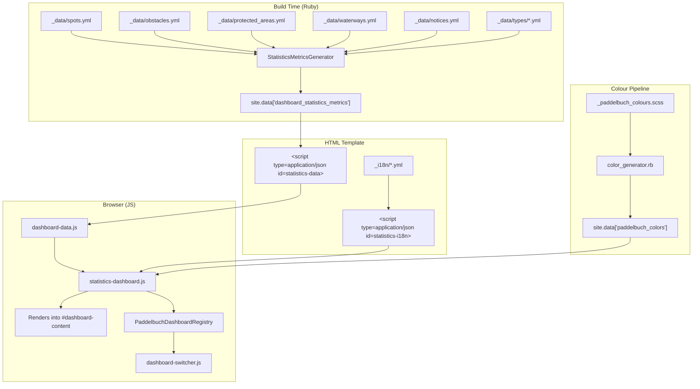

# Design Document: Statistics Dashboard

## Overview

The Statistics Dashboard is a new non-map dashboard module (`id: 'statistics'`, `usesMap: false`) added to the existing Data Quality page at `/offene-daten/datenqualitaet/`. It provides an at-a-glance overview of the Paddelbuch database through summary figures and horizontal stacked bar charts.

The dashboard displays:
- Total spots with a stacked bar chart by spot type (including "no entry" spots)
- Total obstacles with a stacked bar chart by portage route availability
- Total protected areas with a stacked bar chart by protected area type
- Per-paddle-craft-type spot counts (summary figures only)
- Per-data-source-type entry counts across all five entity types
- Per-data-license-type entry counts across all five entity types

It becomes the first (default) dashboard shown when users visit the Data Quality page, pushing Freshness and Coverage to second and third position.

All metrics are computed at Jekyll build time by a new Ruby generator plugin (`StatisticsMetricsGenerator`), following the existing compute-once-cache-across-locales pattern. Pre-computed JSON is embedded in the HTML page via `<script type="application/json">` blocks and read by the JS module at runtime — no counting or computation happens in the browser.

### Key Design Decisions

1. **Non-map dashboard**: Sets `usesMap: false`, so the dashboard-switcher hides `#dashboard-map` and shows `#dashboard-content`. All rendering goes into `#dashboard-content`.

2. **Build-time computation**: Follows the same pattern as `DashboardMetricsGenerator` — compute once on first locale pass, cache in class-level variables, localize on subsequent passes.

3. **All entity types have data source and license fields**: The Contentful content model defines `dataSourceType` and `dataLicenseType` as common fact table fields for all entity types. All five mappers (`map_spot`, `map_waterway`, `map_obstacle`, `map_protected_area`, `map_event_notice`) extract `dataSourceType_slug` and `dataLicenseType_slug`. Some current YAML data files may not yet have these fields populated for every entry, so the generator will treat nil/missing values gracefully (skip for counting) while still iterating all five entity types.

4. **Script load order**: The statistics dashboard JS file loads after `dashboard-data.js` but before `freshness-dashboard.js` and `coverage-dashboard.js`, ensuring it registers first in `PaddelbuchDashboardRegistry` and becomes the default.

5. **CSP compliance**: No inline scripts. All data passed via `<script type="application/json">` blocks. All JS in external files listed in front matter `scripts` array.

6. **Colour pipeline**: New SCSS colour variables are added to `_paddelbuch_colours.scss`. The existing `color_generator.rb` plugin automatically parses them and exposes them via `site.data['paddelbuch_colors']` — no plugin changes needed.

## Architecture



### Component Interaction Flow

1. At build time, `StatisticsMetricsGenerator` reads all five entity data files and type definition files, deduplicates by slug, computes counts, and stores results in `site.data['dashboard_statistics_metrics']`.
2. The HTML template embeds the metrics as a JSON block (`#statistics-data`) and localised strings as another JSON block (`#statistics-i18n`).
3. `dashboard-data.js` parses the `#statistics-data` JSON block and exposes it on `PaddelbuchDashboardData.statisticsMetrics`.
4. `statistics-dashboard.js` registers itself on `PaddelbuchDashboardRegistry` (first, before freshness and coverage).
5. `dashboard-switcher.js` reads the registry, builds tabs, and activates the first dashboard (statistics).
6. When activated, the statistics module reads the pre-computed metrics and i18n strings, then renders summary figures and stacked bar charts into `#dashboard-content`.

## Components and Interfaces

### 1. StatisticsMetricsGenerator (Ruby Plugin)

**File**: `_plugins/statistics_metrics_generator.rb`

```ruby
module Jekyll
  class StatisticsMetricsGenerator < Generator
    safe true
    priority :normal

    @@cached_metrics = nil

    def generate(site)
      locale = site.config['lang'] || site.config['default_lang'] || 'de'

      if @@cached_metrics.nil?
        # Compute all counts once
        @@cached_metrics = compute_metrics(site)
      end

      # Localize type names for current locale
      site.data['dashboard_statistics_metrics'] = localize_metrics(@@cached_metrics, locale)
    end
  end
end
```

**Output structure** (`site.data['dashboard_statistics_metrics']`):

```json
{
  "spots": {
    "total": 150,
    "byType": [
      { "slug": "einstieg-ausstieg", "name": "Ein- und Ausstieg", "count": 80 },
      { "slug": "nur-einstieg", "name": "Nur Einstieg", "count": 25 },
      { "slug": "nur-ausstieg", "name": "Nur Ausstieg", "count": 20 },
      { "slug": "rasthalte", "name": "Rasthalte", "count": 15 },
      { "slug": "notauswasserungsstelle", "name": "Notauswasserungsstelle", "count": 5 },
      { "slug": "no-entry", "name": "Kein Zutritt", "count": 5 }
    ]
  },
  "obstacles": {
    "total": 30,
    "withPortageRoute": 20,
    "withoutPortageRoute": 10
  },
  "protectedAreas": {
    "total": 45,
    "byType": [
      { "slug": "naturschutzgebiet", "name": "Naturschutzgebiet", "count": 12 }
    ]
  },
  "paddleCraftTypes": [
    { "slug": "seekajak", "name": "Seekajak", "count": 100 },
    { "slug": "kanadier", "name": "Kanadier", "count": 95 },
    { "slug": "stand-up-paddle-board", "name": "Stand Up Paddle Board (SUP)", "count": 90 }
  ],
  "dataSourceTypes": [
    { "slug": "swiss-canoe", "name": "Swiss Canoe (SKV)", "count": 200 }
  ],
  "dataLicenseTypes": [
    { "slug": "cc-by-sa-4", "name": "CC-BY-SA-4.0", "count": 250 }
  ]
}
```

### 2. statistics-dashboard.js (Dashboard Module)

**File**: `assets/js/statistics-dashboard.js`

Follows the exact same IIFE pattern as `freshness-dashboard.js` and `coverage-dashboard.js`:

```javascript
(function(global) {
  'use strict';

  var module = {
    id: 'statistics',
    getName: function() { return strings.name; },
    usesMap: false,
    activate: function(context) { /* render into context.contentEl */ },
    deactivate: function() { /* clear context.contentEl */ }
  };

  global.PaddelbuchStatisticsDashboard = module;
  (global.PaddelbuchDashboardRegistry = global.PaddelbuchDashboardRegistry || []).push(module);
})(typeof window !== 'undefined' ? window : this);
```

**Interface contract**:
- `id`: `'statistics'`
- `getName()`: Returns localised dashboard name from `#statistics-i18n`
- `usesMap`: `false`
- `activate(context)`: Receives `{ contentEl, legendEl, data }`. Reads `PaddelbuchDashboardData.statisticsMetrics` and `#statistics-i18n`. Renders summary figures and bar charts into `context.contentEl`. Sets `#dashboard-title` and `#dashboard-description`.
- `deactivate()`: Clears `#dashboard-content`, `#dashboard-title`, `#dashboard-description`, `#dashboard-legend`.

### 3. dashboard-data.js (Extended)

Add parsing of the `#statistics-data` JSON block:

```javascript
global.PaddelbuchDashboardData = {
  freshnessMetrics: parseJsonBlock('freshness-data'),
  coverageMetrics: parseJsonBlock('coverage-data'),
  statisticsMetrics: parseJsonBlock('statistics-data')  // NEW
};
```

Note: `parseJsonBlock` returns `[]` for arrays but statistics data is an object. We need a `parseJsonObjectBlock` variant that returns `{}` on failure instead of `[]`.

### 4. HTML Template Changes (datenqualitaet.html)

- Add `statistics-dashboard.js` to front matter `scripts` array (after `dashboard-data.js`, before `freshness-dashboard.js`)
- Add `<script type="application/json" id="statistics-data">` block
- Add `<script type="application/json" id="statistics-i18n">` block

### 5. Colour Additions (_paddelbuch_colours.scss)

New colour variables for chart segments. These will be automatically picked up by `color_generator.rb`:

```scss
// Statistics Dashboard — Spot Type Colours
$spot-type-entry-exit: #2e86c1;
$spot-type-entry-only: #28b463;
$spot-type-exit-only: #e67e22;
$spot-type-rest: #8e44ad;
$spot-type-emergency: #c0392b;
$spot-type-no-entry: #7f8c8d;

// Statistics Dashboard — Obstacle Colours
$obstacle-with-portage: #27ae60;
$obstacle-without-portage: #e74c3c;

// Statistics Dashboard — Protected Area Type Colours
$pa-type-naturschutzgebiet: #1a5276;
$pa-type-fahrverbotzone: #6c3483;
$pa-type-schilfgebiet: #117a65;
$pa-type-schwimmbereich: #2e86c1;
$pa-type-industriegebiet: #7d6608;
$pa-type-schiesszone: #943126;
$pa-type-teleskizone: #1e8449;
$pa-type-privatbesitz: #af601a;
$pa-type-wasserskizone: #148f77;
```

### 6. i18n Additions

New keys under `dashboards.statistics` in both `_i18n/de.yml` and `_i18n/en.yml`:

```yaml
# de.yml
dashboards:
  statistics:
    name: "Statistiken"
    description: "Übersicht über den Inhalt der Paddel Buch Datenbank."
    spots_title: "Einstiegsorte"
    obstacles_title: "Hindernisse"
    protected_areas_title: "Schutzgebiete"
    paddle_craft_title: "Einstiegsorte nach Paddelboot-Typ"
    data_source_title: "Einträge nach Datenquelle"
    data_license_title: "Einträge nach Datenlizenz"
    with_portage: "Mit Portage-Route"
    without_portage: "Ohne Portage-Route"
    no_entry: "Kein Zutritt"
```

```yaml
# en.yml
dashboards:
  statistics:
    name: "Statistics"
    description: "Overview of the contents of the Paddel Buch database."
    spots_title: "Spots"
    obstacles_title: "Obstacles"
    protected_areas_title: "Protected Areas"
    paddle_craft_title: "Spots by Paddle Craft Type"
    data_source_title: "Entries by Data Source"
    data_license_title: "Entries by Data License"
    with_portage: "With Portage Route"
    without_portage: "Without Portage Route"
    no_entry: "No Entry"
```

## Data Models

### Input Data (Build Time)

| Entity | Data File | Dedup Key | Relevant Fields |
|---|---|---|---|
| Spots | `_data/spots.yml` | `slug` | `spotType_slug`, `rejected`, `paddleCraftTypes`, `dataSourceType_slug`, `dataLicenseType_slug` |
| Obstacles | `_data/obstacles.yml` | `slug` | `portageRoute`, `dataSourceType_slug`, `dataLicenseType_slug` |
| Protected Areas | `_data/protected_areas.yml` | `slug` | `protectedAreaType_slug`, `dataSourceType_slug`, `dataLicenseType_slug` |
| Waterways | `_data/waterways.yml` | `slug` | `dataSourceType_slug`, `dataLicenseType_slug` |
| Notices | `_data/notices.yml` | `slug` | `dataSourceType_slug`, `dataLicenseType_slug` |

### Type Definitions (Build Time)

| Type | Data File | Slugs |
|---|---|---|
| Spot Types | `_data/types/spot_types.yml` | nur-ausstieg, einstieg-ausstieg, rasthalte, notauswasserungsstelle, nur-einstieg |
| Obstacle Types | `_data/types/obstacle_types.yml` | stauwehr, staudamm, tiefe-brucke |
| Protected Area Types | `_data/types/protected_area_types.yml` | wasserskizone, privatbesitz, schiesszone, teleskizone, schilfgebiet, schwimmbereich, industriegebiet, fahrverbotzone, naturschutzgebiet |
| Paddle Craft Types | `_data/types/paddle_craft_types.yml` | stand-up-paddle-board, kanadier, seekajak |
| Data Source Types | `_data/types/data_source_types.yml` | swiss-canoe, openstreetmap, swiss-canoe-fako-member, individual-contributor, swiss-canoe-meldestelle-fur-absehbare-gewasserereignisse |
| Data License Types | `_data/types/data_license_types.yml` | cc-by-sa-4, lizenz-odbl |

### Output Data (JSON Block)

The `StatisticsMetricsGenerator` produces a single object (not an array) with the structure shown in the Components section above. Key characteristics:

- All counts are integers representing unique slugs (deduplicated across locales)
- Type names are localised strings (using `name_de` or `name_en` depending on locale)
- The "no-entry" pseudo-type in the spots breakdown uses a synthetic slug `"no-entry"` with a localised name from the i18n file
- `paddleCraftTypes` counts are non-exclusive (a spot can count toward multiple craft types)
- `dataSourceTypes` and `dataLicenseTypes` counts sum across all entity types that have the field

### Deduplication Strategy

Same pattern as `DashboardMetricsGenerator`: group by slug, keep first occurrence. Since numeric fields (counts, types) are identical across locales, any locale's entry suffices for computation. Only names need locale-specific lookup.


## Correctness Properties

*A property is a characteristic or behavior that should hold true across all valid executions of a system — essentially, a formal statement about what the system should do. Properties serve as the bridge between human-readable specifications and machine-verifiable correctness guarantees.*

### Property 1: Deduplication correctness

*For any* entity type (spots, obstacles, protected areas, waterways, notices) and *for any* list of entity entries that may contain duplicate slugs across locales, the total count produced by the `StatisticsMetricsGenerator` deduplication shall equal the number of unique slugs in the input list.

**Validates: Requirements 2.1, 3.1, 4.1, 8.3, 8.4, 8.5, 8.6, 8.7, 12.1, 12.2, 12.3, 12.4, 12.5, 12.6**

### Property 2: Spot type partitioning

*For any* set of deduplicated spots, every spot shall be classified into exactly one segment: if `rejected` is `true`, the spot is counted in the "no-entry" segment regardless of its `spotType_slug`; otherwise it is counted in the segment matching its `spotType_slug`. The sum of all segment counts shall equal the total spot count.

**Validates: Requirements 2.4, 2.5**

### Property 3: Obstacle portage partitioning

*For any* set of deduplicated obstacles, every obstacle shall be classified into exactly one of two segments: "with portage route" if `portageRoute` is non-null, "without portage route" if `portageRoute` is null. The sum of the two segment counts shall equal the total obstacle count.

**Validates: Requirements 3.3, 3.4**

### Property 4: Paddle craft type counting

*For any* set of deduplicated spots and *for any* paddle craft type slug, the count for that paddle craft type shall equal the number of unique spots whose `paddleCraftTypes` array contains that slug. A single spot may be counted toward multiple paddle craft types.

**Validates: Requirements 5.2, 5.3**

### Property 5: Data source type counting

*For any* set of deduplicated entities (across all entity types that have a `dataSourceType_slug` field) and *for any* data source type slug, the count for that data source type shall equal the sum of unique entities matching that slug across all applicable entity types.

**Validates: Requirements 6.2, 6.3**

### Property 6: Data license type counting

*For any* set of deduplicated entities (across all entity types that have a `dataLicenseType_slug` field) and *for any* data license type slug, the count for that data license type shall equal the sum of unique entities matching that slug across all applicable entity types.

**Validates: Requirements 7.2, 7.3**

### Property 7: Type name localisation

*For any* type definition (spot type, protected area type, paddle craft type, data source type, data license type) and *for any* locale (`de` or `en`), the name in the generator output shall equal the `name_de` or `name_en` field from the corresponding type definition entry for that locale.

**Validates: Requirements 5.4, 6.4, 7.4, 9.3**

### Property 8: Deactivation cleanup

*For any* state where the Statistics Dashboard has been activated with valid metrics data, calling `deactivate()` shall leave the `#dashboard-content`, `#dashboard-title`, `#dashboard-description`, and `#dashboard-legend` containers empty.

**Validates: Requirements 1.5**

## Error Handling

### Build-Time (Ruby Generator)

| Scenario | Handling |
|---|---|
| Missing data file (e.g. `spots.yml` absent) | `site.data['spots']` returns `nil`; generator treats as empty array `[]`, produces zero counts. No build failure. |
| Entity with missing `slug` field | Skipped during deduplication (same pattern as `DashboardMetricsGenerator`). |
| Entity with missing `spotType_slug` or `protectedAreaType_slug` | Counted under an "unknown" bucket or skipped. Logged as warning. |
| Entity with missing `dataSourceType_slug` or `dataLicenseType_slug` | Skipped for data source/license counting. No error. |
| Empty `paddleCraftTypes` array or nil | Spot contributes zero to all paddle craft type counts. |
| Type definition file missing | Generator produces empty type arrays. Logged as warning. |

### Client-Side (JavaScript)

| Scenario | Handling |
|---|---|
| `#statistics-data` JSON block missing | `parseJsonObjectBlock` returns `{}`. Dashboard renders empty state (no figures, no charts). |
| `#statistics-i18n` JSON block missing | `getStrings()` falls back to German defaults (same pattern as freshness/coverage dashboards). |
| Metrics object has unexpected shape | Defensive checks (`|| 0`, `|| []`) prevent runtime errors. |
| Zero counts for a segment | Bar chart segment has zero width; legend still shows the category. |

## Testing Strategy

### Unit Tests (RSpec for Ruby, manual/example tests for JS)

Unit tests cover specific examples, edge cases, and integration points:

- **Deduplication**: Given a known list with 2 locales × N entities, verify the deduplicated count equals N.
- **Spot classification edge case**: A spot with `rejected: true` and a valid `spotType_slug` is counted only in "no-entry".
- **Obstacle with empty string portageRoute**: Verify it's treated as "with portage route" (non-null).
- **Spot with empty `paddleCraftTypes`**: Verify it contributes zero to all craft type counts.
- **Localisation**: Given locale `de`, verify type names use `name_de`; given locale `en`, verify `name_en`.
- **Script load order**: Verify the front matter `scripts` array has `statistics-dashboard.js` before `freshness-dashboard.js`.
- **JS activate/deactivate round trip**: Verify content container is populated after activate and empty after deactivate.

### Property-Based Tests

Property-based tests verify universal properties across randomly generated inputs. Each property test runs a minimum of 100 iterations.

**Library**: [Hypothesis](https://hypothesis.readthedocs.io/) for Python (testing the Ruby generator logic via a Python port of the core computation functions) or RSpec + [Rantly](https://github.com/rantly-rb/rantly) for Ruby.

Given the project already uses RSpec (`.rspec` file exists), the property tests should use **Rantly** with RSpec.

Each property test must be tagged with a comment referencing the design property:

```ruby
# Feature: statistics-dashboard, Property 1: Deduplication correctness
it 'deduplicates entities by slug correctly' do
  property_of { ... }.check(100) { |input| ... }
end
```

**Property test mapping**:

| Property | Test Description | Tag |
|---|---|---|
| Property 1 | Generate random entity lists with duplicate slugs across 2 locales; verify dedup count = unique slug count | `Feature: statistics-dashboard, Property 1: Deduplication correctness` |
| Property 2 | Generate random spots with varying `rejected` and `spotType_slug`; verify partitioning and sum | `Feature: statistics-dashboard, Property 2: Spot type partitioning` |
| Property 3 | Generate random obstacles with nil/non-nil `portageRoute`; verify partitioning and sum | `Feature: statistics-dashboard, Property 3: Obstacle portage partitioning` |
| Property 4 | Generate random spots with random `paddleCraftTypes` arrays; verify count per craft type | `Feature: statistics-dashboard, Property 4: Paddle craft type counting` |
| Property 5 | Generate random entities with random `dataSourceType_slug`; verify sum across entity types | `Feature: statistics-dashboard, Property 5: Data source type counting` |
| Property 6 | Generate random entities with random `dataLicenseType_slug`; verify sum across entity types | `Feature: statistics-dashboard, Property 6: Data license type counting` |
| Property 7 | Generate random type definitions with `name_de`/`name_en`; verify correct name for each locale | `Feature: statistics-dashboard, Property 7: Type name localisation` |
| Property 8 | Generate random valid metrics; call activate then deactivate; verify containers are empty | `Feature: statistics-dashboard, Property 8: Deactivation cleanup` |
