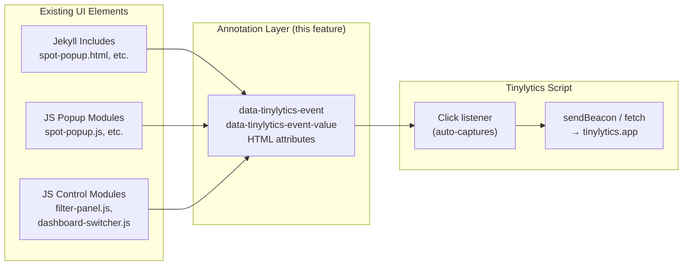

# Design Document: Tinylytics Event Tracking

## Overview

This feature adds declarative event tracking to the Paddel Buch site by annotating interactive HTML elements with `data-tinylytics-event` and `data-tinylytics-event-value` attributes. The Tinylytics script (already loaded for page views) auto-captures clicks on annotated elements and sends event data to the Tinylytics dashboard. No new JavaScript modules, dependencies, or CSP changes are required.

The implementation touches two categories of code:

1. **Jekyll Liquid templates** — static HTML includes where attributes are added directly in markup
2. **Vanilla JS modules** — functions that generate HTML strings or create DOM elements at runtime, where attributes are added via string concatenation or `setAttribute`

### Research Summary

The [Tinylytics event tracking documentation](https://tinylytics.app/docs/event_tracking) confirms:

- Adding `?events` to the embed script URL enables click-event collection
- Adding `?beacon` uses `navigator.sendBeacon` for reliable delivery on page-unload (outbound links)
- The script listens for clicks on any element carrying `data-tinylytics-event` and sends the event name + optional value
- Event names must follow `category.action` format
- A built-in 500 ms debounce prevents duplicate events from rapid clicks
- No inline scripts or additional JS are needed — the mechanism is purely attribute-based

## Architecture

The feature is a **pure annotation layer** on top of existing UI elements. It introduces no new modules, no new data flows, and no runtime logic beyond what the Tinylytics script already provides.



### Change Categories

| Category | Files | Mechanism |
|----------|-------|-----------|
| Script URL | `_layouts/default.html` | Add `?events&beacon` query params |
| Jekyll popup includes | `spot-popup.html`, `rejected-popup.html`, `obstacle-popup.html`, `event-popup.html` | Add attributes to `<button>` wrappers |
| Jekyll detail includes | `navigate-btn.html`, `spot-detail-content.html` | Add attributes to `<a>` and `<button>` elements |
| Jekyll header | `header.html` | Add attributes to language switcher `<a>` links |
| JS popup generators | `spot-popup.js`, `obstacle-popup.js`, `event-notice-popup.js` | Concatenate attributes into HTML strings |
| JS fallback popups | `layer-control.js` | Concatenate attributes into fallback HTML strings |
| JS control builders | `filter-panel.js`, `dashboard-switcher.js` | `setAttribute` on created DOM elements |

## Components and Interfaces

### 1. Tinylytics Script Configuration (`_layouts/default.html`)

**Current:**
```html
<script src="https://tinylytics.app/embed/DWSnjEu6fgk9s2Yu2H4a/min.js" defer></script>
```

**Updated:**
```html
<script src="https://tinylytics.app/embed/DWSnjEu6fgk9s2Yu2H4a/min.js?events&beacon" defer></script>
```

The `defer` attribute is preserved. The `?events` parameter enables event collection; `&beacon` enables `navigator.sendBeacon` for outbound link events (navigate buttons).

### 2. Jekyll Include Annotations

Each Jekyll include gains `data-tinylytics-event` and `data-tinylytics-event-value` attributes on the appropriate clickable element. The attributes are added directly in Liquid markup.

#### Event Naming Convention

| Event Name | Trigger | Value |
|------------|---------|-------|
| `marker.click` | Popup wrapper (outermost div) | Entity slug or name |
| `popup.navigate` | Navigate button inside popup | Spot slug |
| `popup.details` | More-details button inside popup | Entity slug |
| `filter.toggle` | Filter panel toggle button | *(none)* |
| `filter.change` | Spot-type / craft-type checkbox | `dimension_key:option_slug` |
| `layer.toggle` | Layer toggle checkbox | Layer key |
| `dashboard.switch` | Dashboard tab button | Dashboard id |
| `clipboard.copy-gps` | Copy GPS button on detail page | Spot slug |
| `clipboard.copy-address` | Copy address button on detail page | Spot slug |
| `navigate.click` | Navigate button on detail page | Spot slug |
| `language.switch` | Language switcher link | Target locale code |

#### Popup Tracking Strategy

Tinylytics captures clicks on elements with `data-tinylytics-event`. For popup content (which contains multiple trackable actions), the approach is:

- **Marker click tracking**: The popup content wrapper `<div>` receives `data-tinylytics-event="marker.click"` with the entity slug as value. Since Tinylytics fires on click of the annotated element, and the popup HTML is bound to the marker via `bindPopup()`, the outermost wrapper element of the popup content carries the marker click event. However, because Leaflet popups open on marker click and the popup HTML is injected into the DOM at that point, the click that opens the popup does not land on the popup content itself. Instead, the `marker.click` event attributes are placed on the outermost wrapper `<div>` of the popup content so that any click within the popup (on the title, description, etc.) registers the marker interaction.

- **Button tracking**: Navigate and More-details buttons inside popups get their own event attributes (`popup.navigate`, `popup.details`) on the `<button>` or `<a>` element. When a user clicks these, Tinylytics captures the most specific annotated element, so the button event fires rather than the wrapper event.

### 3. JS Module Annotations

#### spot-popup.js

The `generateSpotPopupContent` and `generateRejectedSpotPopupContent` functions build HTML strings. The changes add:
- `data-tinylytics-event="marker.click"` and `data-tinylytics-event-value="{slug}"` on the outermost popup wrapper
- `data-tinylytics-event="popup.navigate"` and `data-tinylytics-event-value="{slug}"` on the navigate button
- `data-tinylytics-event="popup.details"` and `data-tinylytics-event-value="{slug}"` on the more-details button

#### obstacle-popup.js

The `generateObstaclePopupContent` function gains:
- `data-tinylytics-event="marker.click"` and value on the wrapper
- `data-tinylytics-event="popup.details"` and value on the more-details button

#### event-notice-popup.js

The `generateEventNoticePopupContent` function gains:
- `data-tinylytics-event="marker.click"` and value on the wrapper
- `data-tinylytics-event="popup.details"` and value on the more-details button

#### layer-control.js

All inline fallback HTML strings (for spots, obstacles, event notices, and protected areas) gain the same attributes as their Jekyll include counterparts. The protected area popup (generated only in JS) gains `data-tinylytics-event="marker.click"` with the protected area slug or name as value.

#### filter-panel.js

- The toggle button gets `setAttribute('data-tinylytics-event', 'filter.toggle')` after creation
- Each spot-type/craft-type checkbox gets `setAttribute('data-tinylytics-event', 'filter.change')` and `setAttribute('data-tinylytics-event-value', dimKey + ':' + slug)`
- Each layer toggle checkbox gets `setAttribute('data-tinylytics-event', 'layer.toggle')` and `setAttribute('data-tinylytics-event-value', toggle.key)`

#### dashboard-switcher.js

- Each tab button gets `setAttribute('data-tinylytics-event', 'dashboard.switch')` and `setAttribute('data-tinylytics-event-value', dashboard.id)` during `buildTabs()`

## Data Models

No new data models are introduced. The feature uses only HTML attributes on existing DOM elements. The data flow is:

```
User click → Tinylytics script reads data-tinylytics-event + data-tinylytics-event-value → POST to tinylytics.app
```

The event payload (managed entirely by the Tinylytics script) contains:
- **event**: The `category.action` string from `data-tinylytics-event`
- **value**: The optional string from `data-tinylytics-event-value`
- **url**: The current page URL (added automatically by Tinylytics)


## Correctness Properties

*A property is a characteristic or behavior that should hold true across all valid executions of a system — essentially, a formal statement about what the system should do. Properties serve as the bridge between human-readable specifications and machine-verifiable correctness guarantees.*

The testable surface for this feature is the set of JS functions that generate popup HTML strings and the JS functions that create DOM elements with event tracking attributes. Jekyll template changes are static markup and are better validated with example-based tests.

### Property 1: Spot popup event tracking completeness

*For any* valid spot object with a slug, location, and name, the HTML string returned by `generateSpotPopupContent` SHALL contain:
- `data-tinylytics-event="marker.click"` with `data-tinylytics-event-value` equal to the spot slug on the outermost wrapper
- `data-tinylytics-event="popup.navigate"` with `data-tinylytics-event-value` equal to the spot slug on the navigate button (when location is present)
- `data-tinylytics-event="popup.details"` with `data-tinylytics-event-value` equal to the spot slug on the more-details button (when slug is present)

**Validates: Requirements 2.1, 3.1, 4.1**

### Property 2: Rejected spot popup event tracking completeness

*For any* valid rejected spot object with a slug and name, the HTML string returned by `generateRejectedSpotPopupContent` SHALL contain:
- `data-tinylytics-event="marker.click"` with `data-tinylytics-event-value` equal to the spot slug on the outermost wrapper
- `data-tinylytics-event="popup.details"` with `data-tinylytics-event-value` equal to the spot slug on the more-details button (when slug is present)

**Validates: Requirements 2.2, 4.2**

### Property 3: Obstacle popup event tracking completeness

*For any* valid obstacle object with a slug and name, the HTML string returned by `generateObstaclePopupContent` SHALL contain:
- `data-tinylytics-event="marker.click"` with `data-tinylytics-event-value` equal to the obstacle slug on the outermost wrapper
- `data-tinylytics-event="popup.details"` with `data-tinylytics-event-value` equal to the obstacle slug on the more-details button (when slug is present)

**Validates: Requirements 2.3, 4.3**

### Property 4: Event notice popup event tracking completeness

*For any* valid event notice object with a slug and name, the HTML string returned by `generateEventNoticePopupContent` SHALL contain:
- `data-tinylytics-event="marker.click"` with `data-tinylytics-event-value` equal to the notice slug on the outermost wrapper
- `data-tinylytics-event="popup.details"` with `data-tinylytics-event-value` equal to the notice slug on the more-details button (when slug is present)

**Validates: Requirements 2.4, 4.4**

### Property 5: Filter panel checkbox event tracking

*For any* set of dimension configs and layer toggles passed to the filter panel, every created checkbox SHALL carry the correct event tracking attributes:
- Spot-type/craft-type checkboxes: `data-tinylytics-event="filter.change"` with `data-tinylytics-event-value` in the format `dimension_key:option_slug`
- Layer toggle checkboxes: `data-tinylytics-event="layer.toggle"` with `data-tinylytics-event-value` equal to the layer key

**Validates: Requirements 6.1, 7.1**

### Property 6: Dashboard switcher button event tracking

*For any* set of dashboard registrations, every tab button created by the dashboard switcher SHALL carry `data-tinylytics-event="dashboard.switch"` with `data-tinylytics-event-value` equal to the dashboard id.

**Validates: Requirements 8.1**

## Error Handling

This feature adds only HTML attributes to existing elements. There are no new error paths, network calls, or failure modes introduced by the implementation itself.

| Scenario | Behavior |
|----------|----------|
| Tinylytics script fails to load | Event attributes remain inert — no errors, no broken UI. The attributes are standard HTML `data-*` attributes that browsers ignore when no script reads them. |
| Tinylytics script loaded but `?events` missing | Events are not captured, but no errors occur. The script simply doesn't listen for click events on annotated elements. |
| Element has event attribute but no value attribute | Tinylytics sends the event name with an empty/null value. This is valid per the Tinylytics API. |
| Slug contains special characters | Slugs are already URL-safe in the Paddel Buch data model (lowercase alphanumeric + hyphens). No additional escaping is needed for the `data-tinylytics-event-value` attribute, but the existing `PaddelbuchHtmlUtils.escapeHtml` is used in JS popup generators for safety. |
| `navigator.sendBeacon` unavailable | The Tinylytics script falls back to `fetch` automatically. The `?beacon` parameter is a preference, not a hard requirement. |
| Ad blocker blocks Tinylytics | The script doesn't load, attributes are inert. No UI impact. |

## Testing Strategy

### Property-Based Tests (fast-check)

Property-based tests validate the six correctness properties above using [fast-check](https://github.com/dubzzz/fast-check) for JavaScript. Each test generates random entity objects and verifies the generated HTML or DOM elements contain the correct event tracking attributes.

- **Library**: fast-check (JavaScript property-based testing)
- **Minimum iterations**: 100 per property
- **Tag format**: `Feature: tinylytics-event-tracking, Property {N}: {title}`

Tests target the pure functions that generate HTML strings (`generateSpotPopupContent`, `generateRejectedSpotPopupContent`, `generateObstaclePopupContent`, `generateEventNoticePopupContent`) and the DOM-building logic in `filter-panel.js` and `dashboard-switcher.js`.

For the popup generator tests, a mock `PaddelbuchHtmlUtils` global is provided (the functions are pure string transforms). For the filter panel and dashboard switcher tests, a minimal DOM environment (jsdom) and Leaflet stubs are used.

### Unit Tests (example-based)

Example-based unit tests cover:

1. **Jekyll template output** — Verify rendered HTML of each modified include contains the expected `data-tinylytics-event` and `data-tinylytics-event-value` attributes with correct values (Requirements 9.1, 9.2, 10.1, 11.1)
2. **Filter panel toggle button** — Verify the toggle button has `data-tinylytics-event="filter.toggle"` (Requirement 5.1)
3. **Fallback HTML in layer-control.js** — Verify each fallback popup HTML string contains the correct event attributes (Requirements 2.6, 3.2, 4.5)
4. **Protected area popup** — Verify the protected area popup HTML contains `marker.click` event attributes (Requirement 2.5)
5. **Edge cases** — Spot with no slug (no more-details button, no value attribute), spot with no location (no navigate button), empty slug string

### Smoke Tests

1. **Script URL** — Verify `_layouts/default.html` contains the Tinylytics script with `?events&beacon` and `defer` (Requirements 1.1, 1.2, 1.3)
2. **CSP unchanged** — Verify `deploy/frontend-deploy.yaml` has not been modified (Requirement 12.4)
3. **No inline scripts/styles** — Static analysis of changed files to confirm no inline `<script>` blocks or `style=""` attributes were introduced (Requirement 12.1)
