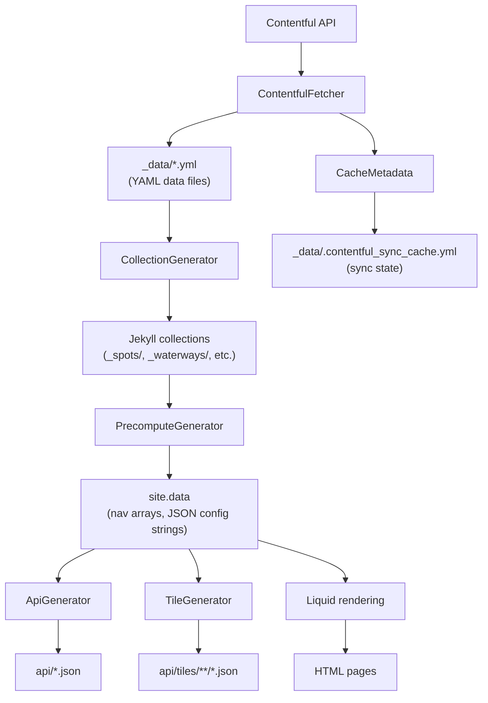
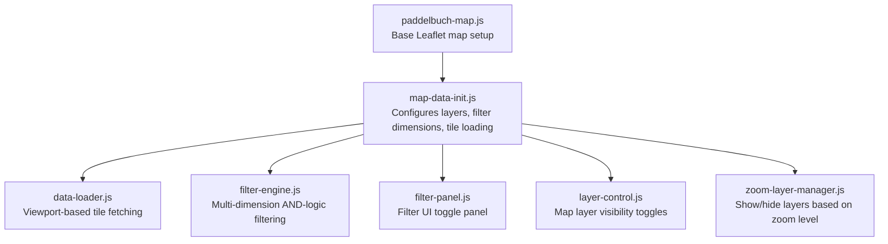

# Architecture Overview

This document describes the architecture of Paddel Buch, a Jekyll-based static site that displays Swiss paddle sports data on interactive maps.

## High-Level Architecture


Content is managed in Contentful, fetched and transformed during the Jekyll build, and the resulting static site is deployed to AWS Amplify. The site is bilingual (German default, English secondary).

## Build Pipeline

The production build is orchestrated by the `build:site` Rake task and runs in three phases:

### Phase 1: Pre-fetch

A single Jekyll invocation triggers `ContentfulFetcher` (priority `:highest`) to populate `_data/` with fresh Contentful content. This runs generators only — no rendering or file writing occurs. The `_config_prefetch.yml` override enables this lightweight mode.

### Phase 2: Parallel Locale Builds

Two Jekyll processes run concurrently, one per locale:

- **German build** (`_config_de.yml`): Outputs to `_site_de/`. Produces root pages, `assets/`, and `api/`.
- **English build** (`_config_en.yml`): Outputs to `_site_en/`. Produces English pages only.

Both builds skip the Contentful fetch (`skip_contentful_fetch: true`) since data was already fetched in Phase 1. Each build runs the full generator chain and renders all pages for its locale.

### Phase 3: Merge

The German build output forms the base of `_site/`. The English build output is copied into `_site/en/`, excluding `assets/` and `api/` (which are locale-independent and come from the German build).

```
_site/
├── index.html              ← German (from _site_de/)
├── einstiegsorte/          ← German spot pages
├── en/
│   ├── index.html          ← English (from _site_en/)
│   └── einstiegsorte/      ← English spot pages
├── assets/                 ← Shared (from _site_de/)
└── api/                    ← Shared (from _site_de/)
```

## Plugin Execution Order

Jekyll plugins run in priority order during the generate phase. The Paddel Buch plugins form a pipeline:

| Priority | Plugin | Responsibility |
|----------|--------|----------------|
| Hook (`after_init`) | `EnvLoader` | Loads `.env` files into `ENV` and site config |
| Hook (`after_init`) | `BuildTimer` | Starts build timing instrumentation |
| `:highest` | `ContentfulFetcher` | Fetches content from Contentful, writes `_data/*.yml` |
| `:high` | `CollectionGenerator` | Creates Jekyll collection documents from `_data/` YAML |
| `:high` | `ColorGenerator` | Parses SCSS colour variables into `site.data` for JS |
| `:normal` | `PrecomputeGenerator` | Pre-computes navigation, map config, and layer config JSON |
| `:normal` | `DashboardMetricsGenerator` | Computes freshness and coverage metrics for data quality dashboards |
| `:normal` | `StatisticsMetricsGenerator` | Computes statistics counts and spot freshness map data |
| `:low` | `ApiGenerator` | Generates JSON API files in `api/` |
| `:low` | `TileGenerator` | Generates spatial tile JSON files in `api/tiles/` |
| `:low` | `SitemapGenerator` | Generates XML sitemap files |
| `:low` | `FaviconGenerator` | Copies favicon and Apple Touch Icon to site root |

Plugins at the same priority level have no ordering guarantees between them, but the pipeline is designed so that each priority tier only depends on outputs from higher-priority tiers.

## Data Flow



### Contentful Sync Strategy

The `ContentfulFetcher` uses the Contentful Sync API for incremental updates:

1. On first build (or when cache is missing/invalid): performs a full sync, fetches all entries
2. On subsequent builds: checks the Sync API with the stored token to detect changes
3. If no changes: skips the fetch entirely, uses cached `_data/` files
4. If changes detected and delta items are classifiable: attempts a delta merge
   - Re-fetches each changed entry individually via the Contentful API
   - Maps through `ContentfulMappers.flatten_entry` and upserts rows in the existing YAML data files
   - Looks up deleted entries in the Entry ID Index and removes rows from the corresponding YAML files
   - Falls back to a full fetch if any step fails
5. If changes detected but delta items are not classifiable: performs a full fetch
6. A SHA-256 content hash is computed over all YAML files to detect actual data changes

The **Entry ID Index** is a persistent mapping of Contentful `sys.id` → `{ slug, content_type }` stored in the sync cache file. It is built during full syncs and maintained incrementally during delta merges. The index is necessary because `DeletedEntry` items from the Contentful Sync API contain only `sys` metadata (no `fields` or `slug`), so the index provides the slug and content type needed to locate and remove the correct rows from the YAML data files.

The `contentful_data_changed` flag propagates through the pipeline. When `false`, the `ApiGenerator` and `TileGenerator` can skip regeneration and serve from their own caches (`_data/.api_cache/` and `_data/.tile_cache/`).

### Force Sync

A full re-fetch can be forced via:
- `CONTENTFUL_FORCE_SYNC=true` environment variable
- `force_contentful_sync: true` in `_config.yml`

## Content Model

Content is stored in Contentful and mapped to Jekyll data structures by `ContentfulMappers`. The main content types are:

### Fact Types (primary data)

| Content Type | Data File | Collection | Description |
|---|---|---|---|
| `spot` | `spots.yml` | `_spots/` | Paddle entry/exit points with GPS coordinates |
| `waterway` | `waterways.yml` | `_waterways/` | Lakes and rivers with GeoJSON geometry |
| `obstacle` | `obstacles.yml` | `_obstacles/` | Obstacles with portage information |
| `protectedArea` | `protected_areas.yml` | — | Protected nature areas (no detail pages) |
| `waterwayEventNotice` | `notices.yml` | `_notices/` | Temporary event notices with date ranges |
| `staticPage` | `static_pages.yml` | `_static_pages/` | CMS-driven static pages (About, Open Data) |

### Dimension Types (lookup tables)

| Content Type | Data File | Description |
|---|---|---|
| `spotType` | `types/spot_types.yml` | Entry/exit, entry-only, exit-only, rest, emergency |
| `obstacleType` | `types/obstacle_types.yml` | Obstacle classifications |
| `paddleCraftType` | `types/paddle_craft_types.yml` | Kayak, canoe, SUP |
| `paddlingEnvironmentType` | `types/paddling_environment_types.yml` | Lake (see), river (fluss) |
| `protectedAreaType` | `types/protected_area_types.yml` | Protected area classifications |
| `dataSourceType` | `types/data_source_types.yml` | Data provenance |
| `dataLicenseType` | `types/data_license_types.yml` | Data licensing terms |

All entries are fetched with `locale: '*'` and flattened into per-locale rows by `ContentfulMappers.flatten_entry`. Each row has a `locale` field (`de` or `en`) used for filtering throughout the pipeline.

## Spatial Tile System

The `TileGenerator` divides Switzerland's bounding box into a grid of tiles (0.25° lat × 0.46° lon each, producing a 10×8 grid). Each tile contains the data items whose location falls within its bounds.

```
api/tiles/
├── spots/
│   ├── de/
│   │   ├── index.json      ← Tile index with bounds and counts
│   │   ├── 3_2.json        ← Tile at grid position (3, 2)
│   │   └── ...
│   └── en/
│       └── ...
├── notices/
├── obstacles/
└── protected/
```

The frontend's `data-loader.js` uses the tile index to determine which tiles overlap the current map viewport, then fetches only those tiles. This avoids loading all data upfront and keeps initial page load fast.

## Frontend Architecture

The frontend is vanilla JavaScript (no framework, no bundler). Scripts are loaded via `<script>` tags in the Jekyll layouts.

### Map Initialisation Flow



### Key JavaScript Modules

| Module | Purpose |
|--------|---------|
| `paddelbuch-map.js` | Creates the Leaflet map instance with Swiss bounds |
| `data-loader.js` | Fetches spatial tiles based on the current viewport |
| `map-data-init.js` | Orchestrates layer creation, data loading, and filter setup |
| `filter-engine.js` | Applies multi-dimension AND-logic filters to spot markers |
| `filter-panel.js` | Renders and manages the filter toggle UI |
| `layer-control.js` | Custom layer control with date-based event notice filtering |
| `zoom-layer-manager.js` | Shows detail layers (obstacles, protected areas) only at zoom ≥ 12 |
| `marker-registry.js` | Deduplicates markers and manages marker lifecycle |
| `spot-popup.js` | Renders spot marker popups |
| `obstacle-popup.js` | Renders obstacle marker popups |
| `event-notice-popup.js` | Renders event notice popups |
| `layer-styles.js` | Defines colours and styles for map layers |
| `marker-styles.js` | Defines marker icon styles per spot type |
| `spatial-utils.js` | GeoJSON geometry utilities |
| `date-utils.js` | Locale-aware date formatting |
| `html-utils.js` | HTML escaping and sanitisation |
| `color-vars.js` | Reads CSS custom properties set by `ColorGenerator` |
| `locale-filter.js` | Client-side locale detection |
| `clipboard.js` | GPS/address copy-to-clipboard functionality |
| `dashboard-data.js` | Parses JSON data blocks for data quality and statistics dashboards |
| `dashboard-map.js` | Creates Leaflet maps with Positron vector tiles for dashboards |
| `dashboard-switcher.js` | Tab-style switcher for toggling between dashboard views |
| `coverage-dashboard.js` | Waterway coverage dashboard (covered/uncovered segments) |
| `freshness-dashboard.js` | Waterway freshness dashboard (median age colour gradient) |
| `spot-freshness-dashboard.js` | Spot freshness dashboard (per-spot age chart and map markers) |
| `statistics-dashboard.js` | Statistics dashboard (Chart.js bar charts for spot/obstacle/area counts) |
| `obstacle-portage-dashboard.js` | Obstacle portage routes data quality dashboard |

### Vendor Assets

Third-party libraries (Bootstrap, Leaflet, Leaflet.locatecontrol, MapLibre GL, Chart.js) are installed via npm but copied to `assets/js/vendor/` and `assets/css/vendor/` by the `scripts/copy-vendor-assets.js` script. Google Fonts are downloaded and self-hosted by `scripts/download-google-fonts.js`. This ensures the site has no external runtime dependencies (CDN-free).

## Internationalisation

The site uses [jekyll-multiple-languages-plugin](https://github.com/kurtsson/jekyll-multiple-languages-plugin) with two locales:

- `de` (German) — default, pages at root (`/`)
- `en` (English) — pages under `/en/`

Translation strings are in `_i18n/de.yml` and `_i18n/en.yml`, accessed in templates via ``.

Data-level localisation is handled by the `locale` field on each data row. The `CollectionGenerator` filters data by the current build locale, and the `LocaleFilter` Liquid filter provides `filter_by_locale` for template use.

## Deployment

The site is deployed to AWS Amplify via CloudFormation (`deploy/frontend-deploy.yaml`). Key aspects:

- Builds are triggered by Git pushes and Contentful webhooks
- A custom Docker build image (`infrastructure/Dockerfile`) pre-packages Ruby 3.4.9 and Node.js 22 to speed up builds
- The image is hosted on ECR Public and referenced via the `_CUSTOM_IMAGE` Amplify environment variable
- Security headers (CSP, HSTS, X-Frame-Options, etc.) are configured in the CloudFormation template's `CustomHeaders` property
- Cache TTLs vary by content type: HTML (1 day), spatial tiles (7 days), API JSON (1 day), static assets (30 days)

See [deploy/README.md](../deploy/README.md) and [docs/custom-amplify-build-image/README.md](custom-amplify-build-image/README.md) for detailed deployment instructions.

## Testing Strategy

The project uses property-based testing extensively alongside traditional unit tests:

- **Ruby (RSpec + Rantly)**: Tests for all Jekyll plugins, including property-based tests that verify invariants across random inputs
- **JavaScript (Jest + fast-check)**: Tests for frontend modules, including property-based tests for map rendering, filter logic, popup generation, and data loading
- **Python**: CSP inline script detection and preservation tests

See [docs/testing.md](testing.md) for the full testing guide.
